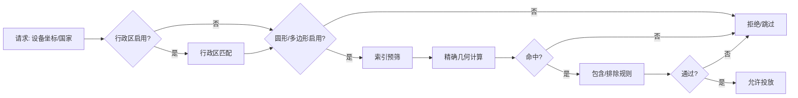
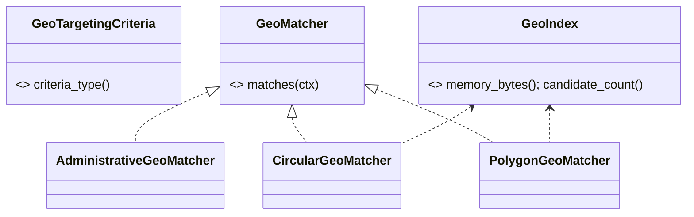

# 地理定向系统设计说明（Rust 实现）

## 概述

平台提供三类地理定向能力，按精度与性能覆盖不同业务场景：

1. AdministrativeGeoTargeting（行政区划）标识：`AdministrativeGeo`
2. CircularGeoFenceTargeting（圆形围栏）标识：`CircularGeoFence`
3. PolygonGeoFenceTargeting（多边形围栏）标识：`PolygonGeoFence`

本设计面向 Rust 技术栈与项目分层，提供抽象契约、数据结构、索引/缓存策略、配置与依赖注入、监控与测试指导，不包含具体实现代码。

---

## 分层定位与crate映射

- 04-core/domain：
    - 值对象：GeoPoint、GeoPolygon、GeoCircle、CountryCode、AdminLevel 等。
    - 领域配置：TargetingConfig（含 Geo 部分）。
- 04-core/ad-engine-abstractions：
    - 抽象 trait：GeoTargetingCriteria、GeoMatcher、GeoIndex、GeoRepository。
- 03-strategies/filter：
    - 具体策略实现：AdministrativeGeoMatcher、CircularGeoMatcher、PolygonGeoMatcher。
    - 索引实现：基于 R 树、网格、哈希映射等。
- 02-services/targeting：
    - 管理 API/后台配置、素材校验、数据导入与发布管线。
- 05-infrastructure/caching-*、data-*、composition：
    - 缓存与持久化（元数据、索引快照）、组件装配与运行时选择。

依赖规则：表示/服务 → 抽象层 → 实现层；抽象不依赖实现，组合在 composition 完成。

---

## 统一抽象与输入输出契约

### 输入上下文与坐标系

- 坐标系：WGS84，经纬度 double（f64），单位度。
- 位置来源：GPS/基站/Wi-Fi，允许精度与误差字段。

数据形状（示意）：

```rust
pub struct GeoPoint { pub lat: f64, pub lon: f64 }
pub struct GeoCircle { pub center: GeoPoint, pub radius_m: f64, pub buffer_m: f64 }
pub struct GeoPolygon { pub points: Vec<GeoPoint>, pub buffer_m: f64 }
pub enum AdminLevel { Country, Province, City }
pub struct AdminKey { pub country: String, pub code: String, pub level: AdminLevel }

pub struct GeoContext {
    pub device: Option<GeoPoint>,
    pub accuracy_m: Option<f64>,
    pub country: Option<String>,
}
```

### 匹配抽象

```rust
#[async_trait::async_trait]
pub trait GeoTargetingCriteria {
    fn criteria_type(&self) -> &'static str; // AdministrativeGeo / CircularGeoFence / PolygonGeoFence
}

#[async_trait::async_trait]
pub trait GeoMatcher {
    async fn matches(&self, ctx: &GeoContext) -> bool;
}

pub trait GeoIndex: Send + Sync {
    fn memory_bytes(&self) -> usize;
    fn candidate_count(&self, ctx: &GeoContext) -> usize; // 供监控
}
```

实现要求：

- 每种类型提供自身的 Matcher 与可选 Index；
- 组合器支持多条件并/或及包含/排除逻辑；
- 误差缓冲（buffer_m）与设备精度（accuracy_m）纳入判定。


---

## 三种地理定向的功能定位与技术设计

### 1. AdministrativeGeoTargeting（行政区划）

功能：按国家/省/市等行政边界匹配，支持包含/排除与层级优先级。

技术要点：

- 数据模型：AdminKey 集合，映射至行政区层级树；
- 匹配：优先基于 country/city code 快速命中；
- 索引：hashmap（country→province→city），O(1) 级别；
- 缓存策略：长TTL（≥24h），变更少；
- 误差处理：可选边界扩展（buffer_m），仅用于边界模糊区域。


适用：全国/省市级投放、法规限制、城市本地化营销。

### 2. CircularGeoFenceTargeting（圆形围栏）

功能：以坐标点为中心、半径为范围的围栏匹配，支持 POI 类别管理与缓冲区。

技术要点：

- 距离计算：Haversine；
- 索引：网格索引或 R 树（中心点）；预筛候选后再精算距离；
- 缓存策略：中TTL（1-6h），按围栏类别分组；
- 误差处理：radius_m += buffer_m + accuracy_m（上限可配置）。


适用：商圈、POI周边、交通枢纽、事件现场。

### 3. PolygonGeoFenceTargeting（多边形围栏）

功能：以多边形区域进行精确定向，支持复杂形状、简化与性能优化。

技术要点：

- 点在多边形判定：射线法/绕数法；
- 多边形简化：Ramer�CDouglas�CPeucker（阈值可配置）；
- 索引：R 树（多边形包围盒），候选再做点内判定；
- 缓存策略：短TTL（30min-2h）；
- 边界缓冲：对多边形进行缓冲扩张减少漏判（小半径）。


适用：不规则商业区、园区边界、沿线/沿海区域等高精度场景。

---

## 组合与优先级

- 分层组合：先行政区粗筛，再围栏精筛；
- 包含/排除：任意类型可声明 include 或 exclude；
- 优先级：按类型与对象级别可配置优先次序，早停策略优化延迟；
- A/B：同版位配置不同组合，在线对比效果与成本。

---

## 性能与内存基线（目标值）

| 指标              | 行政区划 | 圆形围栏 | 多边形围栏 |
| ----------------- | -------- | -------- | ---------- |
| 单匹配延迟（p95） | < 50?s   | < 200?s  | < 800?s    |
| 候选集规模        | O(1)     | O(log N) | O(log N)   |
| 内存/对象         | 极小     | 小       | 中-大      |
| TTL               | ≥24h     | 1-6h     | 0.5-2h     |

说明：具体数值以基准测试与目标硬件为准，以上为设计门槛。

---

## 索引与数据管线

- 数据来源：行政区与围栏（POI/多边形）以 GeoJSON/自定义格式导入；
- 预处理：

    - 统一坐标系（WGS84）；
    - 计算包围盒、中心点、面积与复杂度评级；
    - 多边形可选简化；

- 索引构建：

    - 行政区：层级 hashmap；
    - 圆形：网格或 R 树（中心点）；
    - 多边形：R 树（包围盒）；

- 快照：索引可序列化为只读快照；进程启动时加载，变更以版本号热切换。

---

## 配置与依赖注入

使用统一配置与组件发现（config-impl、di-impl、composition）：

示例（toml）：

```toml
[geo]
enable_admin = true
enable_circle = true
enable_polygon = true

[geo.match]
max_accuracy_m = 100
early_stop = true

[geo.index]
type = "rtree" # rtree|grid|hash
simplify_epsilon_m = 5

[geo.cache]
admin_ttl_sec = 86400
circle_ttl_sec = 21600
polygon_ttl_sec = 3600
```

装配：

- 三类 Matcher/Index 以组件标签导出；
- composition 根据配置选择索引类型与TTL策略；
- 统一注册至 ad-engine 的策略执行流水线（filter阶段）。


---

## 缓存策略

- 键设计：`geo:{type}:{hash}`（type=admin/circle/polygon）；
- 失效：按类型TTL + 数据版本；
- 局部刷新：某一围栏/城市更新即可单键失效；
- 多层缓存：进程内 LRU + Redis（可选）。

---

## 可观测性与安全

- tracing 埋点：类别、候选规模、命中与未命中、延迟；
- 指标：p50/p95、命中率、索引大小、快照加载耗时；
- 日志：异常坐标与越界输入采样记录；
- 数据合规：边界数据许可与使用范围，避免侵权；
- 坐标系：如涉及国内测绘偏移（GCJ-02）需在导入环节统一转换。

---

## 测试与基准

- 单元测试：几何判定（边界、顶点、洞、多边形自交）与组合逻辑；
- 性能基准：Criterion 建立基线；
- 随机性质测：proptest 针对点在圆/多边形的性质验证；
- 集成测试：加载真实子集数据，回放典型请求；
- 边界场景：

    - 无坐标或精度过差；
    - 跨经度180°、极端高纬度；
    - 多边形带洞/自相交；
    - 大量围栏并发匹配。

---

## 迁移指南（从 .NET 到 Rust）

- 类到trait/结构体映射：
    - GeoTargeting → GeoTargetingCriteria（trait）
    - AdministrativeGeoTargeting/CircularGeoFenceTargeting/PolygonGeoFenceTargeting → 各自 Matcher + 配置结构体
    - TargetingConfig（C# 值对象）→ 04-core/domain::TargetingConfig（Rust 值对象）
- 示例代码迁移为配置样例与伪代码，避免内嵌业务实现；
- 依赖注入：通过 composition 组件标签与命名注册；
- 测试：替换为 Rust 测试框架（cargo test + proptest + criterion）。

---

## 流程图与组件图





---

## 选择建议（业务侧）

- 行政区：响应最快、成本最低，适合广覆盖；
- 圆形：精度/性能平衡，适合商圈/POI；
- 多边形：精度最高，适合高价值精准投放与不规则区域。

---

本技术设计遵循项目“技术设计文档不含具体实现代码”的规范，提供抽象契约、数据形状、索引与运行特性指导。实现需落位至相应 crate，并通过 composition 统一装配与配置管理。
