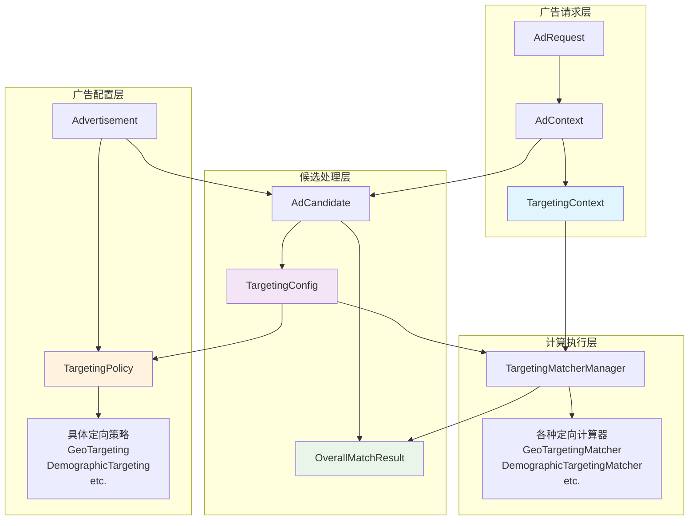
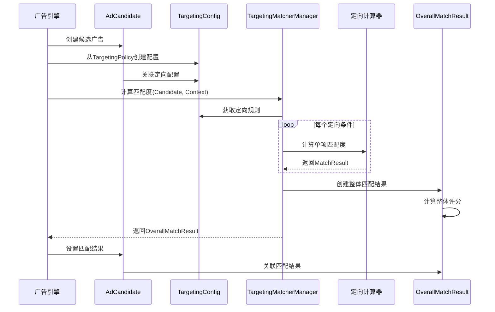

# 定向相关实体关系详解（Rust 实现）

## 概述

本文档基于 Rust 技术栈（Tokio + Axum + composition + strategies/filter + ad-engine-abstractions），阐明定向相关实体间关系与职责边界：TargetingContext、TargetingPolicy、TargetingConfig、MatchResult/OverallMatchResult 及其在候选与计算管线中的作用。文档不包含实现代码，仅提供 trait/struct 设计与依赖关系指导。

## 核心实体关系图



## 详细关系说明（Rust 视角）

### 1. TargetingPolicy ↔ TargetingConfig 关系

**设计目的**：

- TargetingPolicy：广告主设置的静态定向策略模板（domain 值对象）
- TargetingConfig：运行时动态化配置实例（domain 值对象），承载从 Policy 复制的规则与动态参数

**关系特征**：

- 一对多：一个 TargetingPolicy 可生成多个 TargetingConfig（按候选/AB版本/租户）
- 继承：TargetingConfig 承接 Policy 规则集合
- 扩展：TargetingConfig 增加动态参数（优化/灰度/实验）

**Rust 设计（示意）**：

```rust
// crates/04-core/domain
pub struct TargetingPolicy {
    pub policy_id: String,
    pub criteria: std::collections::HashMap<String, Box<dyn TargetingCriteria>>, // 抽象条件
}

pub struct TargetingConfig {
    pub policy_id: String,
    pub ad_candidate_id: String,
    pub criteria: std::collections::HashMap<String, Box<dyn TargetingCriteria>>, // 从Policy复制
    pub dynamic_params: std::collections::HashMap<String, serde_json::Value>,
}

impl TargetingConfig {
    pub fn from_policy(policy: &TargetingPolicy, ad_candidate_id: String) -> Self {
        // 逻辑：深拷贝/克隆 criteria 的配置型数据（实现者需提供可克隆配置）
        Self { policy_id: policy.policy_id.clone(), ad_candidate_id, criteria: policy.criteria.clone(), dynamic_params: Default::default() }
    }
}
```

**使用场景**：

1. 静态配置：直接使用 Policy 规则集合
2. 动态优化：依据上下文/反馈动态调整参数
3. A/B 测试：同广告不同配置版本
4. 个性化：租户/人群差异化策略

### 2. AdCandidate ↔ OverallMatchResult 关系

**设计目的**：

- AdCandidate：候选广告对象（domain 实体），聚合广告信息与 TargetingConfig
- OverallMatchResult：匹配器管理器计算出的整体匹配结果（abstractions 结果模型）

**关系特征**：

- 一对一：每个 AdCandidate 对应一个 OverallMatchResult（一次计算过程）
- 计算输出：OverallMatchResult 为 Candidate×Context 的计算结果
- 生命周期：绑定当前投放流程内的 Candidate 生命周期

**Rust 设计（示意）**：

```rust
// crates/04-core/domain
pub struct AdCandidate {
    pub id: String,
    pub ad_id: String,
    pub campaign_id: String,
    pub targeting: TargetingConfig,
    pub match_result: Option<OverallMatchResult>,
}

impl AdCandidate {
    pub fn set_match_result(&mut self, result: OverallMatchResult) { self.match_result = Some(result); }
    pub fn is_matched(&self) -> bool { self.match_result.as_ref().map(|r| r.passed).unwrap_or(false) }
    pub fn match_score(&self) -> f32 { self.match_result.as_ref().map(|r| r.score).unwrap_or(0.0) }
}

// crates/04-core/ad-engine-abstractions
pub struct MatchResult { pub matcher_type: String, pub passed: bool, pub score: f32, pub weight: f32 }
pub struct OverallMatchResult {
    pub ad_candidate_id: String,
    pub ad_context_id: String,
    pub score: f32,
    pub passed: bool,
    pub details: Vec<MatchResult>,
    pub calculated_at_unix: i64,
    pub reason: String,
}
```

### 3. 计算流程设计

**整体计算流程**：



**关键决策点**：

1. 配置创建时机：
    - 召回阶段：从 TargetingPolicy 创建 TargetingConfig
    - 可选优化：依据上下文进行动态调整

2. 匹配计算时机：
    - 过滤阶段：计算匹配度并创建 OverallMatchResult
    - 排序阶段：使用匹配度作为排序因子

3. 结果存储策略：
    - 临时存储：在 AdCandidate 处理期间保存
    - 可选缓存：对频繁查询的结果进行缓存

### 4. 性能优化考虑

**缓存策略（设计）**：

- 键：`ad:{ad_id}:ctx:{hash}`；
- 进程内 LRU + 分布式缓存（Redis 可选）；
- TTL：短周期（1-5 分钟），按实验与命中率调优；
- 失效：基于配置版本与重要上下文字段散列。

**批量计算优化（设计）**：

- 按 TargetingConfig 签名分组，避免重复评估；
- 对同类 Criteria 批量评估；
- 支持 tokio 并发，限流与公平调度；
- 可选结果克隆/重用以降低开销。

## 总结

通过以上 Rust 设计，我们建立了清晰的定向实体关系：

1. **TargetingPolicy → TargetingConfig**：从静态模板到动态实例的转换
2. **AdCandidate ↔ OverallMatchResult**：候选广告与其匹配结果的一一对应
3. **TargetingContext → 计算过程**：请求上下文驱动整个匹配计算流程

这个设计确保了：

- 职责清晰：每个实体有明确的职责边界
- 关系明确：实体间的关系和依赖明确定义
- 可扩展性：支持动态优化和个性化配置
- 性能优化：支持缓存和批量处理
- 可追溯性：完整的计算过程和结果记录
