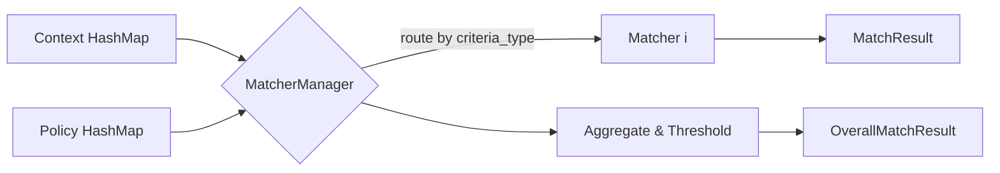

# 定向策略架构改进方案（Rust 实现）

## 改进背景

当前定向策略存在：

1. 硬编码：上下文与策略规则固定为若干类型，难以扩展。
2. 职责混乱：匹配/评分逻辑嵌入条件数据结构。
3. 可扩展性差：新增定向类型涉及多处修改。
4. 测试困难：计算逻辑与数据存储耦合。

目标：以 Rust 抽象与分层改造，形成“接口解耦、集合管理、职责分离、可插拔匹配器”的架构。

---

## 总览与核心思想

- 接口抽象化：使用 trait 统一上下文、条件、匹配器的契约；
- 集合管理：以 HashMap/Vec 管理任意数量的上下文与条件，移除硬编码；
- 职责分离：上下文/条件为数据模型，匹配器只负责算法；
- 依赖注入：通过 composition 组件发现与配置驱动加载匹配器。

### 架构对比（Rust 视角）

改造前（概念示意）

```text
TargetingContext (硬编码若干字段)
TargetingPolicy (硬编码若干条件 + 内嵌计算)
```

改造后（目标）

```text
TargetingContext (集合管理)
├── HashMap<String, Box<dyn TargetingContextItem>>
TargetingPolicy (集合管理)
├── HashMap<String, Box<dyn TargetingCriteria>>

匹配器（独立组件）
├── TargetingMatcherManager
├── GeoMatcher / DemographicMatcher / DeviceMatcher / TimeMatcher / BehaviorMatcher
```

---

## crate 映射与分层依赖

- crates/04-core/domain：
   - 值对象与策略配置：TargetingContext、TargetingPolicy；
   - 统一枚举/标识：CriteriaType、ContextType；
- crates/04-core/ad-engine-abstractions：
   - trait 契约：TargetingContextItem、TargetingCriteria、TargetingMatcher、TargetingMatcherManager；
   - 结果模型：MatchResult、OverallMatchResult；
- crates/03-strategies/filter：
   - 具体匹配器实现：GeoMatcher、DemographicMatcher、DeviceMatcher、TimeMatcher、BehaviorMatcher；
   - 组合器：And/Or/Not 组合，权重与阈值；
- crates/02-services/targeting：
   - 策略配置装载、管理 API、发布流程；
- crates/05-infrastructure/composition：
   - 组件发现、DI 装配、配置绑定。

依赖方向：presentation/services → 04-core → 03/05；抽象不依赖实现，组合在 composition。

---

## 抽象契约（Rust trait）

```rust
pub trait TargetingContextItem: Send + Sync {
   fn context_type(&self) -> &'static str; // e.g. "Geo", "Device", "UserProfile"
}

pub trait TargetingCriteria: Send + Sync {
   fn criteria_type(&self) -> &'static str; // e.g. "AdministrativeGeo", "CircularGeoFence"
}

pub struct MatchResult { pub passed: bool, pub score: f32 }
pub struct OverallMatchResult { pub passed: bool, pub score: f32 }

#[async_trait::async_trait]
pub trait TargetingMatcher {
   fn supports(&self) -> &'static str; // criteria_type
   async fn evaluate(&self, ctx: &HashMap<String, Box<dyn TargetingContextItem>>, criteria: &dyn TargetingCriteria) -> MatchResult;
}

#[async_trait::async_trait]
pub trait TargetingMatcherManager {
   async fn evaluate_all(&self, ctx: &HashMap<String, Box<dyn TargetingContextItem>>, criteria: &HashMap<String, Box<dyn TargetingCriteria>>) -> OverallMatchResult;
   fn register(&mut self, matcher: Box<dyn TargetingMatcher>);
}
```

说明：

- Context 与 Criteria 使用 type 字符串标识，避免交叉依赖；
- Manager 负责路由到正确的 Matcher，聚合结果（AND/OR/权重）；
- 评分（score）可选：用于排序或阈值过滤。


---

## 数据结构与组合策略

- TargetingContext：`HashMap<String, Box<dyn TargetingContextItem>>`；
- TargetingPolicy：`HashMap<String, Box<dyn TargetingCriteria>>`；
- 组合器：
   -  逻辑：AND（默认）、OR、NOT；
      - 权重：按 CriteriaType 赋权；
      - 阈值：设定通过阈值与早停策略（short-circuit）。

Mermaid（聚合流程）



---

## 配置与依赖注入

通过 composition 读取配置并注册匹配器：

```toml
[targeting]
aggregation = "AND" # AND|OR|WEIGHTED
threshold = 1.0

[targeting.matchers]
geo = true
demographic = true
device = true
time = true
behavior = true
```

装配要点：

- 各 Matcher 以组件标签导出，支持开关控制；
- Manager 在启动初始化阶段注册可用 Matcher；
- 支持运行时热更新（开关与阈值）。

---

## 性能与可观测性

- 目标：单请求策略计算 p95 < 10ms；
- 指标：每类 Matcher 延迟、聚合延迟、早停次数；
- 追踪：tracing span 覆盖 evaluate_all 与 evaluate；
- 优化：

   -  早停：AND 模式中遇到 fail 即返回；OR 模式中遇到 pass 即返回；
      - 批量：对同类条件批量评估；
      - 缓存：静态或低变更条件结果可按上下文散列缓存；
      - 并发：独立条件可 tokio::join 并发评估（注意限流与公平性）。

---

## 实施计划（Rust 版本）

第一阶段：接口与基础设施

1. 在 ad-engine-abstractions 定义 trait：TargetingContextItem、TargetingCriteria、TargetingMatcher、TargetingMatcherManager、MatchResult/OverallMatchResult；
2. 在 composition 提供 Manager 的默认实现与注册入口；
3. 配置绑定与热更新通道；

第二阶段：具体实现

1. 在 strategies/filter 实现 Geo/Demographic/Device/Time/Behavior 五类 Matcher；
2. 在 domain 定义与拆分 TargetingContext/TargetingPolicy 为集合模型；
3. 提供组合器（AND/OR/WEIGHTED）与早停策略；

第三阶段：集成与测试

1. 用新的 Manager 替换引擎中的策略评估；
2. 单元测试：为每个 Matcher 提供独立测试与伪造上下文；
3. 集成测试：端到端评估；性能基准测试（Criterion）；

第四阶段：配置与观测

1. 增加 tracing 指标导出，Prometheus 采集；
2. 调优阈值、权重与并发策略；

---

## 兼容性与迁移

- 渐进式迁移：保留旧 API，内部通过适配器包装到新集合模型；
- 数据结构稳定：原有条件数据可映射为新的 Criteria；
- 双写灰度：一段时间内并行运行新旧路径，校验结果一致性；

---

## 风险与缓解

- 复杂度：抽象与组件化提高复杂度 → 提供模板与脚手架；
- 性能：抽象带来微弱开销 → 早停、并发、缓存与基准守护；
- 团队学习：提供示例、文档与培训；

---

## 成功指标

技术：

- 覆盖率 ≥ 90%，关键分支 ≥ 95%；
- 策略计算 p95 < 10ms；
- 新增定向类型 ≤ 2 天；

业务：

- 保持现有匹配精度；
- 6 个月新增 ≥ 3 种定向类型；
- 支持多租户个性化与灰度发布。

---

本方案遵循项目技术设计文档规范：不包含实现代码，提供 trait 契约、模块职责、依赖关系与实施计划，并与 composition/配置体系对齐。
