# 广告引擎抽象层设计 (Rust实现)

## 设计概述

广告引擎抽象层（`crates/04-core/ad-engine-abstractions`）是广告投放引擎的核心抽象trait层，定义了基于策略集合模式的广告处理架构。该抽象层采用统一策略trait设计，通过配置驱动的方式支持策略集合的动态组装和调用，利用Rust的零成本抽象特性实现高度灵活、内存安全和可扩展的广告处理流程。

### 系统架构总览
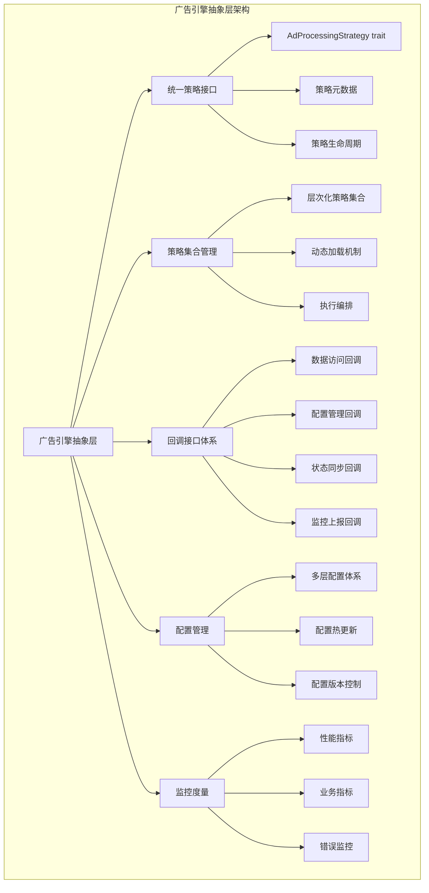

## 架构设计理念

### 核心设计原则
- **统一策略trait**：所有策略都实现相同的统一trait，便于动态加载和调用，利用Rust的trait系统实现零成本抽象
- **策略集合模式**：通过策略集合的层次化组织，支持复杂的处理流程编排
- **配置驱动架构**：策略集合的组合和调用顺序完全由配置文件定义，支持运行时配置更新
- **依赖注入加载**：策略通过Rust的依赖注入容器动态加载，支持运行时扩展
- **回调机制设计**：策略通过回调trait获取所需的上下文和数据，保证内存安全

### 架构灵活性考量
- **非固化阶段**：不固化为三阶段架构，支持任意数量和类型的处理阶段
- **动态扩展**：支持在不修改核心代码的情况下增加新的策略类型和处理阶段
- **热插拔能力**：支持策略的热插拔和在线更新，利用Rust的模块系统
- **多租户隔离**：支持不同租户使用不同的策略集合配置，通过Rust的所有权模型保证隔离性

## 统一策略Trait设计

### 策略Trait架构

#### 统一策略Trait定义

所有策略都实现统一的`AdProcessingStrategy` trait，该trait定义了策略执行的标准规范。

**注意**：以下核心类型已迁移到域层：
- `AdCandidate`类型已迁移到`crates/04-core/domain/entities`模块
- `AdContext`类型已迁移到`crates/04-core/domain/entities`模块  
- `UserProfile`类型定义在`crates/04-core/domain/entities`模块（由DMP系统管理）
- 相关枚举类型已迁移到`crates/04-core/shared/enums`模块

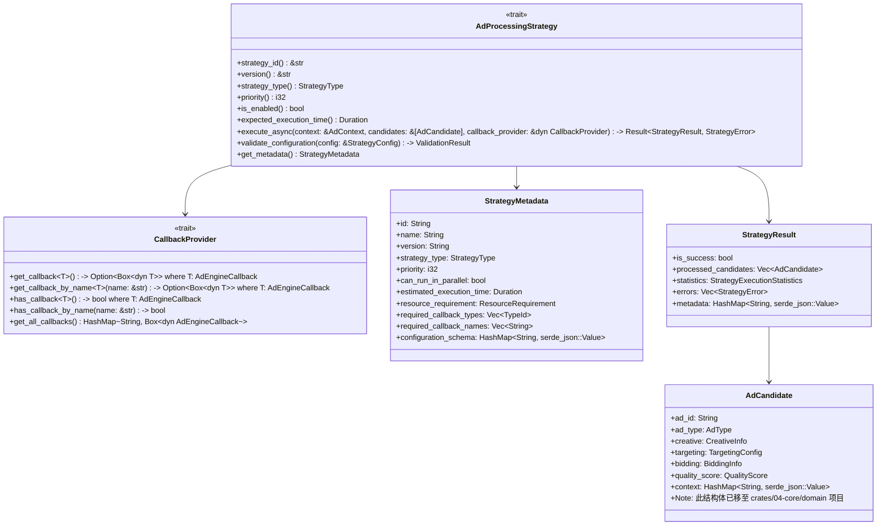

**Trait职责**：
- 定义策略的基本元数据（名称、版本、优先级等）
- 规范策略的执行方法和参数传递
- 提供策略执行结果的标准格式
- 支持策略的动态配置和状态管理

**Trait设计要点**：
- 输入输出标准化：统一使用广告候选集合作为处理对象
- 上下文获取抽象：通过回调trait获取所需的上下文信息
- 异步执行支持：基于Tokio异步运行时，支持高并发场景下的异步处理
- 错误处理规范：使用Rust的Result类型实现统一的异常处理和错误报告机制

#### 策略元数据定义
每个策略需要提供以下元数据信息：

**基础元数据**：
- 策略唯一标识符
- 策略版本信息
- 策略类型分类
- 执行优先级设置

**运行时属性**：
- 策略启用状态
- 并行执行能力
- 预期处理时间
- 资源消耗评估

**配置依赖**：
- 所需配置参数定义
- 依赖的外部服务接口
- 数据访问权限要求
- 回调接口使用声明

### 广告引擎回调Trait设计

#### 回调Trait架构

广告投放引擎需要提供一系列回调trait，供策略获取所需的上下文信息和数据。为了提高扩展性和灵活性，我们采用**泛型化的上下文获取机制**设计：

```mermaid
classDiagram
    class AdEngineCallback {
        <<trait>>
    }
    
    class AdEngineContextCallback {
        <<trait>>
        +get_context_async~T~(request: &ContextRequest~T~) -> Result~T, ContextError~ where T: TargetingContext
        +get_context_by_type_async~T~(context_type: &str, parameters: HashMap~String, serde_json::Value~) -> Result~T, ContextError~ where T: TargetingContext
        +get_batch_context_async~T~(requests: &[ContextRequest~T~]) -> Result~Vec~T~, ContextError~ where T: TargetingContext
        +is_context_type_supported~T~() -> bool where T: TargetingContext
        +is_context_type_supported_by_name(context_type: &str) -> bool
        +get_supported_context_types() -> Vec~String~
    }
    
    class ContextRequest~T~ {
        <<trait>>
        +context_type: String
        +parameters: HashMap~String, serde_json::Value~
        +timeout: Duration
        +cache_policy: CachePolicy
        +request_id: String
    }
    
    class TargetingContext {
        <<trait>>
        +context_type() -> &str
        +context_id() -> &str
        +timestamp() -> DateTime~Utc~
        +properties() -> &HashMap~String, serde_json::Value~
        +get_property~T~(key: &str) -> Option~T~ where T: DeserializeOwned
        +has_property(key: &str) -> bool
        +validate() -> ValidationResult
    }
    
    class UserProfileContext {
        +context_type: String = "UserProfile"
        +user_id: String
        +demographics: HashMap~String, String~
        +interests: Vec~String~
        +behaviors: Vec~String~
        +location: GeoLocation
        +device: DeviceInfo
        +get_property~T~(key: &str) -> Option~T~
    }
    
    class GeoLocationContext {
        +context_type: String = "GeoLocation"
        +latitude: f64
        +longitude: f64
        +country: String
        +region: String
        +city: String
        +accuracy: i32
        +get_property~T~(key: &str) -> Option~T~
    }
    
    class DeviceContext {
        +context_type: String = "Device"
        +device_type: DeviceType
        +os: String
        +os_version: String
        +browser: String
        +user_agent: String
        +screen: ScreenResolution
        +get_property~T~(key: &str) -> Option~T~
    }
    
    class TimeContext {
        +context_type: String = "Time"
        +request_time: DateTime~Utc~
        +timezone: String
        +day_of_week: chrono::Weekday
        +is_weekend: bool
        +is_holiday: bool
        +get_property~T~(key: &str) -> Option~T~
    }
    
    class AdEngineConfigCallback {
        <<trait>>
        +get_strategy_config_async(strategy_id: &str) -> Result~StrategyConfig, ConfigError~
        +get_business_rules_async(rule_type: &str) -> Result~BusinessRules, ConfigError~
        +get_threshold_parameters_async(param_type: &str) -> Result~HashMap~String, serde_json::Value~, ConfigError~
        +get_ab_test_config_async(experiment_id: &str) -> Result~ABTestConfig, ConfigError~
    }
    
    class AdEngineStateCallback {
        <<trait>>
        +get_budget_status_async(campaign_id: &str) -> Result~BudgetStatus, StateError~
        +get_frequency_control_async(user_id: &str, ad_id: &str) -> Result~FrequencyStatus, StateError~
        +get_blacklist_status_async(request: &BlacklistRequest) -> Result~BlacklistStatus, StateError~
        +get_quality_score_async(ad_id: &str) -> Result~QualityScore, StateError~
    }
    
    class AdEngineMetricsCallback {
        <<trait>>
        +report_strategy_metrics_async(metrics: &StrategyMetrics) -> Result~(), MetricsError~
        +record_error_async(error: &StrategyError) -> Result~(), MetricsError~
        +record_performance_async(performance: &PerformanceMetrics) -> Result~(), MetricsError~
        +record_business_metrics_async(metrics: &BusinessMetrics) -> Result~(), MetricsError~
    }
    
    AdEngineCallback <|-- AdEngineContextCallback
    AdEngineCallback <|-- AdEngineConfigCallback
    AdEngineCallback <|-- AdEngineStateCallback
    AdEngineCallback <|-- AdEngineMetricsCallback
    
    TargetingContext <|.. UserProfileContext
    TargetingContext <|.. GeoLocationContext
    TargetingContext <|.. DeviceContext
    TargetingContext <|.. TimeContext
    
    AdEngineContextCallback --> ContextRequest
    ContextRequest --> TargetingContext

```
        +DateTime Timestamp

#### 泛型化上下文获取机制设计

**核心设计理念**：

1. **统一的泛型trait**：使用泛型方法 `get_context_async<T>()` 替代硬编码的具体方法，利用Rust的零成本泛型
2. **类型安全的请求对象**：通过 `ContextRequest<T>` 封装不同类型上下文的请求参数，编译时保证类型安全
3. **可扩展的上下文类型**：所有上下文类型都实现 `TargetingContext` trait
4. **灵活的参数传递**：支持HashMap形式的动态参数传递，使用serde进行序列化/反序列化

**请求-响应关系模型**：

**关系说明**：
- `ContextRequest<T>`：请求对象trait，封装获取特定类型上下文所需的参数
- `TargetingContext`：响应对象trait，定义返回的上下文数据的标准格式
- `T`：具体的上下文类型，必须实现`TargetingContext` trait
- 它们是请求-响应模式，而非继承关系，利用Rust的trait系统实现零成本抽象

**接口关系图**：

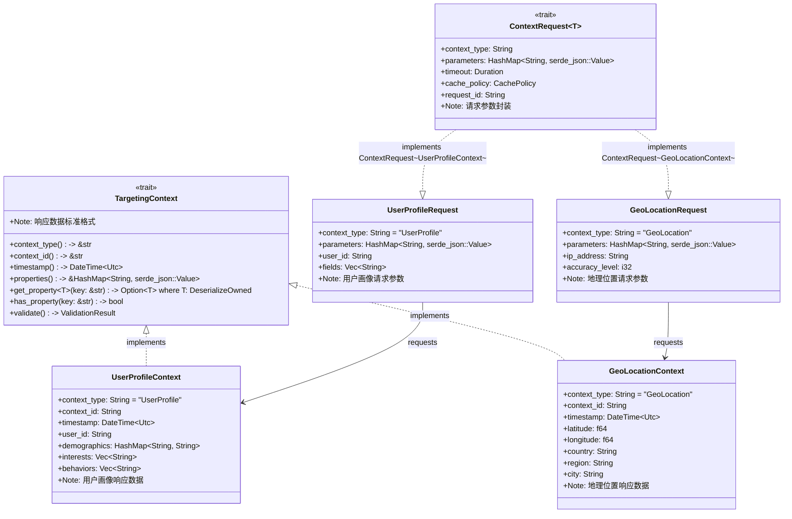

**技术实现指导**：

**请求对象设计原则**：
- 在`crates/04-core/ad-engine-abstractions`项目的`models/requests`目录下设计请求结构体
- 每个请求结构体实现`ContextRequest<T>` trait，其中T是对应的上下文类型
- 请求对象封装获取特定上下文所需的所有参数
- 包含超时设置、缓存策略等控制信息，使用serde进行序列化

**响应对象设计原则**：
- 在`crates/04-core/ad-engine-abstractions`项目的`models/contexts`目录下设计上下文结构体
- 所有上下文类型实现`TargetingContext`基础trait
- 提供标准化的属性访问方法和验证机制
- 包含时间戳、上下文ID等元数据信息，使用chrono处理时间

**泛型约束机制**：
- `get_context_async<T>(request: &ContextRequest<T>)` 方法中的T必须实现`TargetingContext`
- 编译时确保请求对象和返回类型的一致性
- 通过Rust的trait约束实现类型安全的请求-响应匹配

**使用模式示例**：

**强类型请求-响应模式**：

```text
UserProfileRequest (请求) → UserProfileContext (响应)
GeoLocationRequest (请求) → GeoLocationContext (响应)
DeviceRequest (请求) → DeviceContext (响应)
```

**方法签名说明**：

```rust
async fn get_context_async<UserProfileContext>(
    request: &ContextRequest<UserProfileContext>
) -> Result<UserProfileContext, ContextError>

// 其中：
// - ContextRequest<UserProfileContext>：具体为 UserProfileRequest
// - UserProfileContext：实现了 TargetingContext 的具体上下文类型
```

**Crate组织结构建议**：

```text
crates/04-core/ad-engine-abstractions/
├── src/
│   ├── traits/
│   │   ├── ad_processing_strategy.rs
│   │   ├── callback_provider.rs
│   │   ├── ad_engine_callback.rs
│   │   ├── ad_engine_context_callback.rs
│   │   ├── ad_engine_config_callback.rs
│   │   ├── ad_engine_state_callback.rs
│   │   ├── ad_engine_metrics_callback.rs
│   │   ├── context_request.rs
│   │   └── targeting/
│   │       ├── targeting_matcher.rs
│   │       └── targeting_matcher_manager.rs
│   ├── models/
│   │   ├── requests/
│   │   │   ├── user_profile_request.rs
│   │   │   ├── geo_location_request.rs
│   │   │   └── device_request.rs
│   │   ├── results/
│   │   │   ├── strategy_result.rs
│   │   │   ├── strategy_metadata.rs
│   │   │   └── match_result.rs
│   │   └── targeting/
│   │       └── overall_match_result.rs
│   ├── enums/
│   │   ├── strategy_type.rs
│   │   ├── matcher_type.rs
│   │   └── criteria_type.rs
│   └── lib.rs
└── Cargo.toml

crates/04-core/domain/
├── src/
│   ├── entities/
│   │   ├── ad_candidate.rs
│   │   ├── ad_context.rs
│   │   ├── user_profile.rs
│   │   └── mod.rs
│   ├── value_objects/
│   │   └── targeting/
│   │       ├── targeting_context.rs
│   │       ├── targeting_criteria.rs
│   │       ├── user_profile_context.rs
│   │       ├── geo_location_context.rs
│   │       ├── device_context.rs
│   │       ├── targeting_policy.rs
│   │       ├── targeting_rule.rs
│   │       └── mod.rs
│   └── lib.rs
└── Cargo.toml

crates/05-infrastructure/data-abstractions/
├── src/
│   ├── traits/
│   │   ├── repository.rs
│   │   ├── unit_of_work.rs
│   │   └── data_access/
│   │       ├── ad_engine_cache_provider.rs
│   │       ├── cache_strategy.rs
│   │       ├── cache_key_generator.rs
│   │       ├── advertisement_data_provider.rs
│   │       ├── user_context_data_provider.rs
│   │       ├── targeting_data_provider.rs
│   │       └── delivery_data_provider.rs
│   ├── models/
│   │   ├── cache_context.rs
│   │   ├── cache_decision.rs
│   │   ├── ad_request_context.rs
│   │   ├── targeting_context.rs
│   │   ├── delivery_context.rs
│   │   ├── data_preload_request.rs
│   │   └── mod.rs
│   └── lib.rs
└── Cargo.toml
```

**修正后的依赖关系**：

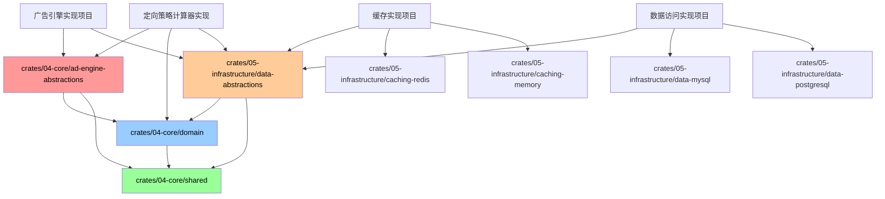

这种设计清晰地分离了请求参数和响应数据的职责，确保了类型安全性，同时提供了良好的扩展性。

## 数据访问抽象Trait设计

### 数据访问架构概述

为了解决广告投放引擎中数据访问透明化的问题，我们设计了清晰的分层架构。数据访问相关trait将放在`crates/05-infrastructure/data-abstractions`项目中，通过回调机制为广告投放引擎提供透明的数据访问能力。

#### 设计目标

**完全透明的数据访问**：

- 广告投放引擎无需感知缓存、数据库等底层实现
- 通过回调trait统一访问所有数据
- 数据访问的复杂性完全封装在基础设施层
- 引擎层只关注业务逻辑，不关心数据来源

**清晰的分层职责**：

- `04-core/ad-engine-abstractions`：定义引擎相关的回调trait
- `05-infrastructure/data-abstractions`：定义数据访问相关的抽象trait
- `04-core/domain`：定义领域模型和值对象trait
- 各层职责清晰，避免跨层依赖

#### 修正后的数据访问架构

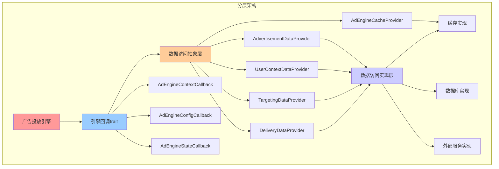

## 回调Trait设计规范

### 回调提供者Trait设计

#### CallbackProvider Trait定义

为了解决类型安全的回调访问问题，我们引入了`CallbackProvider` trait来提供类型安全的回调访问机制：

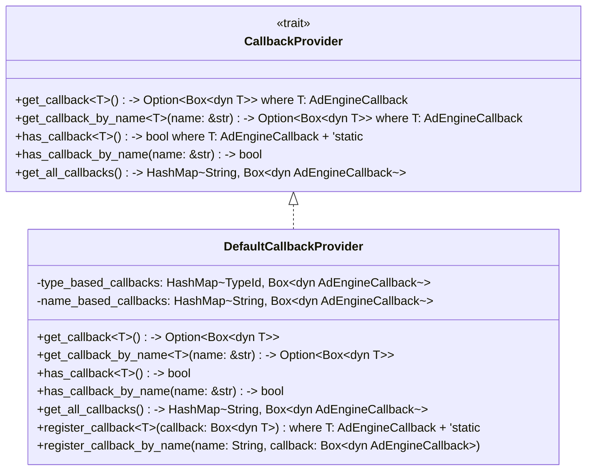

**设计特点**：

1. **类型安全访问**：通过泛型方法`get_callback<T>()`提供编译时类型检查，利用Rust的类型系统
2. **命名访问**：支持通过字符串名称访问回调，满足动态配置需求
3. **存在性检查**：提供`has_callback`方法检查回调是否可用
4. **完整访问**：提供`get_all_callbacks`方法获取所有可用回调
5. **内存安全**：利用Rust的所有权系统和生命周期管理，确保回调访问的内存安全

#### 策略中的回调使用示例

```rust
use async_trait::async_trait;
use std::sync::Arc;

pub struct UserInterestRecallStrategy;

#[async_trait]
impl AdProcessingStrategy for UserInterestRecallStrategy {
    async fn execute_async(
        &self,
        context: &AdContext,
        candidates: &[AdCandidate],
        callback_provider: &dyn CallbackProvider,
    ) -> Result<StrategyResult, StrategyError> {
        // 方式1：类型安全的回调获取
        let data_callback = callback_provider
            .get_callback::<dyn AdEngineDataCallback>()
            .ok_or(StrategyError::CallbackNotFound("AdEngineDataCallback"))?;
            
        let user_profile = data_callback
            .get_user_profile_async(&context.user_id, &["interests", "demographics"])
            .await?;
        
        // 方式2：通过名称获取回调（用于动态配置场景）
        if callback_provider.has_callback_by_name("CustomDataSource") {
            let custom_callback = callback_provider
                .get_callback_by_name::<dyn AdEngineDataCallback>("CustomDataSource")
                .ok_or(StrategyError::CallbackNotFound("CustomDataSource"))?;
                
            let custom_data = custom_callback
                .get_historical_data_async(&HistoricalDataRequest::new())
                .await?;
        }
        
        // 业务逻辑处理...
        let filtered_candidates = self.filter_by_interests(&candidates, &user_profile.interests);
        
        Ok(StrategyResult {
            is_success: true,
            processed_candidates: filtered_candidates,
            statistics: Default::default(),
            errors: vec![],
            metadata: HashMap::new(),
        })
    }
    
    fn get_metadata(&self) -> StrategyMetadata {
        StrategyMetadata {
            id: "UserInterestRecall".to_string(),
            name: "用户兴趣召回策略".to_string(),
            required_callback_types: vec![
                std::any::TypeId::of::<dyn AdEngineDataCallback>(),
                std::any::TypeId::of::<dyn AdEngineConfigCallback>(),
            ],
            required_callback_names: vec![
                "DataCallback".to_string(),
                "ConfigCallback".to_string(),
                "CustomDataSource?".to_string(), // ?表示可选
            ],
            ..Default::default()
        }
    }
}
```

### 回调机制设计考量

#### 设计决策说明

针对回调访问机制，我们选择了`CallbackProvider` trait而不是简单的`HashMap<String, Box<dyn AdEngineCallback>>`的原因如下：

#### 1. 类型安全性

```rust
// 类型安全的访问方式
let data_callback = callback_provider.get_callback::<dyn AdEngineDataCallback>()?;

// 而不是容易出错的字符串键访问
let data_callback = callbacks.get("DataCallback")
    .and_then(|cb| cb.as_any().downcast_ref::<dyn AdEngineDataCallback>());
// 可能为None，且需要手动类型转换
```

#### 2. Trait契约明确

```rust
impl AdProcessingStrategy for MyStrategy {
    fn get_metadata(&self) -> StrategyMetadata {
        StrategyMetadata {
            // 编译时类型检查
            required_callback_types: vec![
                std::any::TypeId::of::<dyn AdEngineDataCallback>(),
            ],
            // 运行时字符串匹配（用于配置）
            required_callback_names: vec!["DataCallback".to_string()],
            ..Default::default()
        }
    }
}
```

#### 3. 灵活的获取方式

- 通过类型获取：`get_callback<T>()`适用于静态编译时已知的回调类型
- 通过名称获取：`get_callback_by_name<T>(name)`适用于动态配置场景
- 存在性检查：避免运行时空引用异常

#### 4. 向后兼容

```rust
// 提供底层HashMap访问以支持特殊场景
impl CallbackProvider for DefaultCallbackProvider {
    fn get_all_callbacks(&self) -> HashMap<String, Box<dyn AdEngineCallback>> {
        self.name_based_callbacks.clone()
    }
}
```

#### 实现示例

```rust
use std::any::TypeId;
use std::collections::HashMap;
use std::sync::Arc;

pub struct DefaultCallbackProvider {
    type_based_callbacks: HashMap<TypeId, Box<dyn AdEngineCallback>>,
    name_based_callbacks: HashMap<String, Box<dyn AdEngineCallback>>,
}

impl CallbackProvider for DefaultCallbackProvider {
    fn get_callback<T>(&self) -> Option<Box<dyn T>> 
    where 
        T: AdEngineCallback + 'static 
    {
        self.type_based_callbacks
            .get(&TypeId::of::<T>())
            .and_then(|callback| callback.as_any().downcast_ref::<T>())
            .map(|callback| Box::new(callback.clone()) as Box<dyn T>)
    }
    
    fn get_callback_by_name<T>(&self, name: &str) -> Option<Box<dyn T>> 
    where 
        T: AdEngineCallback + 'static 
    {
        self.name_based_callbacks
            .get(name)
            .and_then(|callback| callback.as_any().downcast_ref::<T>())
            .map(|callback| Box::new(callback.clone()) as Box<dyn T>)
    }
    
    fn has_callback<T>(&self) -> bool 
    where 
        T: AdEngineCallback + 'static 
    {
        self.type_based_callbacks.contains_key(&TypeId::of::<T>())
    }
    
    fn has_callback_by_name(&self, callback_name: &str) -> bool {
        self.name_based_callbacks.contains_key(callback_name)
    }
}

impl DefaultCallbackProvider {
    pub fn new() -> Self {
        Self {
            type_based_callbacks: HashMap::new(),
            name_based_callbacks: HashMap::new(),
        }
    }
    
    pub fn register_callback<T>(&mut self, callback: Box<dyn T>) 
    where 
        T: AdEngineCallback + 'static 
    {
        self.type_based_callbacks.insert(TypeId::of::<T>(), callback as Box<dyn AdEngineCallback>);
    }
    
    pub fn register_callback_by_name(&mut self, name: String, callback: Box<dyn AdEngineCallback>) {
        self.name_based_callbacks.insert(name, callback);
    }
}
```

### 核心回调Trait架构

#### 广告引擎上下文回调Trait

**上下文访问trait设计要点**：

- 提供统一的上下文信息访问trait，整合数据访问抽象层
- 支持多种数据源的透明访问，包括缓存和数据库
- 实现数据的延迟加载和缓存机制，对策略透明
- 保障数据访问的线程安全性和高并发支持，利用Rust的并发安全特性

**主要回调trait类型**：

**广告数据访问回调（基于AdEngineDataCallback）**：

- 通过AdvertisementDataProvider获取广告候选集合和筛选
- 通过UserContextDataProvider获取用户画像和行为数据
- 通过TargetingDataProvider获取定向策略和匹配逻辑
- 通过DeliveryDataProvider获取投放状态和预算信息
- 集成AdEngineCacheProvider提供透明的缓存访问

**配置和状态回调**：

- 策略配置的动态获取和热更新
- 系统状态和性能指标的实时监控
- 业务规则和约束条件的查询
- 异常和风险事件的报告

**指标和监控回调**：

- 策略执行性能的统计和分析
- 业务指标的实时跟踪和告警
- 缓存命中率和数据访问统计
- 系统资源使用情况监控

#### 回调Trait性能设计

**异步访问机制**：

- 所有数据访问都采用异步模式，基于Tokio异步运行时，避免阻塞策略执行
- 支持批量数据请求的合并和优化，提高吞吐量
- 实现并发访问的控制和协调，利用Rust的Arc和Mutex防止资源争用
- 提供超时和重试机制的统一管理

**缓存和预加载策略**：

- 基于AdEngineCacheProvider的智能缓存管理
- 支持数据预加载机制，优化关键路径性能
- 实现缓存一致性保障，确保数据准确性
- 提供缓存失效和更新的精确控制

**数据访问优化**：

- 通过数据访问抽象层，自动进行查询优化
- 支持分页和流式处理，处理大数据集
- 实现数据格式的标准化和压缩，使用serde进行序列化
- 提供网络传输优化和错误处理

### 回调Trait安全设计

#### 数据访问权限控制

**权限验证机制**：

- 策略身份的验证和授权
- 数据访问权限的细粒度控制
- 敏感数据的脱敏和保护
- 访问日志的记录和审计

**数据安全传输**：

- 数据传输的加密和完整性校验
- API调用的签名和防篡改
- 敏感信息的安全存储和访问
- 数据泄露的监控和防护

#### 故障隔离和降级

**回调trait的故障隔离**：

- 单个回调失败不影响整体流程
- 回调服务的熔断和降级机制
- 备用数据源的自动切换
- 故障恢复的自动检测和处理

**数据一致性保障**：

- 分布式数据的一致性控制
- 数据更新的事务性保障
- 并发访问的冲突检测和解决，利用Rust的所有权系统
- 数据同步的延迟监控和告警

## 策略集合架构设计

### 层次化策略集合模型

#### 策略集合层次结构

采用层次化的策略集合组织模型，支持复杂的处理流程编排：

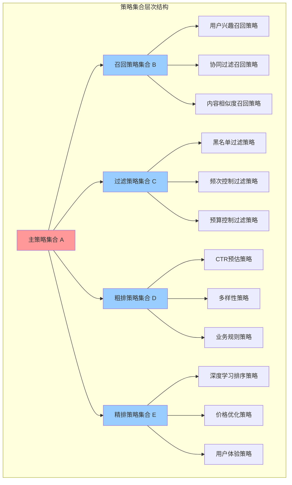

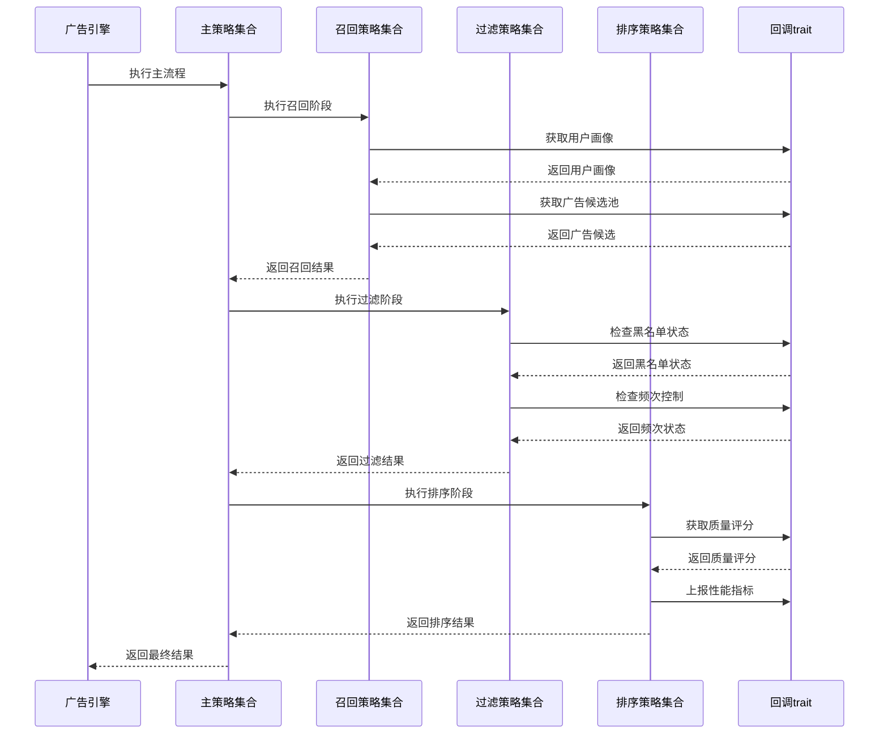

**顶层策略集合（策略集合A）**：

- 作为广告处理的主流程定义
- 包含多个子策略集合的引用
- 定义子策略集合的执行顺序
- 控制整体处理流程的超时和错误处理

**子策略集合（策略集合B、C、D、E等）**：

- 每个子策略集合专注特定的处理阶段
- 包含多个具体策略的组合
- 支持策略间的并行和串行执行
- 提供阶段级别的配置和控制

**具体策略实现**：

- 实现统一的策略trait
- 专注单一的算法逻辑
- 通过回调trait获取所需数据
- 提供标准化的执行结果

#### 策略集合配置模型

**配置结构设计**：

```text
策略集合配置
├── 主流程定义
│   ├── 策略集合A配置
│   │   ├── 子策略集合执行顺序
│   │   ├── 全局超时设置
│   │   ├── 错误处理策略
│   │   └── 监控上报配置
│   └── 执行环境配置
├── 子策略集合定义
│   ├── 召回策略集合B
│   │   ├── 策略列表和优先级
│   │   ├── 并行执行配置
│   │   ├── 结果合并规则
│   │   └── 阶段性能要求
│   ├── 过滤策略集合C
│   ├── 粗排策略集合D
│   └── 精排策略集合E
└── 策略实例配置
    ├── 各策略的参数配置
    ├── 启用状态和版本设置
    ├── 资源限制和超时配置
    └── 监控和告警设置

```

**配置管理机制**：

- 配置版本控制和回滚机制
- 配置变更的实时生效
- 多环境配置管理（开发、测试、生产）
- 配置校验和安全检查

## 定向策略计算器抽象设计

### 定向策略计算器架构概述

定向策略计算器是广告引擎抽象层的重要组成部分，采用统一的策略trait设计，支持各种定向条件的匹配度计算。该设计遵循**单一职责原则**和**开闭原则**，将定向数据存储与匹配算法分离，实现高度可扩展和可测试的架构。

#### 设计理念

**职责分离**：

- 定向上下文信息（TargetingContext）：负责存储和管理各种定向相关的上下文数据
- 定向策略信息（TargetingPolicy）：负责存储广告的定向配置和规则
- 定向策略计算器：专注于实现各种匹配算法和评分逻辑

**统一trait**：

- 所有定向策略计算器都实现统一的 `TargetingMatcher` trait
- 支持依赖注入和动态加载
- 提供标准化的输入输出格式

**可扩展架构**：

- 支持运行时动态注册新的定向类型和计算器
- 配置驱动的计算器选择和组合
- 支持计算器的版本管理和热更新

### 定向策略计算器Trait设计

#### 核心Trait定义

```mermaid
classDiagram
    class TargetingMatcher {
        <<trait>>
        +matcher_type() -> &str
        +version() -> &str
        +priority() -> i32
        +calculate_match_score_async(context: &dyn TargetingContext, criteria: &dyn TargetingCriteria) -> Result~MatchResult, MatchError~
        +is_supported(criteria_type: &str) -> bool
        +get_required_context_types() -> Vec~String~
        +validate_criteria(criteria: &dyn TargetingCriteria) -> ValidationResult
    }
    
    class TargetingContext {
        <<trait>>
        +context_type() -> &str
        +context_id() -> &str
        +timestamp() -> DateTime~Utc~
        +properties() -> &HashMap~String, serde_json::Value~
        +get_property~T~(key: &str) -> Option~T~ where T: DeserializeOwned
        +has_property(key: &str) -> bool
        +validate() -> ValidationResult
        +Note: "定义在 crates/04-core/domain 项目中"
    }
    
    class TargetingCriteria {
        <<trait>>
        +criteria_type() -> &str
        +rules() -> &HashMap~String, serde_json::Value~
        +get_rule~T~(key: &str) -> Option~T~ where T: DeserializeOwned
        +has_rule(key: &str) -> bool
        +weight() -> f64
        +is_enabled() -> bool
        +Note: "定义在 crates/04-core/domain 项目中"
    }
    
    class MatchResult {
        +score: f64
        +is_match: bool
        +matcher_type: String
        +details: HashMap~String, serde_json::Value~
        +reason_code: String
        +execution_time: Duration
    }
    
    class GeoTargetingMatcher {
        +calculate_match_score_async(context: &dyn TargetingContext, criteria: &dyn TargetingCriteria) -> Result~MatchResult, MatchError~
        +is_supported(criteria_type: &str) -> bool
        -calculate_distance_score(user_location: &GeoLocation, target_location: &GeoLocation) -> f64
        -calculate_region_score(user_region: &str, target_regions: &[String]) -> f64
    }
    
    class DemographicTargetingMatcher {
        +calculate_match_score_async(context: &dyn TargetingContext, criteria: &dyn TargetingCriteria) -> Result~MatchResult, MatchError~
        +is_supported(criteria_type: &str) -> bool
        -calculate_age_score(user_age: i32, target_range: &AgeRange) -> f64
        -calculate_gender_score(user_gender: &Gender, target_genders: &[Gender]) -> f64
    }
    
    class DeviceTargetingMatcher {
        +calculate_match_score_async(context: &dyn TargetingContext, criteria: &dyn TargetingCriteria) -> Result~MatchResult, MatchError~
        +is_supported(criteria_type: &str) -> bool
        -calculate_device_type_score(user_device: &DeviceType, target_devices: &[DeviceType]) -> f64
        -calculate_os_score(user_os: &str, target_os: &[String]) -> f64
    }
    
    class TimeTargetingMatcher {
        +calculate_match_score_async(context: &dyn TargetingContext, criteria: &dyn TargetingCriteria) -> Result~MatchResult, MatchError~
        +is_supported(criteria_type: &str) -> bool
        -calculate_time_slot_score(request_time: DateTime~Utc~, target_slots: &[TimeSlot]) -> f64
        -calculate_day_of_week_score(request_day: chrono::Weekday, target_days: &[chrono::Weekday]) -> f64
    }
    
    class BehaviorTargetingMatcher {
        +calculate_match_score_async(context: &dyn TargetingContext, criteria: &dyn TargetingCriteria) -> Result~MatchResult, MatchError~
        +is_supported(criteria_type: &str) -> bool
        -calculate_interest_score(user_interests: &[String], target_interests: &[String]) -> f64
        -calculate_behavior_pattern_score(user_behavior: &UserBehavior, target_pattern: &BehaviorPattern) -> f64
    }
    
    TargetingMatcher <|.. GeoTargetingMatcher
    TargetingMatcher <|.. DemographicTargetingMatcher
    TargetingMatcher <|.. DeviceTargetingMatcher
    TargetingMatcher <|.. TimeTargetingMatcher
    TargetingMatcher <|.. BehaviorTargetingMatcher
    
    TargetingMatcher --> MatchResult : creates
    TargetingMatcher --> TargetingContext : uses
    TargetingMatcher --> TargetingCriteria : uses
```

#### Trait设计说明

**TargetingMatcher trait**：

- `matcher_type()`：计算器类型标识，用于配置和注册
- `version()`：计算器版本，支持版本管理和兼容性检查
- `priority()`：计算器优先级，影响执行顺序
- `calculate_match_score_async()`：核心匹配计算方法，返回匹配结果
- `is_supported()`：检查是否支持指定的条件类型
- `get_required_context_types()`：返回所需的上下文类型列表
- `validate_criteria()`：验证条件配置的有效性

**TargetingContext trait（位于crates/04-core/domain项目）**：

- 统一的上下文数据访问trait
- 支持强类型的属性获取
- 提供属性存在性检查
- 包含时间戳信息用于缓存管理

**TargetingCriteria trait（位于crates/04-core/domain项目）**：

- 统一的条件规则访问trait
- 支持强类型的规则获取
- 包含权重和启用状态配置
- 支持复杂的条件规则定义

**依赖关系说明**：

- `TargetingMatcher`在抽象层项目中定义，作为策略计算器的统一trait
- `TargetingContext`和`TargetingCriteria`在crates/04-core/domain项目中定义，作为值对象trait
- 这样的设计避免了循环依赖，符合DDD的分层架构原则

### 定向策略计算器管理器设计

#### 计算器管理器Trait

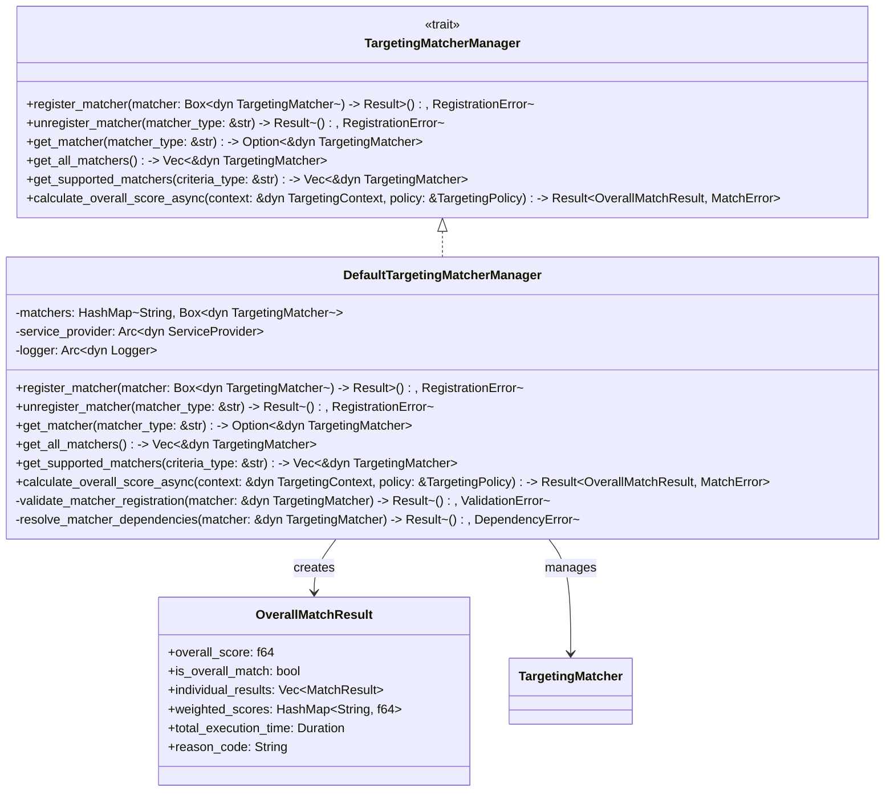

#### 管理器职责说明

**计算器注册管理**：

- 支持运行时动态注册和注销计算器
- 验证计算器的有效性和兼容性
- 管理计算器的依赖关系和生命周期

**计算器查找和选择**：

- 根据条件类型查找支持的计算器
- 按优先级排序计算器执行顺序
- 提供计算器的缓存和性能优化

**整体评分计算**：

- 协调多个计算器的执行
- 合并个体匹配结果为整体评分
- 应用权重配置和聚合策略
- 提供详细的执行统计和调试信息

### 依赖注入和配置管理

#### 服务注册架构设计

**扩展函数设计指导**：

- 在`crates/04-core/ad-engine-abstractions`项目的`extensions`目录下设计服务注册扩展函数
- 提供`add_targeting_matchers`扩展函数，支持链式配置
- 自动扫描和注册所有实现`TargetingMatcher` trait的类型
- 支持配置选项的强类型绑定，使用serde进行配置解析

**注册策略设计**：

- 管理器使用Arc<dyn TargetingMatcherManager>单例模式注册，确保全局唯一
- 计算器使用Box<dyn TargetingMatcher>注册，支持并发访问
- 通过配置文件控制计算器的启用状态和参数
- 提供配置验证和默认值设置机制

#### 配置文件架构设计

**配置层次结构**：

- 全局配置：默认阈值、并行执行、最大执行时间等系统级参数
- 计算器配置：每个计算器的权重、启用状态、优先级、特定参数
- 环境配置：支持开发、测试、生产环境的差异化配置

**配置管理原则**：

- 使用强类型配置结构体，提供编译时检查
- 支持配置热更新，无需重启应用程序
- 实现配置验证机制，防止无效配置
- 提供配置变更的审计和回滚能力

**注册策略设计**：

- 管理器使用单例模式注册，确保全局唯一
- 计算器使用瞬态模式注册，支持并发访问
- 通过配置文件控制计算器的启用状态和参数
- 提供配置验证和默认值设置机制

#### 配置文件架构设计

**配置层次结构**：

- 全局配置：默认阈值、并行执行、最大执行时间等系统级参数
- 计算器配置：每个计算器的权重、启用状态、优先级、特定参数
- 环境配置：支持开发、测试、生产环境的差异化配置

**配置管理原则**：

- 使用强类型配置类，提供编译时检查
- 支持配置热更新，无需重启应用程序
- 实现配置验证机制，防止无效配置
- 提供配置变更的审计和回滚能力

### 计算器执行流程设计

#### 执行编排策略

**流程控制设计**：

- 管理器负责计算器的选择、调度和结果聚合
- 支持串行和并行两种执行模式
- 实现超时控制和异常隔离机制
- 提供执行进度跟踪和性能监控

**结果聚合算法**：

- 根据权重配置计算加权平均分
- 支持多种聚合策略：最大值、最小值、平均值等
- 实现短路机制，当某个计算器分数过低时提前终止
- 提供详细的执行统计和调试信息

#### 性能优化策略

**并发控制机制**：

- 使用`futures::future::join_all`实现异步并行执行
- 通过信号量控制并发度，避免资源过载
- 实现计算器间的依赖关系管理
- 支持优先级调度和资源分配

**缓存策略设计**：

- 实现多层缓存：计算器实例缓存、配置缓存、结果缓存
- 使用LRU算法管理缓存淘汰
- 支持缓存预热和智能预加载
- 实现缓存一致性保证机制

**错误处理策略**：

- 单个计算器失败不影响整体流程
- 提供默认评分和降级策略
- 实现错误传播控制和异常聚合
- 支持故障恢复和自动重试机制

## 扩展性和演进设计

### 新计算器接入指导

**开发流程设计**：

1. **trait实现**：在`crates/03-strategies/targeting`项目中创建新的计算器结构体，实现`TargetingMatcher` trait
2. **值对象定义**：如需要新的定向上下文或条件类型，在`crates/04-core/domain`项目的`value_objects/targeting`目录下定义
3. **依赖注入**：通过自动扫描机制注册，或在扩展函数中显式注册
4. **配置管理**：在config.toml中添加计算器配置项
5. **测试验证**：编写单元测试和集成测试确保功能正确性
6. **部署策略**：支持热部署和灰度发布

**设计规范要求**：

- 计算器必须是无状态的，支持并发调用
- 实现幂等性，相同输入产生相同输出
- 提供详细的元数据和配置约束定义
- 支持版本兼容性检查和升级路径
- 遵循DDD分层架构，正确引用crates/04-core/domain中的值对象trait

#### 算法优化和升级策略

**版本管理机制**：

- 支持同类型计算器的多版本共存
- 通过配置控制版本选择和切换
- 提供A/B测试框架验证新算法效果
- 实现渐进式升级和快速回滚能力

**配置驱动优化**：

- 算法参数外化为配置项，支持运行时调整
- 提供参数有效性验证和范围检查
- 实现参数变更的影响分析和风险评估
- 支持参数优化建议和自动调优

**机器学习集成准备**：

- 预留模型推理接口和特征工程框架
- 设计模型版本管理和在线更新机制
- 实现模型性能监控和效果评估
- 支持模型训练数据的收集和标注

**监控和度量体系**：

- 实现计算器执行时间和成功率监控
- 提供业务指标的实时跟踪和告警
- 支持性能瓶颈识别和优化建议
- 实现执行链路追踪和问题诊断

### 与数据访问接口的集成

#### 定向数据访问集成

定向策略计算器通过数据访问抽象接口获取所需数据：

```rust
use async_trait::async_trait;
use std::sync::Arc;
use tokio::time::Instant;

pub struct GeoTargetingMatcher {
    targeting_data_provider: Arc<dyn TargetingDataProvider>,
}

#[async_trait]
impl TargetingMatcher for GeoTargetingMatcher {
    async fn calculate_match_score_async(
        &self,
        context: &dyn TargetingContext,
        criteria: &dyn TargetingCriteria,
        cancellation_token: CancellationToken,
    ) -> Result<MatchResult, MatchError> {
        let start_time = Instant::now();
        
        // 通过数据访问接口获取地理定向数据，自动处理缓存
        let location_hash = context.get_property::<String>("LocationHash")
            .ok_or(MatchError::MissingProperty("LocationHash"))?;
            
        let geo_data = self.targeting_data_provider
            .get_geo_targeting_data_async(&location_hash, cancellation_token)
            .await?;
            
        let user_location = context.get_property::<GeoLocation>("UserLocation")
            .ok_or(MatchError::MissingProperty("UserLocation"))?;
            
        let target_location = criteria.get_rule::<GeoLocation>("TargetLocation")
            .ok_or(MatchError::MissingRule("TargetLocation"))?;
        
        // 执行匹配算法
        let score = self.calculate_distance_score(&user_location, &target_location);
        let min_score = criteria.get_rule::<f64>("MinScore").unwrap_or(0.0);
        
        Ok(MatchResult {
            score,
            is_match: score >= min_score,
            matcher_type: self.matcher_type().to_string(),
            details: HashMap::new(),
            reason_code: if score >= min_score { "MATCH".to_string() } else { "NO_MATCH".to_string() },
            execution_time: start_time.elapsed(),
        })
    }
    
    fn matcher_type(&self) -> &str {
        "GeoTargeting"
    }
    
    fn calculate_distance_score(&self, user_location: &GeoLocation, target_location: &GeoLocation) -> f64 {
        // 地理距离计算算法实现
        // 这里是简化示例
        let distance = ((user_location.latitude - target_location.latitude).powi(2) + 
                       (user_location.longitude - target_location.longitude).powi(2)).sqrt();
        
        if distance < 1.0 {
            1.0
        } else {
            1.0 / distance
        }
    }
}
```

**集成优势**：

1. **透明缓存**：定向计算器无需关心数据缓存逻辑
2. **统一访问**：通过标准化接口访问所有定向相关数据
3. **性能优化**：自动的批量数据获取和预加载
4. **一致性保障**：数据访问接口确保缓存和数据库的一致性

### DDD分层架构合规性说明

#### 分层原则遵循

根据数据模型分层设计文档和DDD最佳实践，我们严格遵循以下分层原则：

**Core.Domain层职责**：

- 定义领域实体（如`AdCandidate`、`Campaign`、`UserProfile`等）
- 定义值对象trait（如`TargetingContext`、`TargetingCriteria`）
- 定义聚合根和领域事件
- 包含业务规则和领域逻辑

**Core.AdEngine.Abstractions层职责**：

- 定义引擎抽象trait（如`TargetingMatcher`、`AdProcessingStrategy`）
- 定义数据访问抽象trait
- 定义回调机制trait
- 提供扩展点和插件机制

**避免循环依赖**：

- `Core.AdEngine.Abstractions` → `Core.Domain`：抽象层依赖领域层，获取值对象trait
- `Infrastructure.*` → `Core.AdEngine.Abstractions`：基础设施层依赖抽象层，实现具体trait
- `Infrastructure.*` → `Core.Domain`：基础设施层依赖领域层，实现数据持久化

**正确的依赖方向**：
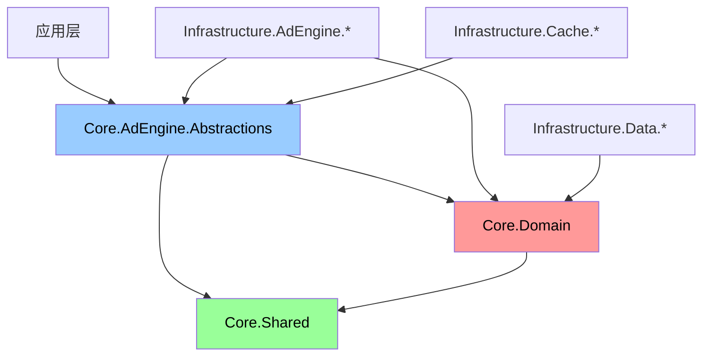

#### 接口定义位置原则

**值对象trait**（定义在Core.Domain）：

- `TargetingContext`：定向上下文数据结构
- `TargetingCriteria`：定向条件规则结构
- 这些trait定义了领域概念的数据结构和行为契约

**服务trait**（定义在Core.AdEngine.Abstractions）：

- `TargetingMatcher`：定向匹配计算服务
- `TargetingMatcherManager`：定向匹配管理服务
- 这些trait定义了应用服务和基础设施服务的行为契约

#### 实现项目职责

**定向策略计算器实现项目**：

```text
crates/03-strategies/targeting/
├── src/
│   ├── matchers/
│   │   ├── geo_targeting_matcher.rs
│   │   ├── demographic_targeting_matcher.rs
│   │   ├── device_targeting_matcher.rs
│   │   ├── time_targeting_matcher.rs
│   │   └── behavior_targeting_matcher.rs
│   ├── managers/
│   │   └── targeting_matcher_manager.rs
│   ├── extensions/
│   │   └── service_registration.rs
│   ├── configuration/
│   │   └── targeting_matcher_options.rs
│   └── lib.rs
└── Cargo.toml
```

**依赖引用**：

- `crates/04-core/ad-engine-abstractions`：获取`TargetingMatcher`等服务trait
- `crates/04-core/domain`：获取`TargetingContext`、`TargetingCriteria`等值对象trait
- `crates/04-core/shared`：获取通用枚举和常量

这样的设计确保了清晰的分层边界，避免了循环依赖，同时符合DDD的设计理念。
