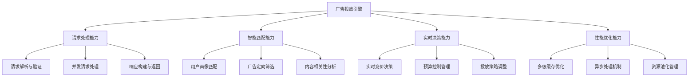
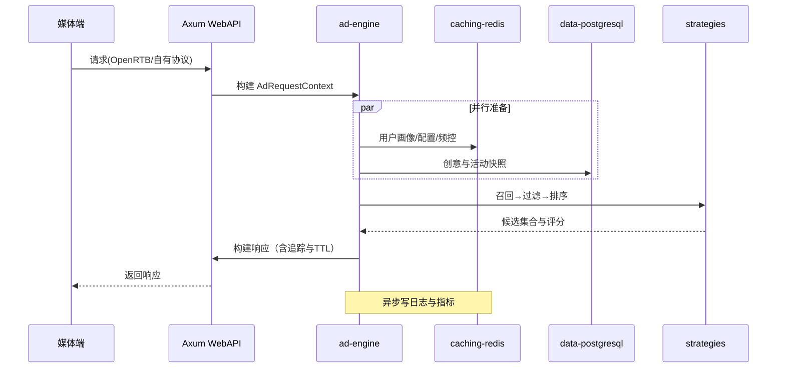
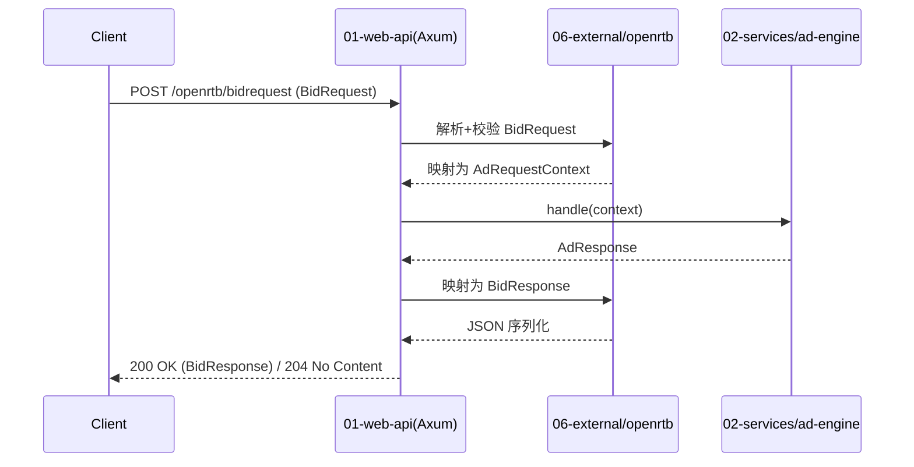

# 广告投放引擎技术设计（Rust 实现）

本文档将原有 .NET/C# 视角的设计全面转为 Rust 技术栈落地方案，基于工作空间的分层架构与抽象接口规范，提供清晰的 crate 映射、核心接口契约、数据流、性能与可靠性设计，避免具体实现代码，专注技术设计与实现指导。

## 1. 系统概述

### 1.1 设计目标

| 设计目标 | 技术指标            | 业务价值                     |
| -------- | ------------------- | ---------------------------- |
| 高性能   | 响应时间P99 < 100ms | 提升用户体验，增加广告填充率 |
| 高并发   | 支持50万QPS         | 满足大流量广告投放需求       |
| 高可用   | 系统可用性99.99%    | 保障广告收入稳定性           |
| 实时性   | 毫秒级响应          | 支持RTB实时竞价场景          |
| 智能化   | AI驱动优化          | 提升广告投放效果和ROI        |
| 可扩展   | 水平弹性扩展        | 适应业务快速增长需求         |

### 1.2 核心能力



### 1.3 技术架构原则（Rust）

| 设计原则     | 具体要求               | 实现策略                             |
| ------------ | ---------------------- | ------------------------------------ |
| 高内聚低耦合 | 模块功能单一，接口清晰 | Cargo Workspace + trait 接口隔离     |
| 无状态设计   | 服务实例无状态，易扩展 | 会话/频控外部化，幂等与去重设计      |
| 异步优先     | 非阻塞处理，提升并发   | Tokio 运行时，Axum/Hyper 异步栈      |
| 缓存优先     | 减少数据访问延迟       | L1/L2 多级缓存 + 预计算策略          |
| 容错设计     | 故障隔离，优雅降级     | 超时/重试/熔断/降级与幂等            |
| 可观测性     | 端到端追踪与指标       | tracing + OpenTelemetry + Prometheus |

## 2. 架构与 crate 映射

### 2.1 整体架构（C4 组件视图）

```mermaid
graph TB
    subgraph "01-Presentation"
        WebAPI[web-api(Axum)]
        Gateway[gateway]
    end

    subgraph "02-Services"
        AdEngine[ad-engine]
        Targeting[targeting]
        Bidding[bidding]
        Campaign[campaign]
        Analytics[analytics]
        Reporting[reporting]
    end

    subgraph "03-Strategies"
        Recall[recall]
        Filter[filter]
        Ranking[ranking]
        SCommon[strategy-common]
    end

    subgraph "04-Core"
        Domain[domain]
        App[application]
        Shared[shared]
        Abstractions[ad-engine-abstractions]
    end

    subgraph "05-Infrastructure"
        CfgAbs[config-abstractions]
        CfgImpl[config-impl]
        DiAbs[di-abstractions]
        DiImpl[di-impl]
        DataAbs[data-abstractions]
        Pg[data-postgresql]
        Redis[caching-redis]
        Comp[infrastructure-composition]
    end

    subgraph "06-External"
        OpenRTB[openrtb]
        VAST[vast]
    end

    WebAPI -->|HTTP/JSON| AdEngine
    Gateway --> WebAPI

    AdEngine --> Targeting
    AdEngine --> Bidding
    AdEngine --> Campaign

    Targeting --> Recall
    Targeting --> Filter
    Targeting --> Ranking
    Targeting --> Abstractions

    AdEngine --> Abstractions
    AdEngine --> Shared
    AdEngine --> DataAbs
    AdEngine --> Redis
    AdEngine --> Pg
    AdEngine --> Comp
    AdEngine --> CfgAbs

    WebAPI --> OpenRTB
```

### 2.2 crate 依赖与职责

- crates/02-services/ad-engine
  - 职责：请求编排、候选生成、策略执行、响应组装
  - 依赖：ad-engine-abstractions, shared, targeting, bidding, campaign, data-abstractions, caching-*, config-*, di-*, infrastructure-composition

  - 职责：统一的策略接口、上下文/策略/结果模型、管线协议
  - 依赖：shared（类型与错误）

- crates/03-strategies/{recall,filter,ranking}
  - 职责：实现召回/过滤/排序策略（Rust 实现），通过 trait 解耦
  - 依赖：ad-engine-abstractions, shared

- crates/05-infrastructure/{config-*, di-*, data-*, caching-*}
  - 职责：配置、依赖注入、数据库与缓存接入，运行时可切换
  - 依赖：shared

- crates/06-external/openrtb
  - 职责：OpenRTB 协议对象映射与适配层
  - 依赖：shared

依赖规则：外层依赖内层；通过 trait 进行接口隔离；禁止 crate 循环依赖。

## 3. 核心接口契约（设计，不含实现）

### 3.1 处理管线与策略接口

```rust
// ad-engine-abstractions（设计草案）
pub trait AdProcessingPipeline {
    fn handle(&self, ctx: &AdRequestContext) -> Result<AdResponse, EngineError>;
}

pub trait RecallStrategy {
    fn recall(&self, ctx: &AdRequestContext) -> Result<Vec<AdCandidate>, StrategyError>;
}

pub trait FilterStrategy {
    fn filter(&self, ctx: &AdRequestContext, cands: Vec<AdCandidate>) -> Result<Vec<AdCandidate>, StrategyError>;
}

pub trait RankingStrategy {
    fn rank(&self, ctx: &AdRequestContext, cands: Vec<ScoredCandidate>) -> Result<Vec<ScoredCandidate>, StrategyError>;
}

pub trait StrategyRegistry {
    fn recalls(&self) -> Vec<Box<dyn RecallStrategy + Send + Sync>>;
    fn filters(&self) -> Vec<Box<dyn FilterStrategy + Send + Sync>>;
    fn rankings(&self) -> Vec<Box<dyn RankingStrategy + Send + Sync>>;
}
```

约束与要求：

- 输入输出均为不可变或新分配集合，避免共享可变状态；
- 错误需带有可观测上下文（分类、原因、建议）；
- 策略执行可并发但需可控（限流、预算、隔离）。

### 3.2 上下文、候选与结果模型

```rust
// ad-engine-abstractions（设计草案）
pub struct AdRequestContext { /* 请求、设备、地理、用户画像、媒体位、隐私同意等 */ }
pub struct AdCandidate { /* 广告基本信息、TargetingConfig、素材摘要、预算引用 */ }
pub struct ScoredCandidate { /* 候选 + 得分/权重/解释 */ }

pub struct AdResponse { /* 展示/竞价响应，含追踪参数与渲染指令 */ }

pub enum EngineError { Timeout, Backend, Invalid, Capacity, Other(String) }
pub enum StrategyError { DataMissing, Compute, Incompatible, Other(String) }
```

关键字段：

- 上下文：request_id、site/app、imp、geo、device、user、consent、network；
- 候选：ad_id、campaign_id、targeting_config_sig、creative_meta、pacing/budget ref；
- 结果：score、features、explanations、selected_creatives、ttl。

### 3.3 Web 接入（Axum）与 OpenRTB 适配

- 接入 crate：01-presentation/web-api（Axum）
- 端点：/openrtb/bidrequest, /ad/request（自有协议）
- 适配：06-external/openrtb 负责 JSON 映射与验证，转换为 AdRequestContext。

## 4. 数据流与执行流程

### 4.1 请求处理序列



### 4.2 关键决策

- 早停与短路：无候选立即返回 no-fill；
- 预算与频控：严格在过滤前后两次校验；
- 质量与合规：在排序前剔除违规或低质；
- 探索与学习：按策略对新广告给予适度曝光。

## 5. 配置与依赖注入

### 5.1 统一配置

- crates/05-infrastructure/config-abstractions：定义 ConfigProvider、ConfigWatcher；
- crates/05-infrastructure/config-impl：实现文件/环境变量/远端配置源；
- 模式：分层配置（默认→环境→租户→实验），支持热更新与版本化。

### 5.2 依赖注入与组件发现

- crates/05-infrastructure/di-abstractions：Container、ServiceDescriptor、Scope；
- crates/05-infrastructure/di-impl：构建器与生命周期管理；
- crates/05-infrastructure/composition：组件自动发现（宏/约定）与注册；
- 策略注册：通过 feature flag 或配置启停策略集合。

## 6. 数据访问、缓存与一致性

### 6.1 数据访问

- crates/05-infrastructure/data-abstractions：DbSession、Repository、Transaction；
- crates/05-infrastructure/data-postgresql：SeaORM 实现；
- 访问模式：只读快照优先，强一致仅用于低频关键写入（预算结算）。

### 6.2 多级缓存

- L1（进程内）：热点配置与特征；
- L2（Redis）：候选池、用户画像摘要、频控计数；
- 键：ad:{ad_id}:cfg:{ver}、usr:{uid}:fx、ctx:{hash}；
- TTL：短 TTL + 主动失效（版本/黑名单/紧急开关）。

### 6.3 一致性

- 事件外盒（Outbox）用于投放日志与异步统计；
- 预算扣减采用幂等写与行级乐观锁；
- 频控计数使用 Redis 原子操作与滑窗。

## 7. 可观测性与SLO

### 7.1 tracing 与指标

- tracing 层级：request→pipeline→strategy→backend；
- 指标：
  - QPS, P50/P95/P99, error_rate, timeouts
  - recall/filter/rank 耗时与命中率
  - cache hit ratio、DB 延迟、队列堆积

### 7.2 日志与采样

- 结构化日志（JSON），敏感字段脱敏；
- 低基数标签，针对错误与慢请求提高采样。

## 8. 性能与容量规划

### 8.1 并发模型

- Tokio 多反应堆线程，CPU 亲和可选；
- I/O 线程与计算任务分离（spawn_blocking 限制）；
- 零拷贝/池化：字节缓冲复用、预分配集合容量。

### 8.2 热路径优化

- 早拒绝与短路；
- 批处理（同策略同配置合并计算）；
- 可配置的降级路径（跳过次要特征）。

### 8.3 基准与回归

- Criterion 基准测试覆盖管线与策略热点；
- 负载测试场景：冷/热缓存、比例混合、故障注入。

## 9. 可靠性与恢复

### 9.1 错误分类

- 输入类（400）：参数/协议错误；
- 后端类（5xx）：缓存/数据库/消息队列；
- 资源类：超时/舱位满/降级；
- 策略类：数据缺失/不兼容。

### 9.2 恢复策略

- 超时与重试（抖动退避）；
- 断路器与舱壁隔离；
- 降级响应（no-fill/部分字段可空）。

## 10. 安全与合规

- PII 最小化与加密存储；
- 同意管理（TCF 等）透传；
- 反作弊信号（IP/UA/设备指纹）采集与策略联动。

## 11. 测试策略（TDD）

- 单元：trait 合同、边界条件、错误分支；
- 集成：与 Redis/PostgreSQL 的最小化联测（Testcontainers）；
- E2E：OpenRTB 端到端；
- 回归：策略榜单的金数据集校验。

### 11.1 测试项目映射（Rust）

- 单元（cargo test）：各 crate 自带 tests/；使用 mockall 模拟 trait；tokio::test 测异步
- 集成（testcontainers）：crates/08-tests/integration 启动 Redis/PostgreSQL 进行最小联测
- 性能（Criterion）：crates/08-tests/performance 针对热路径与策略热点做基准
- 压测（可选）：k6/JMeter 脚本驱动 Axum 端点，记录 P95/P99
- 端到端（E2E）：crates/08-tests/e2e 启动 WebAPI，发送 OpenRTB 样例断言 BidResponse

### 11.2 测试覆盖目标（Rust）

- ad-engine：单元 ≥ 95%，集成 ≥ 85%，E2E 覆盖主流程与超时/降级
- openrtb/vast：核心字段 100% 映射校验，ext.* 透传用例覆盖
- infrastructure：缓存一致性、过期与重试策略覆盖关键分支

## 12. 部署与运维

- 健康探针：/healthz(liveness), /readyz(readiness)；
- 蓝绿/金丝雀发布；
- 配置版本与回滚；
- 多云抽象：cloud-abstractions + cloud-*（按需）。

### 12.1 部署工具与项目映射（Rust）

- 构建与镜像：cargo-dist 或 Docker multi-stage；运行时镜像采用 distroless/ubi-minimal
- 数据迁移：crates/09-tools/data-migration 管理 SeaORM Migrator 版本与回滚
- 配置管理：crates/05-infrastructure/config-impl + K8s ConfigMap/Secret（env 覆盖优先）
- 发布流水线：GitHub Actions/Azure DevOps，缓存 sccache，加速构建

### 12.2 监控与运维项目映射（Rust）

- 指标与日志：tracing + OpenTelemetry → Prometheus/Grafana/Jaeger
- 告警策略：错误率/延迟/No-Fill 阈值；预算/消耗异常
- 运维脚本：crates/09-tools/deployment 提供健康检查、灰度流量切换、回滚

## 13. IAB 标准集成

- OpenRTB：请求/响应映射，必填校验，扩展字段透传；
- VAST/VMAP：视频/多广告场景由 vast crate 生成模板；
- AdCOM：对象模型与内部模型的映射对照。

### 13.1 协议实现映射（Rust）

- Crate 映射
    - crates/01-presentation/web-api：Axum 接入层（路由、限流、鉴权、追踪）
    - crates/06-external/openrtb：OpenRTB 协议对象、serde 映射、字段校验与适配
    - crates/06-external/vast：VAST/VMAP 模板生成与响应渲染
    - crates/02-services/ad-engine：投放引擎管线与策略执行
    - crates/02-services/bidding（可选）：独立竞价/拍卖服务

- 端点与数据流



- 请求/响应映射要点
    - BidRequest → AdRequestContext：site/app、imp、device、geo、user、consent、ext.*
    - AdResponse → BidResponse：seatbid.bid[].price、adm/nurl、crid、cat、attr、exp/ttl
    - 扩展字段透传：保留 ext.* 未知字段，避免破坏兼容

- 错误与边界
    - 协议/必填缺失/类型错误 → 400 Bad Request（错误码+提示）
    - 无可投放/策略不匹配 → 204 No Content（no-fill）
    - 后端依赖故障/超时 → 5xx（可降级空填充，带 traceId）

- 版本与兼容
    - OpenRTB 2.5 基线；常见 2.3/2.4 字段向前兼容
    - JSON 大小写/数值范围严格校验；UTC 时间戳；货币单位统一（例如 micros 或 ISO-4217）

### 13.2 第三方服务集成（Rust）

- 服务目录与调用方式
    - 反作弊 AntiFraud：crates/06-external/antifraud（HTTP/gRPC 可插拔），提供 is_valid_traffic(ctx) → Verdict
    - GeoIP：crates/06-external/geoip（本地库/MaxMind 文件/内存映射），ip → GeoInfo；带冷/热缓存
    - DMP 画像：crates/06-external/dmp（HTTP），user_id/device_id → Traits；过期与并发合并请求
    - 支付结算：crates/06-external/payment（REST），结算回调异步 outbox 驱动

- 可靠性与容错
    - 超时/重试/熔断：统一通过 infrastructure/common 重试策略；幂等键防重
    - 回退：不可用时使用缓存快照或降级为 no-fill；记录外部依赖状态指标
    - 度量与追踪：每个集成暴露 latency、error_rate、qps；trace 跨服务关联

## 14. 实施里程碑（Rust）

1. 基础抽象与管线骨架（ad-engine-abstractions + ad-engine）
2. 策略最小集（recall/filter/ranking 各1-2个）与可观测性
3. 缓存与配置/DI 落地（config-impl, di-impl, caching-redis）
4. 数据访问只读路径（data-postgresql）与日志外盒
5. OpenRTB 接入与 E2E 验证
6. 性能优化与可靠性收敛（限流/熔断/降级）

---

附录：输入/输出契约（简版）

- 输入：AdRequestContext
  - 必填：request_id、imp、site/app、device、network、consent
  - 可选：user/profile、geo、keywords、ext

- 输出：AdResponse
  - 必填：选择的候选、渲染指令/追踪链接、TTL
  - 可选：解释/特征值、实验标签

错误与超时：

- 引擎层 handle 超时 < 50ms（可配置）；
- 后端调用单次超时 5-20ms（服务级别配置）；
- 对外响应在 SLA 下返回可降级结果。
