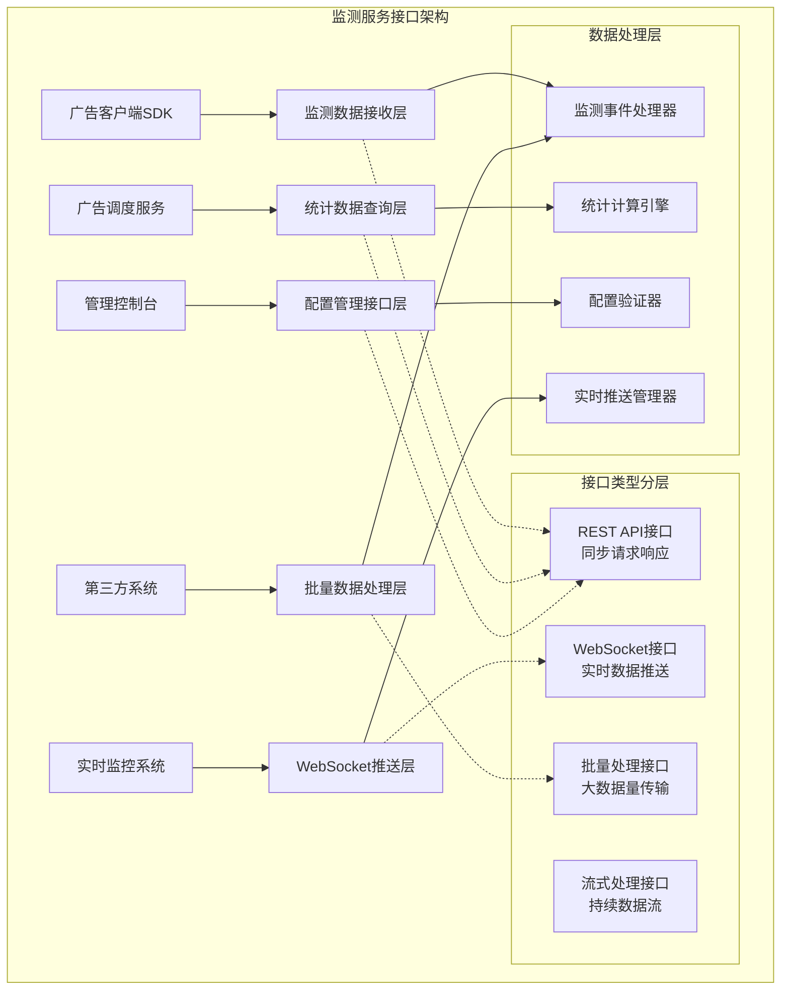
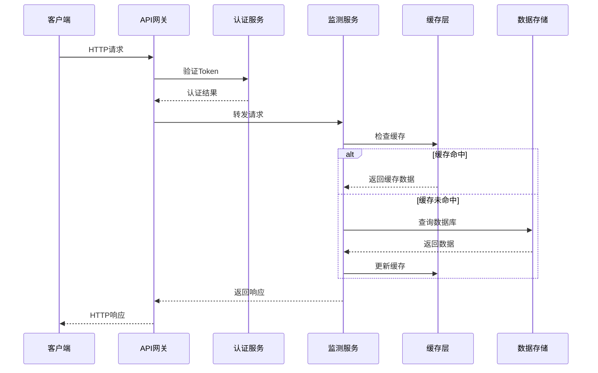
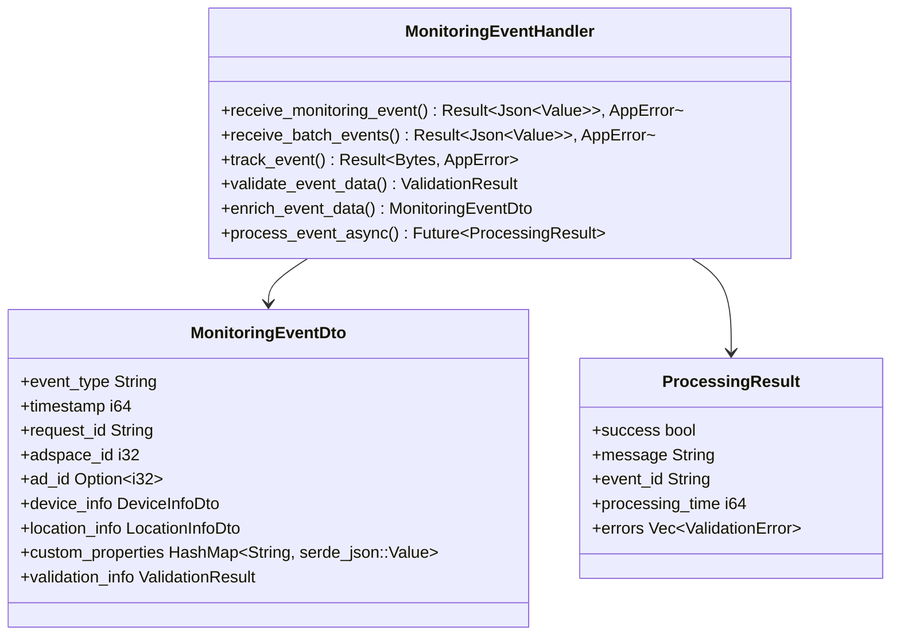
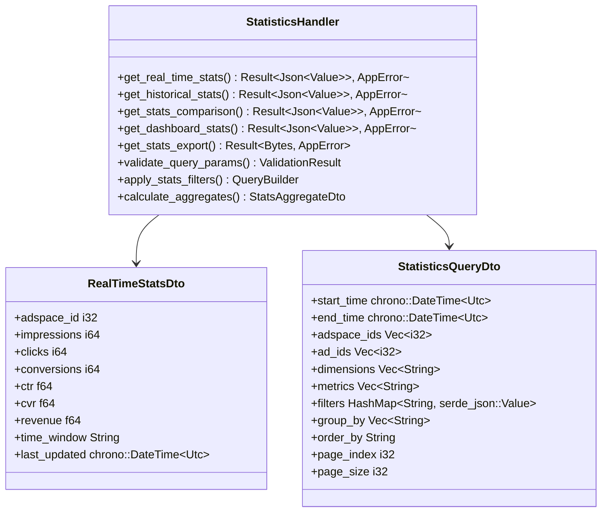
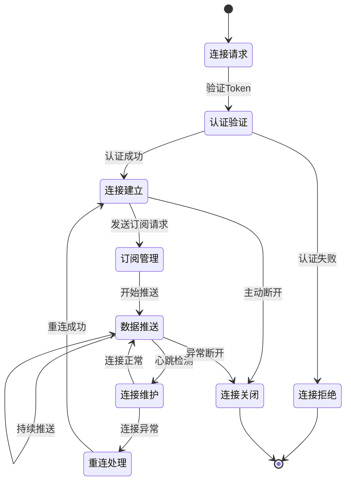
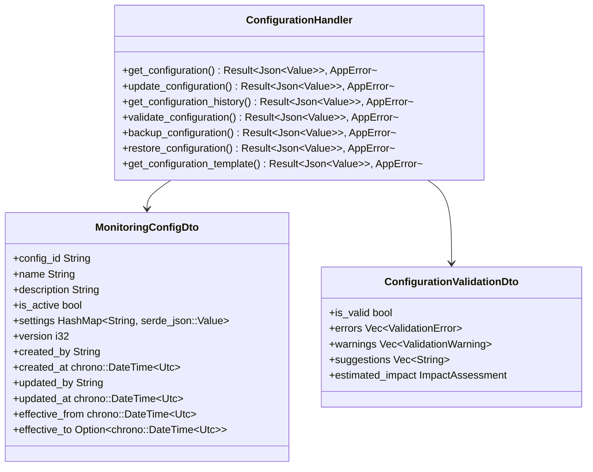
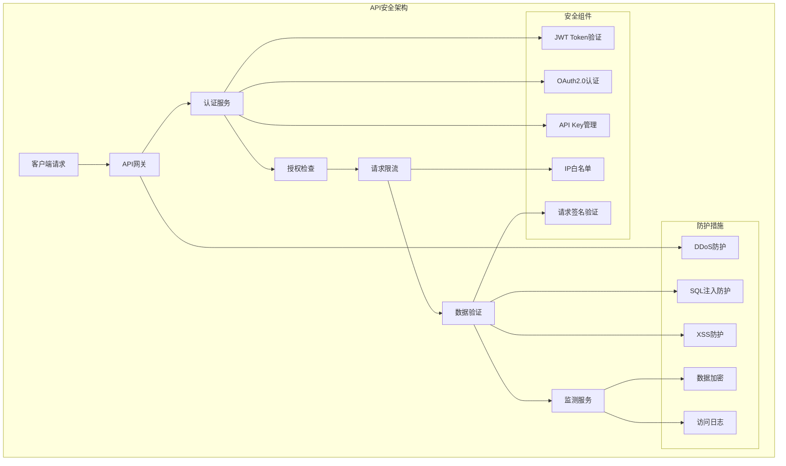

# 广告效果监测服务接口设计

## 设计概述

广告效果监测服务接口设计定义了监测数据接收、统计数据查询和管理配置的完整API接口规范。设计遵循RESTful API设计原则，支持HTTP/HTTPS协议、WebSocket实时推送和批量处理接口，基于Rust + Axum框架为广告客户端、调度服务和管理平台提供高性能、高可用的监测服务接口。

## 接口架构设计

### 整体接口架构



### 接口服务时序设计



## 监测数据接收接口设计

### 单条监测数据接收接口



**接口规范**：

`POST /api/monitoring/track`

**功能描述**：

- 接收单条监测事件数据，支持完整的JSON格式数据传输
- 提供实时数据验证和处理结果反馈
- 支持多种监测事件类型的统一处理接口

**请求规范**：

- `Content-Type`: application/json
- `Authorization`: Bearer {token}
- 请求体大小限制: 最大1MB
- 超时设置: 30秒

**Rust实现要求**：

- 使用`axum::Json<MonitoringEventDto>`接收JSON数据
- 使用`tower-http::limit::RequestBodyLimitLayer`限制请求体大小
- 使用`tower::timeout::TimeoutLayer`设置超时
- 使用`axum_extra::headers::Authorization`处理认证

**请求参数设计**：

1. **核心事件信息**:
   - `eventType`: 监测事件类型(impression/click/conversion等)
   - `timestamp`: 事件发生时间戳(Unix时间戳，毫秒级)
   - `requestId`: 请求唯一标识符，用于幂等性控制
   - `adspaceId`: 广告位标识符，必填字段
   - `adId`: 广告标识符，展示事件时必填

2. **上下文信息**:
   - `device_info`: 设备信息对象，包含设备类型、操作系统等
   - `location_info`: 位置信息对象，包含地理位置和网络信息
   - `custom_properties`: 自定义属性HashMap，支持业务扩展

3. **质量控制信息**:
   - `validation_info`: 客户端验证信息
   - `data_quality`: 数据质量评分

**响应设计**：

1. **成功响应（200 OK）**:

```json
{
  "success": true,
  "message": "Event processed successfully",
  "data": {
    "event_id": "evt_1234567890",
    "processing_time": 25,
    "status": "processed"
  },
  "timestamp": 1640995200000
}
```

2. **验证失败响应（400 Bad Request）**:

```json
{
  "success": false,
  "message": "Validation failed",
  "errors": [
    {
      "field": "event_type",
      "code": "INVALID_VALUE",
      "message": "Event type must be one of: impression, click, conversion"
    }
  ],
  "timestamp": 1640995200000
}
```

3. **服务器错误响应（500 Internal Server Error）**:

```json
{
  "success": false,
  "message": "Internal server error",
  "error_code": "PROCESSING_ERROR",
  "correlation_id": "req_1234567890",
  "timestamp": 1640995200000
}
```

### 批量监测数据接收接口

**接口规范**：

`POST /api/monitoring/batch`

**功能描述**：

- 支持大批量监测事件数据的高效传输
- 提供批量数据验证和处理策略
- 支持部分成功处理和错误反馈机制

**批量处理策略**：

1. **数据验证策略**:
   - 单条验证失败不影响其他数据处理
   - 提供验证失败数据的详细错误信息
   - 支持验证失败数据的重试机制

2. **性能优化策略**:
   - 异步批量写入数据库
   - 并行验证处理
   - 内存批次缓冲区管理

3. **错误处理策略**:
   - 验证错误：返回具体错误信息
   - 处理错误：记录错误日志并返回错误标识
   - 系统错误：返回统一错误响应

**请求体设计**：

```json
{
  "batch_id": "batch_1234567890",
  "events": [
    {
      "event_type": "impression",
      "timestamp": 1640995200000,
      "request_id": "req_001",
      "adspace_id": 12345,
      "ad_id": 67890,
      "device_info": {
        "device_type": "mobile",
        "os_name": "iOS",
        "browser_name": "Safari"
      },
      "location_info": {
        "country": "CN",
        "region": "Beijing",
        "city": "Beijing"
      }
    }
  ],
  "processing_options": {
    "validate_only": false,
    "continue_on_error": true,
    "max_processing_time": 60000
  }
}
```

### GET方式监测数据接收接口

**接口规范**：

`GET /api/monitoring/pixel`

**功能描述**：

- 支持通过GET请求进行监测数据收集
- 主要用于跨域监测和简单事件追踪
- 提供图片响应模式，适用于Web页面嵌入

**请求参数设计**：

1. **必填参数**:
   - `et`: 事件类型(event_type简写)
   - `ts`: 时间戳
   - `aid`: 广告位ID
   - `rid`: 请求ID

2. **可选参数**:
   - `ad`: 广告ID
   - `dt`: 设备类型
   - `os`: 操作系统
   - `br`: 浏览器类型
   - `ip`: IP地址(通常从请求头获取)

**响应设计**：

- 返回1x1透明像素GIF图片
- HTTP状态码200表示处理成功
- 设置适当的缓存控制头
- 响应时间要求 < 50ms

**使用示例**：

```html

```

**Rust实现要求**：

- 使用`axum::extract::Query`解析URL参数
- 使用`axum::response::Response`返回二进制图片数据
- 使用`tower-http::set_header::SetResponseHeaderLayer`设置缓存头
- 使用`bytes::Bytes`处理像素数据

## 统计数据查询接口设计

### 实时统计数据查询接口



**接口规范**：

`GET /api/statistics/realtime/{adspaceId}`

**功能描述**：

- 提供广告位级别的实时统计数据查询
- 支持多种时间窗口的实时数据聚合
- 提供缓存优化的高性能查询响应

**查询参数设计**：

1. **时间参数**:
   - `time_window` (可选): 时间窗口类型（minute/hour/day），默认hour
   - `timezone` (可选): 时区设置，默认UTC

2. **过滤参数**:
   - `ad_ids` (可选): 广告ID列表，逗号分隔
   - `device_types` (可选): 设备类型过滤
   - `include_metrics` (可选): 包含的指标列表

3. **格式参数**:
   - `format` (可选): 响应格式(json/xml)，默认json
   - `locale` (可选): 本地化设置

**响应数据结构**：

```json
{
  "success": true,
  "data": {
    "adspace_id": 12345,
    "time_window": "hour",
    "period_start": "2024-01-15T10:00:00Z",
    "period_end": "2024-01-15T11:00:00Z",
    "metrics": {
      "impressions": 15420,
      "clicks": 234,
      "conversions": 18,
      "ctr": 1.52,
      "cvr": 7.69,
      "revenue": 450.75,
      "ecpm": 29.23
    },
    "breakdown": [
      {
        "dimension": "device_type",
        "values": [
          {
            "name": "mobile",
            "impressions": 10234,
            "clicks": 167,
            "conversions": 12
          },
          {
            "name": "desktop",
            "impressions": 5186,
            "clicks": 67,
            "conversions": 6
          }
        ]
      }
    ],
    "last_updated": "2024-01-15T10:55:30Z"
  },
  "cache": {
    "hit": true,
    "ttl": 300,
    "next_update": "2024-01-15T11:00:00Z"
  }
}
```

### 历史统计数据查询接口

**接口规范**：

`POST /api/statistics/query`

**功能描述**：

- 提供历史统计数据的复杂查询功能
- 支持多维度数据聚合和对比分析
- 提供灵活的查询条件和结果格式化

**查询请求设计**：

1. **时间范围查询**:
   - 支持绝对时间和相对时间查询
   - 支持多个时间段对比查询
   - 提供预设时间段快捷选择

2. **维度和指标选择**:
   - 支持动态维度组合查询
   - 支持计算字段和自定义指标
   - 提供指标聚合方式选择

3. **过滤和排序**:
   - 支持复杂过滤条件组合
   - 支持多字段排序
   - 提供结果分页和限制

**请求体示例**：

```json
{
  "time_range": {
    "start": "2024-01-01T00:00:00Z",
    "end": "2024-01-31T23:59:59Z",
    "granularity": "day"
  },
  "dimensions": ["adspace_id", "device_type", "country"],
  "metrics": ["impressions", "clicks", "conversions", "revenue"],
  "filters": [
    {
      "field": "adspace_id",
      "operator": "in",
      "values": [12345, 12346, 12347]
    },
    {
      "field": "impressions",
      "operator": "gte",
      "value": 100
    }
  ],
  "group_by": ["adspace_id", "device_type"],
  "order_by": [
    {
      "field": "impressions",
      "direction": "desc"
    }
  ],
  "pagination": {
    "page_index": 0,
    "page_size": 100
  },
  "options": {
    "include_zero_values": false,
    "calculate_totals": true,
    "format": "detailed"
  }
}
```

## WebSocket实时推送接口设计

### WebSocket连接管理



**接口规范**：

`WS /api/realtime/subscribe`

**功能描述**：

- 提供实时统计数据的推送服务
- 支持多种订阅模式和数据过滤
- 提供连接状态管理和自动重连机制

**Rust WebSocket实现要求**：

- 使用`axum::extract::ws::WebSocketUpgrade`处理WebSocket升级
- 使用`tokio::sync::broadcast`实现消息广播
- 使用`tokio::time::interval`实现定时推送
- 使用`serde_json`序列化推送数据

**连接建立流程**：

1. **订阅创建**:
   - 客户端发送WebSocket连接请求
   - 服务端验证认证Token
   - 建立连接并返回连接确认

2. **订阅配置**:
   - 客户端发送订阅配置消息
   - 指定订阅的数据类型和过滤条件
   - 服务端确认订阅并开始推送

3. **数据推送**:
   - 服务端按配置推送实时数据
   - 支持增量推送和全量推送
   - 提供推送频率和批次控制

**订阅消息格式**：

```json
{
  "action": "subscribe",
  "subscriptions": [
    {
      "type": "realtime_stats",
      "adspace_ids": [12345, 12346],
      "metrics": ["impressions", "clicks", "ctr"],
      "interval": 5000,
      "filters": {
        "device_type": ["mobile", "desktop"]
      }
    },
    {
      "type": "alert_notifications",
      "severity": ["warning", "error"],
      "categories": ["performance", "security"]
    }
  ],
  "options": {
    "compression": true,
    "batch_size": 50,
    "max_latency": 1000
  }
}
```

**推送数据格式**：

```json
{
  "type": "realtime_stats",
  "timestamp": 1640995200000,
  "data": [
    {
      "adspace_id": 12345,
      "metrics": {
        "impressions": 1523,
        "clicks": 23,
        "ctr": 1.51
      },
      "update_time": "2024-01-15T10:55:00Z"
    }
  ],
  "metadata": {
    "sequence": 12345,
    "compression": "gzip",
    "checksum": "abc123def456"
  }
}
```

## 配置管理接口设计

### 监测配置管理



**接口规范**：

`GET|POST|PUT|DELETE /api/configuration/monitoring`

**功能描述**：

- 提供监测配置的完整生命周期管理
- 支持配置版本控制和历史追踪
- 提供配置验证和影响评估功能

**核心管理功能**：

1. **配置CRUD操作**:
   - 创建新配置：POST请求创建配置
   - 查询配置：GET请求获取当前或历史配置
   - 更新配置：PUT请求更新指定配置
   - 删除配置：DELETE请求删除配置

2. **配置验证功能**:
   - 语法验证：检查配置格式和语法正确性
   - 业务验证：检查配置的业务逻辑合理性
   - 兼容性验证：检查配置与现有系统的兼容性
   - 影响评估：评估配置变更的影响范围

3. **版本管理功能**:
   - 版本历史：维护配置的完整变更历史
   - 版本对比：支持不同版本配置的对比
   - 版本回滚：支持快速回滚到历史版本
   - 分支管理：支持配置的分支和合并

## 安全与性能设计

### 6.1 安全机制设计



**安全要求设计**：

1. **JWT认证**:

   - JWT Bearer Token认证机制
   - Token过期时间配置和自动刷新
   - Token权限范围控制和细粒度授权

**Rust安全实现要求**：

- 使用`jsonwebtoken` crate处理JWT token验证
- 使用`tower-http::auth::RequireAuthorizationLayer`实现认证中间件
- 使用`axum-extra::headers::Authorization`提取Bearer token

2. **API Key管理**:

   - 每个客户端分配唯一API Key
   - API Key的生成、轮换和撤销管理
   - API Key权限绑定和使用监控

**Rust实现要求**：

- 使用`uuid` crate生成唯一API Key
- 使用`tower-http::validate_request::ValidateRequestHeaderLayer`验证API Key
- 使用Redis缓存API Key权限信息

3. **请求安全**:

   - 请求签名验证防止篡改
   - 时间戳验证防止重放攻击
   - IP白名单和地理位置限制

4. **传输安全**:

   - 强制HTTPS传输加密
   - TLS 1.2+协议要求
   - 证书验证和密钥管理

5. **数据安全**:

   - 敏感数据字段加密存储
   - 数据脱敏和匿名化处理
   - 数据访问权限控制

**Rust实现要求**：

- 使用`rustls` crate实现TLS支持
- 使用`ring` crate进行加密解密操作
- 使用`tower-http::cors::CorsLayer`处理跨域请求
- 使用`tower-http::trace::TraceLayer`记录访问日志

### 6.2 性能优化设计

**性能指标要求**：

1. **响应时间要求**:

   - 监测数据接收接口：P99响应时间 < 50ms
   - 统计数据查询接口：P95响应时间 < 200ms
   - 批量数据处理接口：P90响应时间 < 2s

2. **吞吐量要求**:

   - 监测数据接收：支持10,000+ QPS
   - 统计数据查询：支持1,000+ QPS
   - WebSocket并发连接：支持5,000+连接

3. **可用性要求**:

   - 服务可用性：99.9%以上
   - 数据一致性：最终一致性，延迟 < 5s
   - 故障恢复时间：RTO < 30s，RPO < 10s

**Rust性能优化要求**：

- 使用`tokio`异步运行时最大化并发性能
- 使用`moka`或`dashmap`实现高性能内存缓存
- 使用`tower::load_shed::LoadShedLayer`实现负载保护
- 使用`metrics` crate收集性能指标

## 开发实现指导

### 7.1 Cargo工作空间项目结构

**API层项目结构**：

- `crates/02-services/monitoring/src/handlers/`目录实现所有API处理器
- 处理器命名规范：`{功能名}_handler.rs`
- 每个处理器专注单一业务领域，遵循单一职责原则

**处理器设计原则**：

1. **单一职责原则**:

   - 每个处理器只处理一类业务功能
   - 处理器函数保持简洁，复杂逻辑委托给服务层
   - 统一的错误处理和响应格式

**Rust实现要求**：

- 使用`axum::routing::Router`定义路由
- 使用`#[derive(serde::Deserialize, serde::Serialize)]`自动实现序列化
- 使用`thiserror` crate定义自定义错误类型
- 使用`tracing` crate实现结构化日志

2. **RESTful设计**:

   - HTTP方法语义正确使用(GET/POST/PUT/DELETE)
   - URL设计符合RESTful规范
   - 状态码使用符合HTTP标准

3. **性能优化**:

   - 异步函数实现，避免阻塞调用
   - 合理使用缓存减少数据库访问
   - 分页查询避免大数据量返回

**Rust异步实现要求**：

- 所有处理器函数使用`async fn`
- 使用`axum::http::StatusCode`设置HTTP状态码
- 使用`axum::response::Json`返回JSON响应

### 7.2 DTO设计和映射

**DTO层设计要求**：

- 位置：`crates/02-services/monitoring/src/models/dtos/`
- 命名规范：`{业务对象名}_dto.rs`
- 数据验证：使用`validator` crate进行字段验证
- 使用`serde`实现自动序列化和反序列化

**Rust DTO实现要求**：

```rust
use serde::{Deserialize, Serialize};
use validator::Validate;

#[derive(Debug, Serialize, Deserialize, Validate)]
pub struct MonitoringEventDto {
    #[validate(length(min = 1))]
    pub event_type: String,
    pub timestamp: i64,
    #[validate(length(min = 1))]
    pub request_id: String,
    #[validate(range(min = 1))]
    pub adspace_id: i32,
    pub ad_id: Option<i32>,
    pub device_info: DeviceInfoDto,
    pub location_info: LocationInfoDto,
}
```

### 7.3 中间件配置

**必需中间件**：

- 集成JWT Bearer Token认证中间件
- 集成全局错误处理中间件
- 集成请求限流中间件
- 集成CORS跨域处理中间件
- 集成请求响应日志中间件

**Rust中间件实现**：

```rust
use axum::{Router, middleware};
use tower::ServiceBuilder;
use tower_http::{
    auth::RequireAuthorizationLayer,
    cors::CorsLayer,
    limit::RequestBodyLimitLayer,
    trace::TraceLayer,
};

let app = Router::new()
    .layer(
        ServiceBuilder::new()
            .layer(TraceLayer::new_for_http())
            .layer(CorsLayer::permissive())
            .layer(RequestBodyLimitLayer::new(1024 * 1024)) // 1MB
            .layer(RequireAuthorizationLayer::bearer("secret-token"))
    );
```

### 7.4 测试策略

**测试覆盖要求**：

- 处理器函数的单元测试覆盖
- API接口的集成测试覆盖
- API接口的端到端测试
- 性能测试和负载测试
- API文档的自动化验证

**Rust测试实现**：

```rust
#[cfg(test)]
mod tests {
    use super::*;
    use axum_test::TestServer;
    
    #[tokio::test]
    async fn test_receive_monitoring_event() {
        let app = create_app().await;
        let server = TestServer::new(app).unwrap();
        
        let event = MonitoringEventDto {
            event_type: "impression".to_string(),
            timestamp: 1640995200000,
            request_id: "req_001".to_string(),
            adspace_id: 12345,
            ad_id: Some(67890),
            // ... 其他字段
        };
        
        let response = server
            .post("/api/monitoring/track")
            .json(&event)
            .await;
        
        assert_eq!(response.status_code(), 200);
    }
}
```

### 7.5 API文档

**OpenAPI文档配置**：

```rust
use utoipa::OpenApi;

#[derive(OpenApi)]
#[openapi(
    paths(
        handlers::monitoring::receive_monitoring_event,
        handlers::monitoring::receive_batch_events,
        handlers::statistics::get_real_time_stats,
    ),
    components(
        schemas(MonitoringEventDto, ProcessingResult, RealTimeStatsDto)
    ),
    tags(
        (name = "monitoring", description = "监测数据接收API"),
        (name = "statistics", description = "统计数据查询API")
    )
)]
struct ApiDoc;

// 在main.rs中集成Swagger UI
let app = Router::new()
    .merge(SwaggerUi::new("/swagger-ui").url("/api-docs/openapi.json", ApiDoc::openapi()));
```

**文档示例结构**：

```json
{
  "openapi": "3.0.1",
  "info": {
    "title": "广告效果监测服务API",
    "version": "1.0.0",
    "description": "提供广告监测数据接收、统计查询和配置管理的API接口"
  },
  "servers": [
    {
      "url": "https://api.adsp.com",
      "description": "生产环境"
    }
  ]
}
```

## 开发实现示例

### 8.1 监测事件接收处理器实现

**项目位置**: `crates/02-services/monitoring/src/handlers/monitoring_event_handler.rs`

**实现要求**:

```rust
use axum::{
    extract::Query,
    http::StatusCode,
    response::{Json, Response},
    Extension,
};
use serde::{Deserialize, Serialize};
use std::sync::Arc;
use validator::Validate;

pub struct MonitoringEventHandler {
    monitoring_service: Arc<dyn MonitoringService>,
}

impl MonitoringEventHandler {
    // 单条事件接收
    #[utoipa::path(
        post,
        path = "/api/monitoring/track",
        request_body = MonitoringEventDto,
        responses(
            (status = 200, description = "处理成功", body = ProcessingResult),
            (status = 400, description = "验证失败", body = ValidationResult)
        )
    )]
    pub async fn receive_monitoring_event(
        Extension(service): Extension<Arc<dyn MonitoringService>>,
        Json(event_dto): Json<MonitoringEventDto>,
    ) -> Result<Json<ProcessingResult>, AppError> {
        // 参数验证
        event_dto.validate().map_err(AppError::ValidationError)?;

        // 数据处理
        let result = service.process_event_async(event_dto).await?;
        
        Ok(Json(result))
    }

    // 批量事件接收  
    #[utoipa::path(
        post,
        path = "/api/monitoring/batch",
        request_body = BatchMonitoringRequestDto,
        responses(
            (status = 200, description = "批量处理成功", body = BatchProcessingResult)
        )
    )]
    pub async fn receive_batch_events(
        Extension(service): Extension<Arc<dyn MonitoringService>>,
        Json(batch_request): Json<BatchMonitoringRequestDto>,
    ) -> Result<Json<BatchProcessingResult>, AppError> {
        // 批量处理逻辑
        let result = service.process_batch_events_async(batch_request).await?;
        
        Ok(Json(result))
    }

    // GET方式事件追踪
    #[utoipa::path(
        get,
        path = "/api/monitoring/pixel",
        params(PixelTrackingParams),
        responses(
            (status = 200, description = "返回1x1透明像素", body = Vec<u8>)
        )
    )]
    pub async fn track_event(
        Extension(service): Extension<Arc<dyn MonitoringService>>,
        Query(params): Query<PixelTrackingParams>,
    ) -> Result<Response<Vec<u8>>, AppError> {
        // 参数解析和处理
        let event_dto = map_query_params_to_dto(params)?;
        service.process_event_async(event_dto).await?;
        
        // 返回1x1透明像素图片
        use base64::Engine;
        let pixel_data = base64::engine::general_purpose::STANDARD
            .decode("R0lGODlhAQABAIAAAAAAAP///yH5BAEAAAAALAAAAAABAAEAAAIBRAA7")
            .map_err(AppError::InternalError)?;
            
        Ok(Response::builder()
            .status(StatusCode::OK)
            .header("Content-Type", "image/gif")
            .header("Cache-Control", "no-cache")
            .body(pixel_data)?)
    }
}

#[derive(Debug, Deserialize, Validate)]
pub struct PixelTrackingParams {
    #[validate(length(min = 1))]
    pub et: String,  // event_type
    pub ts: i64,     // timestamp
    #[validate(range(min = 1))]
    pub aid: i32,    // adspace_id
    #[validate(length(min = 1))]
    pub rid: String, // request_id
    pub ad: Option<i32>, // ad_id
}
```

### 8.2 统计数据查询处理器实现

**项目位置**: `crates/02-services/monitoring/src/handlers/statistics_handler.rs`

**实现要求**:

```rust
use axum::{
    extract::{Path, Query},
    http::StatusCode,
    response::Json,
    Extension,
};
use moka::future::Cache;
use std::sync::Arc;
use std::time::Duration;

pub struct StatisticsHandler {
    statistics_service: Arc<dyn StatisticsService>,
    cache: Cache<String, RealTimeStatsDto>,
}

impl StatisticsHandler {
    pub fn new(statistics_service: Arc<dyn StatisticsService>) -> Self {
        let cache = Cache::builder()
            .max_capacity(10_000)
            .time_to_live(Duration::from_secs(300)) // 5分钟缓存
            .build();
            
        Self {
            statistics_service,
            cache,
        }
    }

    // 实时统计查询
    #[utoipa::path(
        get,
        path = "/api/statistics/realtime/{adspace_id}",
        params(("adspace_id" = i32, Path, description = "广告位ID")),
        responses(
            (status = 200, description = "查询成功", body = RealTimeStatsDto)
        )
    )]
    pub async fn get_real_time_stats(
        Extension(handler): Extension<Arc<StatisticsHandler>>,
        Path(adspace_id): Path<i32>,
        Query(params): Query<RealTimeStatsQuery>,
    ) -> Result<Json<serde_json::Value>, AppError> {
        // 缓存键生成
        let cache_key = format!(
            "realtime_stats_{}_{}_{}",
            adspace_id,
            params.time_window.as_deref().unwrap_or("hour"),
            params.ad_ids.as_ref().map(|ids| ids.join(",")).unwrap_or_default()
        );
        
        // 检查缓存
        if let Some(cached_stats) = handler.cache.get(&cache_key).await {
            return Ok(Json(serde_json::json!({
                "success": true,
                "data": cached_stats,
                "cache": { "hit": true }
            })));
        }

        // 查询数据
        let stats = handler
            .statistics_service
            .get_real_time_stats_async(adspace_id, &params)
            .await?;
        
        // 更新缓存
        handler.cache.insert(cache_key, stats.clone()).await;
        
        Ok(Json(serde_json::json!({
            "success": true,
            "data": stats,
            "cache": { "hit": false }
        })))
    }

    // 历史统计查询
    #[utoipa::path(
        post,
        path = "/api/statistics/query",
        request_body = StatisticsQueryDto,
        responses(
            (status = 200, description = "查询成功", body = StatisticsQueryResult)
        )
    )]
    pub async fn query_historical_stats(
        Extension(handler): Extension<Arc<StatisticsHandler>>,
        Json(query_dto): Json<StatisticsQueryDto>,
    ) -> Result<Json<StatisticsQueryResult>, AppError> {
        // 查询验证
        query_dto.validate().map_err(AppError::ValidationError)?;

        // 执行查询
        let result = handler
            .statistics_service
            .query_statistics_async(query_dto)
            .await?;
        
        Ok(Json(result))
    }
}

#[derive(Debug, serde::Deserialize, validator::Validate)]
pub struct RealTimeStatsQuery {
    pub time_window: Option<String>,
    pub timezone: Option<String>,
    pub ad_ids: Option<Vec<i32>>,
    pub device_types: Option<Vec<String>>,
    pub include_metrics: Option<Vec<String>>,
    pub format: Option<String>,
    pub locale: Option<String>,
}
```

### 8.3 WebSocket实时推送服务实现

**项目位置**: `crates/02-services/monitoring/src/handlers/realtime_stats_handler.rs`

**实现要求**:

```rust
use axum::{
    extract::{ws::WebSocketUpgrade, WebSocket},
    response::Response,
    Extension,
};
use futures_util::{SinkExt, StreamExt};
use serde::{Deserialize, Serialize};
use std::sync::Arc;
use tokio::sync::{broadcast, RwLock};
use std::collections::HashMap;
use uuid::Uuid;

#[derive(Clone)]
pub struct RealtimeStatsHandler {
    push_service: Arc<dyn RealtimePushService>,
    connections: Arc<RwLock<HashMap<String, ConnectionInfo>>>,
    broadcaster: broadcast::Sender<PushMessage>,
}

#[derive(Debug, Clone)]
pub struct ConnectionInfo {
    pub connection_id: String,
    pub subscriptions: Vec<SubscriptionConfig>,
    pub sender: broadcast::Sender<PushMessage>,
}

impl RealtimeStatsHandler {
    pub fn new(push_service: Arc<dyn RealtimePushService>) -> Self {
        let (broadcaster, _) = broadcast::channel(1000);
        
        Self {
            push_service,
            connections: Arc::new(RwLock::new(HashMap::new())),
            broadcaster,
        }
    }

    // WebSocket连接处理
    pub async fn websocket_handler(
        Extension(handler): Extension<Arc<RealtimeStatsHandler>>,
        ws: WebSocketUpgrade,
    ) -> Response {
        ws.on_upgrade(move |socket| handler.handle_websocket(socket))
    }

    async fn handle_websocket(self: Arc<Self>, socket: WebSocket) {
        let connection_id = Uuid::new_v4().to_string();
        let mut receiver = self.broadcaster.subscribe();
        
        let (mut sender, mut receiver_ws) = socket.split();
        
        // 发送连接确认
        let welcome_msg = serde_json::json!({
            "type": "connection_established",
            "connection_id": connection_id,
            "timestamp": chrono::Utc::now().timestamp_millis()
        });
        
        if let Err(_) = sender.send(axum::extract::ws::Message::Text(welcome_msg.to_string())).await {
            return;
        }

        // 处理客户端消息
        let handler_clone = self.clone();
        let conn_id_clone = connection_id.clone();
        let message_handler = tokio::spawn(async move {
            while let Some(msg) = receiver_ws.next().await {
                if let Ok(msg) = msg {
                    if let axum::extract::ws::Message::Text(text) = msg {
                        if let Err(e) = handler_clone.handle_client_message(&conn_id_clone, &text).await {
                            tracing::error!("处理客户端消息失败: {}", e);
                            break;
                        }
                    }
                }
            }
        });

        // 推送消息处理
        let push_handler = tokio::spawn(async move {
            while let Ok(push_msg) = receiver.recv().await {
                let message = serde_json::to_string(&push_msg).unwrap_or_default();
                if let Err(_) = sender.send(axum::extract::ws::Message::Text(message)).await {
                    break;
                }
            }
        });

        // 等待任一任务完成
        tokio::select! {
            _ = message_handler => {},
            _ = push_handler => {},
        }

        // 清理连接
        self.cleanup_connection(&connection_id).await;
    }

    async fn handle_client_message(&self, connection_id: &str, message: &str) -> Result<(), Box<dyn std::error::Error>> {
        let parsed: serde_json::Value = serde_json::from_str(message)?;
        
        match parsed.get("action").and_then(|a| a.as_str()) {
            Some("subscribe") => {
                if let Ok(config) = serde_json::from_value::<SubscriptionConfigDto>(parsed) {
                    self.handle_subscribe(connection_id, config).await?;
                }
            },
            Some("unsubscribe") => {
                if let Some(subscription_type) = parsed.get("subscription_type").and_then(|s| s.as_str()) {
                    self.handle_unsubscribe(connection_id, subscription_type).await?;
                }
            },
            _ => {
                tracing::warn!("未知的消息类型: {}", message);
            }
        }
        
        Ok(())
    }

    async fn handle_subscribe(&self, connection_id: &str, config: SubscriptionConfigDto) -> Result<(), Box<dyn std::error::Error>> {
        // 验证订阅配置
        let validation_result = self.validate_subscription(&config).await;
        if !validation_result.is_valid {
            let error_msg = serde_json::json!({
                "type": "subscription_error",
                "errors": validation_result.errors
            });
            self.send_to_connection(connection_id, error_msg).await?;
            return Ok(());
        }

        // 启动数据推送
        self.push_service.start_pushing_async(connection_id, &config).await?;

        // 发送订阅确认
        let confirm_msg = serde_json::json!({
            "type": "subscription_confirmed",
            "subscriptions": config.subscriptions.len(),
            "connection_id": connection_id
        });
        self.send_to_connection(connection_id, confirm_msg).await?;

        Ok(())
    }

    async fn cleanup_connection(&self, connection_id: &str) {
        let mut connections = self.connections.write().await;
        connections.remove(connection_id);
        
        // 停止推送服务
        if let Err(e) = self.push_service.cleanup_connection_async(connection_id).await {
            tracing::error!("清理连接失败: {}", e);
        }
    }
}

#[derive(Debug, Deserialize, Serialize)]
pub struct SubscriptionConfigDto {
    pub subscriptions: Vec<SubscriptionConfig>,
    pub options: SubscriptionOptions,
}

#[derive(Debug, Deserialize, Serialize, Clone)]
pub struct SubscriptionConfig {
    pub r#type: String,
    pub adspace_ids: Option<Vec<i32>>,
    pub metrics: Option<Vec<String>>,
    pub interval: Option<u64>,
    pub filters: Option<HashMap<String, serde_json::Value>>,
}

#[derive(Debug, Deserialize, Serialize)]
pub struct SubscriptionOptions {
    pub compression: Option<bool>,
    pub batch_size: Option<usize>,
    pub max_latency: Option<u64>,
}

#[derive(Debug, Clone, Serialize)]
pub struct PushMessage {
    pub r#type: String,
    pub timestamp: i64,
    pub data: serde_json::Value,
    pub metadata: Option<serde_json::Value>,
}
```

这份接口设计文档为广告效果监测服务提供了完整的API接口规范，确保开发团队能够基于Rust + Axum框架实现高性能、高可用的监测服务接口。所有设计都严格遵循RESTful API设计原则和Rust生态系统最佳实践，充分利用Rust的内存安全特性和异步处理能力。
