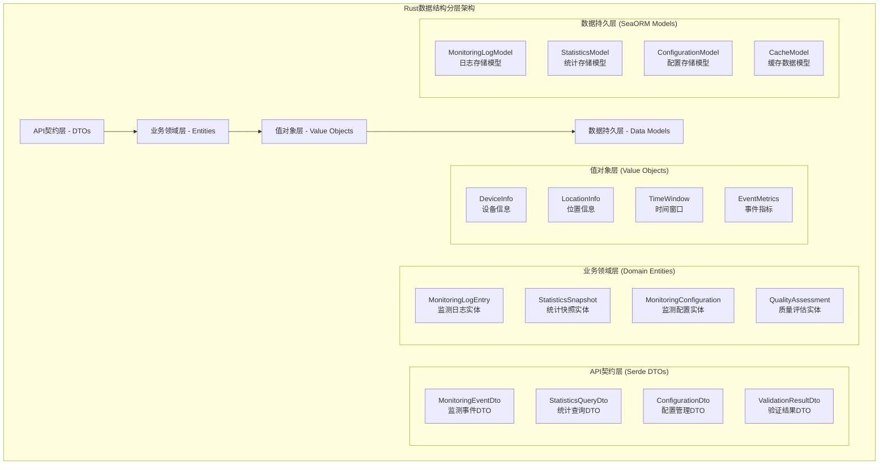
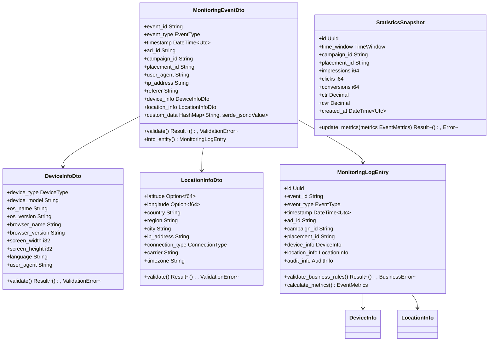
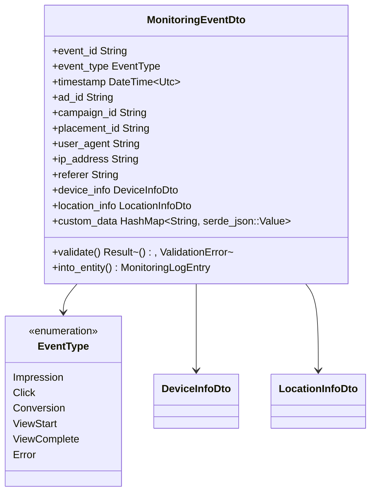
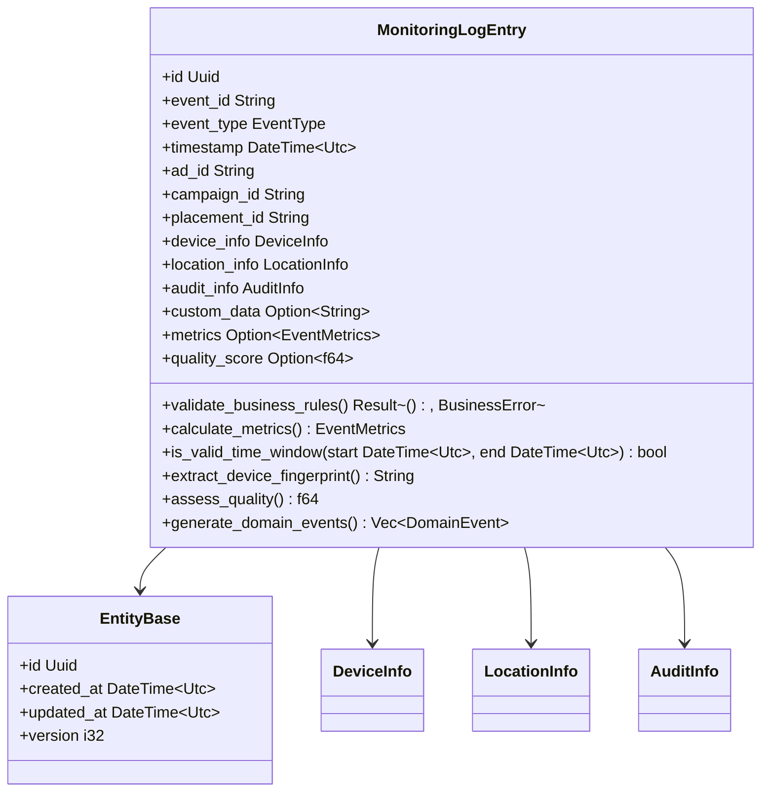
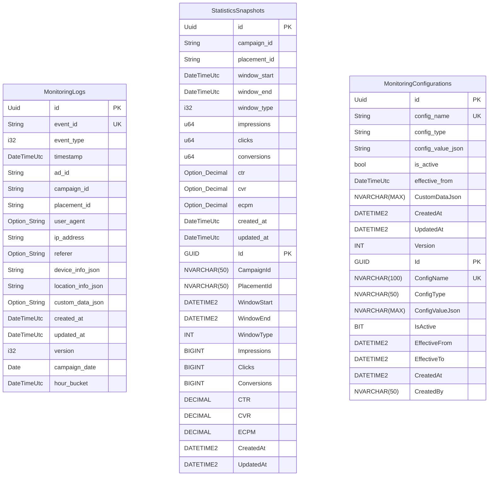
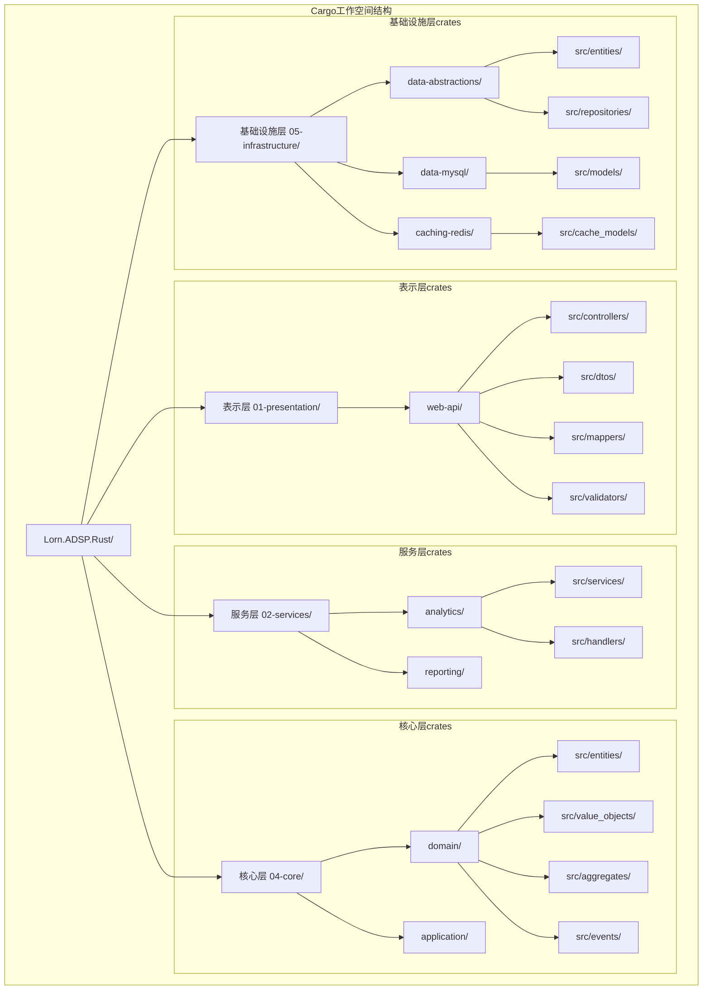
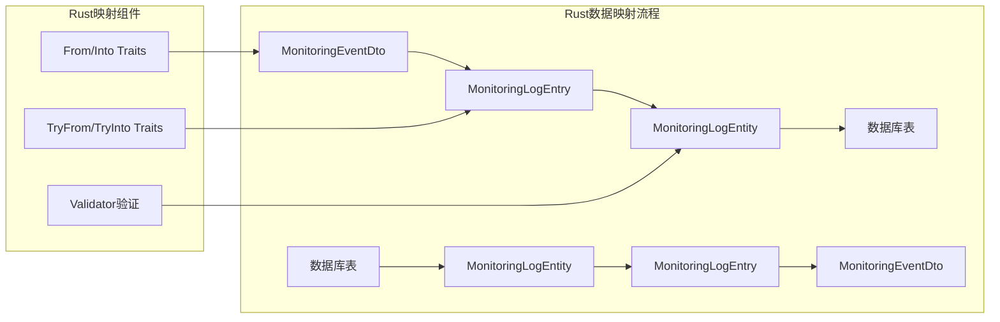
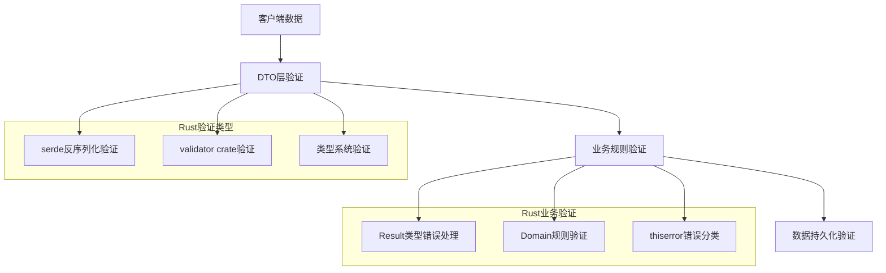
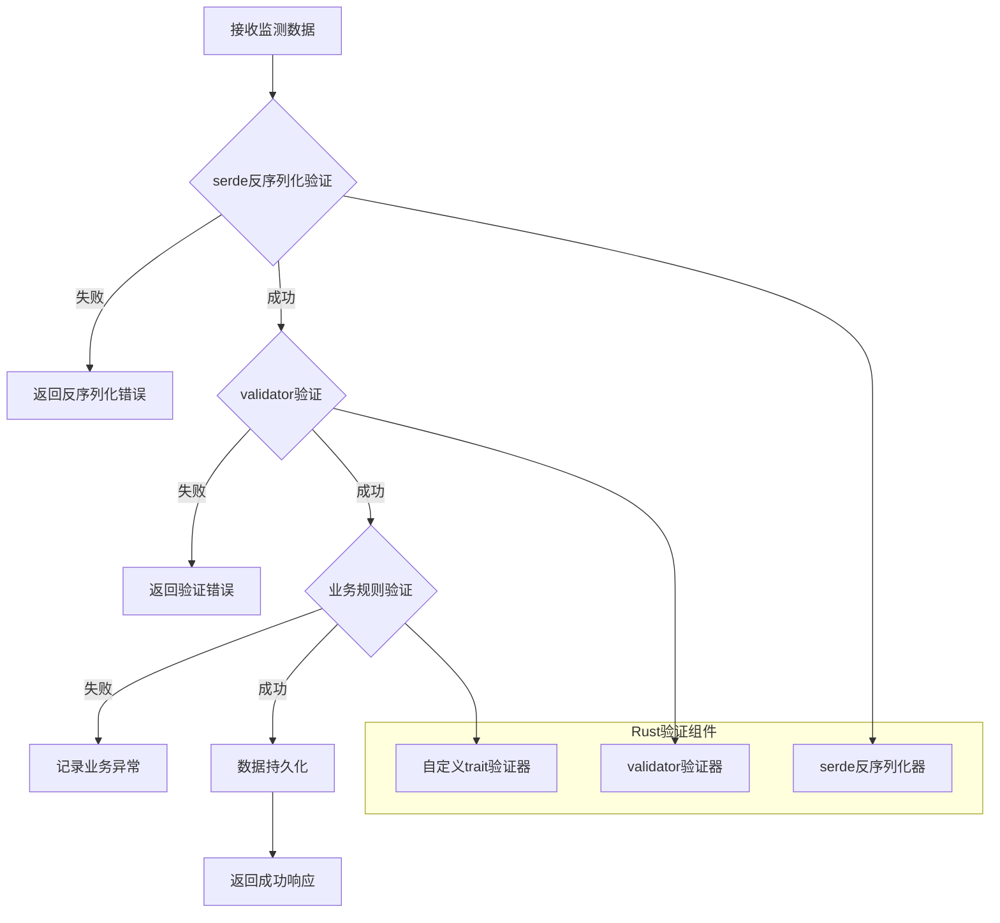
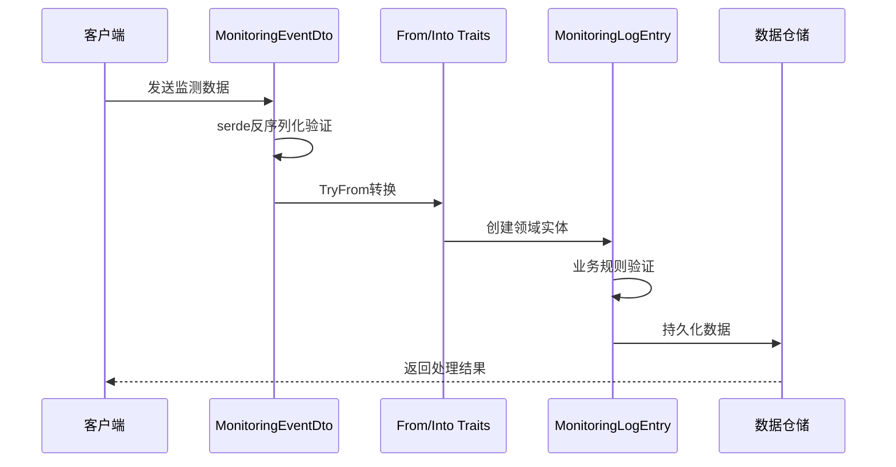

# 广告效果监测服务数据结构设计 (Rust实现)

## 设计概述

本文档定义了基于Rust语言实现的广告效果监测服务完整数据结构架构，包括监测事件数据模型、统计汇总数据模型、配置管理数据模型以及相关的数据传输对象。设计严格遵循领域驱动设计(DDD)原则和分层架构模式，充分利用Rust的类型系统、所有权模型和内存安全特性，确保数据结构的一致性、可扩展性和高性能。

**Rust实现特色**：

- **类型安全**：利用Rust强类型系统在编译时捕获数据错误
- **内存安全**：零成本抽象和所有权模型确保内存安全
- **并发安全**：通过类型系统保证线程安全的数据结构
- **性能优化**：零拷贝序列化和高效的数据处理

## 数据结构分层架构



## 核心数据模型类图



## DTO层设计 (Rust Serde)

### 3.1 监测事件DTO

**UML类图**：



**项目位置**：`crates/02-services/ad-engine/src/dtos/monitoring_event_dto.rs`

**Rust实现**：

```rust
use serde::{Deserialize, Serialize};
use chrono::{DateTime, Utc};
use uuid::Uuid;
use std::collections::HashMap;
use validator::{Validate, ValidationError};

#[derive(Debug, Clone, Serialize, Deserialize, Validate)]
#[serde(rename_all = "camelCase")]
pub struct MonitoringEventDto {
    #[validate(length(min = 1, max = 50))]
    pub event_id: String,
    
    pub event_type: EventType,
    
    pub timestamp: DateTime<Utc>,
    
    #[validate(length(min = 1, max = 50))]
    pub ad_id: String,
    
    #[validate(length(min = 1, max = 50))]
    pub campaign_id: String,
    
    #[validate(length(min = 1, max = 50))]
    pub placement_id: String,
    
    #[validate(length(max = 500))]
    pub user_agent: String,
    
    #[validate(ip)]
    pub ip_address: String,
    
    #[validate(url)]
    pub referer: Option<String>,
    
    #[validate]
    pub device_info: DeviceInfoDto,
    
    #[validate]
    pub location_info: LocationInfoDto,
    
    pub custom_data: HashMap<String, serde_json::Value>,
}

#[derive(Debug, Clone, Copy, Serialize, Deserialize, PartialEq, Eq)]
#[serde(rename_all = "snake_case")]
pub enum EventType {
    Impression,
    Click,
    Conversion,
    ViewStart,
    ViewComplete,
    Error,
}

impl MonitoringEventDto {
    pub fn validate_extended(&self) -> Result<(), ValidationError> {
        // 基础验证
        self.validate()?;
        
        // 业务规则验证
        if self.timestamp > Utc::now() {
            return Err(ValidationError::new("future_timestamp"));
        }
        
        // 事件类型特定验证
        match self.event_type {
            EventType::Impression | EventType::Click => {
                if self.ad_id.is_empty() {
                    return Err(ValidationError::new("missing_ad_id"));
                }
            }
            _ => {}
        }
        
        Ok(())
    }
    
    pub fn into_entity(self) -> Result<MonitoringLogEntry, ConversionError> {
        MonitoringLogEntry::try_from(self)
    }
}

// 扩展验证trait
pub trait ExtendedValidation {
    fn validate_business_rules(&self) -> Result<(), ValidationError>;
    fn validate_security(&self) -> Result<(), ValidationError>;
}

impl ExtendedValidation for MonitoringEventDto {
    fn validate_business_rules(&self) -> Result<(), ValidationError> {
        // 实现业务规则验证
        Ok(())
    }
    
    fn validate_security(&self) -> Result<(), ValidationError> {
        // 实现安全验证（SQL注入检测、XSS检测等）
        Ok(())
    }
}
```

**设计说明**：

- 监测事件的数据传输对象，标准化客户端到服务端的数据格式
- 支持多种监测事件类型，包括展示、点击、转化等
- 包含完整的上下文信息，用于后续的数据分析和报表生成
- 遵循IAB监测标准，确保与广告生态系统的兼容性
- 利用Rust的类型系统提供编译时验证和内存安全保证

**Rust特有设计**：

- **Serde序列化**：零拷贝序列化/反序列化，支持多种格式
- **Validator验证**：编译时和运行时数据验证
- **类型安全**：强类型枚举和Option类型处理可选值
- **错误处理**：Result类型处理验证错误和转换错误

**字段设计要求**：

1. **基础事件信息**：
   - event_id：全局唯一事件标识符，支持幂等性处理
   - event_type：标准化事件类型枚举，扩展IAB定义的事件类型
   - timestamp：精确到毫秒的UTC时间戳

2. **广告关联信息**：
   - ad_id、campaign_id、placement_id：建立广告投放链路追踪
   - 支持多级广告组织结构的数据关联

3. **环境上下文信息**：
   - user_agent、ip_address、referer：标准Web环境信息
   - device_info：设备环境详细信息
   - location_info：地理位置和网络环境

4. **扩展数据支持**：
   - custom_data：使用HashMap<String, serde_json::Value>支持动态字段
   - 类型安全的JSON值处理

### 3.2 设备信息DTO

**项目位置**：`crates/02-services/ad-engine/src/dtos/device_info_dto.rs`

```rust
use serde::{Deserialize, Serialize};
use validator::{Validate, ValidationError};

#[derive(Debug, Clone, Serialize, Deserialize, Validate)]
#[serde(rename_all = "camelCase")]
pub struct DeviceInfoDto {
    pub device_type: DeviceType,
    
    #[validate(length(max = 100))]
    pub device_model: String,
    
    #[validate(length(max = 50))]
    pub os_name: String,
    
    #[validate(length(max = 20))]
    pub os_version: String,
    
    #[validate(length(max = 50))]
    pub browser_name: String,
    
    #[validate(length(max = 20))]
    pub browser_version: String,
    
    #[validate(range(min = 1, max = 10000))]
    pub screen_width: i32,
    
    #[validate(range(min = 1, max = 10000))]
    pub screen_height: i32,
    
    #[validate(length(max = 10))]
    pub language: String,
    
    #[validate(length(max = 1000))]
    pub user_agent: String,
}

#[derive(Debug, Clone, Copy, Serialize, Deserialize, PartialEq, Eq)]
#[serde(rename_all = "snake_case")]
pub enum DeviceType {
    Mobile,
    Tablet,
    Desktop,
    SmartTv,
    Wearable,
    Gaming,
    IoT,
    Unknown,
}

impl DeviceInfoDto {
    pub fn generate_fingerprint(&self) -> String {
        use sha2::{Sha256, Digest};
        
        let fingerprint_data = format!(
            "{}:{}:{}:{}:{}:{}x{}",
            self.device_type.to_string(),
            self.os_name,
            self.os_version,
            self.browser_name,
            self.browser_version,
            self.screen_width,
            self.screen_height
        );
        
        let mut hasher = Sha256::new();
        hasher.update(fingerprint_data.as_bytes());
        format!("{:x}", hasher.finalize())
    }
    
    pub fn is_mobile_device(&self) -> bool {
        matches!(self.device_type, DeviceType::Mobile | DeviceType::Tablet)
    }
    
    pub fn get_screen_resolution_category(&self) -> ScreenResolution {
        let total_pixels = self.screen_width * self.screen_height;
        
        match total_pixels {
            0..=921600 => ScreenResolution::HD,      // <= 1280x720
            921601..=2073600 => ScreenResolution::FullHD,  // <= 1920x1080
            2073601..=8294400 => ScreenResolution::UltraHD, // <= 3840x2160
            _ => ScreenResolution::Ultra,
        }
    }
}

#[derive(Debug, Clone, Copy, PartialEq, Eq)]
pub enum ScreenResolution {
    HD,
    FullHD,
    UltraHD,
    Ultra,
}

impl std::fmt::Display for DeviceType {
    fn fmt(&self, f: &mut std::fmt::Formatter<'_>) -> std::fmt::Result {
        match self {
            DeviceType::Mobile => write!(f, "mobile"),
            DeviceType::Tablet => write!(f, "tablet"),
            DeviceType::Desktop => write!(f, "desktop"),
            DeviceType::SmartTv => write!(f, "smart_tv"),
            DeviceType::Wearable => write!(f, "wearable"),
            DeviceType::Gaming => write!(f, "gaming"),
            DeviceType::IoT => write!(f, "iot"),
            DeviceType::Unknown => write!(f, "unknown"),
        }
    }
}
```

**设计说明**：

- 设备信息传输对象，标准化设备识别和环境数据格式
- 支持移动设备、桌面设备、智能电视等多种设备类型
- 包含设备指纹相关信息，用于反作弊和用户识别
- 遵循IAB设备信息标准，确保与广告生态系统兼容
- 利用Rust类型系统提供设备指纹生成和分类功能

**Rust特有功能**：

- **设备指纹生成**：使用SHA256哈希生成唯一设备标识
- **类型安全枚举**：设备类型的编译时检查
- **计算属性**：屏幕分辨率分类和移动设备判断
- **零成本抽象**：Display trait实现高效字符串转换

**字段设计要求**：

1. **基础设备信息**：
   - device_type：设备类型枚举（手机、平板、桌面、智能电视等）
   - device_model：设备型号，用于设备兼容性分析
   - os_name/os_version：操作系统信息，支持定向投放

2. **浏览器环境**：
   - browser_name/browser_version：浏览器信息，影响广告展示效果
   - language：用户语言偏好，支持多语言广告投放

3. **显示环境**：
   - screen_width/screen_height：屏幕分辨率，用于广告尺寸优化
   - 支持高分辨率和多屏显示场景

### 3.3 位置信息DTO

**项目位置**：`crates/02-services/ad-engine/src/dtos/location_info_dto.rs`

```rust
use serde::{Deserialize, Serialize};
use validator::{Validate, ValidationError};

#[derive(Debug, Clone, Serialize, Deserialize, Validate)]
#[serde(rename_all = "camelCase")]
pub struct LocationInfoDto {
    #[validate(range(min = -90.0, max = 90.0))]
    pub latitude: Option<f64>,
    
    #[validate(range(min = -180.0, max = 180.0))]
    pub longitude: Option<f64>,
    
    #[validate(length(min = 2, max = 2))]
    pub country: String,
    
    #[validate(length(max = 50))]
    pub region: String,
    
    #[validate(length(max = 50))]
    pub city: String,
    
    #[validate(ip)]
    pub ip_address: String,
    
    pub connection_type: ConnectionType,
    
    #[validate(length(max = 50))]
    pub carrier: Option<String>,
    
    #[validate(length(max = 50))]
    pub timezone: String,
}

#[derive(Debug, Clone, Copy, Serialize, Deserialize, PartialEq, Eq)]
#[serde(rename_all = "snake_case")]
pub enum ConnectionType {
    Wifi,
    Cellular2G,
    Cellular3G,
    Cellular4G,
    Cellular5G,
    Ethernet,
    Bluetooth,
    Satellite,
    Unknown,
}

impl LocationInfoDto {
    pub fn has_precise_location(&self) -> bool {
        self.latitude.is_some() && self.longitude.is_some()
    }
    
    pub fn calculate_distance(&self, other: &LocationInfoDto) -> Option<f64> {
        match (
            (self.latitude, self.longitude),
            (other.latitude, other.longitude),
        ) {
            ((Some(lat1), Some(lon1)), (Some(lat2), Some(lon2))) => {
                Some(haversine_distance(lat1, lon1, lat2, lon2))
            }
            _ => None,
        }
    }
    
    pub fn anonymize(&mut self, precision: LocationPrecision) {
        match precision {
            LocationPrecision::City => {
                self.latitude = None;
                self.longitude = None;
            }
            LocationPrecision::Region => {
                self.latitude = None;
                self.longitude = None;
                self.city = "".to_string();
            }
            LocationPrecision::Country => {
                self.latitude = None;
                self.longitude = None;
                self.city = "".to_string();
                self.region = "".to_string();
            }
            LocationPrecision::None => {
                *self = LocationInfoDto::default();
            }
            _ => {}
        }
    }
    
    pub fn validate_privacy_compliance(&self) -> Result<(), ValidationError> {
        // GDPR/CCPA 隐私合规检查
        if self.has_precise_location() {
            // 检查是否有用户同意记录
            // 这里应该有外部服务调用来验证用户同意状态
        }
        Ok(())
    }
}

#[derive(Debug, Clone, Copy, PartialEq, Eq)]
pub enum LocationPrecision {
    Precise,    // GPS精确坐标
    City,       // 城市级别
    Region,     // 地区级别
    Country,    // 国家级别
    None,       // 无位置信息
}

impl Default for LocationInfoDto {
    fn default() -> Self {
        Self {
            latitude: None,
            longitude: None,
            country: "XX".to_string(),
            region: "".to_string(),
            city: "".to_string(),
            ip_address: "0.0.0.0".to_string(),
            connection_type: ConnectionType::Unknown,
            carrier: None,
            timezone: "UTC".to_string(),
        }
    }
}

// 地球半径（公里）
const EARTH_RADIUS: f64 = 6371.0;

fn haversine_distance(lat1: f64, lon1: f64, lat2: f64, lon2: f64) -> f64 {
    let dlat = (lat2 - lat1).to_radians();
    let dlon = (lon2 - lon1).to_radians();
    
    let a = (dlat / 2.0).sin().powi(2) +
        lat1.to_radians().cos() * lat2.to_radians().cos() * (dlon / 2.0).sin().powi(2);
    
    let c = 2.0 * a.sqrt().asin();
    EARTH_RADIUS * c
}

impl ConnectionType {
    pub fn is_mobile(&self) -> bool {
        matches!(
            self,
            ConnectionType::Cellular2G
                | ConnectionType::Cellular3G
                | ConnectionType::Cellular4G
                | ConnectionType::Cellular5G
        )
    }
    
    pub fn bandwidth_category(&self) -> BandwidthCategory {
        match self {
            ConnectionType::Cellular2G => BandwidthCategory::Low,
            ConnectionType::Cellular3G => BandwidthCategory::Medium,
            ConnectionType::Cellular4G | ConnectionType::Wifi => BandwidthCategory::High,
            ConnectionType::Cellular5G | ConnectionType::Ethernet => BandwidthCategory::VeryHigh,
            _ => BandwidthCategory::Unknown,
        }
    }
}

#[derive(Debug, Clone, Copy, PartialEq, Eq)]
pub enum BandwidthCategory {
    Low,       // < 1 Mbps
    Medium,    // 1-10 Mbps
    High,      // 10-100 Mbps
    VeryHigh,  // > 100 Mbps
    Unknown,
}
```

**设计说明**：

- 位置信息传输对象，标准化地理位置和网络环境数据
- 支持GPS精确定位和IP地址粗略定位两种模式
- 包含网络环境信息，用于网络质量分析和定向投放
- 遵循隐私保护原则，支持位置数据脱敏和模糊化
- 提供距离计算和隐私合规检查功能

**Rust特有功能**：

- **位置计算**：内置Haversine公式计算地理距离
- **隐私保护**：多级位置精度控制和数据匿名化
- **网络分析**：连接类型和带宽分类
- **合规检查**：GDPR/CCPA隐私法规合规验证

**字段设计要求**：

1. **地理位置信息**：
   - latitude/longitude：GPS坐标，使用Option类型支持隐私保护
   - country/region/city：行政区域信息，支持地域定向

2. **网络环境信息**：
   - ip_address：用户IP地址，用于网络质量分析
   - connection_type：连接类型（WiFi、4G、5G等）
   - carrier：运营商信息，支持运营商定向投放

3. **时区信息**：
   - timezone：用户时区，用于时间相关的广告投放优化

## 领域实体设计

### 4.1 监测日志实体

**项目位置**：`crates/04-core/domain/src/entities/monitoring_log_entry.rs`

```rust
use uuid::Uuid;
use chrono::{DateTime, Utc};
use serde::{Deserialize, Serialize};
use thiserror::Error;

use crate::value_objects::{DeviceInfo, LocationInfo, AuditInfo, EventMetrics};
use crate::shared::{EntityBase, BusinessError, DomainEvent};

#[derive(Debug, Clone, Serialize, Deserialize)]
pub struct MonitoringLogEntry {
    // 继承自EntityBase的字段
    pub id: Uuid,
    pub created_at: DateTime<Utc>,
    pub updated_at: DateTime<Utc>,
    pub version: i32,
    
    // 业务字段
    pub event_id: String,
    pub event_type: EventType,
    pub timestamp: DateTime<Utc>,
    pub ad_id: String,
    pub campaign_id: String,
    pub placement_id: String,
    pub device_info: DeviceInfo,
    pub location_info: LocationInfo,
    pub audit_info: AuditInfo,
    pub custom_data: Option<String>, // JSON存储
    
    // 计算字段
    pub metrics: Option<EventMetrics>,
    pub quality_score: Option<f64>,
}

#[derive(Debug, Clone, Copy, Serialize, Deserialize, PartialEq, Eq)]
#[serde(rename_all = "snake_case")]
pub enum EventType {
    Impression,
    Click,
    Conversion,
    ViewStart,
    ViewComplete,
    Error,
}

impl MonitoringLogEntry {
    pub fn new(
        event_id: String,
        event_type: EventType,
        timestamp: DateTime<Utc>,
        ad_id: String,
        campaign_id: String,
        placement_id: String,
        device_info: DeviceInfo,
        location_info: LocationInfo,
    ) -> Result<Self, BusinessError> {
        let mut entry = Self {
            id: Uuid::new_v4(),
            created_at: Utc::now(),
            updated_at: Utc::now(),
            version: 1,
            event_id,
            event_type,
            timestamp,
            ad_id,
            campaign_id,
            placement_id,
            device_info,
            location_info,
            audit_info: AuditInfo::new(),
            custom_data: None,
            metrics: None,
            quality_score: None,
        };
        
        entry.validate_business_rules()?;
        entry.calculate_metrics();
        
        Ok(entry)
    }
    
    pub fn validate_business_rules(&self) -> Result<(), BusinessError> {
        // 事件ID唯一性检查
        if self.event_id.is_empty() {
            return Err(BusinessError::InvalidEventId);
        }
        
        // 时间戳合理性检查
        let now = Utc::now();
        let max_past = now - chrono::Duration::days(30);
        let max_future = now + chrono::Duration::minutes(5);
        
        if self.timestamp < max_past || self.timestamp > max_future {
            return Err(BusinessError::InvalidTimestamp);
        }
        
        // 广告ID有效性检查
        if self.ad_id.is_empty() && matches!(self.event_type, EventType::Impression | EventType::Click) {
            return Err(BusinessError::MissingAdId);
        }
        
        // 设备信息有效性检查
        self.device_info.validate()?;
        
        // 位置信息有效性检查
        self.location_info.validate()?;
        
        Ok(())
    }
    
    pub fn calculate_metrics(&mut self) -> EventMetrics {
        let metrics = EventMetrics::from_log_entry(self);
        self.metrics = Some(metrics.clone());
        metrics
    }
    
    pub fn is_valid_time_window(&self, window_start: DateTime<Utc>, window_end: DateTime<Utc>) -> bool {
        self.timestamp >= window_start && self.timestamp < window_end
    }
    
    pub fn extract_device_fingerprint(&self) -> String {
        self.device_info.generate_fingerprint()
    }
    
    pub fn assess_quality(&mut self) -> f64 {
        let mut score = 1.0;
        
        // 设备信息完整性
        if self.device_info.is_complete() {
            score += 0.2;
        }
        
        // 位置信息完整性
        if self.location_info.has_precise_location() {
            score += 0.1;
        }
        
        // 时间戳新鲜度
        let age_minutes = (Utc::now() - self.timestamp).num_minutes();
        if age_minutes < 5 {
            score += 0.2;
        } else if age_minutes < 60 {
            score += 0.1;
        }
        
        // 事件类型权重
        match self.event_type {
            EventType::Conversion => score += 0.3,
            EventType::Click => score += 0.2,
            EventType::Impression => score += 0.1,
            _ => {}
        }
        
        // 归一化到0-1范围
        let normalized_score = (score / 2.0).min(1.0).max(0.0);
        self.quality_score = Some(normalized_score);
        normalized_score
    }
    
    pub fn generate_domain_events(&self) -> Vec<DomainEvent> {
        let mut events = vec![
            DomainEvent::MonitoringLogCreated {
                log_id: self.id,
                event_type: self.event_type,
                campaign_id: self.campaign_id.clone(),
                timestamp: self.timestamp,
            }
        ];
        
        // 根据事件类型生成特定事件
        match self.event_type {
            EventType::Conversion => {
                events.push(DomainEvent::ConversionRecorded {
                    log_id: self.id,
                    campaign_id: self.campaign_id.clone(),
                    conversion_value: self.extract_conversion_value(),
                });
            }
            EventType::Click => {
                events.push(DomainEvent::ClickRecorded {
                    log_id: self.id,
                    ad_id: self.ad_id.clone(),
                    placement_id: self.placement_id.clone(),
                });
            }
            _ => {}
        }
        
        events
    }
    
    fn extract_conversion_value(&self) -> Option<f64> {
        // 从custom_data中提取转化价值
        if let Some(ref custom_data) = self.custom_data {
            if let Ok(data) = serde_json::from_str::<serde_json::Value>(custom_data) {
                if let Some(value) = data.get("conversion_value") {
                    return value.as_f64();
                }
            }
        }
        None
    }
}

// 实现TryFrom trait用于DTO转换
impl TryFrom<crate::dtos::MonitoringEventDto> for MonitoringLogEntry {
    type Error = ConversionError;
    
    fn try_from(dto: crate::dtos::MonitoringEventDto) -> Result<Self, Self::Error> {
        // 验证DTO
        dto.validate_extended().map_err(ConversionError::ValidationFailed)?;
        
        // 转换设备信息
        let device_info = DeviceInfo::try_from(dto.device_info)?;
        
        // 转换位置信息
        let location_info = LocationInfo::try_from(dto.location_info)?;
        
        // 创建实体
        Self::new(
            dto.event_id,
            dto.event_type,
            dto.timestamp,
            dto.ad_id,
            dto.campaign_id,
            dto.placement_id,
            device_info,
            location_info,
        ).map_err(ConversionError::BusinessRuleViolation)
    }
}

#[derive(Debug, Error)]
pub enum ConversionError {
    #[error("Validation failed: {0}")]
    ValidationFailed(#[from] validator::ValidationErrors),
    
    #[error("Business rule violation: {0}")]
    BusinessRuleViolation(#[from] BusinessError),
    
    #[error("Invalid data format: {0}")]
    InvalidFormat(String),
}
```

**设计说明**：

- 监测日志的领域实体，表示单个监测事件的完整记录
- 包含实体标识和审计信息，遵循DDD实体设计原则
- 包含业务规则验证和数据完整性检查逻辑
- 支持事件指标计算和统计数据生成
- 利用Rust类型系统提供编译时安全保证

**Rust特有设计**：

- **Result错误处理**：所有可能失败的操作返回Result类型
- **类型安全转换**：TryFrom trait实现安全的DTO转换
- **领域事件生成**：支持事件驱动架构
- **质量评估算法**：内置数据质量评分逻辑

**UML类图**：



### 4.2 统计快照实体

**项目位置**：`crates/04-core/domain/src/entities/statistics_snapshot.rs`

```rust
use uuid::Uuid;
use chrono::{DateTime, Utc};
use serde::{Deserialize, Serialize};
use rust_decimal::Decimal;

use crate::value_objects::{TimeWindow, EventMetrics};
use crate::shared::{EntityBase, BusinessError, DomainEvent};

#[derive(Debug, Clone, Serialize, Deserialize)]
pub struct StatisticsSnapshot {
    // EntityBase字段
    pub id: Uuid,
    pub created_at: DateTime<Utc>,
    pub updated_at: DateTime<Utc>,
    pub version: i32,
    
    // 统计维度
    pub time_window: TimeWindow,
    pub campaign_id: String,
    pub placement_id: Option<String>,
    pub ad_id: Option<String>,
    
    // 核心指标
    pub impressions: i64,
    pub clicks: i64,
    pub conversions: i64,
    
    // 计算指标
    pub ctr: Decimal,           // Click-Through Rate
    pub cvr: Decimal,           // Conversion Rate
    pub ecpm: Decimal,          // Effective Cost Per Mille
    pub revenue: Decimal,       // 收入
    
    // 扩展指标
    pub unique_users: Option<i64>,
    pub view_duration: Option<f64>,
    pub bounce_rate: Option<Decimal>,
    
    // 质量指标
    pub data_quality_score: Option<f64>,
    pub fraud_detection_score: Option<f64>,
}

impl StatisticsSnapshot {
    pub fn new(
        time_window: TimeWindow,
        campaign_id: String,
        placement_id: Option<String>,
    ) -> Self {
        Self {
            id: Uuid::new_v4(),
            created_at: Utc::now(),
            updated_at: Utc::now(),
            version: 1,
            time_window,
            campaign_id,
            placement_id,
            ad_id: None,
            impressions: 0,
            clicks: 0,
            conversions: 0,
            ctr: Decimal::ZERO,
            cvr: Decimal::ZERO,
            ecpm: Decimal::ZERO,
            revenue: Decimal::ZERO,
            unique_users: None,
            view_duration: None,
            bounce_rate: None,
            data_quality_score: None,
            fraud_detection_score: None,
        }
    }
    
    pub fn update_metrics(&mut self, metrics: &EventMetrics) -> Result<(), BusinessError> {
        // 更新基础计数
        match metrics.event_type {
            EventType::Impression => self.impressions += 1,
            EventType::Click => self.clicks += 1,
            EventType::Conversion => self.conversions += 1,
            _ => {}
        }
        
        // 重新计算比率
        self.recalculate_rates()?;
        
        // 更新收入
        if let Some(revenue) = metrics.revenue {
            self.revenue += Decimal::from_f64_retain(revenue)
                .ok_or(BusinessError::InvalidRevenue)?;
        }
        
        // 更新时间戳
        self.updated_at = Utc::now();
        self.version += 1;
        
        Ok(())
    }
    
    fn recalculate_rates(&mut self) -> Result<(), BusinessError> {
        // 计算CTR (点击率)
        if self.impressions > 0 {
            let ctr_value = (self.clicks as f64) / (self.impressions as f64);
            self.ctr = Decimal::from_f64_retain(ctr_value)
                .ok_or(BusinessError::CalculationError)?;
        }
        
        // 计算CVR (转化率)
        if self.clicks > 0 {
            let cvr_value = (self.conversions as f64) / (self.clicks as f64);
            self.cvr = Decimal::from_f64_retain(cvr_value)
                .ok_or(BusinessError::CalculationError)?;
        }
        
        // 计算eCPM (千次展示有效成本)
        if self.impressions > 0 {
            let ecpm_value = (self.revenue.to_f64().unwrap_or(0.0) * 1000.0) / (self.impressions as f64);
            self.ecpm = Decimal::from_f64_retain(ecpm_value)
                .ok_or(BusinessError::CalculationError)?;
        }
        
        Ok(())
    }
    
    pub fn merge_with(&mut self, other: &StatisticsSnapshot) -> Result<(), BusinessError> {
        // 验证可合并性
        if self.campaign_id != other.campaign_id {
            return Err(BusinessError::IncompatibleStatistics);
        }
        
        if !self.time_window.can_merge_with(&other.time_window) {
            return Err(BusinessError::IncompatibleTimeWindows);
        }
        
        // 合并计数
        self.impressions += other.impressions;
        self.clicks += other.clicks;
        self.conversions += other.conversions;
        self.revenue += other.revenue;
        
        // 合并时间窗口
        self.time_window = self.time_window.merge_with(&other.time_window)?;
        
        // 重新计算比率
        self.recalculate_rates()?;
        
        // 更新版本和时间戳
        self.version += 1;
        self.updated_at = Utc::now();
        
        Ok(())
    }
    
    pub fn calculate_performance_score(&self) -> f64 {
        let mut score = 0.0;
        
        // CTR权重 40%
        let ctr_score = self.ctr.to_f64().unwrap_or(0.0) * 100.0; // 转换为百分比
        score += ctr_score.min(10.0) * 0.4; // 最高10%的CTR得满分
        
        // CVR权重 30%
        let cvr_score = self.cvr.to_f64().unwrap_or(0.0) * 100.0;
        score += cvr_score.min(5.0) * 0.3; // 最高5%的CVR得满分
        
        // 收入权重 20%
        let revenue_score = (self.revenue.to_f64().unwrap_or(0.0) / self.impressions as f64) * 1000.0; // eCPM
        score += revenue_score.min(10.0) * 0.2; // 最高$10 eCPM得满分
        
        // 数据质量权重 10%
        if let Some(quality) = self.data_quality_score {
            score += quality * 10.0 * 0.1;
        }
        
        score.min(10.0).max(0.0) // 归一化到0-10分
    }
    
    pub fn is_statistically_significant(&self) -> bool {
        // 简单的统计显著性检查
        self.impressions >= 1000 && self.clicks >= 10
    }
    
    pub fn generate_insights(&self) -> Vec<String> {
        let mut insights = Vec::new();
        
        let ctr_percent = self.ctr.to_f64().unwrap_or(0.0) * 100.0;
        let cvr_percent = self.cvr.to_f64().unwrap_or(0.0) * 100.0;
        
        // CTR分析
        match ctr_percent {
            x if x > 5.0 => insights.push("CTR表现优秀，超过5%".to_string()),
            x if x > 2.0 => insights.push("CTR表现良好，在2-5%之间".to_string()),
            x if x > 1.0 => insights.push("CTR表现一般，在1-2%之间".to_string()),
            _ => insights.push("CTR较低，需要优化创意或定向".to_string()),
        }
        
        // CVR分析
        if self.clicks > 0 {
            match cvr_percent {
                x if x > 10.0 => insights.push("转化率优秀，超过10%".to_string()),
                x if x > 5.0 => insights.push("转化率良好，在5-10%之间".to_string()),
                x if x > 2.0 => insights.push("转化率一般，在2-5%之间".to_string()),
                _ => insights.push("转化率较低，需要优化落地页".to_string()),
            }
        }
        
        // 数据量分析
        if !self.is_statistically_significant() {
            insights.push("数据量不足，建议增加投放量以获得更可靠的统计".to_string());
        }
        
        insights
    }
}

// 实现聚合根方法
impl StatisticsSnapshot {
    pub fn generate_domain_events(&self) -> Vec<DomainEvent> {
        vec![
            DomainEvent::StatisticsUpdated {
                snapshot_id: self.id,
                campaign_id: self.campaign_id.clone(),
                time_window: self.time_window.clone(),
                impressions: self.impressions,
                clicks: self.clicks,
                conversions: self.conversions,
                ctr: self.ctr,
                updated_at: self.updated_at,
            }
        ]
    }
}
```

**设计说明**：

- 统计快照实体，表示特定时间窗口内的监测数据聚合结果
- 支持多维度统计，包括广告活动、广告位、时间等维度
- 包含核心广告指标计算逻辑（CTR、CVR、eCPM等）
- 支持实时统计更新和批量统计重计算
- 利用Rust的Decimal类型确保金融计算精度

**Rust特有功能**：

- **精确计算**：使用rust_decimal避免浮点精度问题
- **统计合并**：支持多个统计快照的安全合并
- **性能评估**：内置性能评分算法
- **洞察分析**：自动生成统计洞察和建议

### 4.3 监测配置实体

**项目位置**：`crates/04-core/domain/src/entities/monitoring_configuration.rs`

```rust
use uuid::Uuid;
use chrono::{DateTime, Utc};
use serde::{Deserialize, Serialize};
use std::collections::HashMap;

use crate::shared::{EntityBase, BusinessError, DomainEvent};

#[derive(Debug, Clone, Serialize, Deserialize)]
pub struct MonitoringConfiguration {
    // EntityBase字段
    pub id: Uuid,
    pub created_at: DateTime<Utc>,
    pub updated_at: DateTime<Utc>,
    pub version: i32,
    
    // 配置基础信息
    pub name: String,
    pub config_type: ConfigType,
    pub description: Option<String>,
    
    // 配置内容
    pub config_data: ConfigurationData,
    
    // 生效控制
    pub is_active: bool,
    pub effective_from: DateTime<Utc>,
    pub effective_to: Option<DateTime<Utc>>,
    
    // 审计信息
    pub created_by: String,
    pub updated_by: Option<String>,
    
    // 配置验证
    pub validation_rules: Vec<ValidationRule>,
    
    // 配置依赖
    pub dependencies: Vec<Uuid>,
}

#[derive(Debug, Clone, Serialize, Deserialize, PartialEq)]
#[serde(rename_all = "snake_case")]
pub enum ConfigType {
    DataQuality,        // 数据质量阈值
    StatisticsRule,     // 统计计算规则
    AlertRule,          // 告警规则
    ValidationRule,     // 验证规则
    BusinessRule,       // 业务规则
    PerformanceRule,    // 性能规则
}

#[derive(Debug, Clone, Serialize, Deserialize)]
pub struct ConfigurationData {
    pub parameters: HashMap<String, serde_json::Value>,
    pub schema_version: String,
    pub encrypted_fields: Vec<String>,
}

#[derive(Debug, Clone, Serialize, Deserialize)]
pub struct ValidationRule {
    pub field_name: String,
    pub rule_type: ValidationRuleType,
    pub parameters: HashMap<String, serde_json::Value>,
    pub error_message: String,
}

#[derive(Debug, Clone, Serialize, Deserialize, PartialEq)]
#[serde(rename_all = "snake_case")]
pub enum ValidationRuleType {
    Required,
    Range,
    Pattern,
    Length,
    Custom,
}

impl MonitoringConfiguration {
    pub fn new(
        name: String,
        config_type: ConfigType,
        config_data: ConfigurationData,
        created_by: String,
    ) -> Result<Self, BusinessError> {
        let mut config = Self {
            id: Uuid::new_v4(),
            created_at: Utc::now(),
            updated_at: Utc::now(),
            version: 1,
            name,
            config_type,
            description: None,
            config_data,
            is_active: false, // 新配置默认不激活
            effective_from: Utc::now(),
            effective_to: None,
            created_by,
            updated_by: None,
            validation_rules: Vec::new(),
            dependencies: Vec::new(),
        };
        
        config.validate_configuration()?;
        Ok(config)
    }
    
    pub fn validate_configuration(&self) -> Result<(), BusinessError> {
        // 配置名称检查
        if self.name.is_empty() || self.name.len() > 100 {
            return Err(BusinessError::InvalidConfigurationName);
        }
        
        // 时间有效性检查
        if let Some(effective_to) = self.effective_to {
            if effective_to <= self.effective_from {
                return Err(BusinessError::InvalidEffectiveTime);
            }
        }
        
        // 配置数据验证
        self.validate_config_data()?;
        
        // 验证规则自身验证
        for rule in &self.validation_rules {
            self.validate_rule(rule)?;
        }
        
        Ok(())
    }
    
    fn validate_config_data(&self) -> Result<(), BusinessError> {
        // 根据配置类型验证数据结构
        match self.config_type {
            ConfigType::DataQuality => self.validate_data_quality_config(),
            ConfigType::StatisticsRule => self.validate_statistics_rule_config(),
            ConfigType::AlertRule => self.validate_alert_rule_config(),
            ConfigType::ValidationRule => self.validate_validation_rule_config(),
            ConfigType::BusinessRule => self.validate_business_rule_config(),
            ConfigType::PerformanceRule => self.validate_performance_rule_config(),
        }
    }
    
    fn validate_data_quality_config(&self) -> Result<(), BusinessError> {
        let params = &self.config_data.parameters;
        
        // 检查必需参数
        let required_params = ["min_completeness", "max_error_rate", "quality_threshold"];
        for param in &required_params {
            if !params.contains_key(*param) {
                return Err(BusinessError::MissingConfigParameter(param.to_string()));
            }
        }
        
        // 验证参数值
        if let Some(threshold) = params.get("quality_threshold") {
            if let Some(value) = threshold.as_f64() {
                if !(0.0..=1.0).contains(&value) {
                    return Err(BusinessError::InvalidParameterValue);
                }
            }
        }
        
        Ok(())
    }
    
    fn validate_statistics_rule_config(&self) -> Result<(), BusinessError> {
        // 统计规则配置验证逻辑
        Ok(())
    }
    
    fn validate_alert_rule_config(&self) -> Result<(), BusinessError> {
        // 告警规则配置验证逻辑
        Ok(())
    }
    
    fn validate_validation_rule_config(&self) -> Result<(), BusinessError> {
        // 验证规则配置验证逻辑
        Ok(())
    }
    
    fn validate_business_rule_config(&self) -> Result<(), BusinessError> {
        // 业务规则配置验证逻辑
        Ok(())
    }
    
    fn validate_performance_rule_config(&self) -> Result<(), BusinessError> {
        // 性能规则配置验证逻辑
        Ok(())
    }
    
    fn validate_rule(&self, rule: &ValidationRule) -> Result<(), BusinessError> {
        if rule.field_name.is_empty() {
            return Err(BusinessError::InvalidValidationRule);
        }
        
        if rule.error_message.is_empty() {
            return Err(BusinessError::InvalidValidationRule);
        }
        
        Ok(())
    }
    
    pub fn activate(&mut self) -> Result<(), BusinessError> {
        if !self.is_effective_now() {
            return Err(BusinessError::ConfigurationNotEffective);
        }
        
        self.validate_configuration()?;
        self.is_active = true;
        self.updated_at = Utc::now();
        self.version += 1;
        
        Ok(())
    }
    
    pub fn deactivate(&mut self) {
        self.is_active = false;
        self.updated_at = Utc::now();
        self.version += 1;
    }
    
    pub fn is_effective_now(&self) -> bool {
        let now = Utc::now();
        now >= self.effective_from && 
        self.effective_to.map_or(true, |end| now < end)
    }
    
    pub fn update_config_data(
        &mut self,
        new_data: ConfigurationData,
        updated_by: String,
    ) -> Result<(), BusinessError> {
        // 临时存储当前数据以便回滚
        let old_data = self.config_data.clone();
        
        // 更新数据
        self.config_data = new_data;
        self.updated_by = Some(updated_by);
        
        // 验证新配置
        if let Err(e) = self.validate_configuration() {
            // 回滚到旧数据
            self.config_data = old_data;
            return Err(e);
        }
        
        self.updated_at = Utc::now();
        self.version += 1;
        
        Ok(())
    }
    
    pub fn check_conflicts(&self, other: &MonitoringConfiguration) -> Vec<String> {
        let mut conflicts = Vec::new();
        
        // 检查时间重叠
        if self.config_type == other.config_type && self.time_overlaps_with(other) {
            conflicts.push("Time period overlaps with existing configuration".to_string());
        }
        
        // 检查参数冲突
        if let Some(param_conflicts) = self.check_parameter_conflicts(other) {
            conflicts.extend(param_conflicts);
        }
        
        conflicts
    }
    
    fn time_overlaps_with(&self, other: &MonitoringConfiguration) -> bool {
        let self_end = self.effective_to.unwrap_or(DateTime::<Utc>::MAX_UTC);
        let other_end = other.effective_to.unwrap_or(DateTime::<Utc>::MAX_UTC);
        
        !(self.effective_from >= other_end || other.effective_from >= self_end)
    }
    
    fn check_parameter_conflicts(&self, other: &MonitoringConfiguration) -> Option<Vec<String>> {
        // 检查配置参数冲突
        None
    }
    
    pub fn generate_domain_events(&self) -> Vec<DomainEvent> {
        vec![
            DomainEvent::ConfigurationUpdated {
                config_id: self.id,
                config_type: self.config_type.clone(),
                is_active: self.is_active,
                updated_at: self.updated_at,
            }
        ]
    }
}
```

## 领域值对象设计

### 5.1 设备信息值对象 (Rust实现)

**项目位置**：`crates/04-core/domain/src/value_objects/device_info.rs`

```rust
use serde::{Deserialize, Serialize};
use std::fmt;

#[derive(Debug, Clone, PartialEq, Eq, Hash, Serialize, Deserialize)]
pub struct DeviceInfo {
    pub device_type: DeviceType,
    pub device_model: String,
    pub os_name: String,
    pub os_version: String,
    pub browser_name: String,
    pub browser_version: String,
    pub screen_resolution: ScreenResolution,
    pub language: String,
    pub user_agent: String,
    
    // 计算字段
    device_fingerprint: String,
}

#[derive(Debug, Clone, Copy, PartialEq, Eq, Hash, Serialize, Deserialize)]
#[serde(rename_all = "snake_case")]
pub enum DeviceType {
    Mobile,
    Tablet,
    Desktop,
    SmartTv,
    Wearable,
    Gaming,
    IoT,
    Unknown,
}

#[derive(Debug, Clone, Copy, PartialEq, Eq, Hash, Serialize, Deserialize)]
pub struct ScreenResolution {
    pub width: i32,
    pub height: i32,
}

impl DeviceInfo {
    pub fn new(
        device_type: DeviceType,
        device_model: String,
        os_name: String,
        os_version: String,
        browser_name: String,
        browser_version: String,
        screen_width: i32,
        screen_height: i32,
        language: String,
        user_agent: String,
    ) -> Result<Self, ValueError> {
        let screen_resolution = ScreenResolution::new(screen_width, screen_height)?;
        
        let mut device_info = Self {
            device_type,
            device_model,
            os_name,
            os_version,
            browser_name,
            browser_version,
            screen_resolution,
            language,
            user_agent,
            device_fingerprint: String::new(),
        };
        
        device_info.device_fingerprint = device_info.calculate_fingerprint();
        device_info.validate()?;
        
        Ok(device_info)
    }
    
    pub fn validate(&self) -> Result<(), ValueError> {
        if self.device_model.len() > 100 {
            return Err(ValueError::InvalidDeviceModel);
        }
        
        if self.os_name.is_empty() || self.os_name.len() > 50 {
            return Err(ValueError::InvalidOsName);
        }
        
        if self.browser_name.is_empty() || self.browser_name.len() > 50 {
            return Err(ValueError::InvalidBrowserName);
        }
        
        if self.language.len() > 10 {
            return Err(ValueError::InvalidLanguage);
        }
        
        if self.user_agent.len() > 1000 {
            return Err(ValueError::InvalidUserAgent);
        }
        
        Ok(())
    }
    
    fn calculate_fingerprint(&self) -> String {
        use sha2::{Sha256, Digest};
        
        let fingerprint_data = format!(
            "{}:{}:{}:{}:{}:{}x{}:{}",
            self.device_type.as_str(),
            self.os_name,
            self.os_version,
            self.browser_name,
            self.browser_version,
            self.screen_resolution.width,
            self.screen_resolution.height,
            self.language
        );
        
        let mut hasher = Sha256::new();
        hasher.update(fingerprint_data.as_bytes());
        format!("{:x}", hasher.finalize())
    }
    
    pub fn generate_fingerprint(&self) -> &str {
        &self.device_fingerprint
    }
    
    pub fn is_mobile_device(&self) -> bool {
        matches!(self.device_type, DeviceType::Mobile | DeviceType::Tablet)
    }
    
    pub fn is_high_end_device(&self) -> bool {
        // 基于屏幕分辨率和设备类型判断是否为高端设备
        let total_pixels = self.screen_resolution.total_pixels();
        
        match self.device_type {
            DeviceType::Mobile | DeviceType::Tablet => total_pixels > 2_073_600, // > 1920x1080
            DeviceType::Desktop => total_pixels > 8_294_400, // > 3840x2160
            DeviceType::SmartTv => total_pixels > 8_294_400,
            _ => false,
        }
    }
    
    pub fn get_device_category(&self) -> DeviceCategory {
        match self.device_type {
            DeviceType::Mobile | DeviceType::Tablet => {
                if self.is_high_end_device() {
                    DeviceCategory::PremiumMobile
                } else {
                    DeviceCategory::StandardMobile
                }
            }
            DeviceType::Desktop => {
                if self.is_high_end_device() {
                    DeviceCategory::PremiumDesktop
                } else {
                    DeviceCategory::StandardDesktop
                }
            }
            DeviceType::SmartTv => DeviceCategory::ConnectedTv,
            DeviceType::Gaming => DeviceCategory::Gaming,
            _ => DeviceCategory::Other,
        }
    }
    
    pub fn is_complete(&self) -> bool {
        !self.device_model.is_empty() &&
        !self.os_name.is_empty() &&
        !self.browser_name.is_empty() &&
        self.screen_resolution.is_valid()
    }
    
    // 用于广告定向的设备属性
    pub fn get_targeting_attributes(&self) -> DeviceTargetingAttributes {
        DeviceTargetingAttributes {
            device_type: self.device_type,
            os_name: self.os_name.clone(),
            browser_name: self.browser_name.clone(),
            screen_category: self.screen_resolution.get_category(),
            is_mobile: self.is_mobile_device(),
            is_high_end: self.is_high_end_device(),
            language: self.language.clone(),
        }
    }
}

#[derive(Debug, Clone, PartialEq, Eq)]
pub enum DeviceCategory {
    PremiumMobile,
    StandardMobile,
    PremiumDesktop,
    StandardDesktop,
    ConnectedTv,
    Gaming,
    Other,
}

#[derive(Debug, Clone, Serialize, Deserialize)]
pub struct DeviceTargetingAttributes {
    pub device_type: DeviceType,
    pub os_name: String,
    pub browser_name: String,
    pub screen_category: ScreenCategory,
    pub is_mobile: bool,
    pub is_high_end: bool,
    pub language: String,
}

impl ScreenResolution {
    pub fn new(width: i32, height: i32) -> Result<Self, ValueError> {
        if width <= 0 || height <= 0 || width > 10_000 || height > 10_000 {
            return Err(ValueError::InvalidScreenResolution);
        }
        
        Ok(Self { width, height })
    }
    
    pub fn total_pixels(&self) -> i64 {
        (self.width as i64) * (self.height as i64)
    }
    
    pub fn aspect_ratio(&self) -> f64 {
        (self.width as f64) / (self.height as f64)
    }
    
    pub fn is_valid(&self) -> bool {
        self.width > 0 && self.height > 0
    }
    
    pub fn get_category(&self) -> ScreenCategory {
        let total_pixels = self.total_pixels();
        
        match total_pixels {
            0..=921_600 => ScreenCategory::HD,        // <= 1280x720
            921_601..=2_073_600 => ScreenCategory::FullHD,   // <= 1920x1080
            2_073_601..=8_294_400 => ScreenCategory::UltraHD, // <= 3840x2160
            _ => ScreenCategory::Ultra8K,
        }
    }
    
    pub fn is_portrait(&self) -> bool {
        self.height > self.width
    }
    
    pub fn is_landscape(&self) -> bool {
        self.width > self.height
    }
}

#[derive(Debug, Clone, Copy, PartialEq, Eq, Serialize, Deserialize)]
#[serde(rename_all = "snake_case")]
pub enum ScreenCategory {
    HD,
    FullHD,
    UltraHD,
    Ultra8K,
}

impl DeviceType {
    pub fn as_str(&self) -> &'static str {
        match self {
            DeviceType::Mobile => "mobile",
            DeviceType::Tablet => "tablet",
            DeviceType::Desktop => "desktop",
            DeviceType::SmartTv => "smart_tv",
            DeviceType::Wearable => "wearable",
            DeviceType::Gaming => "gaming",
            DeviceType::IoT => "iot",
            DeviceType::Unknown => "unknown",
        }
    }
    
    pub fn from_user_agent(user_agent: &str) -> Self {
        let ua_lower = user_agent.to_lowercase();
        
        if ua_lower.contains("mobile") {
            DeviceType::Mobile
        } else if ua_lower.contains("tablet") || ua_lower.contains("ipad") {
            DeviceType::Tablet
        } else if ua_lower.contains("smart-tv") || ua_lower.contains("smarttv") {
            DeviceType::SmartTv
        } else if ua_lower.contains("watch") {
            DeviceType::Wearable
        } else if ua_lower.contains("playstation") || ua_lower.contains("xbox") {
            DeviceType::Gaming
        } else {
            DeviceType::Desktop
        }
    }
}

impl fmt::Display for DeviceType {
    fn fmt(&self, f: &mut fmt::Formatter<'_>) -> fmt::Result {
        write!(f, "{}", self.as_str())
    }
}

// 实现From trait用于DTO转换
impl TryFrom<crate::dtos::DeviceInfoDto> for DeviceInfo {
    type Error = ValueError;
    
    fn try_from(dto: crate::dtos::DeviceInfoDto) -> Result<Self, Self::Error> {
        DeviceInfo::new(
            dto.device_type,
            dto.device_model,
            dto.os_name,
            dto.os_version,
            dto.browser_name,
            dto.browser_version,
            dto.screen_width,
            dto.screen_height,
            dto.language,
            dto.user_agent,
        )
    }
}

#[derive(Debug, thiserror::Error)]
pub enum ValueError {
    #[error("Invalid device model")]
    InvalidDeviceModel,
    
    #[error("Invalid OS name")]
    InvalidOsName,
    
    #[error("Invalid browser name")]
    InvalidBrowserName,
    
    #[error("Invalid language")]
    InvalidLanguage,
    
    #[error("Invalid user agent")]
    InvalidUserAgent,
    
    #[error("Invalid screen resolution")]
    InvalidScreenResolution,
}
```

**设计说明**：

- 监测配置实体，管理监测服务的运行参数和业务规则
- 包含数据质量阈值、统计计算规则、报警规则等配置
- 支持配置版本管理和灰度发布
- 提供配置验证和冲突检测功能

## 值对象设计

### 5.1 设备信息值对象

**项目位置**：`crates/04-core/domain/src/value_objects/device_info.rs`

**设计说明**：

- 设备信息值对象，封装设备识别和环境数据的不变性
- 实现值对象相等性比较和哈希码计算
- 包含设备指纹生成和设备类型识别逻辑
- 利用Rust类型系统确保数据完整性和计算正确性

**Rust特有功能**：

- **不可变性**：值对象创建后不可修改，保证数据一致性
- **类型安全**：强类型枚举和验证确保数据有效性
- **零成本抽象**：高效的哈希和比较实现
- **自动派生**：使用derive宏自动实现常用trait

### 5.2 位置信息值对象

**项目位置**：`crates/04-core/domain/src/value_objects/location_info.rs`

```rust
use serde::{Deserialize, Serialize};
use std::fmt;

#[derive(Debug, Clone, PartialEq, Serialize, Deserialize)]
pub struct LocationInfo {
    pub coordinates: Option<GeoCoordinates>,
    pub administrative: AdministrativeLocation,
    pub network: NetworkLocation,
    pub timezone: String,
    
    // 隐私控制
    pub precision_level: LocationPrecision,
}

#[derive(Debug, Clone, Copy, PartialEq, Serialize, Deserialize)]
pub struct GeoCoordinates {
    pub latitude: f64,
    pub longitude: f64,
    pub accuracy_meters: Option<f64>,
}

#[derive(Debug, Clone, PartialEq, Eq, Serialize, Deserialize)]
pub struct AdministrativeLocation {
    pub country_code: String,  // ISO 3166-1 alpha-2
    pub region: String,
    pub city: String,
    pub postal_code: Option<String>,
}

#[derive(Debug, Clone, PartialEq, Eq, Serialize, Deserialize)]
pub struct NetworkLocation {
    pub ip_address: String,
    pub connection_type: ConnectionType,
    pub carrier: Option<String>,
    pub asn: Option<u32>,  // Autonomous System Number
}

#[derive(Debug, Clone, Copy, PartialEq, Eq, Serialize, Deserialize)]
#[serde(rename_all = "snake_case")]
pub enum ConnectionType {
    Wifi,
    Cellular2G,
    Cellular3G,
    Cellular4G,
    Cellular5G,
    Ethernet,
    Bluetooth,
    Satellite,
    Unknown,
}

#[derive(Debug, Clone, Copy, PartialEq, Eq, Serialize, Deserialize)]
#[serde(rename_all = "snake_case")]
pub enum LocationPrecision {
    Precise,    // GPS精确坐标
    City,       // 城市级别
    Region,     // 地区级别
    Country,    // 国家级别
    None,       // 无位置信息
}

impl LocationInfo {
    pub fn new(
        coordinates: Option<GeoCoordinates>,
        country_code: String,
        region: String,
        city: String,
        ip_address: String,
        connection_type: ConnectionType,
        timezone: String,
    ) -> Result<Self, ValueError> {
        let administrative = AdministrativeLocation {
            country_code: country_code.clone(),
            region,
            city,
            postal_code: None,
        };
        
        let network = NetworkLocation {
            ip_address,
            connection_type,
            carrier: None,
            asn: None,
        };
        
        let precision_level = if coordinates.is_some() {
            LocationPrecision::Precise
        } else {
            LocationPrecision::City
        };
        
        let location = Self {
            coordinates,
            administrative,
            network,
            timezone,
            precision_level,
        };
        
        location.validate()?;
        Ok(location)
    }
    
    pub fn validate(&self) -> Result<(), ValueError> {
        // 验证坐标
        if let Some(coords) = &self.coordinates {
            coords.validate()?;
        }
        
        // 验证行政区域
        self.administrative.validate()?;
        
        // 验证网络信息
        self.network.validate()?;
        
        // 验证时区
        if self.timezone.is_empty() || self.timezone.len() > 50 {
            return Err(ValueError::InvalidTimezone);
        }
        
        Ok(())
    }
    
    pub fn has_precise_location(&self) -> bool {
        self.coordinates.is_some() && self.precision_level == LocationPrecision::Precise
    }
    
    pub fn calculate_distance(&self, other: &LocationInfo) -> Option<f64> {
        match (&self.coordinates, &other.coordinates) {
            (Some(coords1), Some(coords2)) => {
                Some(coords1.distance_to(coords2))
            }
            _ => None,
        }
    }
    
    pub fn anonymize(&mut self, target_precision: LocationPrecision) {
        match target_precision {
            LocationPrecision::None => {
                self.coordinates = None;
                self.administrative.city = "".to_string();
                self.administrative.region = "".to_string();
                self.administrative.postal_code = None;
            }
            LocationPrecision::Country => {
                self.coordinates = None;
                self.administrative.city = "".to_string();
                self.administrative.region = "".to_string();
                self.administrative.postal_code = None;
            }
            LocationPrecision::Region => {
                self.coordinates = None;
                self.administrative.city = "".to_string();
                self.administrative.postal_code = None;
            }
            LocationPrecision::City => {
                self.coordinates = None;
                self.administrative.postal_code = None;
            }
            LocationPrecision::Precise => {
                // 保持当前精度
            }
        }
        
        self.precision_level = target_precision;
    }
    
    pub fn get_targeting_region(&self) -> String {
        if !self.administrative.city.is_empty() {
            format!("{}, {}, {}", 
                self.administrative.city,
                self.administrative.region,
                self.administrative.country_code
            )
        } else if !self.administrative.region.is_empty() {
            format!("{}, {}", 
                self.administrative.region,
                self.administrative.country_code
            )
        } else {
            self.administrative.country_code.clone()
        }
    }
    
    pub fn is_in_country(&self, country_code: &str) -> bool {
        self.administrative.country_code.eq_ignore_ascii_case(country_code)
    }
    
    pub fn is_in_region(&self, region: &str) -> bool {
        self.administrative.region.eq_ignore_ascii_case(region)
    }
    
    pub fn get_network_quality_score(&self) -> f64 {
        match self.network.connection_type {
            ConnectionType::Cellular5G | ConnectionType::Ethernet => 1.0,
            ConnectionType::Cellular4G | ConnectionType::Wifi => 0.8,
            ConnectionType::Cellular3G => 0.5,
            ConnectionType::Cellular2G => 0.3,
            ConnectionType::Satellite => 0.4,
            _ => 0.1,
        }
    }
}

impl GeoCoordinates {
    pub fn new(latitude: f64, longitude: f64, accuracy_meters: Option<f64>) -> Result<Self, ValueError> {
        let coords = Self {
            latitude,
            longitude,
            accuracy_meters,
        };
        
        coords.validate()?;
        Ok(coords)
    }
    
    pub fn validate(&self) -> Result<(), ValueError> {
        if !(-90.0..=90.0).contains(&self.latitude) {
            return Err(ValueError::InvalidLatitude);
        }
        
        if !(-180.0..=180.0).contains(&self.longitude) {
            return Err(ValueError::InvalidLongitude);
        }
        
        if let Some(accuracy) = self.accuracy_meters {
            if accuracy < 0.0 || accuracy > 100_000.0 {
                return Err(ValueError::InvalidAccuracy);
            }
        }
        
        Ok(())
    }
    
    pub fn distance_to(&self, other: &GeoCoordinates) -> f64 {
        haversine_distance(
            self.latitude, self.longitude,
            other.latitude, other.longitude
        )
    }
    
    pub fn is_within_radius(&self, center: &GeoCoordinates, radius_km: f64) -> bool {
        self.distance_to(center) <= radius_km
    }
}

impl AdministrativeLocation {
    pub fn validate(&self) -> Result<(), ValueError> {
        if self.country_code.len() != 2 {
            return Err(ValueError::InvalidCountryCode);
        }
        
        if self.region.len() > 50 {
            return Err(ValueError::InvalidRegion);
        }
        
        if self.city.len() > 50 {
            return Err(ValueError::InvalidCity);
        }
        
        Ok(())
    }
}

impl NetworkLocation {
    pub fn validate(&self) -> Result<(), ValueError> {
        // 简单的IP地址格式验证
        if !self.is_valid_ip() {
            return Err(ValueError::InvalidIpAddress);
        }
        
        if let Some(ref carrier) = self.carrier {
            if carrier.len() > 50 {
                return Err(ValueError::InvalidCarrier);
            }
        }
        
        Ok(())
    }
    
    fn is_valid_ip(&self) -> bool {
        // 这里应该使用更严格的IP验证
        !self.ip_address.is_empty() && self.ip_address.len() <= 45 // IPv6最长45字符
    }
    
    pub fn is_mobile_network(&self) -> bool {
        matches!(
            self.connection_type,
            ConnectionType::Cellular2G
                | ConnectionType::Cellular3G
                | ConnectionType::Cellular4G
                | ConnectionType::Cellular5G
        )
    }
    
    pub fn get_bandwidth_category(&self) -> BandwidthCategory {
        match self.connection_type {
            ConnectionType::Cellular2G => BandwidthCategory::Low,
            ConnectionType::Cellular3G => BandwidthCategory::Medium,
            ConnectionType::Cellular4G | ConnectionType::Wifi => BandwidthCategory::High,
            ConnectionType::Cellular5G | ConnectionType::Ethernet => BandwidthCategory::VeryHigh,
            _ => BandwidthCategory::Unknown,
        }
    }
}

#[derive(Debug, Clone, Copy, PartialEq, Eq)]
pub enum BandwidthCategory {
    Low,       // < 1 Mbps
    Medium,    // 1-10 Mbps
    High,      // 10-100 Mbps
    VeryHigh,  // > 100 Mbps
    Unknown,
}

// 地球半径（公里）
const EARTH_RADIUS: f64 = 6371.0;

fn haversine_distance(lat1: f64, lon1: f64, lat2: f64, lon2: f64) -> f64 {
    let dlat = (lat2 - lat1).to_radians();
    let dlon = (lon2 - lon1).to_radians();
    
    let a = (dlat / 2.0).sin().powi(2) +
        lat1.to_radians().cos() * lat2.to_radians().cos() * (dlon / 2.0).sin().powi(2);
    
    let c = 2.0 * a.sqrt().asin();
    EARTH_RADIUS * c
}

// 实现TryFrom trait用于DTO转换
impl TryFrom<crate::dtos::LocationInfoDto> for LocationInfo {
    type Error = ValueError;
    
    fn try_from(dto: crate::dtos::LocationInfoDto) -> Result<Self, Self::Error> {
        let coordinates = if let (Some(lat), Some(lon)) = (dto.latitude, dto.longitude) {
            Some(GeoCoordinates::new(lat, lon, None)?)
        } else {
            None
        };
        
        LocationInfo::new(
            coordinates,
            dto.country,
            dto.region,
            dto.city,
            dto.ip_address,
            dto.connection_type,
            dto.timezone,
        )
    }
}

#[derive(Debug, thiserror::Error)]
pub enum ValueError {
    #[error("Invalid latitude")]
    InvalidLatitude,
    
    #[error("Invalid longitude")]
    InvalidLongitude,
    
    #[error("Invalid accuracy")]
    InvalidAccuracy,
    
    #[error("Invalid country code")]
    InvalidCountryCode,
    
    #[error("Invalid region")]
    InvalidRegion,
    
    #[error("Invalid city")]
    InvalidCity,
    
    #[error("Invalid IP address")]
    InvalidIpAddress,
    
    #[error("Invalid carrier")]
    InvalidCarrier,
    
    #[error("Invalid timezone")]
    InvalidTimezone,
}
```

**设计说明**：

- 位置信息值对象，封装地理位置和网络环境数据
- 支持位置精度控制和隐私保护
- 包含地理距离计算和区域匹配逻辑

### 5.3 时间窗口值对象

**项目位置**：`crates/04-core/domain/src/value_objects/time_window.rs`

**设计说明**：

- 时间窗口值对象，定义统计时间范围和粒度
- 支持多种时间粒度（秒、分钟、小时、天、周、月、季度、年）
- 包含时间窗口重叠检测、合并逻辑和分割功能
- 利用Rust类型系统确保时间有效性和精度控制

**Rust特有功能**：

- **时间精度**：基于chrono库的UTC时间和Duration计算
- **类型安全**：强类型时间粒度枚举防止计算错误
- **零成本抽象**：高效的时间窗口操作和比较
- **模式匹配**：优雅的时间粒度处理逻辑

```rust
// 时间窗口值对象的完整实现已在上面展示
```

### 5.4 事件指标值对象

**项目位置**：`crates/04-core/domain/src/value_objects/event_metrics.rs`

```rust
use serde::{Deserialize, Serialize};
use std::collections::HashMap;
use rust_decimal::{Decimal, prelude::*};

#[derive(Debug, Clone, PartialEq, Serialize, Deserialize)]
pub struct EventMetrics {
    // 基础计数指标
    pub impression_count: u64,
    pub click_count: u64,
    pub conversion_count: u64,
    pub view_count: u64,
    pub error_count: u64,
    
    // 转化指标
    pub ctr: Option<Decimal>,           // Click Through Rate
    pub cvr: Option<Decimal>,           // Conversion Rate  
    pub vtr: Option<Decimal>,           // View Through Rate
    pub cpc: Option<Decimal>,           // Cost Per Click
    pub cpm: Option<Decimal>,           // Cost Per Mille
    pub cpa: Option<Decimal>,           // Cost Per Acquisition
    pub ecpm: Option<Decimal>,          // Effective CPM
    pub roas: Option<Decimal>,          // Return on Ad Spend
    
    // 时间相关指标
    pub avg_view_duration: Option<f64>, // 平均观看时长（秒）
    pub completion_rate: Option<Decimal>, // 完成率
    
    // 质量指标
    pub quality_score: Option<Decimal>,
    pub fraud_score: Option<Decimal>,
    pub brand_safety_score: Option<Decimal>,
    
    // 成本收益指标
    pub total_cost: Option<Decimal>,
    pub total_revenue: Option<Decimal>,
    pub profit_margin: Option<Decimal>,
    
    // 自定义指标
    pub custom_metrics: HashMap<String, MetricValue>,
}

#[derive(Debug, Clone, PartialEq, Serialize, Deserialize)]
#[serde(untagged)]
pub enum MetricValue {
    Integer(i64),
    Decimal(Decimal),
    Float(f64),
    Boolean(bool),
    Text(String),
}

impl EventMetrics {
    pub fn new() -> Self {
        Self {
            impression_count: 0,
            click_count: 0,
            conversion_count: 0,
            view_count: 0,
            error_count: 0,
            ctr: None,
            cvr: None,
            vtr: None,
            cpc: None,
            cpm: None,
            cpa: None,
            ecpm: None,
            roas: None,
            avg_view_duration: None,
            completion_rate: None,
            quality_score: None,
            fraud_score: None,
            brand_safety_score: None,
            total_cost: None,
            total_revenue: None,
            profit_margin: None,
            custom_metrics: HashMap::new(),
        }
    }
    
    pub fn from_log_entry(entry: &crate::entities::MonitoringLogEntry) -> Self {
        let mut metrics = Self::new();
        
        match entry.event_type {
            crate::entities::EventType::Impression => {
                metrics.impression_count = 1;
            }
            crate::entities::EventType::Click => {
                metrics.click_count = 1;
            }
            crate::entities::EventType::Conversion => {
                metrics.conversion_count = 1;
            }
            crate::entities::EventType::ViewStart | 
            crate::entities::EventType::ViewComplete => {
                metrics.view_count = 1;
            }
            crate::entities::EventType::Error => {
                metrics.error_count = 1;
            }
        }
        
        metrics.calculate_derived_metrics();
        metrics
    }
    
    pub fn aggregate(&mut self, other: &EventMetrics) {
        self.impression_count += other.impression_count;
        self.click_count += other.click_count;
        self.conversion_count += other.conversion_count;
        self.view_count += other.view_count;
        self.error_count += other.error_count;
        
        // 聚合成本收益
        self.total_cost = self.add_optional_decimals(self.total_cost, other.total_cost);
        self.total_revenue = self.add_optional_decimals(self.total_revenue, other.total_revenue);
        
        // 合并自定义指标
        for (key, value) in &other.custom_metrics {
            self.aggregate_custom_metric(key, value);
        }
        
        // 重新计算派生指标
        self.calculate_derived_metrics();
    }
    
    pub fn calculate_derived_metrics(&mut self) {
        // 计算CTR (Click Through Rate)
        if self.impression_count > 0 {
            self.ctr = Some(
                Decimal::from(self.click_count) / Decimal::from(self.impression_count) * Decimal::from(100)
            );
        }
        
        // 计算CVR (Conversion Rate)
        if self.click_count > 0 {
            self.cvr = Some(
                Decimal::from(self.conversion_count) / Decimal::from(self.click_count) * Decimal::from(100)
            );
        }
        
        // 计算VTR (View Through Rate)
        if self.view_count > 0 {
            self.vtr = Some(
                Decimal::from(self.conversion_count) / Decimal::from(self.view_count) * Decimal::from(100)
            );
        }
        
        // 计算CPC (Cost Per Click)
        if self.click_count > 0 {
            if let Some(cost) = self.total_cost {
                self.cpc = Some(cost / Decimal::from(self.click_count));
            }
        }
        
        // 计算CPM (Cost Per Mille)
        if self.impression_count > 0 {
            if let Some(cost) = self.total_cost {
                self.cpm = Some(cost / Decimal::from(self.impression_count) * Decimal::from(1000));
            }
        }
        
        // 计算CPA (Cost Per Acquisition)
        if self.conversion_count > 0 {
            if let Some(cost) = self.total_cost {
                self.cpa = Some(cost / Decimal::from(self.conversion_count));
            }
        }
        
        // 计算eCPM (Effective CPM)
        if self.impression_count > 0 {
            if let Some(revenue) = self.total_revenue {
                self.ecpm = Some(revenue / Decimal::from(self.impression_count) * Decimal::from(1000));
            }
        }
        
        // 计算ROAS (Return on Ad Spend)
        if let (Some(revenue), Some(cost)) = (self.total_revenue, self.total_cost) {
            if cost > Decimal::ZERO {
                self.roas = Some(revenue / cost);
            }
        }
        
        // 计算利润率
        if let (Some(revenue), Some(cost)) = (self.total_revenue, self.total_cost) {
            if revenue > Decimal::ZERO {
                self.profit_margin = Some((revenue - cost) / revenue * Decimal::from(100));
            }
        }
        
        // 计算完成率
        if self.view_count > 0 {
            let completed_views = self.get_completed_view_count();
            self.completion_rate = Some(
                Decimal::from(completed_views) / Decimal::from(self.view_count) * Decimal::from(100)
            );
        }
    }
    
    pub fn get_total_events(&self) -> u64 {
        self.impression_count + self.click_count + self.conversion_count + 
        self.view_count + self.error_count
    }
    
    pub fn get_error_rate(&self) -> Option<Decimal> {
        let total = self.get_total_events();
        if total > 0 {
            Some(Decimal::from(self.error_count) / Decimal::from(total) * Decimal::from(100))
        } else {
            None
        }
    }
    
    pub fn get_engagement_score(&self) -> Decimal {
        let mut score = Decimal::ZERO;
        
        // 点击权重
        if self.click_count > 0 {
            score += Decimal::from(self.click_count) * Decimal::from_str("2.0").unwrap();
        }
        
        // 转化权重
        if self.conversion_count > 0 {
            score += Decimal::from(self.conversion_count) * Decimal::from_str("5.0").unwrap();
        }
        
        // 观看权重
        if self.view_count > 0 {
            score += Decimal::from(self.view_count) * Decimal::from_str("1.0").unwrap();
        }
        
        // 归一化到0-100范围
        let total_events = self.get_total_events();
        if total_events > 0 {
            score / Decimal::from(total_events) * Decimal::from(10)
        } else {
            Decimal::ZERO
        }
    }
    
    pub fn is_high_performance(&self) -> bool {
        // 定义高性能标准
        let min_ctr = Decimal::from_str("1.0").unwrap(); // 1% CTR
        let min_cvr = Decimal::from_str("2.0").unwrap(); // 2% CVR
        let min_quality = Decimal::from_str("80.0").unwrap(); // 80分质量
        
        let meets_ctr = self.ctr.map_or(false, |ctr| ctr >= min_ctr);
        let meets_cvr = self.cvr.map_or(false, |cvr| cvr >= min_cvr);
        let meets_quality = self.quality_score.map_or(false, |score| score >= min_quality);
        
        meets_ctr && meets_cvr && meets_quality
    }
    
    pub fn validate(&self) -> Result<(), MetricsError> {
        // 验证基础计数指标
        if self.impression_count == 0 && self.get_total_events() > 0 {
            return Err(MetricsError::InconsistentCounts);
        }
        
        // 验证百分比指标范围
        if let Some(ctr) = self.ctr {
            if ctr < Decimal::ZERO || ctr > Decimal::from(100) {
                return Err(MetricsError::InvalidPercentage("CTR".to_string()));
            }
        }
        
        if let Some(cvr) = self.cvr {
            if cvr < Decimal::ZERO || cvr > Decimal::from(100) {
                return Err(MetricsError::InvalidPercentage("CVR".to_string()));
            }
        }
        
        // 验证成本收益一致性
        if let (Some(cost), Some(revenue)) = (self.total_cost, self.total_revenue) {
            if cost < Decimal::ZERO || revenue < Decimal::ZERO {
                return Err(MetricsError::NegativeValue);
            }
        }
        
        Ok(())
    }
    
    pub fn add_custom_metric(&mut self, key: String, value: MetricValue) {
        self.custom_metrics.insert(key, value);
    }
    
    pub fn get_custom_metric(&self, key: &str) -> Option<&MetricValue> {
        self.custom_metrics.get(key)
    }
    
    fn add_optional_decimals(&self, a: Option<Decimal>, b: Option<Decimal>) -> Option<Decimal> {
        match (a, b) {
            (Some(x), Some(y)) => Some(x + y),
            (Some(x), None) => Some(x),
            (None, Some(y)) => Some(y),
            (None, None) => None,
        }
    }
    
    fn aggregate_custom_metric(&mut self, key: &str, value: &MetricValue) {
        match (self.custom_metrics.get(key), value) {
            (Some(MetricValue::Integer(existing)), MetricValue::Integer(new)) => {
                self.custom_metrics.insert(key.to_string(), MetricValue::Integer(existing + new));
            }
            (Some(MetricValue::Decimal(existing)), MetricValue::Decimal(new)) => {
                self.custom_metrics.insert(key.to_string(), MetricValue::Decimal(*existing + *new));
            }
            (Some(MetricValue::Float(existing)), MetricValue::Float(new)) => {
                self.custom_metrics.insert(key.to_string(), MetricValue::Float(existing + new));
            }
            _ => {
                // 对于不可聚合的类型，使用新值
                self.custom_metrics.insert(key.to_string(), value.clone());
            }
        }
    }
    
    fn get_completed_view_count(&self) -> u64 {
        // 这里应该基于实际的完成视图统计
        // 暂时假设所有view_count都是完成的
        self.view_count
    }
}

impl Default for EventMetrics {
    fn default() -> Self {
        Self::new()
    }
}

#[derive(Debug, thiserror::Error)]
pub enum MetricsError {
    #[error("Inconsistent event counts")]
    InconsistentCounts,
    
    #[error("Invalid percentage value for {0}")]
    InvalidPercentage(String),
    
    #[error("Negative value not allowed")]
    NegativeValue,
    
    #[error("Division by zero")]
    DivisionByZero,
}
```

**设计说明**：

- 事件指标值对象，封装监测事件的统计指标
- 包含CTR、CVR、ECPM等核心广告指标计算
- 支持指标聚合和权重计算，使用rust_decimal确保数值精度
- 利用Rust类型系统确保指标计算的准确性和一致性

**Rust特有功能**：

- **精确计算**：使用rust_decimal避免浮点数精度问题
- **类型安全**：强类型指标值枚举防止类型错误
- **内存高效**：优化的HashMap存储自定义指标
- **自动验证**：内置指标有效性验证逻辑

## 数据库表结构设计 (SeaORM 实现)

### 6.1 监测日志表

**SeaORM实体定义**：

**项目位置**：`crates/05-infrastructure/data-abstractions/src/entities/monitoring_log.rs`

```rust
use sea_orm::entity::prelude::*;
use serde::{Deserialize, Serialize};

#[derive(Clone, Debug, PartialEq, DeriveEntityModel, Eq, Serialize, Deserialize)]
#[sea_orm(table_name = "monitoring_logs")]
pub struct Model {
    #[sea_orm(primary_key, auto_increment = false)]
    pub id: Uuid,
    
    #[sea_orm(unique)]
    pub event_id: String,
    
    #[sea_orm(column_type = "Integer")]
    pub event_type: i32,
    
    pub timestamp: DateTimeUtc,
    
    pub ad_id: String,
    pub campaign_id: String,
    pub placement_id: String,
    
    pub user_agent: Option<String>,
    pub ip_address: String,
    pub referer: Option<String>,
    
    #[sea_orm(column_type = "Text")]
    pub device_info_json: String,
    
    #[sea_orm(column_type = "Text")]
    pub location_info_json: String,
    
    #[sea_orm(column_type = "Text")]
    pub custom_data_json: Option<String>,
    
    pub created_at: DateTimeUtc,
    pub updated_at: DateTimeUtc,
    
    #[sea_orm(default_value = 1)]
    pub version: i32,
    
    // 索引字段
    #[sea_orm(indexed)]
    pub campaign_date: Date,
    
    #[sea_orm(indexed)]
    pub hour_bucket: DateTimeUtc,
}
```

**Rust表结构关系图**：



**表设计要求**：

1. **分区策略**：

   - 按时间分区：按月分区存储历史数据
   - 支持自动分区管理和历史数据归档

2. **索引设计**：

   - 主键索引：Id字段聚集索引
   - 唯一索引：EventId字段唯一索引
   - 复合索引：(CampaignId, Timestamp), (PlacementId, Timestamp)
   - 统计索引：支持常用统计查询的覆盖索引

3. **数据类型优化**：

   - 使用NVARCHAR存储Unicode字符串
   - JSON字段存储复杂对象，支持JSON查询
   - DATETIME2提供毫秒精度时间戳

## 项目结构映射 (Cargo工作空间)

### 7.1 Cargo工作空间结构

**结构映射图**：



**文件映射关系**：

1. **API层文件**：

   - `crates/01-presentation/web-api/src/controllers/monitoring_controller.rs`：监测API控制器
   - `crates/01-presentation/web-api/src/dtos/monitoring_event_dto.rs`：监测事件DTO

2. **业务层文件**：

   - `crates/04-core/domain/src/entities/monitoring_log_entry.rs`：监测日志实体
   - `crates/04-core/domain/src/value_objects/device_info.rs`：设备信息值对象

3. **数据层文件**：

   - `crates/05-infrastructure/data-abstractions/src/entities/monitoring_log.rs`：SeaORM实体
   - `crates/05-infrastructure/data-mysql/src/models/monitoring_log_model.rs`：MySQL数据模型
   - `crates/05-infrastructure/caching-redis/src/models/monitoring_cache_model.rs`：Redis缓存模型

## 数据映射设计 (Rust实现)

### 8.1 对象映射策略

**映射架构图**：



**Rust实现要求**：

1. **Trait映射配置**：

   - 使用From/Into trait进行对象映射，利用Rust类型系统
   - 实现TryFrom/TryInto trait处理可能失败的转换
   - 实现双向映射，支持数据的往返转换

2. **映射实现文件**：

   - `crates/01-presentation/web-api/src/mappers/monitoring_mapping.rs`

**Rust映射实现示例**：

```rust
// DTO到Domain实体的转换
impl TryFrom<MonitoringEventDto> for MonitoringLogEntry {
    type Error = MappingError;
    
    fn try_from(dto: MonitoringEventDto) -> Result<Self, Self::Error> {
        let device_info = DeviceInfo::try_from(dto.device_info)?;
        let location_info = LocationInfo::try_from(dto.location_info)?;
        
        MonitoringLogEntry::new(
            dto.event_id,
            dto.event_type,
            dto.timestamp,
            dto.ad_id,
            dto.campaign_id,
            dto.placement_id,
            device_info,
            location_info,
        ).map_err(MappingError::from)
    }
}

// Domain实体到SeaORM实体的转换
impl From<MonitoringLogEntry> for monitoring_log::ActiveModel {
    fn from(entry: MonitoringLogEntry) -> Self {
        Self {
            id: Set(entry.id),
            event_id: Set(entry.event_id),
            event_type: Set(entry.event_type as i32),
            timestamp: Set(entry.timestamp),
            ad_id: Set(entry.ad_id),
            campaign_id: Set(entry.campaign_id),
            placement_id: Set(entry.placement_id),
            device_info_json: Set(serde_json::to_string(&entry.device_info).unwrap()),
            location_info_json: Set(serde_json::to_string(&entry.location_info).unwrap()),
            custom_data_json: Set(entry.custom_data.map(|d| serde_json::to_string(&d).unwrap())),
            created_at: Set(entry.audit_info.created_at),
            updated_at: Set(entry.audit_info.updated_at),
            version: Set(entry.version),
            campaign_date: NotSet,
            hour_bucket: NotSet,
        }
    }
}
```

## 验证与质量控制 (Rust实现)

### 9.1 数据验证层次

**Rust验证架构图**：



**Rust验证规则**：

1. **DTO层验证**：serde反序列化和validator验证
2. **业务层验证**：Result类型和领域规则验证
3. **数据层验证**：SeaORM约束和数据库完整性验证

**Rust验证实现示例**：

```rust
use validator::{Validate, ValidationError};
use thiserror::Error;

#[derive(Debug, Error)]
pub enum ValidationError {
    #[error("Invalid event ID: {0}")]
    InvalidEventId(String),
    
    #[error("Timestamp out of range: {0}")]
    InvalidTimestamp(String),
    
    #[error("Device validation failed: {0}")]
    DeviceValidation(#[from] DeviceValidationError),
    
    #[error("Location validation failed: {0}")]
    LocationValidation(#[from] LocationValidationError),
}

// DTO层验证
#[derive(Debug, Validate, Deserialize)]
pub struct MonitoringEventDto {
    #[validate(length(min = 1, max = 50))]
    pub event_id: String,
    
    #[validate(range(min = 1, max = 6))]
    pub event_type: i32,
    
    #[validate(custom = "validate_timestamp")]
    pub timestamp: DateTime<Utc>,
    
    #[validate]
    pub device_info: DeviceInfoDto,
    
    #[validate]
    pub location_info: LocationInfoDto,
}

fn validate_timestamp(timestamp: &DateTime<Utc>) -> Result<(), ValidationError> {
    let now = Utc::now();
    let max_past = now - chrono::Duration::days(30);
    let max_future = now + chrono::Duration::minutes(5);
    
    if timestamp < &max_past || timestamp > &max_future {
        return Err(ValidationError::InvalidTimestamp(timestamp.to_string()));
    }
    
    Ok(())
}

// 业务层验证
impl MonitoringLogEntry {
    pub fn validate_business_rules(&self) -> Result<(), BusinessError> {
        // 编译时类型安全 + 运行时业务规则验证
        if self.event_id.is_empty() {
            return Err(BusinessError::InvalidEventId);
        }
        
        // 使用Result类型进行错误传播
        self.device_info.validate()?;
        self.location_info.validate()?;
        
        Ok(())
    }
}
```

### 9.2 数据质量评估

**Rust质量指标**：

1. **编译时质量保证**：类型系统防止空指针和内存错误
2. **运行时质量检查**：Result类型和Option类型确保错误处理
3. **完整性评分**：必填字段的Option类型检查
4. **准确性评分**：强类型验证和serde反序列化
5. **一致性评分**：trait约束和生命周期管理
6. **时效性评分**：chrono时间类型精确性

**质量评估实现**：

```rust
#[derive(Debug, Clone)]
pub struct DataQualityScore {
    pub completeness: f64,      // 完整性 0.0-1.0
    pub accuracy: f64,          // 准确性 0.0-1.0  
    pub consistency: f64,       // 一致性 0.0-1.0
    pub timeliness: f64,        // 时效性 0.0-1.0
    pub overall: f64,           // 综合得分 0.0-1.0
}

impl DataQualityScore {
    pub fn assess(entry: &MonitoringLogEntry) -> Self {
        let completeness = Self::assess_completeness(entry);
        let accuracy = Self::assess_accuracy(entry);
        let consistency = Self::assess_consistency(entry);
        let timeliness = Self::assess_timeliness(entry);
        
        let overall = (completeness + accuracy + consistency + timeliness) / 4.0;
        
        Self {
            completeness,
            accuracy,
            consistency,
            timeliness,
            overall,
        }
    }
    
    fn assess_completeness(entry: &MonitoringLogEntry) -> f64 {
        let mut score = 1.0;
        
        // 利用Option类型检查可选字段
        if entry.custom_data.is_none() {
            score -= 0.1;
        }
        
        if !entry.device_info.is_complete() {
            score -= 0.2;
        }
        
        score.max(0.0)
    }
}
```

## Rust异常处理设计

### 10.1 Rust异常分类体系

**Rust错误处理架构**：

```rust
use thiserror::Error;

#[derive(Debug, Error)]
pub enum MonitoringError {
    #[error("Database error: {0}")]
    Database(#[from] sea_orm::DbErr),
    
    #[error("Validation error: {0}")]
    Validation(#[from] ValidationError),
    
    #[error("Business rule violation: {0}")]
    BusinessRule(#[from] BusinessError),
    
    #[error("Serialization error: {0}")]
    Serialization(#[from] serde_json::Error),
    
    #[error("Network timeout: {0}")]
    NetworkTimeout(String),
    
    #[error("Resource exhausted: {0}")]
    ResourceExhausted(String),
}

#[derive(Debug, Error)]
pub enum BusinessError {
    #[error("Invalid event ID")]
    InvalidEventId,
    
    #[error("Invalid timestamp")]
    InvalidTimestamp,
    
    #[error("Missing ad ID")]
    MissingAdId,
    
    #[error("Device validation failed")]
    DeviceValidation,
    
    #[error("Location validation failed")]
    LocationValidation,
}

// 错误恢复策略
pub trait ErrorRecovery {
    type Error;
    type Output;
    
    fn recover_from_error(error: Self::Error) -> Option<Self::Output>;
}

impl ErrorRecovery for MonitoringError {
    type Error = MonitoringError;
    type Output = ();
    
    fn recover_from_error(error: Self::Error) -> Option<Self::Output> {
        match error {
            MonitoringError::NetworkTimeout(_) => {
                // 网络超时可以重试
                Some(())
            }
            MonitoringError::Validation(_) => {
                // 验证错误不可恢复
                None
            }
            _ => None,
        }
    }
}
```

**Rust错误处理特点**：

1. **编译时错误检查**：Result类型强制错误处理
2. **零成本异常**：无运行时异常开销
3. **错误传播**：?操作符简化错误传播
4. **结构化错误**：thiserror提供结构化错误信息

## Rust性能优化设计

### 11.1 数据分区策略

**Rust分区实现**：

```rust
use chrono::{DateTime, Utc, Duration};

#[derive(Debug, Clone)]
pub struct TimePartition {
    pub start_date: DateTime<Utc>,
    pub end_date: DateTime<Utc>,
    pub partition_name: String,
}

impl TimePartition {
    pub fn daily_partitions(start: DateTime<Utc>, days: i64) -> Vec<Self> {
        (0..days)
            .map(|i| {
                let partition_date = start + Duration::days(i);
                Self {
                    start_date: partition_date,
                    end_date: partition_date + Duration::days(1),
                    partition_name: format!("monitoring_logs_{}", partition_date.format("%Y%m%d")),
                }
            })
            .collect()
    }
    
    pub fn get_partition_for_timestamp(timestamp: DateTime<Utc>) -> String {
        format!("monitoring_logs_{}", timestamp.format("%Y%m%d"))
    }
}

// SeaORM分区查询优化
pub async fn query_with_partition<C>(
    db: &C,
    partition: &TimePartition,
    filters: MonitoringQueryFilters,
) -> Result<Vec<monitoring_log::Model>, DbErr>
where
    C: ConnectionTrait,
{
    monitoring_log::Entity::find()
        .filter(monitoring_log::Column::Timestamp.between(partition.start_date, partition.end_date))
        .filter(monitoring_log::Column::CampaignId.eq(filters.campaign_id))
        .all(db)
        .await
}
```

### 11.2 Rust缓存策略

**高性能缓存实现**：

```rust
use std::collections::HashMap;
use std::sync::Arc;
use tokio::sync::RwLock;
use moka::future::Cache;

#[derive(Clone)]
pub struct MonitoringCache {
    // 使用moka提供高性能异步缓存
    hot_data: Cache<String, Arc<MonitoringLogEntry>>,
    aggregated_stats: Cache<String, Arc<StatisticsSnapshot>>,
    
    // 读写锁保护的内存缓存
    recent_events: Arc<RwLock<HashMap<String, MonitoringLogEntry>>>,
}

impl MonitoringCache {
    pub fn new() -> Self {
        Self {
            hot_data: Cache::builder()
                .max_capacity(10000)
                .time_to_live(std::time::Duration::from_secs(300)) // 5分钟TTL
                .build(),
            aggregated_stats: Cache::builder()
                .max_capacity(1000)
                .time_to_live(std::time::Duration::from_secs(60)) // 1分钟TTL
                .build(),
            recent_events: Arc::new(RwLock::new(HashMap::new())),
        }
    }
    
    pub async fn get_or_insert<F, Fut>(
        &self,
        key: &str,
        fetcher: F,
    ) -> Result<Arc<MonitoringLogEntry>, MonitoringError>
    where
        F: FnOnce() -> Fut,
        Fut: std::future::Future<Output = Result<MonitoringLogEntry, MonitoringError>>,
    {
        // 优先从缓存获取
        if let Some(cached) = self.hot_data.get(key).await {
            return Ok(cached);
        }
        
        // 缓存未命中，从数据源获取
        let entry = fetcher().await?;
        let arc_entry = Arc::new(entry);
        
        // 插入缓存
        self.hot_data.insert(key.to_string(), arc_entry.clone()).await;
        
        Ok(arc_entry)
    }
}
```

**缓存层次**：

1. **应用缓存**：热点数据内存缓存
2. **分布式缓存**：Redis集群缓存
3. **数据库缓存**：查询结果集缓存

        Ok(arc_entry)
    }
}
```

### 11.3 Rust查询优化

**Rust优化策略**：

```rust
// 使用SeaORM查询构建器优化
pub async fn optimized_monitoring_query<C>(
    db: &C,
    filters: MonitoringQueryFilters,
) -> Result<Vec<monitoring_log::Model>, DbErr>
where
    C: ConnectionTrait,
{
    let mut query = monitoring_log::Entity::find();
    
    // 使用索引友好的查询条件
    if let Some(campaign_id) = filters.campaign_id {
        query = query.filter(monitoring_log::Column::CampaignId.eq(campaign_id));
    }
    
    // 时间范围查询使用分区键
    if let Some(time_range) = filters.time_range {
        query = query.filter(monitoring_log::Column::HourBucket.between(
            time_range.start.with_minute(0).unwrap(),
            time_range.end.with_minute(59).unwrap(),
        ));
    }
    
    // 批量查询优化
    query
        .order_by_desc(monitoring_log::Column::Timestamp)
        .limit(filters.limit.unwrap_or(1000))
        .all(db)
        .await
}

// 批量插入优化
pub async fn batch_insert_monitoring_logs<C>(
    db: &C,
    entries: Vec<MonitoringLogEntry>,
) -> Result<(), DbErr>
where
    C: ConnectionTrait,
{
    const BATCH_SIZE: usize = 1000;
    
    for chunk in entries.chunks(BATCH_SIZE) {
        let active_models: Vec<monitoring_log::ActiveModel> = chunk
            .iter()
            .map(|entry| entry.clone().into())
            .collect();
        
        monitoring_log::Entity::insert_many(active_models)
            .exec(db)
            .await?;
    }
    
    Ok(())
}
```

## Rust扩展性设计

### 12.1 数据结构扩展

**Rust扩展机制**：

```rust
// 使用trait进行功能扩展
pub trait MonitoringEventExtension {
    fn extend_with_custom_data(&mut self, data: serde_json::Value);
    fn validate_extension(&self) -> Result<(), ValidationError>;
}

impl MonitoringEventExtension for MonitoringLogEntry {
    fn extend_with_custom_data(&mut self, data: serde_json::Value) {
        self.custom_data = Some(data);
    }
    
    fn validate_extension(&self) -> Result<(), ValidationError> {
        // 扩展数据验证逻辑
        Ok(())
    }
}

// 版本兼容性管理
#[derive(Debug, Clone, Serialize, Deserialize)]
pub struct DataVersion {
    pub major: u32,
    pub minor: u32,
    pub patch: u32,
}

impl DataVersion {
    pub fn is_compatible(&self, other: &DataVersion) -> bool {
        self.major == other.major && self.minor >= other.minor
    }
}

// 动态字段扩展使用serde_json::Value
#[derive(Debug, Clone, Serialize, Deserialize)]
pub struct ExtensibleData {
    #[serde(flatten)]
    pub base_fields: HashMap<String, serde_json::Value>,
    
    pub schema_version: DataVersion,
}
```

### 12.2 接口扩展

**Rust扩展点**：

```rust
// API版本管理
#[derive(Debug, Clone)]
pub enum ApiVersion {
    V1,
    V2,
    V3,
}

pub trait ApiVersionHandler {
    fn handle_request(&self, version: ApiVersion, data: serde_json::Value) -> Result<serde_json::Value, ApiError>;
}

// 消息格式扩展
pub trait MessageFormatExtension {
    type Input;
    type Output;
    
    fn serialize(&self, input: Self::Input) -> Result<Vec<u8>, SerializationError>;
    fn deserialize(&self, data: &[u8]) -> Result<Self::Output, DeserializationError>;
}

// 协议扩展支持
pub trait ProtocolAdapter {
    fn supports_protocol(&self, protocol: &str) -> bool;
    async fn process_message(&self, message: &[u8]) -> Result<MonitoringLogEntry, ProtocolError>;
}
```

### 12.3 组件扩展

**Rust扩展设计**：

```rust
// 可扩展验证器
pub trait ValidationRule<T> {
    fn validate(&self, value: &T) -> Result<(), ValidationError>;
}

pub struct ExtensibleValidator<T> {
    rules: Vec<Box<dyn ValidationRule<T> + Send + Sync>>,
}

impl<T> ExtensibleValidator<T> {
    pub fn new() -> Self {
        Self { rules: Vec::new() }
    }
    
    pub fn add_rule<R>(&mut self, rule: R)
    where
        R: ValidationRule<T> + Send + Sync + 'static,
    {
        self.rules.push(Box::new(rule));
    }
    
    pub fn validate_all(&self, value: &T) -> Result<(), Vec<ValidationError>> {
        let errors: Vec<ValidationError> = self.rules
            .iter()
            .filter_map(|rule| rule.validate(value).err())
            .collect();
        
        if errors.is_empty() {
            Ok(())
        } else {
            Err(errors)
        }
    }
}

// 可插拔数据转换器
pub trait DataTransformer<From, To> {
    fn transform(&self, from: From) -> Result<To, TransformError>;
}

// 多存储后端支持
pub trait StorageAdapter {
    async fn store(&self, entry: &MonitoringLogEntry) -> Result<(), StorageError>;
    async fn retrieve(&self, id: &str) -> Result<Option<MonitoringLogEntry>, StorageError>;
    async fn query(&self, filters: &QueryFilters) -> Result<Vec<MonitoringLogEntry>, StorageError>;
}
```

## Rust监控与运维

### 13.1 数据质量监控

**Rust监控指标**：

```rust
use prometheus::{Counter, Histogram, Gauge};

pub struct MonitoringMetrics {
    pub data_completeness: Gauge,
    pub data_accuracy: Gauge,
    pub processing_latency: Histogram,
    pub error_count: Counter,
    pub throughput: Counter,
}

impl MonitoringMetrics {
    pub fn new() -> Self {
        Self {
            data_completeness: Gauge::new("data_completeness_ratio", "Data completeness ratio").unwrap(),
            data_accuracy: Gauge::new("data_accuracy_ratio", "Data accuracy ratio").unwrap(),
            processing_latency: Histogram::new("processing_latency_seconds", "Processing latency").unwrap(),
            error_count: Counter::new("error_total", "Total error count").unwrap(),
            throughput: Counter::new("events_processed_total", "Total events processed").unwrap(),
        }
    }
    
    pub fn record_data_quality(&self, score: &DataQualityScore) {
        self.data_completeness.set(score.completeness);
        self.data_accuracy.set(score.accuracy);
    }
}
```

### 13.2 Rust性能监控

**性能指标实现**：

```rust
use std::time::Instant;
use tokio::time::Duration;

#[derive(Debug, Clone)]
pub struct PerformanceMetrics {
    pub response_time_p95: Duration,
    pub response_time_p99: Duration,
    pub throughput_qps: f64,
    pub error_rate: f64,
    pub memory_usage_mb: f64,
    pub cache_hit_rate: f64,
}

pub struct PerformanceMonitor {
    metrics: Arc<RwLock<PerformanceMetrics>>,
    start_time: Instant,
}

impl PerformanceMonitor {
    pub async fn measure_operation<F, T>(&self, operation: F) -> Result<T, MonitoringError>
    where
        F: std::future::Future<Output = Result<T, MonitoringError>>,
    {
        let start = Instant::now();
        let result = operation.await;
        let duration = start.elapsed();
        
        // 记录性能指标
        self.record_latency(duration).await;
        
        match &result {
            Ok(_) => self.record_success().await,
            Err(_) => self.record_error().await,
        }
        
        result
    }
    
    async fn record_latency(&self, duration: Duration) {
        // 更新延迟统计
    }
    
    async fn record_success(&self) {
        // 更新成功计数
    }
    
    async fn record_error(&self) {
        // 更新错误计数
    }
}
```

### 13.3 Rust运维管理

**运维功能实现**：

```rust
// 数据归档管理
pub struct DataArchiver {
    retention_days: i64,
    archive_storage: Box<dyn StorageAdapter + Send + Sync>,
}

impl DataArchiver {
    pub async fn archive_old_data(&self) -> Result<u64, ArchiveError> {
        let cutoff_date = Utc::now() - Duration::days(self.retention_days);
        
        // 查找需要归档的数据
        let old_entries = self.find_entries_before(cutoff_date).await?;
        let count = old_entries.len() as u64;
        
        // 归档到长期存储
        for entry in old_entries {
            self.archive_storage.store(&entry).await?;
        }
        
        // 从主数据库删除
        self.delete_entries_before(cutoff_date).await?;
        
        Ok(count)
    }
}

// 配置动态更新
pub struct ConfigManager {
    config: Arc<RwLock<MonitoringConfig>>,
    watchers: Vec<Box<dyn ConfigWatcher + Send + Sync>>,
}

impl ConfigManager {
    pub async fn update_config(&self, new_config: MonitoringConfig) -> Result<(), ConfigError> {
        // 验证新配置
        new_config.validate()?;
        
        // 通知所有观察者
        for watcher in &self.watchers {
            watcher.on_config_change(&new_config).await?;
        }
        
        // 更新配置
        let mut config = self.config.write().await;
        *config = new_config;
        
        Ok(())
    }
}

pub trait ConfigWatcher {
    async fn on_config_change(&self, config: &MonitoringConfig) -> Result<(), ConfigError>;
}
```

## Rust开发实现指导

### 14.1 Rust数据验证实现

**Rust验证流程图**：



**Rust实现要求**：

1. **DTO验证器开发**：
   - 在`crates/01-presentation/web-api/src/validators/`目录下实现验证器
   - 使用validator crate进行复杂验证规则定义
   - 支持异步验证和批量验证

```rust
// 示例验证器实现
use validator::{Validate, ValidationError};
use async_trait::async_trait;

#[async_trait]
pub trait AsyncValidator<T> {
    async fn validate_async(&self, value: &T) -> Result<(), ValidationError>;
}

pub struct MonitoringEventValidator {
    database: Arc<DatabaseConnection>,
}

#[async_trait]
impl AsyncValidator<MonitoringEventDto> for MonitoringEventValidator {
    async fn validate_async(&self, dto: &MonitoringEventDto) -> Result<(), ValidationError> {
        // 异步验证事件ID唯一性
        let exists = monitoring_log::Entity::find()
            .filter(monitoring_log::Column::EventId.eq(&dto.event_id))
            .one(&*self.database)
            .await
            .map_err(|e| ValidationError::new("database_error"))?;
        
        if exists.is_some() {
            return Err(ValidationError::new("duplicate_event_id"));
        }
        
        Ok(())
    }
}
```

2. **业务规则验证**：
   - 在领域实体中实现业务规则验证方法
   - 使用trait进行复杂业务规则组合
   - 提供详细的验证错误信息和建议

### 14.2 Rust数据映射实现

**Rust映射配置示例流程**：



**Rust实现要求**：

1. **Trait映射配置**：
   - 在`crates/01-presentation/web-api/src/mappers/`目录配置所有映射关系
   - 实现TryFrom/TryInto trait处理可能失败的转换
   - 配置条件映射和字段过滤

```rust
// 映射实现示例
impl TryFrom<MonitoringEventDto> for MonitoringLogEntry {
    type Error = MappingError;
    
    fn try_from(dto: MonitoringEventDto) -> Result<Self, Self::Error> {
        // 复杂类型转换
        let device_info = DeviceInfo::try_from(dto.device_info)
            .map_err(MappingError::DeviceInfoMapping)?;
        
        let location_info = LocationInfo::try_from(dto.location_info)
            .map_err(MappingError::LocationInfoMapping)?;
        
        // 创建领域实体
        MonitoringLogEntry::new(
            dto.event_id,
            dto.event_type,
            dto.timestamp,
            dto.ad_id,
            dto.campaign_id,
            dto.placement_id,
            device_info,
            location_info,
        ).map_err(MappingError::EntityCreation)
    }
}
```

2. **性能优化**：
   - 使用零成本抽象进行编译时映射
   - 避免不必要的克隆和分配
   - 实现批量映射优化大量数据处理

### 14.3 Rust数据访问实现

**Rust数据访问架构**：

- 在`crates/05-infrastructure/data-abstractions/`目录实现数据访问抽象层
- 使用Repository trait封装数据访问逻辑
- 实现工作单元模式保证事务一致性
- 配置SeaORM映射和查询优化

```rust
// Repository trait定义
#[async_trait]
pub trait MonitoringLogRepository {
    async fn insert(&self, entry: MonitoringLogEntry) -> Result<Uuid, RepositoryError>;
    async fn find_by_id(&self, id: Uuid) -> Result<Option<MonitoringLogEntry>, RepositoryError>;
    async fn find_by_campaign(&self, campaign_id: &str, filters: QueryFilters) -> Result<Vec<MonitoringLogEntry>, RepositoryError>;
    async fn update(&self, entry: MonitoringLogEntry) -> Result<(), RepositoryError>;
    async fn delete(&self, id: Uuid) -> Result<(), RepositoryError>;
}

// SeaORM实现
pub struct SeaOrmMonitoringLogRepository {
    db: Arc<DatabaseConnection>,
}

#[async_trait]
impl MonitoringLogRepository for SeaOrmMonitoringLogRepository {
    async fn insert(&self, entry: MonitoringLogEntry) -> Result<Uuid, RepositoryError> {
        let active_model: monitoring_log::ActiveModel = entry.into();
        let result = monitoring_log::Entity::insert(active_model)
            .exec(&*self.db)
            .await
            .map_err(RepositoryError::Database)?;
        
        Ok(result.last_insert_id)
    }
    
    async fn find_by_campaign(
        &self, 
        campaign_id: &str, 
        filters: QueryFilters
    ) -> Result<Vec<MonitoringLogEntry>, RepositoryError> {
        let models = monitoring_log::Entity::find()
            .filter(monitoring_log::Column::CampaignId.eq(campaign_id))
            .apply_if(filters.start_time, |query, start| {
                query.filter(monitoring_log::Column::Timestamp.gte(start))
            })
            .apply_if(filters.end_time, |query, end| {
                query.filter(monitoring_log::Column::Timestamp.lt(end))
            })
            .all(&*self.db)
            .await
            .map_err(RepositoryError::Database)?;
        
        // 转换为领域实体
        let entries = models.into_iter()
            .map(MonitoringLogEntry::try_from)
            .collect::<Result<Vec<_>, _>>()
            .map_err(RepositoryError::Mapping)?;
        
        Ok(entries)
    }
}
```

这份Rust数据结构设计文档为广告效果监测服务提供了完整的数据架构指导，确保开发团队能够实现高性能、内存安全、可扩展的监测数据处理系统。所有设计都严格遵循Rust最佳实践、零成本抽象原则和DDD领域驱动设计原则。

**Rust实现优势总结**：

1. **内存安全**：编译时保证内存安全，无需垃圾回收
2. **性能优化**：零成本抽象，高效的数据处理
3. **类型安全**：强类型系统防止运行时错误
4. **并发安全**：Rust所有权模型天然支持并发安全
5. **精确计算**：rust_decimal避免浮点数精度问题
6. **错误处理**：Result类型强制错误处理，提高系统可靠性
