## 2. 数据模型分层设计 (Rust实现)

### 2.1 领域模型层

#### 2.1.1 核心实体设计

| 实体名称           | 业务职责       | 关键属性                                       | 生命周期管理            | crate位置             | 数据库存储 |
| ------------------ | -------------- | ---------------------------------------------- | ----------------------- | --------------------- | ---------- |
| Advertisement      | 广告信息管理   | 基本信息、审核状态、创意内容                   | 创建→审核→投放→归档     | crates/04-core/domain | ✅需要存储  |
| Campaign           | 广告活动管理   | 预算控制、时间管理、定向配置                   | 计划→执行→结束→分析     | crates/04-core/domain | ✅需要存储  |
| Advertiser         | 广告主管理     | 基本信息、资质认证、账户状态                   | 注册→认证→激活→管理     | crates/04-core/domain | ✅需要存储  |
| MediaResource      | 媒体资源管理   | 媒体信息、广告位配置、流量属性                 | 接入→配置→监控→优化     | crates/04-core/domain | ✅需要存储  |
| DeliveryRecord     | 投放记录管理   | 投放历史、效果数据、结算信息                   | 记录→统计→分析→结算     | crates/04-core/domain | ✅需要存储  |
| AdCandidate        | 广告候选管理   | 活动引用、竞价信息、匹配结果、广告位关联       | 召回→过滤→排序→投放     | crates/04-core/domain | ❌临时数据  |
| AdContext          | 广告上下文管理 | 用户信息、设备信息、按广告位分组的候选集合     | 请求创建→使用→销毁      | crates/04-core/domain | ❌临时数据  |
| AdRequest          | 广告请求管理   | 批量广告位标识、用户信息、设备环境、请求元数据 | 接收→验证→转换→处理     | crates/04-core/domain | ❌临时数据  |
| UserProfile        | 用户画像管理   | 用户标签、兴趣偏好、行为数据                   | 创建→更新→丰富→应用     | crates/04-core/domain | ✅需要存储  |
| OverallMatchResult | 匹配结果管理   | 匹配分数、详细结果、执行信息                   | 计算生成→缓存→使用→清理 | crates/04-core/domain | ❌临时数据  |
| TargetingConfig    | 定向配置管理   | 规则实例、动态参数、活动关联                   | 创建→调整→计算→完成     | crates/04-core/domain | ✅需要存储  |
| TargetingPolicy    | 定向策略模板   | 预配置规则集、复用模板、版本                   | 创建→发布→复用→维护     | crates/04-core/domain | ✅需要存储  |

**数据库存储说明**：
- ✅**需要存储**：持久化业务数据，需要在数据库中创建相应的表结构
- ❌**临时数据**：运行时临时对象，不需要持久化存储，仅在内存中使用

##### 核心实体类图设计

```mermaid
classDiagram
    class EntityBase {
        <<abstract>>
        +Option~i64~ id                   [DB存储-主键]
        +DateTime~Utc~ created_at         [DB存储]
        +DateTime~Utc~ updated_at         [DB存储]
        +String created_by                [DB存储]
        +String updated_by                [DB存储]
        +bool is_deleted                  [DB存储]
        +validate_entity() Result~(), String~
        +hash() u64
        +eq(other: Self) bool
    }
    
    class AggregateRoot {
        <<abstract>>
        +Vec~Box~dyn DomainEvent~~ domain_events
        +add_domain_event(event: Box~dyn DomainEvent~)
        +clear_domain_events()
        +get_uncommitted_events() Vec~Box~dyn DomainEvent~~
    }
    
    class Advertisement {
        <<需要存储>>
        +String title                     [DB存储]
        +String description               [DB存储]
        +AdType ad_type                   [DB存储]
        +AdStatus status                  [DB存储]
        +i64 advertiser_id                [DB存储-外键]
        +Option~Advertiser~ advertiser    [DB存储-关联]
        +Option~AuditInfo~ audit_info     [DB存储-关联]
        +Vec~Creative~ creatives          [DB存储-集合关联]
        +Vec~Campaign~ campaigns          [DB存储-集合关联]
        +submit_for_review() Result~(), String~
        +approve(reviewer_comment: String) Result~(), String~
        +reject(reason: String) Result~(), String~
        +activate() Result~(), String~
        +pause() Result~(), String~
        +archive() Result~(), String~
        +add_campaign(campaign: Campaign) Result~(), String~
        +get_active_campaigns() Vec~Campaign~
    }
    
    class Campaign {
        <<需要存储>>
        +String name                      [DB存储]
        +String description               [DB存储]
        +CampaignStatus status            [DB存储]
        +i64 advertisement_id             [DB存储-外键]
        +Option~Advertisement~ advertisement [DB存储-关联]
        +Option~TargetingConfig~ targeting_config [DB存储-关联]
        +Option~DeliveryPolicy~ delivery_policy [DB存储-关联]
        +Option~BudgetInfo~ budget_info   [DB存储-关联]
        +DateTime~Utc~ start_date         [DB存储]
        +DateTime~Utc~ end_date           [DB存储]
        +Option~BiddingStrategy~ bidding_strategy [DB存储-关联]
        +Vec~DeliveryRecord~ delivery_records [DB存储-集合关联]
        +start() Result~(), String~
        +pause() Result~(), String~
        +resume() Result~(), String~
        +stop() Result~(), String~
        +update_budget(budget: BudgetInfo) Result~(), String~
        +update_targeting(config: TargetingConfig) Result~(), String~
        +create_targeting_from_policy(policy: TargetingPolicy) Result~TargetingConfig, String~
        +check_budget_availability() Result~bool, String~
        +get_daily_spend() Result~Decimal, String~
    }
    
    class Advertiser {
        <<需要存储>>
        +String company_name              [DB存储]
        +String contact_name              [DB存储]
        +String email                     [DB存储]
        +String phone                     [DB存储]
        +AdvertiserStatus status          [DB存储]
        +DateTime~Utc~ registered_at      [DB存储]
        +QualificationInfo qualification_info [DB存储-关联]
        +BillingInfo billing_info         [DB存储-关联]
        +Vec~Advertisement~ advertisements [DB存储-集合关联]
        +register(info: RegistrationInfo) Result~(), String~
        +submit_qualification(info: QualificationInfo) Result~(), String~
        +activate() Result~(), String~
        +suspend(reason: String) Result~(), String~
        +update_billing(billing: BillingInfo) Result~(), String~
    }
    
    class MediaResource {
        <<需要存储>>
        +String name                      [DB存储]
        +MediaType media_type             [DB存储]
        +String url                       [DB存储]
        +MediaStatus status               [DB存储]
        +i64 publisher_id                 [DB存储-外键]
        +Option~Publisher~ publisher      [DB存储-关联]
        +Option~AdSlotConfiguration~ slot_config [DB存储-关联]
        +Option~TrafficProfile~ traffic_profile [DB存储-关联]
        +Vec~AdPlacement~ placements      [DB存储-集合关联]
        +configure(config: AdSlotConfiguration) Result~(), String~
        +update_traffic_profile(profile: TrafficProfile) Result~(), String~
        +enable() Result~(), String~
        +disable() Result~(), String~
        +get_available_inventory() Result~i32, String~ [临时计算方法]
    }
    
    class DeliveryRecord {
        <<需要存储>>
        +String request_id                [DB存储]
        +i64 campaign_id                  [DB存储-外键]
        +Option~Campaign~ campaign        [DB存储-关联]
        +i64 media_resource_id            [DB存储-外键]
        +Option~MediaResource~ media_resource [DB存储-关联]
        +DeliveryStatus status            [DB存储]
        +DateTime~Utc~ delivered_at       [DB存储]
        +rust_decimal::Decimal cost       [DB存储]
        +Option~PerformanceMetrics~ performance_metrics [DB存储-关联]
        +Option~UserContext~ user_context [DB存储-关联]
        +Option~DeliveryContext~ delivery_context [DB存储-关联]
        +record_impression() Result~(), String~
        +record_click() Result~(), String~
        +record_conversion() Result~(), String~
        +calculate_cost() Result~rust_decimal::Decimal, String~ [临时计算方法]
        +generate_report() Result~DeliveryReport, String~ [临时计算方法]
    }
    
    class AdCandidate {
        <<临时数据-不存储>>
        +String id                        [临时属性]
        +String campaign_id               [临时属性]
        +String placement_id              [临时属性]
        +Campaign campaign                [临时引用]
        +rust_decimal::Decimal bid_price  [临时属性]
        +OverallMatchResult match_result  [临时对象]
        +Vec~AdCandidateContext~ request_context [临时关联]
        +DateTime~Utc~ created_at         [临时属性]
        +CandidateStatus status           [临时属性]
        +update_bid_price(new_price: rust_decimal::Decimal) Result~(), String~
        +set_match_result(result: OverallMatchResult) Result~(), String~
        +is_eligible_for_placement(placement: &PlacementInfo) Result~bool, String~
        +get_targeting_config() Result~TargetingConfig, String~
        +get_advertisement() Result~Advertisement, String~
        +get_performance_metrics() Result~PerformanceMetrics, String~
        +clone() Result~AdCandidate, String~
        +assign_to_placement(placement_id: String) Result~(), String~
    }
    
    class AdContext {
        <<临时数据-不存储>>
        +String request_id                [临时属性]
        +String user_id                   [临时属性]
        +DateTime~Utc~ request_time       [临时属性]
        +Vec~AdContextPlacement~ candidates_by_placement [临时关联]
        +TargetingContext targeting_context [临时对象]
        +Vec~AdContextEnvironment~ environment_info [临时关联]
        +get_user_segments() Result~Vec~String~, String~ [临时计算方法]
        +get_time_slot() Result~TimeSlot, String~ [临时计算方法]
        +get_request_metadata() Result~RequestMetadata, String~ [临时计算方法]
        +get_targeting_context() Result~TargetingContext, String~
        +get_candidates_for_placement(placement_id: &str) Result~Vec~AdCandidate~, String~
        +add_candidate_to_placement(placement_id: String, candidate: AdCandidate) Result~(), String~
        +get_all_placements() Result~Vec~String~, String~
    }
    
    class AdRequest {
        <<临时数据-不存储>>
        +String request_id                [临时属性]
        +Vec~String~ placement_ids        [临时属性]
        +DateTime~Utc~ request_time       [临时属性]
        +UserInfo user_info               [临时对象]
        +DeviceInfo device_info           [临时对象]
        +LocationInfo location_info       [临时对象]
        +RequestMetadata metadata         [临时对象]
        +String version                   [临时属性]
        +validate_request() Result~ValidationResult, String~ [临时计算方法]
        +generate_ad_context(targeting_context: TargetingContext) Result~AdContext, String~
        +get_placement_count() Result~i32, String~ [临时计算方法]
        +contains_placement(placement_id: &str) Result~bool, String~ [临时计算方法]
    }
    
    class UserProfile {
        <<需要存储>>
        +String user_id                   [DB存储]
        +String segment_id                [DB存储]
        +Vec~UserDemographic~ demographics [DB存储-集合关联]
        +Vec~UserInterest~ interests      [DB存储-集合关联]
        +Vec~UserBehavior~ behaviors      [DB存储-集合关联]
        +Vec~UserTag~ tags                [DB存储-集合关联]
        +DateTime~Utc~ last_update_time   [DB存储]
        +String data_source               [DB存储]
        +ProfileStatus status             [DB存储]
        +get_user_segments() Result~Vec~String~, String~ [临时计算方法]
        +has_tag(tag: &str) Result~bool, String~ [临时计算方法]
        +get_interest_score(category: &str) Result~rust_decimal::Decimal, String~ [临时计算方法]
        +get_behavior_pattern(pattern: &str) Result~serde_json::Value, String~ [临时计算方法]
        +is_target_audience(config: &TargetingConfig) Result~bool, String~ [临时计算方法]
        +update_profile(data: std::collections::HashMap~String, serde_json::Value~) Result~(), String~
        +merge_profile(other: UserProfile) Result~(), String~
    }
    
    class OverallMatchResult {
        <<临时数据-不存储>>
        +String result_id                 [临时属性]
        +String ad_candidate_id           [临时属性]
        +String ad_context_id             [临时属性]
        +rust_decimal::Decimal overall_score [临时属性]
        +bool is_overall_match            [临时属性]
        +Vec~MatchResult~ individual_results [临时对象集合]
        +Vec~WeightedScore~ weighted_scores [临时对象集合]
        +std::time::Duration total_execution_time [临时属性]
        +String reason_code               [临时属性]
        +DateTime~Utc~ calculated_at      [临时属性]
        +MatchConfidence confidence       [临时对象]
        +get_match_details() Result~MatchDetails, String~ [临时计算方法]
        +get_recommendations() Result~Vec~OptimizationRecommendation~, String~ [临时计算方法]
        +is_valid() Result~bool, String~  [临时计算方法]
        +get_debug_info() Result~MatchDebugInfo, String~ [临时计算方法]
    }
    
    class TargetingConfig {
        <<需要存储>>
        +String config_id                 [DB存储]
        +i64 campaign_id                  [DB存储-外键]
        +Option~Campaign~ campaign        [DB存储-关联]
        +i64 source_policy_id             [DB存储-外键]
        +Option~TargetingPolicy~ source_policy [DB存储-关联]
        +Vec~TargetingCriteria~ criteria  [DB存储-集合关联]
        +Vec~DynamicParameter~ dynamic_parameters [DB存储-集合关联]
        +rust_decimal::Decimal weight     [DB存储]
        +bool is_enabled                  [DB存储]
        +DateTime~Utc~ created_at         [DB存储]
        +DateTime~Utc~ updated_at         [DB存储]
        +String created_from              [DB存储]
        +create_from_policy(policy: TargetingPolicy, campaign_id: String) Result~TargetingConfig, String~
        +create_from_scratch(campaign_id: String) Result~TargetingConfig, String~
        +add_criteria(criteria: Box~dyn ITargetingCriteria~) Result~(), String~
        +update_criteria(criteria_type: String, criteria: Box~dyn ITargetingCriteria~) Result~(), String~
        +get_criteria~T~(criteria_type: &str) Result~T, String~ [临时计算方法]
        +has_criteria(criteria_type: &str) Result~bool, String~ [临时计算方法]
        +apply_dynamic_optimization(context: OptimizationContext) Result~(), String~
        +validate_config() Result~ValidationResult, String~ [临时计算方法]
        +clone() Result~TargetingConfig, String~ [临时计算方法]
    }
    
    class TargetingPolicy {
        <<需要存储>>
        +String policy_id                 [DB存储]
        +String name                      [DB存储]
        +String description               [DB存储]
        +i32 version                      [DB存储]
        +String created_by                [DB存储]
        +DateTime~Utc~ created_at         [DB存储]
        +PolicyStatus status              [DB存储]
        +Vec~TargetingCriteriaTemplate~ criteria_templates [DB存储-集合关联]
        +String category                  [DB存储]
        +bool is_public                   [DB存储]
        +Vec~PolicyTag~ tags              [DB存储-集合关联]
        +create_config(campaign_id: String) Result~TargetingConfig, String~ [临时计算方法]
        +validate() Result~ValidationResult, String~ [临时计算方法]
        +clone(new_name: String) Result~TargetingPolicy, String~ [临时计算方法]
        +get_criteria_template~T~(criteria_type: &str) Result~T, String~ [临时计算方法]
        +add_criteria_template(criteria_type: String, criteria: Box~dyn ITargetingCriteria~) Result~(), String~
        +publish() Result~(), String~
        +archive() Result~(), String~
        +get_usage_statistics() Result~PolicyUsageStats, String~ [临时计算方法]
    }
    
    class MatchResult {
        +String criteria_type
        +String criteria_id
        +bool is_match
        +rust_decimal::Decimal match_score
        +String match_reason
        +String not_match_reason
        +std::collections::HashMap~String, serde_json::Value~ match_details
        +std::time::Duration execution_time
        +i32 priority
        +rust_decimal::Decimal weight
        +DateTime~Utc~ calculated_at
        +bool is_required
        +get_weighted_score() Result~rust_decimal::Decimal, String~
        +get_execution_metrics() Result~ExecutionMetrics, String~
        +has_detail(key: &str) Result~bool, String~
        +get_detail~T~(key: &str) Result~T, String~
        +is_valid_result() Result~bool, String~
        +get_debug_info() Result~MatchDebugInfo, String~
    }
    
    class MatchConfidence {
        +rust_decimal::Decimal confidence_score
        +i32 sample_size
        +rust_decimal::Decimal standard_deviation
        +rust_decimal::Decimal confidence_interval
        +ConfidenceLevel level
        +String calculation_method
        +std::collections::HashMap~String, rust_decimal::Decimal~ statistical_metrics
        +DateTime~Utc~ last_updated
        +bool is_reliable
        +get_confidence_level() Result~ConfidenceLevel, String~
        +update_statistics(new_samples: Vec~rust_decimal::Decimal~) Result~(), String~
        +get_statistical_summary() Result~StatisticalSummary, String~
        +is_above_threshold(threshold: rust_decimal::Decimal) Result~bool, String~
        +get_reliability_rating() Result~ReliabilityRating, String~
    }
    
    EntityBase <|-- Advertisement
    EntityBase <|-- Campaign
    EntityBase <|-- Advertiser
    EntityBase <|-- MediaResource
    EntityBase <|-- AdCandidate
    EntityBase <|-- AdContext
    EntityBase <|-- AdRequest
    EntityBase <|-- UserProfile
    EntityBase <|-- OverallMatchResult
    EntityBase <|-- TargetingConfig
    EntityBase <|-- TargetingPolicy
    
    %% 新增支持实体，用于替代复杂类型
    EntityBase <|-- UserDemographic
    EntityBase <|-- UserInterest
    EntityBase <|-- UserBehavior
    EntityBase <|-- UserTag
    EntityBase <|-- TargetingCriteria
    EntityBase <|-- DynamicParameter
    EntityBase <|-- TargetingCriteriaTemplate
    EntityBase <|-- PolicyTag
    EntityBase <|-- WeightedScore
    EntityBase <|-- AdCandidateContext
    EntityBase <|-- AdContextPlacement
    EntityBase <|-- AdContextEnvironment
    EntityBase <|-- AuditInfo
    EntityBase <|-- BudgetInfo
    EntityBase <|-- DeliveryPolicy
    EntityBase <|-- BiddingStrategy
    EntityBase <|-- PerformanceMetrics
    EntityBase <|-- UserContext
    EntityBase <|-- DeliveryContext
    EntityBase <|-- AdSlotConfiguration
    EntityBase <|-- TrafficProfile
    EntityBase <|-- QualificationInfo
    EntityBase <|-- BillingInfo
    EntityBase <|-- Creative
    EntityBase <|-- AdPlacement
    EntityBase <|-- Publisher
    
    ValueObject <|-- MatchResult
    ValueObject <|-- MatchConfidence
    AggregateRoot <|-- Advertisement
    AggregateRoot <|-- Campaign
    AggregateRoot <|-- DeliveryRecord

    Advertisement "1" o-- "0..*" Campaign : contains
    Advertiser "1" o-- "0..*" Advertisement : owns
    Campaign "1" o-- "0..*" DeliveryRecord : generates
    Campaign "1" o-- "1" TargetingConfig : has
    MediaResource "1" o-- "0..*" DeliveryRecord : hosts
    AdCandidate "1" o-- "1" Campaign : references
    AdContext "1" o-- "0..*" AdCandidate : contains
    AdRequest "1" --> "1" AdContext : generates
    Advertisement "1" o-- "1" DeliveryPolicy : uses
    Advertisement "1" o-- "1" AuditInfo : has
    TargetingConfig "0..1" o-- "1" TargetingPolicy : created_from
    AdCandidate "1" o-- "0..1" OverallMatchResult : has
    OverallMatchResult "1" o-- "0..*" MatchResult : contains
    OverallMatchResult "1" o-- "1" MatchConfidence : has
    AdContext "1" o-- "1" TargetingContext : contains
    
    %% 新增关联关系
    UserProfile "1" o-- "0..*" UserDemographic : contains
    UserProfile "1" o-- "0..*" UserInterest : contains
    UserProfile "1" o-- "0..*" UserBehavior : contains
    UserProfile "1" o-- "0..*" UserTag : contains
    TargetingConfig "1" o-- "0..*" TargetingCriteria : contains
    TargetingConfig "1" o-- "0..*" DynamicParameter : contains
    TargetingPolicy "1" o-- "0..*" TargetingCriteriaTemplate : contains
    TargetingPolicy "1" o-- "0..*" PolicyTag : contains
    OverallMatchResult "1" o-- "0..*" WeightedScore : contains
    AdCandidate "1" o-- "0..*" AdCandidateContext : contains
    AdContext "1" o-- "0..*" AdContextPlacement : contains
    AdContext "1" o-- "0..*" AdContextEnvironment : contains
```

##### 实体关系设计说明

**继承关系设计**：

- `EntityBase`：提供所有实体的基础属性和行为，包括标识、时间戳、软删除等通用功能
- `AggregateRoot`：在EntityBase基础上增加领域事件管理能力，确保数据一致性和业务规则执行

**数据库存储标记说明**：

- **✅需要存储**：持久化业务数据，这些实体将在数据库中创建对应的表结构
- **❌临时数据**：运行时临时对象，仅在内存中使用，不需要持久化存储
- **[DB存储]**：该属性需要在数据库表中创建对应的列
- **[DB存储-外键]**：该属性是外键，用于关联其他表
- **[DB存储-关联]**：SeaORM的关联关系，自动处理关联映射
- **[DB存储-集合关联]**：一对多或多对多关系的集合关联
- **[临时属性]**：运行时临时属性，不存储到数据库
- **[临时计算方法]**：临时计算方法，不涉及数据库存储

**复杂类型映射策略**：

为了支持SeaORM的正确映射，原来使用HashMap等复杂类型的地方已经拆分为独立的实体：

| 原复杂类型                                     | 新实体设计             | 关联关系                                      | 存储说明                       |
| ---------------------------------------------- | ---------------------- | --------------------------------------------- | ------------------------------ |
| Dictionary<string,object> Demographics         | UserDemographic实体    | UserProfile -> UserDemographic (一对多)       | 每个人口统计学属性创建一条记录 |
| Dictionary<string,object> Interests            | UserInterest实体       | UserProfile -> UserInterest (一对多)          | 每个兴趣项创建一条记录         |
| Dictionary<string,object> Behaviors            | UserBehavior实体       | UserProfile -> UserBehavior (一对多)          | 每个行为模式创建一条记录       |
| List<string> Tags                              | UserTag实体            | UserProfile -> UserTag (一对多)               | 每个标签创建一条记录           |
| Dictionary<string,ITargetingCriteria> Criteria | TargetingCriteria实体  | TargetingConfig -> TargetingCriteria (一对多) | 每个定向条件创建一条记录       |
| Dictionary<string,object> DynamicParameters    | DynamicParameter实体   | TargetingConfig -> DynamicParameter (一对多)  | 每个动态参数创建一条记录       |
| Dictionary<string,decimal> WeightedScores      | WeightedScore实体      | OverallMatchResult -> WeightedScore (一对多)  | 每个权重分数创建一条记录       |
| Dictionary<string,object> RequestContext       | AdCandidateContext实体 | AdCandidate -> AdCandidateContext (一对多)    | 每个上下文属性创建一条记录     |

**新增支持实体定义**：

```rust
// 用户画像相关支持实体
struct UserDemographic {
    user_profile_id: i64,                          // 外键
    user_profile: Option<UserProfile>,             // 关联
    property_name: String,                         // 属性名称
    property_value: String,                        // 属性值
    data_type: String,                             // 数据类型
}

struct UserInterest {
    user_profile_id: i64,                          // 外键
    user_profile: Option<UserProfile>,             // 关联
    category: String,                              // 兴趣类别
    score: rust_decimal::Decimal,                  // 兴趣分数
    last_updated: DateTime<Utc>,                   // 最后更新时间
}

struct UserBehavior {
    user_profile_id: i64,                          // 外键
    user_profile: Option<UserProfile>,             // 关联
    behavior_type: String,                         // 行为类型
    behavior_value: String,                        // 行为值
    occurred_at: DateTime<Utc>,                    // 发生时间
    frequency: i32,                                // 频次
}

struct UserTag {
    user_profile_id: i64,                          // 外键
    user_profile: Option<UserProfile>,             // 关联
    tag_name: String,                              // 标签名称
    tag_source: String,                            // 标签来源
    assigned_at: DateTime<Utc>,                    // 分配时间
}

// 定向配置相关支持实体
struct TargetingCriteria {
    targeting_config_id: i64,                      // 外键
    targeting_config: Option<TargetingConfig>,     // 关联
    criteria_type: String,                         // 条件类型
    criteria_config: String,                       // 条件配置(JSON)
    weight: rust_decimal::Decimal,                 // 权重
    is_required: bool,                             // 是否必需
}

struct DynamicParameter {
    targeting_config_id: i64,                      // 外键
    targeting_config: Option<TargetingConfig>,     // 关联
    parameter_name: String,                        // 参数名称
    parameter_value: String,                       // 参数值
    parameter_type: String,                        // 参数类型
}

// 匹配结果相关支持实体
struct WeightedScore {
    overall_match_result_id: i64,                  // 外键
    overall_match_result: Option<OverallMatchResult>, // 关联
    score_name: String,                            // 分数名称
    score_value: rust_decimal::Decimal,            // 分数值
    weight: rust_decimal::Decimal,                 // 权重
}

// 广告候选上下文相关支持实体
struct AdCandidateContext {
    ad_candidate_id: i64,                          // 外键
    ad_candidate: Option<AdCandidate>,             // 关联
    context_key: String,                           // 上下文键
    context_value: String,                         // 上下文值
    data_type: String,                             // 数据类型
}
```

**聚合边界定义**：

- **Advertisement聚合**：以Advertisement为聚合根，包含定向策略、投放策略、审核信息等
- **Campaign聚合**：以Campaign为聚合根，管理预算、时间控制、投放记录等
- **DeliveryRecord聚合**：以DeliveryRecord为聚合根，封装投放上下文和性能数据

**关联关系说明**：

- Advertisement与Campaign：一对多组合关系，广告可以有多个投放活动
- Advertiser与Advertisement：一对多聚合关系，广告主拥有多个广告
- Campaign与DeliveryRecord：一对多组合关系，活动产生多条投放记录
- Campaign与TargetingConfig：一对一组合关系，每个活动有独立的定向配置
- AdCandidate与Campaign：多对一关联关系，候选广告关联到具体活动
- OverallMatchResult与MatchResult：一对多组合关系，总体匹配结果包含多个单项匹配结果
- OverallMatchResult与MatchConfidence：一对一组合关系，每个匹配结果有对应的置信度评估
- MediaResource与DeliveryRecord：一对多关联关系，媒体资源承载多次投放

#### 2.1.2 值对象设计

| 值对象名称         | 设计目的           | 组成要素                           | 不变性保证 | 项目位置              | 数据库存储 |
| ------------------ | ------------------ | ---------------------------------- | ---------- | --------------------- | ---------- |
| TargetingContext   | 封装定向上下文     | 上下文标识、上下文集合、时间戳     | 原子性操作 | crates/04-core/domain | ❌临时数据  |
| ITargetingCriteria | 定向条件抽象       | 条件类型、规则配置、权重和启用状态 | trait契约  | crates/04-core/domain | ❌trait定义 |
| ITargetingContext  | 定向上下文抽象     | 上下文类型、属性集合、访问方法     | trait契约  | crates/04-core/domain | ❌trait定义 |
| DeliveryPolicy     | 封装投放策略       | 投放模式、出价策略、频次控制       | 原子性操作 | crates/04-core/domain | ✅需要存储  |
| AuditInfo          | 封装审核信息       | 审核状态、反馈信息、修正建议       | 状态一致性 | crates/04-core/domain | ✅需要存储  |
| GeoLocationContext | 封装地理位置上下文 | 地理信息、坐标信息、区域属性       | 空间一致性 | crates/04-core/domain | ❌临时数据  |
| BudgetInfo         | 封装预算信息       | 总预算、日预算、已消费预算         | 财务一致性 | crates/04-core/domain | ✅需要存储  |
| CreativeInfo       | 封装创意信息       | 创意类型、素材内容、展示属性       | 内容一致性 | crates/04-core/domain | ✅需要存储  |
| BiddingInfo        | 封装竞价信息       | 竞价价格、竞价策略、预算控制       | 价格一致性 | crates/04-core/domain | ❌临时数据  |
| QualityScore       | 封装质量评分       | 评分算法、质量指标、权重配置       | 评分一致性 | crates/04-core/domain | ❌临时数据  |
| MatchResult        | 封装单项匹配结果   | 条件类型、匹配状态、评分和详情     | 计算一致性 | crates/04-core/domain | ❌临时数据  |
| MatchConfidence    | 封装匹配置信度     | 置信分数、样本数量、统计指标       | 统计一致性 | crates/04-core/domain | ❌临时数据  |

**数据库存储说明**：
- ✅**需要存储**：这些值对象虽然是不可变的，但包含需要持久化的业务数据
- ❌**临时数据**：运行时计算产生的值对象，不需要持久化
- ❌**接口定义**：抽象接口，不涉及具体数据存储

##### 值对象类图设计


##### 值对象设计说明

**不变性设计**：

- 所有值对象一旦创建后内部状态不可改变，确保线程安全和状态一致性
- 通过构造函数进行完整初始化验证，避免创建无效对象
- 提供工厂方法和建造者模式支持复杂对象的构建

**相等性语义**：

- 基于值内容的相等性比较，而非引用比较
- 实现Hash trait确保相等的对象具有相同的哈希码
- 通过派生宏和trait实现自然的比较语法

**组合模式应用**：

- TargetingPolicy通过组合多个子定向策略实现复杂定向逻辑
- 支持策略的组合、交集、并集等操作
- 每个子策略独立验证和匹配，提高代码可维护性

#### 2.1.3 聚合根设计


##### 聚合设计详细图

```mermaid
classDiagram
    class IAggregateRoot {
        <<trait>>
        +domain_events: Vec~Box~dyn IDomainEvent~~
        +add_domain_event(event: Box~dyn IDomainEvent~) Result~(), String~
        +clear_domain_events() Result~(), String~
        +get_uncommitted_events() Result~Vec~Box~dyn IDomainEvent~~, String~
    }
    
    class AdvertiserAggregate {
        +root: Advertiser
        +account: AccountInfo
        +financial: FinancialInfo
        +permissions: Vec~Permission~
        +contracts: Vec~Contract~
        +credit: CreditInfo
        +create_advertisement(info: AdInfo) Result~Advertisement, String~
        +update_account(account: AccountInfo) Result~(), String~
        +manage_financial(operation: FinancialOperation) Result~(), String~
        +grant_permission(permission: Permission) Result~(), String~
        +revoke_permission(permission: Permission) Result~(), String~
        +update_credit_limit(limit: rust_decimal::Decimal) Result~(), String~
        +freeze_account(reason: String) Result~(), String~
        +unfreeze_account() Result~(), String~
        +check_account_status() Result~AccountStatus, String~
        +calculate_balance() Result~rust_decimal::Decimal, String~
    }
    
    class AdvertisementAggregate {
        +root: Advertisement
        +creatives: Vec~Creative~
        +campaigns: Vec~Campaign~
        +targeting_policy: TargetingPolicy
        +delivery_policy: DeliveryPolicy
        +audit_info: AuditInfo
        +create_campaign(info: CampaignInfo) Result~Campaign, String~
        +add_creative(creative: Creative) Result~(), String~
        +update_targeting(policy: TargetingPolicy) Result~(), String~
        +submit_for_review() Result~(), String~
        +process_review_result(result: ReviewResult) Result~(), String~
        +check_business_rules() Result~ValidationResult, String~
        +start_campaign(campaign_id: i64) Result~(), String~
        +pause_campaign(campaign_id: i64) Result~(), String~
        +update_campaign_budget(campaign_id: i64, budget: BudgetInfo) Result~(), String~
    }
    
    class UserProfileAggregate {
        +root: UserProfile
        +behaviors: Vec~UserBehavior~
        +preferences: Vec~UserPreference~
        +demographics: DemographicInfo
        +interest_tags: Vec~String~
        +segment_ids: Vec~String~
        +update_profile(info: ProfileUpdateInfo) Result~(), String~
        +record_behavior(behavior: UserBehavior) Result~(), String~
        +update_preferences(preferences: Vec~UserPreference~) Result~(), String~
        +add_interest_tag(tag: String) Result~(), String~
        +assign_to_segment(segment_id: String) Result~(), String~
        +calculate_profile() Result~UserProfileSummary, String~
        +get_recommendations() Result~Vec~ContentRecommendation~, String~
    }
    
    class DeliveryRecordAggregate {
        +root: DeliveryRecord
        +user_context: UserContext
        +device_context: DeviceContext
        +media_context: MediaContext
        +bidding_context: BiddingContext
        +metrics: PerformanceMetrics
        +record_impression(info: ImpressionInfo) Result~(), String~
        +record_click(info: ClickInfo) Result~(), String~
        +record_conversion(info: ConversionInfo) Result~(), String~
        +update_metrics(update: MetricsUpdate) Result~(), String~
        +calculate_cost() Result~rust_decimal::Decimal, String~
    }
    
    class DomainEvent {
        <<抽象trait>>
        +event_id: i64
        +occurred_on: DateTime~Utc~
        +event_type: String
        +aggregate_version: i32
        +event_data: serde_json::Value
    }
    
    class AdCreatedEvent {
        +advertisement_id: i64
        +advertiser_id: i64
        +ad_title: String
        +ad_type: AdType
    }
    
    class CampaignStartedEvent {
        +campaign_id: i64
        +advertisement_id: i64
        +budget: rust_decimal::Decimal
        +start_date: DateTime~Utc~
        +end_date: DateTime~Utc~
    }
    
    class DeliveryCompletedEvent {
        +request_id: String
        +campaign_id: i64
        +cost: rust_decimal::Decimal
        +metrics: PerformanceMetrics
        +delivered_at: DateTime~Utc~
    }
    
    class BudgetExhaustedEvent {
        +campaign_id: i64
        +budget_limit: rust_decimal::Decimal
        +spent_amount: rust_decimal::Decimal
        +exhausted_at: DateTime~Utc~
    }
    
    IAggregateRoot <|.. AdvertiserAggregate
    IAggregateRoot <|.. AdvertisementAggregate
    IAggregateRoot <|.. UserProfileAggregate
    IAggregateRoot <|.. DeliveryRecordAggregate
    
    DomainEvent <|-- AdvertiserCreatedEvent
    DomainEvent <|-- AdvertiserAccountFrozenEvent
    DomainEvent <|-- AdCreatedEvent
    DomainEvent <|-- CampaignStartedEvent
    DomainEvent <|-- DeliveryCompletedEvent
    DomainEvent <|-- BudgetExhaustedEvent
    DomainEvent <|-- UserProfileUpdatedEvent
    
    AdvertiserAggregate --> AdvertiserCreatedEvent : publishes
    AdvertiserAggregate --> AdvertiserAccountFrozenEvent : publishes
    AdvertisementAggregate --> AdCreatedEvent : publishes
    AdvertisementAggregate --> CampaignStartedEvent : publishes
    AdvertisementAggregate --> BudgetExhaustedEvent : publishes
    UserProfileAggregate --> UserProfileUpdatedEvent : publishes
    DeliveryRecordAggregate --> DeliveryCompletedEvent : publishes
```



##### 聚合根重新设计评估

根据业务分析，需要重新评估哪些实体应该设计为聚合根：

**1. Advertiser聚合根设计建议**：

- **业务独立性**：广告主是独立的业务实体，有自己的账户管理、权限控制、财务结算等业务逻辑
- **数据一致性**：广告主账户信息（余额、信用额度、结算状态）需要维护自身的一致性边界
- **生命周期管理**：广告主的创建、更新、冻结、删除是独立的业务流程
- **设计建议**：Advertiser应该设计为独立的聚合根

**2. Campaign聚合根设计质疑**：

- **问题分析**：如果Advertisement是聚合根，而一个Advertisement包含多个Campaign，那么Campaign是否还需要单独作为聚合根？
- **设计冲突**：存在聚合根嵌套的问题，违反了DDD的聚合设计原则
- **建议方案**：Campaign应该作为Advertisement聚合内的实体，而非独立的聚合根

**3. UserProfile聚合根设计建议**：

- **独立性分析**：用户画像是独立的业务概念，不依赖于其他聚合
- **业务价值**：用户画像有自己的生命周期和业务规则
- **设计建议**：UserProfile应该设计为独立的聚合根

**重新修订的聚合根设计**：


**聚合边界重新定义**：

1. **Advertiser聚合**（新增聚合根）
   - 聚合根：Advertiser
   - 聚合内实体：AccountInfo, FinancialInfo, Permission, Contract
   - 业务一致性：广告主账户状态、财务数据、权限配置的一致性

2. **Advertisement聚合**（包含Campaign作为聚合内实体）
   - 聚合根：Advertisement
   - 聚合内实体：Campaign, CreativeAsset, TargetingConfig
   - 业务一致性：广告投放策略和活动管理的一致性

3. **UserProfile聚合**（独立聚合根）
   - 聚合根：UserProfile
   - 聚合内实体：UserBehavior, UserPreference, DemographicInfo
   - 业务一致性：用户画像数据的完整性和一致性

4. **DeliveryRecord聚合**（保持独立）
   - 聚合根：DeliveryRecord
   - 聚合内实体：ImpressionTracking, ClickTracking
   - 业务一致性：投放监测数据的准确性

**设计原则说明**：
- 聚合根是唯一能被外部直接引用的对象
- 聚合内的实体只能通过聚合根进行访问和修改
- 每个聚合根管理自己边界内的业务一致性
- 跨聚合的操作通过领域事件实现最终一致性

### 2.2 数据传输层

#### 2.2.1 API传输对象

| DTO类型     | 用途说明     | 数据特点               | 优化策略           |
| ----------- | ------------ | ---------------------- | ------------------ |
| RequestDTO  | 接收外部请求 | 完整性验证、格式标准化 | 参数校验、类型转换 |
| ResponseDTO | 返回处理结果 | 结构化输出、错误信息   | 数据压缩、字段筛选 |
| CommandDTO  | 执行业务操作 | 操作参数、验证规则     | 幂等性、事务边界   |
| QueryDTO    | 查询数据请求 | 查询条件、分页参数     | 索引优化、缓存策略 |

##### API传输对象架构图


##### 数据传输对象设计模式

**职责分离模式**：

- **RequestDTO**：专注于输入数据验证、格式化和安全检查
- **ResponseDTO**：专注于输出数据格式化、压缩和错误处理
- **CommandDTO**：专注于命令参数封装和业务规则验证
- **QueryDTO**：专注于查询条件构建和缓存优化

**数据映射策略**：

- 提供双向映射方法（To/From），实现DTO与领域对象间的转换
- 支持部分映射和字段筛选，减少网络传输开销
- 集成AutoMapper等工具，简化映射代码维护

**验证和安全机制**：

- 多层次验证：格式验证、业务规则验证、安全检查
- 输入净化：防止XSS、SQL注入等安全威胁
- 版本兼容：支持API版本演进和向后兼容

#### 2.2.2 服务间通信对象

| 通信场景 | 对象设计       | 数据量级 | 性能要求   |
| -------- | -------------- | -------- | ---------- |
| 实时竞价 | 轻量级竞价对象 | KB级别   | 毫秒级响应 |
| 数据同步 | 批量同步对象   | MB级别   | 分钟级处理 |
| 事件通知 | 事件消息对象   | 字节级别 | 秒级传递   |
| 状态查询 | 状态查询对象   | KB级别   | 秒级响应   |

##### 服务间通信对象设计


##### 通信模式和序列化策略

**消息模式设计**：

- **事件模式**：用于状态变更通知，支持事件溯源和重放
- **命令模式**：用于跨服务操作调用，支持幂等性和重试
- **查询模式**：用于数据查询请求，支持缓存和读写分离
- **同步模式**：用于批量数据同步，支持断点续传和增量更新

**序列化性能优化**：

- **Protocol Buffers**：用于高频通信场景，提供最佳性能
- **MessagePack**：用于中等频率场景，兼顾性能和可读性
- **JSON**：用于调试和跨语言兼容场景
- **Avro**：用于大数据批处理场景，支持模式演进

**可靠性保证机制**：

- 消息去重：基于MessageId实现幂等性处理
- 消息重试：指数退避策略，支持死信队列
- 消息路由：基于内容和优先级的智能路由
- 消息监控：全链路跟踪和性能监控

### 2.3 基础设施层

#### 2.3.1 数据持久化对象

| 存储类型   | 对象设计     | 映射策略           | 性能优化           |
| ---------- | ------------ | ------------------ | ------------------ |
| 关系数据库 | 实体映射对象 | ORM映射、外键关联  | 索引优化、查询缓存 |
| 文档数据库 | 文档对象     | JSON映射、嵌套结构 | 分片策略、索引设计 |
| 时序数据库 | 时序对象     | 时间序列、标签索引 | 压缩存储、聚合查询 |
| 图数据库   | 图对象       | 节点关系、属性图   | 图算法、路径优化   |

##### 数据持久化对象架构图

```mermaid
classDiagram
    class IEntity {
        <<interface>>
        +object GetId()
        +void SetId(object id)
        +bool IsTransient()
    }
    
    class EntityBase {
        <<abstract>>
        +TId Id
        +DateTime CreatedAt
        +DateTime UpdatedAt
        +string CreatedBy
        +string UpdatedBy
        +byte[] RowVersion
        +bool IsDeleted
        +MarkAsDeleted()
        +update_timestamp() Result~(), String~
        +get_entity_key() Result~serde_json::Value, String~
    }
    
    class RelationalEntity {
        <<抽象struct>>
        +i64 id                           [DB存储-主键]
        +map_to_table(builder: &mut EntityModelBuilder) Result~(), String~
        +configure_relationships(builder: &mut EntityModelBuilder) Result~(), String~
        +configure_indexes(builder: &mut EntityModelBuilder) Result~(), String~
        +configure_constraints(builder: &mut EntityModelBuilder) Result~(), String~
    }
    
    class DocumentEntity {
        <<抽象struct>>
        +String id                        [DB存储-主键]
        +String partition_key             [DB存储]
        +DateTime~Utc~ ts                 [DB存储]
        +String etag                      [DB存储]
        +to_document() Result~serde_json::Value, String~
        +from_document(doc: serde_json::Value) Result~Self, String~
        +get_partition_key() Result~String, String~
    }
    
    class TimeSeriesEntity {
    class TimeSeriesEntity {
        <<抽象struct>>
        +DateTime~Utc~ timestamp          [DB存储-主键组件]
        +std::collections::HashMap~String,serde_json::Value~ tags [DB存储-标签]
        +std::collections::HashMap~String,f64~ fields [DB存储-字段]
        +String measurement               [DB存储]
        +write_point() Result~influxdb::WritePoint, String~
        +from_point(point: influxdb::Point) Result~Self, String~
    }
    
    class AdvertisementEntity {
        <<需要存储>>
        +i64 id                           [DB存储-主键]
        +String title                     [DB存储]
        +String description               [DB存储]
        +AdType ad_type                   [DB存储]
        +AdStatus status                  [DB存储]
        +i64 advertiser_id                [DB存储-外键]
        +Option~AdvertiserEntity~ advertiser [DB存储-关联]
        +Option~AuditInfoEntity~ audit_info [DB存储-关联]
        +Vec~CampaignEntity~ campaigns    [DB存储-集合关联]
        +Vec~CreativeEntity~ creatives    [DB存储-集合关联]
        +to_domain_entity() Result~Advertisement, String~
        +from_domain_entity(ad: Advertisement) Result~AdvertisementEntity, String~
    }
    
    class CampaignEntity {
        <<需要存储>>
        +i64 id                           [DB存储-主键]
        +String name                      [DB存储]
        +String description               [DB存储]
        +CampaignStatus status            [DB存储]
        +i64 advertisement_id             [DB存储-外键]
        +Option~AdvertisementEntity~ advertisement [DB存储-关联]
        +Option~TargetingConfigEntity~ targeting_config [DB存储-关联]
        +Option~DeliveryPolicyEntity~ delivery_policy [DB存储-关联]
        +Option~BudgetInfoEntity~ budget_info [DB存储-关联]
        +rust_decimal::Decimal total_budget [DB存储]
        +rust_decimal::Decimal daily_budget [DB存储]
        +rust_decimal::Decimal spent_amount [DB存储]
        +DateTime~Utc~ start_date         [DB存储]
        +DateTime~Utc~ end_date           [DB存储]
        +Option~BiddingStrategyEntity~ bidding_strategy [DB存储-关联]
        +Vec~DeliveryRecordEntity~ delivery_records [DB存储-集合关联]
        +calculate_remaining_budget() Result~rust_decimal::Decimal, String~ [临时计算方法]
        +is_active() Result~bool, String~ [临时计算方法]
    }
    
    class DeliveryRecordEntity {
        <<需要存储>>
        +i64 id                           [DB存储-主键]
        +String request_id                [DB存储]
        +i64 campaign_id                  [DB存储-外键]
        +Option~CampaignEntity~ campaign  [DB存储-关联]
        +i64 media_resource_id            [DB存储-外键]
        +Option~MediaResourceEntity~ media_resource [DB存储-关联]
        +DeliveryStatus status            [DB存储]
        +DateTime~Utc~ delivered_at       [DB存储]
        +rust_decimal::Decimal cost       [DB存储]
        +Option~PerformanceMetricsEntity~ performance_metrics [DB存储-关联]
        +Option~UserContextEntity~ user_context [DB存储-关联]
        +Option~DeliveryContextEntity~ delivery_context [DB存储-关联]
    }
    
    class UserProfileDocument {
        +String id
        +String user_id
        +String partition_key
        +std::collections::HashMap~String,serde_json::Value~ demographics
        +Vec~String~ interests
        +Vec~String~ behaviors
        +GeoLocation location
        +DateTime LastUpdated
        +UpdateProfile(UserProfileUpdate update)
        +GetTargetingScore(TargetingPolicy policy) double
    }
    
    class DeliveryMetricsTimeSeries {
        +DateTime Timestamp
        +string CampaignId
        +string PlacementId
        +double Impressions
        +double Clicks
        +double Conversions
        +double Cost
        +double Revenue
        +CalculateCTR() double
        +CalculateROI() double
    }
    
    IEntity <|.. EntityBase
    EntityBase <|-- RelationalEntity
    EntityBase <|-- DocumentEntity
    EntityBase <|-- TimeSeriesEntity
    RelationalEntity <|-- AdvertisementEntity
    RelationalEntity <|-- CampaignEntity
    RelationalEntity <|-- DeliveryRecordEntity
    DocumentEntity <|-- UserProfileDocument
    TimeSeriesEntity <|-- DeliveryMetricsTimeSeries
```

##### 存储策略和映射设计

**多存储策略**：

- **关系数据库（SQL Server）**：核心业务数据，支持ACID事务和复杂查询
- **文档数据库（MongoDB）**：半结构化数据，支持灵活模式和水平扩展
- **时序数据库（InfluxDB）**：监控和指标数据，支持高频写入和时间查询
- **图数据库（Neo4j）**：关系数据分析，支持复杂关系查询和推荐算法

**ORM映射优化**：

- SeaORM配置：延迟加载、查询分离、批量操作
- 索引策略：聚集索引、非聚集索引、复合索引、部分索引
- 分区表设计：按时间分区、按业务分区、水平分片
- 缓存集成：一级缓存、二级缓存、分布式缓存

**数据迁移和版本管理**：

- Schema First迁移：自动生成迁移脚本，支持回滚操作
- 数据版本控制：向前兼容，平滑升级
- 测试数据管理：种子数据、测试环境数据隔离

#### 2.3.2 缓存对象设计

| 缓存类型     | 设计特点           | 数据结构   | 过期策略 |
| ------------ | ------------------ | ---------- | -------- |
| 热点数据缓存 | 高频访问、快速响应 | 扁平化结构 | LRU淘汰  |
| 计算结果缓存 | 复杂计算、中间结果 | 嵌套结构   | TTL过期  |
| 会话状态缓存 | 用户会话、状态管理 | 键值对结构 | 滑动过期 |
| 配置信息缓存 | 系统配置、业务规则 | 层次结构   | 版本控制 |

##### 缓存对象架构设计


##### 缓存策略和一致性设计

**缓存层级策略**：

- **L1缓存（内存）**：最热数据，毫秒级访问，进程内缓存
- **L2缓存（Redis）**：热数据，单位数毫秒访问，分布式缓存
- **L3缓存（数据库查询缓存）**：温数据，数十毫秒访问，查询结果缓存

**缓存一致性模式**：


**过期和淘汰策略**：

- **TTL过期**：基于绝对时间的过期策略，适用于有明确时效性的数据
- **LRU淘汰**：最近最少使用淘汰，适用于内存有限的热点数据缓存
- **滑动过期**：基于访问时间的延期策略，适用于会话和状态数据
- **版本控制**：基于数据版本的失效策略，适用于配置和规则数据

**并发控制和性能优化**：

- 读写锁：支持多读单写，提高并发性能
- 分片策略：按业务维度分片，避免热点竞争
- 预加载：预测性加载热点数据，减少缓存穿透
- 压缩存储：数据压缩减少内存占用，提高缓存容量

### 2.4 共享枚举类型定义

#### 2.4.1 广告引擎相关枚举

以下枚举类型定义在`Lorn.ADSP.Core.Shared`项目中，为广告引擎和领域模型提供共享的类型定义：

| 枚举名称       | 定义目的     | 取值范围                                                    | 项目位置    |
| -------------- | ------------ | ----------------------------------------------------------- | ----------- |
| AdType         | 广告类型分类 | Banner, Video, Native, Audio                                | Core.Shared |
| StrategyType   | 策略类型分类 | Recall, Filter, Ranking, Bid                                | Core.Shared |
| DeliveryMode   | 投放模式枚举 | RTB, PMP, Direct, Programmatic                              | Core.Shared |
| AdStatus       | 广告状态枚举 | Draft, Pending, Approved, Rejected, Active, Paused          | Core.Shared |
| CampaignStatus | 活动状态枚举 | Draft, Scheduled, Running, Paused, Completed, Cancelled     | Core.Shared |
| AuditStatus    | 审核状态枚举 | Pending, InReview, Approved, Rejected, RequiresModification | Core.Shared |

#### 2.4.2 枚举设计规范

```rust
// 示例：AdType枚举定义
// 位置：crates/04-core/shared/src/enums.rs

use sea_orm::DeriveActiveEnum;
use serde::{Deserialize, Serialize};

/// 广告类型枚举
#[derive(Debug, Clone, PartialEq, Eq, DeriveActiveEnum, Serialize, Deserialize)]
#[sea_orm(rs_type = "i32", db_type = "Integer")]
pub enum AdType {
    /// 横幅广告
    #[sea_orm(num_value = 1)]
    Banner = 1,
        
        /// <summary>
        /// 视频广告
        /// </summary>
        Video = 2,
        
        /// <summary>
        /// 原生广告
        /// </summary>
        Native = 3,
        
        /// <summary>
        /// 音频广告
        /// </summary>
        Audio = 4
    }
}
```

**枚举设计原则**：

- 使用有意义的数值，避免使用0作为有效枚举值
- 提供完整的XML文档注释
- 支持位标志操作（如需要）
- 考虑向后兼容性和扩展性

##### 广告引擎特定实体设计说明

**AdCandidate (广告候选实体)**：
- **业务职责**：表示在广告投放流程中的候选广告，是广告召回、过滤、排序阶段的核心处理对象
- **关键属性**：
  - 广告基础信息：AdId, AdType, CampaignId, CreativeId
  - 竞价信息：BidPrice, BiddingInfo
  - 质量评估：QualityScore
  - 定向配置：TargetingConfig
  - 创意内容：CreativeInfo
  - 上下文信息：Context字典，存储动态计算的匹配信息
- **生命周期**：召回→过滤→排序→投放，每个阶段都可能修改候选对象的属性
- **设计考量**：
  - 支持动态属性扩展，适应不同策略的需求
  - 包含计算方法，如相关性评分、合规性检查等
  - 作为策略间数据传递的标准载体

**AdContext (广告上下文实体)**：
- **业务职责**：封装广告请求的完整上下文信息，为广告投放决策提供环境数据
- **关键属性**：
  - 请求标识：RequestId, RequestTime
  - 用户信息：UserId, UserProfile
  - 设备环境：DeviceType, DeviceInfo, UserAgent
  - 地理位置：GeoLocation
  - 广告位信息：PlacementId
  - 环境信息：EnvironmentInfo，包含时间、竞争情况等
- **生命周期**：请求创建→策略使用→销毁，在整个请求处理过程中保持不变
- **设计考量**：
  - 只读性设计，避免在处理过程中被意外修改
  - 提供便捷的查询方法，如用户分段、地理位置判断等
  - 支持元数据扩展，适应不同业务场景的需求

**UserProfile (用户画像实体)**：
- **业务职责**：管理用户的画像数据和行为特征，为广告定向投放提供用户属性信息
- **关键属性**：
  - 用户标识：UserId, SegmentId
  - 人口统计学信息：Demographics（年龄、性别、收入等）
  - 兴趣偏好：Interests（兴趣类别和权重）
  - 行为数据：Behaviors（浏览、点击、购买等行为模式）
  - 标签系统：Tags（用户标签列表）
  - 更新信息：LastUpdateTime, DataSource
  - 状态管理：Status（激活、暂停、删除等状态）
- **生命周期**：创建→更新→丰富→应用，由DMP系统持续维护和更新
- **设计考量**：
  - 实体特性：具有唯一标识(UserId)和可变性，支持DMP系统的持续更新
  - 数据整合：支持多数据源的画像数据合并和更新
  - 隐私保护：遵循数据保护法规，支持数据脱敏和访问控制
  - 性能优化：提供快速的标签查询和兴趣匹配方法
  - 定向支持：为广告定向策略提供丰富的用户属性判断能力

**OverallMatchResult (匹配结果实体)**：

- **业务职责**：存储AdCandidate对TargetingContext的定向匹配计算结果，由定向策略计算器生成
- **关键属性**：
  - 匹配评估：OverallScore, IsOverallMatch, Confidence
  - 详细结果：IndividualResults（各个定向条件的匹配结果）
  - 权重评分：WeightedScores（加权后的分数分布）
  - 执行信息：TotalExecutionTime, CalculatedAt
  - 调试信息：ReasonCode（匹配或不匹配的原因）
- **生命周期**：计算生成→缓存存储→结果使用→过期清理
- **设计考量**：
  - 只读性设计：一旦生成不可修改，确保计算结果的可靠性
  - 提供详细的调试和分析信息，支持广告投放效果优化
  - 支持批量处理和缓存机制，提高计算效率

**TargetingConfig (定向配置实体)**：

- **业务职责**：TargetingPolicy在AdCandidate中的运行时配置实例，支持动态优化和个性化调整
- **关键属性**：
  - 配置来源：PolicyId, CreatedFrom（来源于哪个TargetingPolicy）
  - 定向规则：Criteria（从TargetingPolicy复制的规则集合）
  - 动态参数：DynamicParameters（可能的运行时调整参数）
  - 配置管理：Weight, IsEnabled, 创建和更新时间
- **生命周期**：从Policy创建→动态调整→匹配计算→候选处理完成
- **设计考量**：
  - 支持从TargetingPolicy创建实例，同时允许局部调整
  - 提供动态优化接口，支持实时策略调整
  - 保持与原始Policy的关联，便于追溯和审计

**MatchResult (单项匹配结果值对象)**：

- **业务职责**：表示单个定向条件对用户上下文的匹配计算结果，是OverallMatchResult中IndividualResults集合的元素类型
- **关键属性**：
  - 条件标识：CriteriaType（定向条件类型，如"geo"、"demographic"等）, CriteriaId（具体条件实例标识）
  - 匹配结果：IsMatch（是否匹配）, MatchScore（匹配度分数0-1）
  - 结果详情：MatchReason（匹配原因）, NotMatchReason（不匹配原因）, MatchDetails（详细匹配信息字典）
  - 执行信息：ExecutionTime（单个条件计算耗时）, CalculatedAt（计算时间戳）
  - 权重配置：Priority（优先级）, Weight（权重）, IsRequired（是否为必选条件）
- **生命周期**：条件计算→结果封装→汇总使用→清理销毁
- **设计考量**：
  - 值对象特性：不可变性设计，基于内容相等性比较
  - 详细化设计：提供丰富的调试和分析信息，支持定向策略优化
  - 标准化格式：统一的结果格式便于不同类型定向条件的聚合计算
  - 性能考量：包含执行时间等性能指标，支持定向策略性能优化

**MatchConfidence (匹配置信度值对象)**：

- **业务职责**：表示OverallMatchResult计算结果的统计置信度，提供匹配结果可靠性的量化评估
- **关键属性**：
  - 置信评估：ConfidenceScore（置信度分数0-1）, Level（置信度等级枚举）
  - 统计基础：SampleSize（样本数量）, StandardDeviation（标准差）, ConfidenceInterval（置信区间）
  - 计算方法：CalculationMethod（置信度计算方法描述）, StatisticalMetrics（详细统计指标）
  - 时效信息：LastUpdated（最后更新时间）, IsReliable（是否可靠标识）
- **生命周期**：统计计算→置信度评估→可靠性判断→决策支持
- **设计考量**：
  - 值对象特性：不可变性设计，基于统计计算结果的值相等性
  - 统计科学性：基于统计学原理计算置信度，提供科学的可靠性评估
  - 动态更新：支持基于新样本数据更新置信度统计信息
  - 决策支持：为广告投放决策提供风险评估和可靠性指导
  - 多维度评估：通过多个统计指标综合评估结果可靠性

### 2.4.3 匹配结果相关枚举类型

为支持匹配结果的标准化处理，在`crates/04-core/shared/src/enums.rs`中定义以下枚举：

```rust
use sea_orm::DeriveActiveEnum;
use serde::{Deserialize, Serialize};

/// 置信度等级枚举
#[derive(Debug, Clone, PartialEq, Eq, DeriveActiveEnum, Serialize, Deserialize)]
#[sea_orm(rs_type = "i32", db_type = "Integer")]
pub enum ConfidenceLevel {
    /// 极低置信度（0-0.2）
    #[sea_orm(num_value = 1)]
    VeryLow = 1,
    
    /// 低置信度（0.2-0.4）
    #[sea_orm(num_value = 2)]
    Low = 2,
    
    /// 中等置信度（0.4-0.6）
    #[sea_orm(num_value = 3)]
    Medium = 3,
    
    /// 高置信度（0.6-0.8）
    #[sea_orm(num_value = 4)]
    High = 4,
    
    /// 极高置信度（0.8-1.0）
    #[sea_orm(num_value = 5)]
    VeryHigh = 5,
}

/// 可靠性评级枚举
#[derive(Debug, Clone, PartialEq, Eq, DeriveActiveEnum, Serialize, Deserialize)]
#[sea_orm(rs_type = "i32", db_type = "Integer")]
pub enum ReliabilityRating {
    /// 不可靠
    #[sea_orm(num_value = 1)]
    Unreliable = 1,
    
    /// 有限可靠
    #[sea_orm(num_value = 2)]
    LimitedReliability = 2,
    
    /// <summary>
    /// 基本可靠
    /// </summary>
    BasicReliability = 3,
    
    /// <summary>
    /// 高度可靠
    /// </summary>
    HighReliability = 4,
    
    /// <summary>
    /// 完全可靠
    /// </summary>
    FullReliability = 5
}
```

### 2.5 数据库设计指导总结

#### 2.5.1 实体存储分类

**需要持久化存储的实体**：

- Advertisement (广告信息)
- Campaign (广告活动)  
- Advertiser (广告主)
- MediaResource (媒体资源)
- DeliveryRecord (投放记录)
- UserProfile (用户画像)
- TargetingConfig (定向配置)
- TargetingPolicy (定向策略模板)
- AuditInfo (审核信息)
- BudgetInfo (预算信息)
- DeliveryPolicy (投放策略)
- BiddingStrategy (竞价策略)
- PerformanceMetrics (性能指标)
- UserContext (用户上下文)
- DeliveryContext (投放上下文)
- 以及所有支持实体 (UserDemographic, UserInterest, UserBehavior, UserTag等)

**临时数据不存储的实体**：

- AdCandidate (广告候选) - 临时处理对象
- AdContext (广告上下文) - 请求期间临时对象
- AdRequest (广告请求) - 请求期间临时对象
- OverallMatchResult (匹配结果) - 计算结果临时对象
- MatchResult (单项匹配结果) - 计算结果值对象
- MatchConfidence (匹配置信度) - 统计结果值对象

#### 2.5.2 主键设计规范

**统一使用i64作为主键**：

- 所有实体的主键类型统一为 `i64`，避免使用 `i32` 类型
- i64主键支持分布式环境，避免主键冲突
- 提高系统的可扩展性和并发处理能力

#### 2.5.3 关联关系处理

**关联属性 vs 外键**：

- 使用SeaORM的关联属性建立关联关系
- 保持面向对象的设计思想，如 `Advertisement.audit_info` 而不是 `Advertisement.audit_info_id`
- SeaORM自动处理外键映射和关联查询

**复杂类型映射**：

- HashMap等复杂类型拆分为独立的实体表
- 通过一对多关系建立关联，如 UserProfile -> UserDemographic
- 每个键值对创建独立的记录，支持查询和索引优化

#### 2.5.4 枚举类型处理

**枚举存储策略**：

- 所有枚举类型 (AdType, AdStatus, CampaignStatus等) 不需要创建单独的数据库表
- SeaORM自动将枚举映射为数据库的整数类型
- 枚举定义保存在代码中，通过迁移更新数据库结构

#### 2.5.5 临时属性标记

**临时计算属性和方法**：

- 标记为 `[临时计算方法]` 的方法不涉及数据库存储
- 标记为 `[临时属性]` 的属性在数据库映射时需要排除
- 使用 `#[sea_orm(ignore)]` 属性或SeaORM配置排除临时属性

#### 2.5.6 SeaORM配置建议

**实体配置示例**：

```rust
// 使用SeaORM的实体定义宏配置映射
use sea_orm::entity::prelude::*;

#[derive(Clone, Debug, PartialEq, DeriveEntityModel)]
#[sea_orm(table_name = "advertisements")]
pub struct Model {
    #[sea_orm(primary_key)]
    pub id: i64,
    pub advertiser_id: i64,
    pub title: String,
    pub description: String,
    // ... 其他字段
}

#[derive(Copy, Clone, Debug, EnumIter, DeriveRelation)]
pub enum Relation {
    #[sea_orm(
        belongs_to = "super::advertiser::Entity",
        from = "Column::AdvertiserId",
        to = "super::advertiser::Column::Id"
    )]
    Advertiser,
    
    #[sea_orm(has_many = "super::campaign::Entity")]
    Campaigns,
    
    #[sea_orm(
        has_one = "super::audit_info::Entity",
        from = "Column::Id",
        to = "super::audit_info::Column::AdvertisementId"
    )]
    AuditInfo,
}

impl Related<super::advertiser::Entity> for Entity {
    fn to() -> RelationDef {
        Relation::Advertiser.def()
    }
}

impl Related<super::campaign::Entity> for Entity {
    fn to() -> RelationDef {
        Relation::Campaigns.def()
    }
}

impl ActiveModelBehavior for ActiveModel {}
```

**迁移生成注意事项**：

- 临时数据实体不会生成数据库表
- 临时属性和计算方法不会生成数据库列  
- 复杂类型已拆分为关联表，支持正常的关系型数据库操作
- 所有持久化实体使用i64主键，支持高并发场景
- 使用SeaORM进行数据库映射，支持async/await异步操作
- 枚举类型通过派生宏自动实现数据库映射
- 关联关系通过Option类型和外键字段实现
