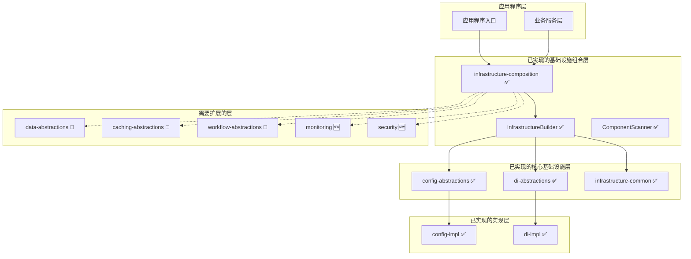
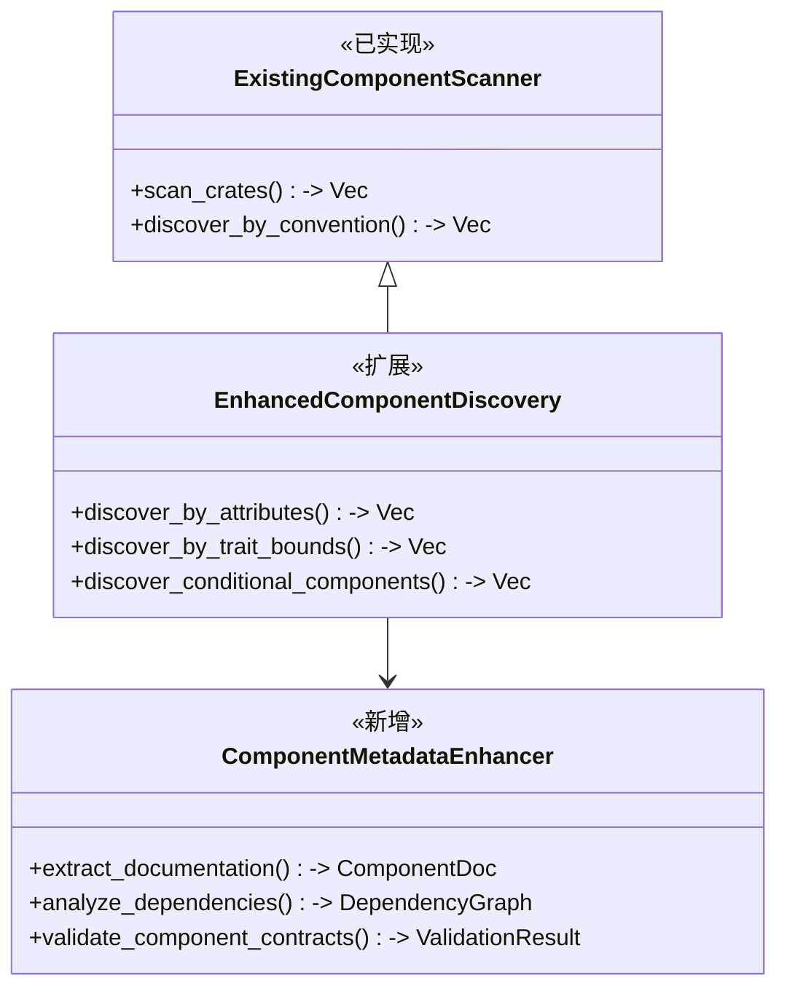
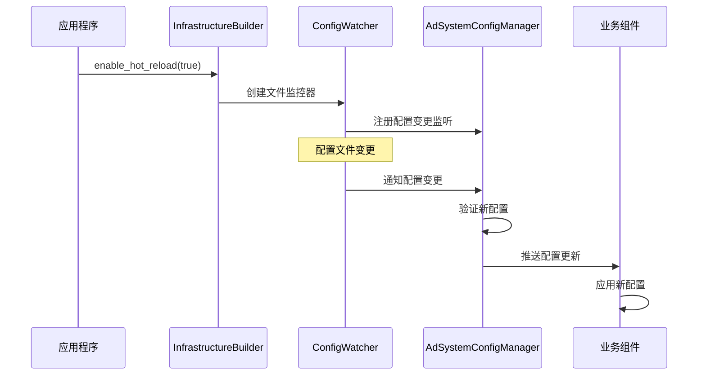
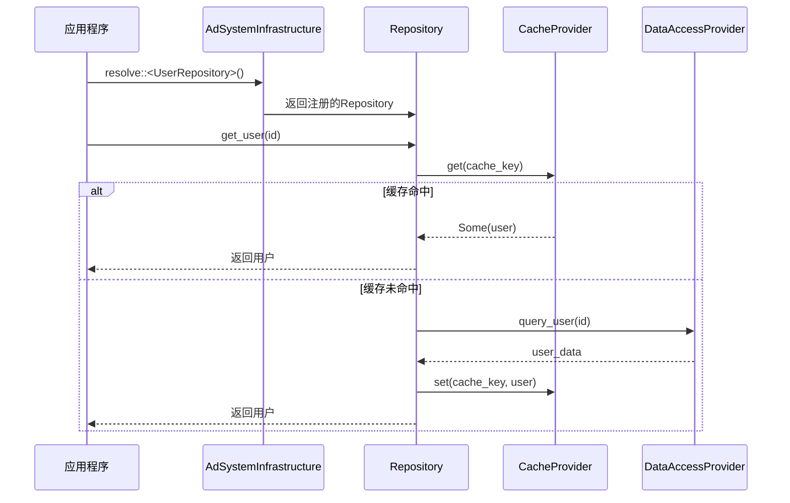
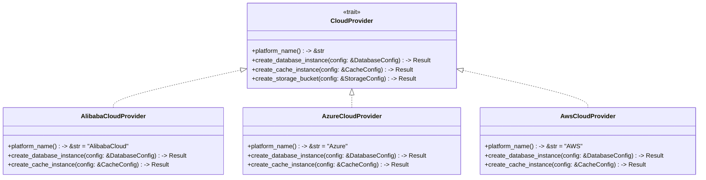

# 核心基础架构设计文档

## 概述

核心基础架构是Lorn.ADSP广告投放系统的技术底座，基于Rust 1.75+技术栈，采用领域驱动设计（DDD）原则。本设计文档基于已有的基础设施实现（`crates/05-infrastructure`），重点关注扩展和优化现有架构，避免重复造轮子，充分利用已实现的配置管理、依赖注入、组件发现等核心功能。

## 现有基础设施分析

### 已实现的核心组件

基于对 `crates/05-infrastructure` 的分析，以下组件已经实现：

#### 1. 基础设施组合层 (`composition`)
- ✅ `AdSystemInfrastructure` - 系统主入口
- ✅ `InfrastructureBuilder` - 构建器模式
- ✅ `ComponentScannerImpl` - 组件扫描器
- ✅ `ConfigSourceManager` - 配置源管理

#### 2. 配置管理 (`config-abstractions` + `config-impl`)
- ✅ `ConfigProvider` trait - 配置提供者抽象
- ✅ `AdSystemConfigManager` - 配置管理器
- ✅ `TomlConfigProvider` - TOML配置支持
- ✅ `JsonConfigProvider` - JSON配置支持
- ✅ `EnvironmentConfigProvider` - 环境变量支持

#### 3. 依赖注入 (`di-abstractions` + `di-impl`)
- ✅ `ComponentRegistry` trait - 组件注册表
- ✅ `DiContainerImpl` - 依赖注入容器
- ✅ `ComponentScanner` - 组件扫描
- ✅ 生命周期管理 (Singleton, Scoped, Transient)

#### 4. 公共基础设施 (`common`)
- ✅ `Component` trait - 组件基础接口
- ✅ `Configurable` trait - 可配置组件
- ✅ `HealthCheckable` trait - 健康检查
- ✅ `ComponentConventions` - 约定规范

## 优化架构设计

### 系统架构图



### 现有工作空间结构

```text
crates/05-infrastructure/
├── common/                    ✅ 已实现 - 公共基础设施
├── composition/               ✅ 已实现 - 基础设施组合层
├── config-abstractions/       ✅ 已实现 - 配置管理抽象
├── config-impl/              ✅ 已实现 - 配置管理实现
├── di-abstractions/          ✅ 已实现 - 依赖注入抽象
└── di-impl/                  ✅ 已实现 - 依赖注入实现
```

## 基于现有基础设施的扩展设计

### 1. 利用现有组件发现机制

#### 现有能力分析
基于 `infrastructure-common` 和 `composition` 的实现，系统已具备：

- ✅ **组件约定规范** (`ComponentConventions`) - 支持基于命名约定的组件发现
- ✅ **组件扫描器** (`ComponentScannerImpl`) - 支持 crate 级别的组件扫描
- ✅ **生命周期管理** (`LifecycleManager`) - 支持 Singleton、Scoped、Transient
- ✅ **健康检查集成** (`HealthCheckable`) - 自动健康检查注册

#### 扩展策略

**增强组件发现能力**


**扩展现有约定规范**
```rust
// 基于现有的 ComponentConventions，添加新的约定规则
impl ComponentConventions {
    pub fn register_ad_engine_conventions(&mut self) {
        // 广告策略组件约定
        self.add_convention(ConventionRule::new(
            "*Strategy",
            Lifetime::Transient,
            "strategies.{component_name}"
        ).with_required_trait::<dyn AdProcessingStrategy>());
        
        // 数据提供者约定
        self.add_convention(ConventionRule::new(
            "*Provider", 
            Lifetime::Scoped,
            "providers.{component_name}"
        ).with_required_trait::<dyn DataProvider>());
        
        // 缓存管理器约定
        self.add_convention(ConventionRule::new(
            "*CacheManager",
            Lifetime::Singleton, 
            "cache.{component_name}"
        ).with_required_trait::<dyn CacheManager>());
    }
}
```

### 2. 扩展配置管理能力

#### 现有配置管理分析
基于 `config-abstractions` 和 `config-impl` 的实现：

- ✅ **多源配置支持** - TOML、JSON、环境变量
- ✅ **类型安全绑定** - 基于 serde 的强类型配置
- ✅ **配置验证** - `ConfigValidator` trait
- ✅ **配置管理器** - `AdSystemConfigManager`

#### 扩展配置能力

**添加新的配置源**
```rust
// 扩展现有的 ConfigProvider trait
pub struct DatabaseConfigProvider {
    connection_pool: Arc<sqlx::PgPool>,
    table_name: String,
}

#[async_trait]
impl ConfigProvider for DatabaseConfigProvider {
    async fn get_configuration(&self, key: &str) -> Result<serde_json::Value, ConfigError> {
        let query = format!(
            "SELECT config_value FROM {} WHERE config_key = $1", 
            self.table_name
        );
        
        let row: (serde_json::Value,) = sqlx::query_as(&query)
            .bind(key)
            .fetch_one(&*self.connection_pool)
            .await
            .map_err(|e| ConfigError::ProviderError { 
                source: Box::new(e) 
            })?;
            
        Ok(row.0)
    }
    
    // ... 其他方法实现
}

// 扩展现有的 InfrastructureBuilder
impl InfrastructureBuilder {
    pub fn add_database_config_source(
        mut self, 
        connection_string: String,
        table_name: String
    ) -> Result<Self, InfrastructureError> {
        let provider = DatabaseConfigProvider::new(connection_string, table_name)?;
        self.config_sources.push(Box::new(provider));
        Ok(self)
    }
}
```

**增强配置热重载**


### 3. 新增数据访问层架构

#### 设计目标
基于现有的依赖注入和配置管理基础设施，新增数据访问层：

- 利用现有的 `Component` trait 和约定规范
- 集成到现有的 `AdSystemInfrastructure` 中
- 支持多种数据库和缓存系统
- 实现缓存优先的数据访问策略

#### 数据访问抽象层设计

**新增 crate: `data-abstractions`**
```rust
// 利用现有的 Component trait
use infrastructure_common::{Component, Configurable};

#[async_trait]
pub trait Repository<T>: Component + Send + Sync {
    async fn get(&self, id: &str) -> Result<Option<T>, RepoError>;
    async fn save(&self, entity: &T) -> Result<(), RepoError>;
    async fn delete(&self, id: &str) -> Result<(), RepoError>;
    async fn find_by_spec(&self, spec: &dyn Specification<T>) -> Result<Vec<T>, RepoError>;
}

#[async_trait]
pub trait DataAccessProvider: Component + Configurable + Send + Sync {
    type Connection: Send + Sync;
    
    async fn get_connection(&self) -> Result<Self::Connection, DataError>;
    async fn execute_query(&self, query: &str) -> Result<QueryResult, DataError>;
    async fn execute_command(&self, command: &str) -> Result<CommandResult, DataError>;
}

// 集成到现有的组件约定中
impl ComponentConventions {
    pub fn register_data_access_conventions(&mut self) {
        self.add_convention(ConventionRule::new(
            "*Repository",
            Lifetime::Scoped,
            "data.repositories.{component_name}"
        ));
        
        self.add_convention(ConventionRule::new(
            "*Provider",
            Lifetime::Singleton,
            "data.providers.{component_name}"
        ));
    }
}
```

**集成到现有基础设施**
```rust
// 扩展现有的 InfrastructureBuilder
impl InfrastructureBuilder {
    pub fn add_data_access_layer(mut self) -> Self {
        // 注册数据访问相关的约定规范
        self.component_scanners.push(Box::new(
            DataAccessComponentScanner::new()
        ));
        self
    }
    
    pub fn add_database_provider<T: DataAccessProvider + 'static>(
        mut self, 
        provider: T
    ) -> Self {
        // 利用现有的组件注册机制
        self.register_component_instance(provider);
        self
    }
}
```

**数据访问流程**


### 4. 新增分布式缓存系统

#### 设计目标
基于现有基础设施，新增缓存系统：

- 利用现有的组件发现和注册机制
- 集成到现有的配置管理系统
- 支持健康检查和监控
- 提供多级缓存和智能缓存策略

#### 缓存抽象层设计

**新增 crate: `caching-abstractions`**
```rust
use infrastructure_common::{Component, Configurable, HealthCheckable};

#[async_trait]
pub trait CacheProvider: Component + Configurable + HealthCheckable + Send + Sync {
    async fn get<T>(&self, key: &str) -> Result<Option<T>, CacheError>
    where
        T: for<'de> Deserialize<'de> + Send + 'static;
        
    async fn set<T>(&self, key: &str, value: &T, ttl: Option<Duration>) -> Result<(), CacheError>
    where
        T: Serialize + Send + Sync;
        
    async fn remove(&self, key: &str) -> Result<(), CacheError>;
    async fn exists(&self, key: &str) -> Result<bool, CacheError>;
}

// 利用现有的约定规范
impl ComponentConventions {
    pub fn register_cache_conventions(&mut self) {
        self.add_convention(ConventionRule::new(
            "*CacheProvider",
            Lifetime::Singleton,
            "cache.providers.{component_name}"
        ));
        
        self.add_convention(ConventionRule::new(
            "*CacheManager", 
            Lifetime::Singleton,
            "cache.managers.{component_name}"
        ));
    }
}
```

**Redis缓存实现 (新增 crate: `caching-redis`)**
```rust
use caching_abstractions::CacheProvider;
use infrastructure_common::{Component, Configurable, HealthCheckable, HealthStatus};

#[derive(Debug, Clone, Deserialize)]
pub struct RedisCacheConfig {
    pub cluster_urls: Vec<String>,
    pub connection_timeout: Duration,
    pub read_timeout: Duration,
    pub write_timeout: Duration,
}

pub struct RedisCacheProvider {
    client: redis::cluster::ClusterClient,
    config: RedisCacheConfig,
}

impl Component for RedisCacheProvider {
    fn name(&self) -> &'static str {
        "RedisCacheProvider"
    }
}

impl Configurable for RedisCacheProvider {
    type Config = RedisCacheConfig;
    
    fn configure(&mut self, config: Self::Config) -> Result<(), ConfigError> {
        self.config = config;
        // 重新创建客户端连接
        self.client = redis::cluster::ClusterClient::new(self.config.cluster_urls.clone())?;
        Ok(())
    }
    
    fn get_config_path() -> &'static str {
        "cache.providers.redis"
    }
}

#[async_trait]
impl HealthCheckable for RedisCacheProvider {
    async fn check_health(&self) -> HealthStatus {
        match self.client.get_async_connection().await {
            Ok(mut conn) => {
                match redis::cmd("PING").query_async::<_, String>(&mut conn).await {
                    Ok(_) => HealthStatus::healthy(),
                    Err(e) => HealthStatus::unhealthy(&format!("Redis PING failed: {}", e)),
                }
            }
            Err(e) => HealthStatus::unhealthy(&format!("Redis connection failed: {}", e)),
        }
    }
}

// 自动注册到基础设施
#[component(singleton)]
impl RedisCacheProvider {
    pub fn new() -> Self {
        Self {
            client: redis::cluster::ClusterClient::new(vec![]).unwrap(),
            config: RedisCacheConfig::default(),
        }
    }
}
```

**集成到现有基础设施**
```rust
// 扩展现有的 InfrastructureBuilder
impl InfrastructureBuilder {
    pub fn add_redis_cache(mut self) -> Self {
        // 利用现有的组件扫描机制自动发现和注册
        self.scan_crate("caching-redis")
    }
    
    pub fn add_cache_layer(mut self) -> Self {
        self.scan_crate("caching-abstractions")
            .scan_crate("caching-redis")
    }
}
```

### 5. 新增工作流引擎与状态机

#### 设计目标
基于现有基础设施，新增工作流引擎：

- 利用现有的组件注册和生命周期管理
- 集成到现有的配置和健康检查系统
- 支持事件驱动的工作流触发
- 提供状态管理和流程编排能力

#### 工作流抽象层设计

**新增 crate: `workflow-abstractions`**
```rust
use infrastructure_common::{Component, Configurable, HealthCheckable};

#[async_trait]
pub trait WorkflowEngine: Component + Configurable + Send + Sync {
    async fn execute_workflow(
        &self, 
        definition: &WorkflowDefinition, 
        context: &WorkflowContext
    ) -> Result<WorkflowResult, WorkflowError>;
    
    async fn pause_workflow(&self, instance_id: &str) -> Result<(), WorkflowError>;
    async fn resume_workflow(&self, instance_id: &str) -> Result<(), WorkflowError>;
    async fn cancel_workflow(&self, instance_id: &str) -> Result<(), WorkflowError>;
    async fn get_workflow_status(&self, instance_id: &str) -> Result<WorkflowStatus, WorkflowError>;
}

#[async_trait]
pub trait TaskExecutor: Component + Send + Sync {
    async fn execute(&self, context: &TaskContext) -> Result<TaskResult, TaskError>;
    fn can_execute(&self, context: &TaskContext) -> bool;
    fn get_required_permissions(&self) -> Vec<Permission>;
}

// 集成到现有约定规范
impl ComponentConventions {
    pub fn register_workflow_conventions(&mut self) {
        self.add_convention(ConventionRule::new(
            "*WorkflowEngine",
            Lifetime::Singleton,
            "workflow.engines.{component_name}"
        ));
        
        self.add_convention(ConventionRule::new(
            "*TaskExecutor",
            Lifetime::Transient,
            "workflow.executors.{component_name}"
        ));
    }
}
```

**工作流引擎实现 (新增 crate: `workflow-impl`)**
```rust
use workflow_abstractions::{WorkflowEngine, TaskExecutor};
use infrastructure_common::{Component, Configurable, HealthCheckable, HealthStatus};

#[derive(Debug, Clone, Deserialize)]
pub struct WorkflowEngineConfig {
    pub max_concurrent_workflows: usize,
    pub task_timeout: Duration,
    pub retry_attempts: u32,
}

pub struct DefaultWorkflowEngine {
    config: WorkflowEngineConfig,
    task_executors: Arc<RwLock<HashMap<String, Arc<dyn TaskExecutor>>>>,
    active_workflows: Arc<RwLock<HashMap<String, WorkflowInstance>>>,
}

impl Component for DefaultWorkflowEngine {
    fn name(&self) -> &'static str {
        "DefaultWorkflowEngine"
    }
}

impl Configurable for DefaultWorkflowEngine {
    type Config = WorkflowEngineConfig;
    
    fn configure(&mut self, config: Self::Config) -> Result<(), ConfigError> {
        self.config = config;
        Ok(())
    }
    
    fn get_config_path() -> &'static str {
        "workflow.engines.default"
    }
}

#[async_trait]
impl HealthCheckable for DefaultWorkflowEngine {
    async fn check_health(&self) -> HealthStatus {
        let active_count = self.active_workflows.read().await.len();
        if active_count > self.config.max_concurrent_workflows {
            HealthStatus::degraded(&format!(
                "工作流数量过多: {}/{}",
                active_count,
                self.config.max_concurrent_workflows
            ))
        } else {
            HealthStatus::healthy()
        }
    }
}

// 自动注册到基础设施
#[component(singleton)]
impl DefaultWorkflowEngine {
    pub fn new() -> Self {
        Self {
            config: WorkflowEngineConfig::default(),
            task_executors: Arc::new(RwLock::new(HashMap::new())),
            active_workflows: Arc::new(RwLock::new(HashMap::new())),
        }
    }
}
```

**集成到现有基础设施**
```rust
// 扩展现有的 InfrastructureBuilder
impl InfrastructureBuilder {
    pub fn add_workflow_engine(mut self) -> Self {
        self.scan_crate("workflow-abstractions")
            .scan_crate("workflow-impl")
    }
}

// 在应用中使用
#[tokio::main]
async fn main() -> Result<(), Box<dyn std::error::Error>> {
    let infrastructure = AdSystemInfrastructure::builder()
        .add_config_toml("config/app.toml")?
        .add_workflow_engine()
        .build()
        .await?;
    
    // 解析工作流引擎
    let workflow_engine = infrastructure.resolve::<dyn WorkflowEngine>().await?;
    
    // 执行工作流
    let result = workflow_engine.execute_workflow(&definition, &context).await?;
    
    Ok(())
}
```

### 6. 优化现有配置管理与依赖注入

#### 现有能力总结
基于 `crates/05-infrastructure` 的分析，以下功能已经完整实现：

- ✅ **统一配置管理** - `AdSystemConfigManager` 支持多源配置
- ✅ **依赖注入框架** - `DiContainerImpl` 支持完整的DI功能
- ✅ **组件生命周期管理** - 支持 Singleton、Scoped、Transient
- ✅ **组件约定规范** - `ComponentConventions` 支持基于约定的发现
- ✅ **健康检查集成** - `HealthCheckable` trait 自动集成

#### 优化建议

**1. 增强现有配置热重载**
```rust
// 基于现有的 AdSystemConfigManager，添加热重载能力
impl AdSystemConfigManager {
    pub async fn enable_hot_reload(&mut self) -> Result<(), ConfigError> {
        let watcher = ConfigFileWatcher::new()?;
        
        // 监控配置文件变更
        for provider in &self.providers {
            if let Some(file_path) = provider.get_file_path() {
                watcher.add_watch_path(&file_path).await?;
            }
        }
        
        // 启动监控任务
        let change_receiver = watcher.get_change_receiver();
        let manager_weak = Arc::downgrade(&Arc::new(self.clone()));
        
        tokio::spawn(async move {
            while let Ok(event) = change_receiver.recv().await {
                if let Some(manager) = manager_weak.upgrade() {
                    if let Err(e) = manager.handle_config_change(event).await {
                        tracing::error!("配置热重载失败: {}", e);
                    }
                }
            }
        });
        
        Ok(())
    }
}
```

**2. 扩展现有组件扫描能力**
```rust
// 基于现有的 ComponentScannerImpl，添加更多发现策略
impl ComponentScannerImpl {
    pub fn with_attribute_discovery(mut self) -> Self {
        // 添加基于属性的组件发现
        self.add_discovery_strategy(AttributeBasedDiscovery::new());
        self
    }
    
    pub fn with_trait_discovery<T: 'static>(mut self) -> Self {
        // 添加基于 trait 的组件发现
        self.add_discovery_strategy(TraitBasedDiscovery::<T>::new());
        self
    }
    
    pub fn with_conditional_discovery(mut self) -> Self {
        // 添加条件化组件发现
        self.add_discovery_strategy(ConditionalDiscovery::new());
        self
    }
}
```

**3. 增强现有基础设施构建器**
```rust
// 基于现有的 InfrastructureBuilder，添加更多便利方法
impl InfrastructureBuilder {
    pub fn auto_configure_for_environment(mut self, env: Environment) -> Self {
        match env {
            Environment::Development => {
                self.add_config_toml("config/dev.toml")
                    .unwrap()
                    .enable_hot_reload(true)
                    .enable_debug_logging()
            }
            Environment::Production => {
                self.add_config_toml("config/prod.toml")
                    .unwrap()
                    .add_config_env_vars("ADSP_")
                    .unwrap()
                    .enable_performance_monitoring()
            }
            Environment::Testing => {
                self.add_config_toml("config/test.toml")
                    .unwrap()
                    .enable_test_mode()
            }
        }
    }
    
    pub fn add_all_infrastructure_layers(mut self) -> Self {
        self.add_data_access_layer()
            .add_cache_layer()
            .add_workflow_engine()
            .add_monitoring_layer()
            .add_security_layer()
    }
}
```

**4. 完整的使用示例**
```rust
#[tokio::main]
async fn main() -> Result<(), Box<dyn std::error::Error>> {
    // 利用现有基础设施，添加新的扩展层
    let infrastructure = AdSystemInfrastructure::builder()
        .auto_configure_for_environment(Environment::Development)
        .add_all_infrastructure_layers()
        .scan_crate("ad-engine")?
        .scan_crate("user-targeting")?
        .scan_crate("bid-processing")?
        .build()
        .await?;
    
    // 启动基础设施
    infrastructure.start().await?;
    
    // 使用现有的解析能力
    let user_service = infrastructure.resolve::<UserService>().await?;
    let cache_provider = infrastructure.resolve::<dyn CacheProvider>().await?;
    let workflow_engine = infrastructure.resolve::<dyn WorkflowEngine>().await?;
    
    // 检查系统健康状态
    let health_status = infrastructure.get_overall_health().await;
    println!("系统健康状态: {:?}", health_status);
    
    Ok(())
}
```

## 基于现有基础设施的技术实现

### 现有技术栈分析

#### 已实现的核心技术
基于 `crates/05-infrastructure` 的分析：

- ✅ **异步运行时**: 基于 Tokio 的异步基础设施
- ✅ **配置管理**: 基于 serde 的类型安全配置绑定
- ✅ **依赖注入**: 完整的 DI 容器实现
- ✅ **组件发现**: 基于约定的组件扫描机制
- ✅ **健康检查**: 集成的健康检查框架

#### 需要新增的技术栈

**数据库与ORM层**
```rust
// 新增 crate: data-abstractions
[dependencies]
sea-orm = { version = "0.12", features = ["sqlx-postgres", "sqlx-mysql", "runtime-tokio-rustls"] }
sqlx = { version = "0.7", features = ["runtime-tokio-rustls", "postgres", "mysql"] }

// 集成到现有基础设施
impl InfrastructureBuilder {
    pub fn add_sea_orm_support(mut self, database_url: String) -> Result<Self, InfrastructureError> {
        let db_provider = SeaOrmDataProvider::new(database_url)?;
        self.register_component_instance(db_provider);
        Ok(self)
    }
}
```

**缓存与存储层**
```rust
// 新增 crate: caching-redis
[dependencies]
redis = { version = "0.24", features = ["cluster", "tokio-comp"] }
tokio = { version = "1.0", features = ["full"] }

// 集成到现有基础设施
impl InfrastructureBuilder {
    pub fn add_redis_cluster(mut self, cluster_urls: Vec<String>) -> Result<Self, InfrastructureError> {
        let redis_provider = RedisCacheProvider::new(cluster_urls)?;
        self.register_component_instance(redis_provider);
        Ok(self)
    }
}
```

### 新增监控与可观测性

#### 监控抽象层设计

**新增 crate: `monitoring`**
```rust
use infrastructure_common::{Component, Configurable, HealthCheckable};

#[async_trait]
pub trait MetricsCollector: Component + Send + Sync {
    async fn record_counter(&self, name: &str, value: u64, tags: &[Tag]);
    async fn record_histogram(&self, name: &str, value: f64, tags: &[Tag]);
    async fn record_gauge(&self, name: &str, value: f64, tags: &[Tag]);
    async fn flush(&self) -> Result<(), MetricsError>;
}

// 利用现有的组件约定
impl ComponentConventions {
    pub fn register_monitoring_conventions(&mut self) {
        self.add_convention(ConventionRule::new(
            "*MetricsCollector",
            Lifetime::Singleton,
            "monitoring.metrics.{component_name}"
        ));
        
        self.add_convention(ConventionRule::new(
            "*TracingCollector",
            Lifetime::Singleton,
            "monitoring.tracing.{component_name}"
        ));
    }
}
```

**Prometheus集成实现**
```rust
use monitoring::{MetricsCollector, Tag};
use prometheus::{Counter, Histogram, Gauge, Registry};

pub struct PrometheusMetricsCollector {
    registry: Registry,
    counters: Arc<RwLock<HashMap<String, Counter>>>,
    histograms: Arc<RwLock<HashMap<String, Histogram>>>,
    gauges: Arc<RwLock<HashMap<String, Gauge>>>,
}

impl Component for PrometheusMetricsCollector {
    fn name(&self) -> &'static str {
        "PrometheusMetricsCollector"
    }
}

#[async_trait]
impl MetricsCollector for PrometheusMetricsCollector {
    async fn record_counter(&self, name: &str, value: u64, tags: &[Tag]) {
        let mut counters = self.counters.write().await;
        let counter = counters.entry(name.to_string())
            .or_insert_with(|| {
                let counter = Counter::new(name, "Counter metric").unwrap();
                self.registry.register(Box::new(counter.clone())).unwrap();
                counter
            });
        counter.inc_by(value as f64);
    }
    
    // ... 其他方法实现
}

// 自动注册到基础设施
#[component(singleton)]
impl PrometheusMetricsCollector {
    pub fn new() -> Self {
        Self {
            registry: Registry::new(),
            counters: Arc::new(RwLock::new(HashMap::new())),
            histograms: Arc::new(RwLock::new(HashMap::new())),
            gauges: Arc::new(RwLock::new(HashMap::new())),
        }
    }
}
```

#### 集成到现有基础设施

**扩展现有的健康检查系统**
```rust
// 基于现有的 HealthCheckable trait，添加监控集成
impl AdSystemInfrastructure {
    pub async fn get_detailed_health_report(&self) -> DetailedHealthReport {
        let health_results = self.check_health().await;
        let metrics = self.collect_health_metrics().await;
        
        DetailedHealthReport {
            overall_status: self.get_overall_health().await,
            component_health: health_results,
            performance_metrics: metrics,
            timestamp: chrono::Utc::now(),
        }
    }
    
    async fn collect_health_metrics(&self) -> HealthMetrics {
        let metrics_collector = self.resolve::<dyn MetricsCollector>().await
            .unwrap_or_else(|_| Arc::new(NoOpMetricsCollector));
            
        HealthMetrics {
            response_time: metrics_collector.get_histogram("health_check_duration").await,
            error_rate: metrics_collector.get_counter("health_check_errors").await,
            component_count: self.get_registered_components().await.len(),
        }
    }
}
```

### 性能优化策略

#### 基于现有架构的优化

**1. 组件解析缓存**
```rust
// 优化现有的 DiContainerImpl
impl DiContainerImpl {
    pub fn with_resolution_cache(mut self) -> Self {
        self.enable_resolution_cache = true;
        self
    }
    
    async fn resolve_with_cache<T: Component + 'static>(&self) -> Result<Arc<T>, DependencyError> {
        let type_id = TypeId::of::<T>();
        
        // 检查缓存
        if let Some(cached) = self.resolution_cache.get(&type_id).await {
            if let Ok(component) = cached.downcast::<T>() {
                return Ok(component);
            }
        }
        
        // 解析并缓存
        let component = self.resolve_uncached::<T>().await?;
        self.resolution_cache.insert(type_id, component.clone()).await;
        Ok(component)
    }
}
```

**2. 配置加载优化**
```rust
// 优化现有的 AdSystemConfigManager
impl AdSystemConfigManager {
    pub fn with_config_cache(mut self) -> Self {
        self.cache_enabled = true;
        self
    }
    
    pub async fn preload_configurations(&mut self) -> Result<(), ConfigError> {
        // 预加载常用配置
        let common_configs = vec![
            "database",
            "cache.redis", 
            "monitoring.metrics",
            "workflow.engines.default"
        ];
        
        for config_path in common_configs {
            let _ = self.get_configuration(config_path).await;
        }
        
        Ok(())
    }
}
```

## 部署架构

### 容器化部署

#### Docker配置
```dockerfile
FROM rust:1.75-slim as builder

WORKDIR /app
COPY Cargo.toml Cargo.lock ./
COPY crates/ crates/

RUN cargo build --release --bin infrastructure-demo

FROM debian:bookworm-slim

RUN apt-get update && apt-get install -y \
    ca-certificates \
    && rm -rf /var/lib/apt/lists/*

COPY --from=builder /app/target/release/infrastructure-demo /usr/local/bin/

COPY config/ /app/config/

WORKDIR /app

EXPOSE 8080

CMD ["infrastructure-demo"]
```

#### Kubernetes部署
```yaml
apiVersion: apps/v1
kind: Deployment
metadata:
  name: core-infrastructure
spec:
  replicas: 3
  selector:
    matchLabels:
      app: core-infrastructure
  template:
    metadata:
      labels:
        app: core-infrastructure
    spec:
      containers:
      - name: infrastructure
        image: lorn-adsp/core-infrastructure:latest
        ports:
        - containerPort: 8080
        env:
        - name: DATABASE_URL
          valueFrom:
            secretKeyRef:
              name: database-secret
              key: url
        - name: REDIS_URL
          valueFrom:
            secretKeyRef:
              name: redis-secret
              key: url
        resources:
          requests:
            memory: "256Mi"
            cpu: "250m"
          limits:
            memory: "512Mi"
            cpu: "500m"
```

### 多云支持

#### 云平台抽象


## 安全设计

### 数据安全

#### 加密存储
- **传输加密**: HTTPS/TLS保护数据传输
- **存储加密**: 数据库透明数据加密(TDE)
- **字段加密**: 敏感字段应用层加密
- **密钥管理**: 统一密钥管理服务

#### 访问控制
- **认证**: JWT令牌认证
- **授权**: 基于角色的访问控制(RBAC)
- **审计**: 完整的访问审计日志
- **权限**: API级别的细粒度权限控制

### 网络安全

#### 安全防护
- **防火墙**: 网络层访问控制
- **WAF**: Web应用防火墙
- **DDoS防护**: 分布式拒绝服务攻击防护
- **入侵检测**: 实时入侵检测和响应

## 测试策略

### 单元测试

#### 测试覆盖
- **组件测试**: 各基础设施组件的单元测试
- **集成测试**: 组件间协作的集成测试
- **性能测试**: 关键路径的性能基准测试
- **安全测试**: 安全漏洞和权限控制测试

#### 测试工具
- **Rust内置测试**: 单元测试框架
- **Mockall**: Mock框架
- **Testcontainers-rs**: 容器化测试环境
- **Criterion**: 性能基准测试

### 集成测试

#### 测试场景
- 完整基础设施启动测试
- 配置热重载测试
- 数据库连接池测试
- 缓存一致性测试
- 工作流执行测试

## 运维监控

### 监控体系

#### 监控层次
- **基础设施监控**: 服务器、网络、存储
- **应用监控**: 应用性能、错误率、响应时间
- **业务监控**: 业务指标、用户行为、转化率
- **安全监控**: 安全事件、异常访问、威胁检测

#### 告警机制
- **阈值告警**: 基于指标阈值的自动告警
- **趋势告警**: 基于趋势分析的预测告警
- **异常告警**: 基于机器学习的异常检测告警
- **业务告警**: 基于业务规则的告警

### 日志管理

#### 日志分类
- **应用日志**: 应用程序运行日志
- **访问日志**: API访问和用户行为日志
- **错误日志**: 系统错误和异常日志
- **审计日志**: 安全和合规审计日志

#### 日志处理
- **结构化日志**: 使用tracing进行结构化日志记录
- **日志聚合**: 集中收集和存储日志
- **日志分析**: 实时日志分析和搜索
- **日志归档**: 长期日志存储和归档

## 总结

本设计文档基于已有的 `crates/05-infrastructure` 基础设施，重点关注扩展和优化现有架构，避免重复造轮子。通过充分利用已实现的配置管理、依赖注入、组件发现等核心功能，为Lorn.ADSP广告投放系统提供完整的技术底座。

### 现有基础设施优势

1. **完整的DI框架**: `DiContainerImpl` 提供了完整的依赖注入能力
2. **灵活的配置管理**: `AdSystemConfigManager` 支持多源配置和类型安全绑定
3. **智能组件发现**: `ComponentScannerImpl` 基于约定的自动化组件发现
4. **健康检查集成**: `HealthCheckable` trait 提供统一的健康检查机制
5. **基础设施组合**: `InfrastructureBuilder` 提供优雅的构建器模式

### 扩展策略

#### 1. 基于现有基础设施的扩展
- ✅ **利用现有组件约定** - 扩展 `ComponentConventions` 支持新的组件类型
- ✅ **集成现有配置系统** - 新组件自动集成到 `AdSystemConfigManager`
- ✅ **复用现有健康检查** - 新组件自动支持 `HealthCheckable` trait
- ✅ **利用现有构建器** - 通过 `InfrastructureBuilder` 统一管理

#### 2. 新增核心能力
- 🆕 **数据访问层** (`data-abstractions` + 实现)
- 🆕 **分布式缓存** (`caching-abstractions` + `caching-redis`)
- 🆕 **工作流引擎** (`workflow-abstractions` + `workflow-impl`)
- 🆕 **监控系统** (`monitoring` + Prometheus集成)
- 🆕 **安全组件** (`security` + 认证授权)

### 实施路径

#### 阶段1: 扩展现有基础设施
```rust
// 1. 扩展组件约定规范
impl ComponentConventions {
    pub fn register_all_ad_engine_conventions(&mut self) {
        self.register_ad_engine_conventions();
        self.register_data_access_conventions();
        self.register_cache_conventions();
        self.register_workflow_conventions();
        self.register_monitoring_conventions();
    }
}

// 2. 增强基础设施构建器
impl InfrastructureBuilder {
    pub fn add_complete_ad_infrastructure(mut self) -> Self {
        self.add_data_access_layer()
            .add_cache_layer()
            .add_workflow_engine()
            .add_monitoring_layer()
            .add_security_layer()
    }
}
```

#### 阶段2: 实现新增组件
- 实现数据访问抽象层和具体提供者
- 实现Redis缓存提供者和多级缓存策略
- 实现工作流引擎和状态机
- 实现Prometheus监控集成
- 实现JWT认证和RBAC授权

#### 阶段3: 集成和优化
- 性能优化：组件解析缓存、配置预加载
- 监控集成：详细的健康检查报告、性能指标收集
- 测试完善：单元测试、集成测试、性能测试
- 文档完善：API文档、使用指南、最佳实践

### 架构优势

1. **避免重复造轮子**: 充分利用已有的成熟基础设施
2. **渐进式扩展**: 基于现有架构逐步添加新能力
3. **一致性保证**: 新组件遵循现有的约定和模式
4. **向后兼容**: 扩展不影响现有功能的使用
5. **统一管理**: 通过现有的构建器统一管理所有组件

### 技术创新

1. **基于约定的扩展**: 新组件自动集成到现有约定规范中
2. **组合式架构**: 通过组合现有组件实现复杂功能
3. **类型安全扩展**: 利用Rust类型系统保证扩展的正确性
4. **异步优先设计**: 所有新组件都基于异步模式设计
5. **可观测性内置**: 监控和健康检查能力内置到每个组件中

通过这种基于现有基础设施的扩展策略，我们可以快速构建出完整、稳定、高性能的广告投放系统技术底座，同时保持代码的简洁性和可维护性。