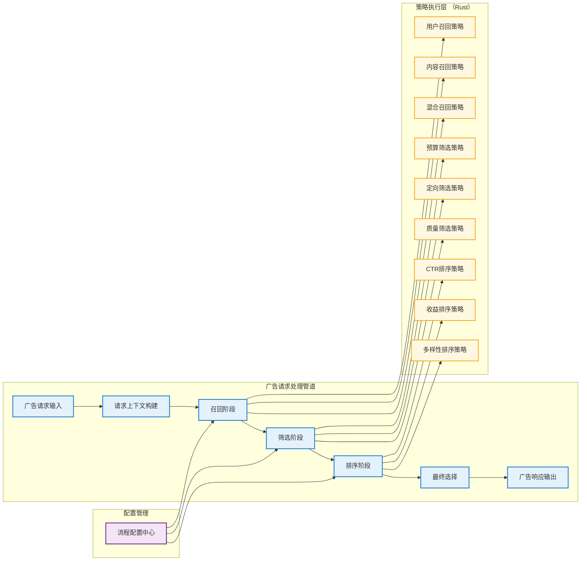

# 系统整体技术架构设计

## 架构概述

Lorn.ADSP-Rust是一个企业级互联网广告投放平台，采用微服务分层架构设计，基于Rust 1.75+技术栈构建。系统严格遵循IAB行业标准，支持OpenRTB实时竞价协议和VAST/VMAP视频广告标准，具备高并发、低延迟、高可用的技术特性。平台利用Rust的内存安全和高性能特性，为广告投放提供毫秒级响应能力。

## 技术架构原则

### 设计原则
- **高性能设计**：广告请求响应时间 < 50ms，支持100万+QPS竞价处理
- **内存安全**：基于Rust零成本抽象，编译时内存安全保证，无垃圾回收开销
- **高可用架构**：系统可用性 ≥ 99.9%，支持故障自动恢复和服务自愈
- **弹性扩展**：支持水平扩展，按需弹性伸缩，GPU加速AI推理
- **标准合规**：严格遵循IAB OpenRTB、VAST、VMAP等行业标准
- **安全可靠**：多层安全防护，完善的反作弊机制，AI模型安全防护
- **数据驱动**：全链路数据追踪，支持实时决策优化和AI增强分析
- **多云支持**：支持阿里云、Azure、AWS等多种云平台部署
- **数据库无关**：通过抽象层实现数据库厂商解耦，支持SeaORM异步操作
- **流程可配置**：广告投放引擎支持动态流程配置和策略热更新
- **多端统一**：客户端SDK支持跨平台统一开发，支持WebAssembly高性能前端

### 架构约束

- 单一职责：每个微服务专注单一业务领域，基于领域驱动设计(DDD)拆分
- 服务自治：服务间通过标准API通信，避免直接数据库访问
- 数据一致性：采用最终一致性，关键业务保证强一致性
- 无状态设计：应用层无状态，状态存储在缓存和数据库中
- 内存安全：利用Rust的所有权模型确保内存安全，避免数据竞争
- 异步优先：基于Tokio异步运行时，支持高并发处理
- 云平台解耦：基础设施抽象化，支持多云部署切换
- 数据访问抽象：仓储模式+适配器模式实现数据库无关性，基于SeaORM
- 策略可插拔：基于管道模式实现广告投放策略的动态配置和热更新
- 客户端统一：通过跨平台框架实现多端代码复用，支持WebAssembly高性能前端

## 技术架构图

```mermaid
graph TB
    subgraph "客户端层 （Client Layer）"
        subgraph "原生应用客户端"
            TAURI[Tauri SDK<br/>Windows/macOS/Linux]
        end
        
        subgraph "Web应用客户端"
            YEW[Yew WebAssembly<br/>高性能Web前端]
        end
        
        subgraph "小程序/轻应用客户端"
            WECHAT[微信小程序<br/>TypeScript SDK]
            ALIPAY[支付宝小程序<br/>TypeScript SDK]
            QUICKAPP[快应用<br/>TypeScript SDK]
        end
    end

    subgraph "接入层 （Gateway Layer）"
        LB[负载均衡器<br/>Nginx/HAProxy]
        AG[API网关<br/>Axum Gateway]
        CDN[CDN<br/>广告素材分发]
    end

    subgraph "应用层 （Application Layer）"
        subgraph "广告投放微服务"
            ADS[广告投放引擎<br/>Axum Web API + 管道模式]
            subgraph "策略引擎 （Rust 实现）"
                RECALL[召回策略<br/>Rust 并行处理]
                FILTER[筛选策略<br/>Rust 并行处理]
                RANKING[排序策略<br/>Rust 并行处理]
            end
            BID[竞价服务<br/>OpenRTB实现]
            TARGET[定向服务<br/>用户画像匹配]
        end
        
        subgraph "业务管理微服务"
            ADM[广告主管理<br/>Axum Web API]
            CAM[广告内容管理<br/>Axum Web API]
            MED[媒体管理<br/>Axum Web API]
        end
        
        subgraph "数据分析微服务"
            RPT[报表服务<br/>Axum Web API]
            BI[商业智能<br/>数据分析引擎]
            ML[机器学习<br/>算法服务]
        end
    end

    subgraph "服务治理层 （Service Governance）"
        REG[服务注册中心<br/>Consul]
        CONF[配置中心<br/>Consul KV]
        DISC[服务发现<br/>Consul DNS]
        PIPELINE[流程配置中心<br/>动态策略配置]
    end

    subgraph "数据访问抽象层 （Data Access Abstraction）"
        REPO[仓储抽象接口<br/>Repository Pattern]
        UOW[工作单元抽象<br/>Unit of Work Pattern]
        ADAPTER[数据库适配器<br/>SeaORM + Provider Pattern]
    end

    subgraph "多云基础设施层 （Multi-Cloud Infrastructure）"
        subgraph "阿里云 （Alibaba Cloud）"
            ALI_RDS[RDS<br/>MySQL/PostgreSQL]
            ALI_REDIS[Redis集群]
            ALI_KAFKA[消息队列]
            ALI_OSS[对象存储]
        end
        
        subgraph "Azure云 （Microsoft Azure）"
            AZ_SQL[Azure Database<br/>MySQL/PostgreSQL]
            AZ_REDIS[Azure Cache for Redis]
            AZ_SB[Service Bus]
            AZ_BLOB[Blob Storage]
        end
        
        subgraph "AWS云 （Amazon Web Services）"
            AWS_RDS[RDS<br/>MySQL/PostgreSQL]
            AWS_REDIS[ElastiCache]
            AWS_SQS[SQS/SNS]
            AWS_S3[S3 Storage]
        end
    end

    subgraph "监控运维层 （Monitoring Layer）"
        PROM[Prometheus<br/>指标收集]
        GRAF[Grafana<br/>监控面板]
        ELK[ELK Stack<br/>日志分析]
        ALERT[AlertManager<br/>告警系统]
        JAEGER[Jaeger<br/>分布式追踪]
    end

    subgraph "第三方集成 (External Integration)"
        DSP[第三方DSP<br/>需求方平台]
        SSP[第三方SSP<br/>供应方平台]
        ADX[第三方ADX<br/>广告交易平台]
        DMP[第三方DMP<br/>数据管理平台]
    end

    %% 客户端到服务端
    TAURI --> AG
    YEW --> AG
    WECHAT --> AG
    ALIPAY --> AG
    QUICKAPP --> AG
    
    %% 请求流转
    LB --> AG
    AG --> ADS
    AG --> ADM
    AG --> CAM
    
    %% 广告引擎内部流程
    ADS --> RECALL
    ADS --> FILTER
    ADS --> RANKING
    ADS --> PIPELINE
    
    %% 服务间通信
    ADS --> BID
    ADS --> TARGET
    BID --> DSP
    
    %% 数据访问抽象
    ADS --> REPO
    ADM --> REPO
    CAM --> REPO
    REPO --> UOW
    UOW --> ADAPTER
    
    %% 多云数据存储
    ADAPTER --> ALI_RDS
    ADAPTER --> AZ_SQL
    ADAPTER --> AWS_RDS
    
    %% 缓存访问
    ADS --> ALI_REDIS
    ADS --> AZ_REDIS
    ADS --> AWS_REDIS
    
    %% 服务治理
    ADS --> REG
    BID --> REG
    TARGET --> REG
    
    %% 消息传递
    ADS --> ALI_KAFKA
    BID --> AZ_SB
    TARGET --> AWS_SQS
    
    %% 监控
    ADS --> PROM
    BID --> PROM
    TARGET --> PROM
    ADS --> JAEGER
    BID --> JAEGER
    TARGET --> JAEGER
    
    %% 样式
    classDef client fill:#e1f5fe,stroke:#0277bd,stroke-width:2px
    classDef gateway fill:#e3f2fd,stroke:#1976d2,stroke-width:2px
    classDef service fill:#f3e5f5,stroke:#6a1b9a,stroke-width:2px
    classDef strategy fill:#fff8e1,stroke:#f9a825,stroke-width:2px
    classDef data fill:#fff3e0,stroke:#f57c00,stroke-width:2px
    classDef cloud fill:#f1f8e9,stroke:#689f38,stroke-width:2px
    classDef monitor fill:#e8f5e8,stroke:#2e7d32,stroke-width:2px
    classDef external fill:#ffebee,stroke:#c62828,stroke-width:2px
    
    class TAURI,YEW,WECHAT,ALIPAY,QUICKAPP client
    class LB,AG,CDN gateway
    class ADS,BID,TARGET,ADM,CAM,MED,RPT,BI,ML service
    class RECALL,FILTER,RANKING strategy
    class REPO,UOW,ADAPTER,PIPELINE data
    class ALI_RDS,ALI_REDIS,ALI_KAFKA,ALI_OSS,AZ_SQL,AZ_REDIS,AZ_SB,AZ_BLOB,AWS_RDS,AWS_REDIS,AWS_SQS,AWS_S3 cloud
    class PROM,GRAF,ELK,ALERT,JAEGER monitor
    class DSP,SSP,ADX,DMP external
```



## Cargo工作空间架构

### 工作空间结构设计

```text
Lorn.ADSP.Rust/
│
├── Cargo.toml                              # 工作空间根配置
├── Cargo.lock                              # 依赖锁定文件
│
├── crates/                                 # 所有 crate 目录
│   │
│   ├── 01-presentation/                    # 表示层
│   │   ├── web-api/                        # Web API服务
│   │   │   ├── src/
│   │   │   │   ├── main.rs                 # 入口文件
│   │   │   │   ├── handlers/               # API处理器
│   │   │   │   ├── models/                 # 数据模型
│   │   │   │   └── routes/                 # 路由定义
│   │   │   └── Cargo.toml
│   │   ├── web-admin/                      # 管理后台 (Yew WebAssembly)
│   │   │   ├── src/
│   │   │   │   ├── main.rs
│   │   │   │   ├── components/             # 后台组件
│   │   │   │   ├── pages/                  # 管理后台页面
│   │   │   │   └── services/               # 前端服务
│   │   │   └── Cargo.toml
│   │   ├── web-advertiser/                 # 广告主门户 (Yew WebAssembly)
│   │   │   ├── src/
│   │   │   │   ├── main.rs
│   │   │   │   ├── components/             # 广告主组件
│   │   │   │   ├── pages/                  # 广告主门户页面
│   │   │   │   └── services/               # 前端服务
│   │   │   └── Cargo.toml
│   │   └── desktop-monitor/                # 桌面监控工具 (Tauri)
│   │       ├── src/
│   │       │   ├── main.rs
│   │       │   ├── commands/               # Tauri命令
│   │       │   └── services/               # 桌面服务
│   │       ├── src-tauri/                  # Tauri后端
│   │       │   ├── src/
│   │       │   │   ├── main.rs
│   │       │   │   └── lib.rs
│   │       │   └── Cargo.toml
│   │       └── Cargo.toml
│   │
│   ├── 02-services/                        # 微服务层
│   │   ├── ad-engine/                      # 广告投放引擎服务
│   │   │   ├── src/
│   │   │   │   ├── main.rs
│   │   │   │   ├── handlers/               # API处理器
│   │   │   │   ├── pipeline/               # 广告管道处理
│   │   │   │   ├── configuration/          # 流程配置
│   │   │   │   └── orchestrator/           # 策略编排
│   │   │   └── Cargo.toml
│   │   ├── bidding/                        # 竞价服务
│   │   │   ├── src/
│   │   │   │   ├── main.rs
│   │   │   │   ├── recall/                 # 竞价召回
│   │   │   │   ├── filter/                 # 竞价过滤
│   │   │   │   └── ranking/                # 竞价排序
│   │   │   └── Cargo.toml
│   │   ├── targeting/                      # 定向服务
│   │   │   ├── src/
│   │   │   │   ├── main.rs
│   │   │   │   ├── recall/                 # 定向召回
│   │   │   │   ├── filter/                 # 定向过滤
│   │   │   │   └── ranking/                # 定向排序
│   │   │   └── Cargo.toml
│   │   ├── creative/                       # 广告创意服务
│   │   │   ├── src/
│   │   │   │   ├── main.rs
│   │   │   │   └── handlers/               # 创意API
│   │   │   └── Cargo.toml
│   │   ├── campaign/                       # 广告活动服务
│   │   │   ├── src/
│   │   │   │   ├── main.rs
│   │   │   │   └── handlers/               # 活动API
│   │   │   └── Cargo.toml
│   │   ├── analytics/                      # 数据分析服务
│   │   │   ├── src/
│   │   │   │   ├── main.rs
│   │   │   │   └── handlers/               # 分析API
│   │   │   └── Cargo.toml
│   │   ├── reporting/                      # 报表服务
│   │   │   ├── src/
│   │   │   │   ├── main.rs
│   │   │   │   └── handlers/               # 报表API
│   │   │   └── Cargo.toml
│   │   └── gateway/                        # API网关服务
│   │       ├── src/
│   │       │   ├── main.rs
│   │       │   └── handlers/               # 网关API
│   │       └── Cargo.toml
│   │
│   ├── 03-strategies/                      # 策略引擎层 (Rust 实现)
│   │   ├── recall/                         # 召回策略
│   │   │   ├── src/
│   │   │   │   ├── lib.rs
│   │   │   │   ├── strategies/             # 召回策略实现
│   │   │   │   └── traits.rs               # 召回策略trait
│   │   │   └── Cargo.toml
│   │   ├── filter/                         # 筛选策略
│   │   │   ├── src/
│   │   │   │   ├── lib.rs
│   │   │   │   ├── strategies/             # 筛选策略实现
│   │   │   │   └── traits.rs               # 筛选策略trait
│   │   │   └── Cargo.toml
│   │   ├── ranking/                        # 排序策略
│   │   │   ├── src/
│   │   │   │   ├── lib.rs
│   │   │   │   ├── strategies/             # 排序策略实现
│   │   │   │   └── traits.rs               # 排序策略trait
│   │   │   └── Cargo.toml
│   │   └── common/                         # 策略公共组件
│   │       ├── src/
│   │       │   ├── lib.rs
│   │       │   ├── types.rs                # 公共类型定义
│   │       │   └── utils.rs                # 公共工具函数
│   │       └── Cargo.toml
│   │
│   ├── 04-core/                            # 关键核心层
│   │   ├── domain/                         # 领域模型
│   │   │   ├── src/
│   │   │   │   ├── lib.rs
│   │   │   │   ├── aggregates/             # 聚合根
│   │   │   │   ├── entities/               # 实体
│   │   │   │   ├── value_objects/          # 值对象
│   │   │   │   ├── events/                 # 领域事件
│   │   │   │   ├── repositories/           # 仓储trait
│   │   │   │   └── specifications/         # 规格模式
│   │   │   └── Cargo.toml
│   │   ├── application/                    # 应用服务
│   │   │   ├── src/
│   │   │   │   ├── lib.rs
│   │   │   │   ├── services/               # 应用服务
│   │   │   │   ├── commands/               # 命令处理
│   │   │   │   ├── queries/                # 查询处理
│   │   │   │   └── dtos/                   # 数据传输对象
│   │   │   └── Cargo.toml
│   │   ├── shared/                         # 共享组件
│   │   │   ├── src/
│   │   │   │   ├── lib.rs
│   │   │   │   ├── constants.rs            # 常量定义
│   │   │   │   ├── enums.rs                # 枚举定义
│   │   │   │   ├── extensions.rs           # 扩展方法
│   │   │   │   └── helpers.rs              # 辅助函数
│   │   │   └── Cargo.toml
│   │   └── ad-engine-abstractions/         # 广告引擎抽象接口层
│   │       ├── src/
│   │       │   ├── lib.rs
│   │       │   ├── targeting.rs            # 定向抽象接口
│   │       │   ├── bidding.rs              # 竞价抽象接口
│   │       │   ├── delivery.rs             # 投放抽象接口
│   │       │   ├── pipeline.rs             # 管道抽象接口
│   │       │   └── strategy.rs             # 策略抽象接口
│   │       └── Cargo.toml
│   │
│   ├── 05-infrastructure/                  # 基础设施层
│   │   ├── data-abstractions/              # 数据访问抽象层
│   │   │   ├── src/
│   │   │   │   ├── lib.rs
│   │   │   │   ├── interfaces.rs           # 数据访问接口
│   │   │   │   └── models.rs               # 数据模型
│   │   │   └── Cargo.toml
│   │   ├── data-mysql/                     # MySQL实现
│   │   │   ├── src/
│   │   │   │   ├── lib.rs
│   │   │   │   ├── repositories/           # MySQL仓储
│   │   │   │   ├── entities/               # SeaORM实体
│   │   │   │   └── migrations/             # 数据库迁移
│   │   │   └── Cargo.toml
│   │   ├── data-postgresql/                # PostgreSQL实现
│   │   │   ├── src/
│   │   │   │   ├── lib.rs
│   │   │   │   ├── repositories/           # PostgreSQL仓储
│   │   │   │   ├── entities/               # SeaORM实体
│   │   │   │   └── migrations/             # 数据库迁移
│   │   │   └── Cargo.toml
│   │   ├── caching-abstractions/           # 缓存抽象层
│   │   │   ├── src/
│   │   │   │   ├── lib.rs
│   │   │   │   └── interfaces.rs           # 缓存接口
│   │   │   └── Cargo.toml
│   │   ├── caching-redis/                  # Redis缓存实现
│   │   │   ├── src/
│   │   │   │   ├── lib.rs
│   │   │   │   └── client.rs               # Redis客户端
│   │   │   └── Cargo.toml
│   │   ├── search-abstractions/            # 搜索引擎抽象层
│   │   │   ├── src/
│   │   │   │   ├── lib.rs
│   │   │   │   └── interfaces.rs           # 搜索接口
│   │   │   └── Cargo.toml
│   │   ├── search-elasticsearch/           # Elasticsearch搜索引擎实现
│   │   │   ├── src/
│   │   │   │   ├── lib.rs
│   │   │   │   └── client.rs               # ES客户端
│   │   │   └── Cargo.toml
│   │   ├── messaging-abstractions/         # 消息队列抽象层
│   │   │   ├── src/
│   │   │   │   ├── lib.rs
│   │   │   │   └── interfaces.rs           # 消息接口
│   │   │   └── Cargo.toml
│   │   ├── messaging-kafka/                # Kafka实现
│   │   │   ├── src/
│   │   │   │   ├── lib.rs
│   │   │   │   ├── producer.rs             # Kafka生产者
│   │   │   │   └── consumer.rs             # Kafka消费者
│   │   │   └── Cargo.toml
│   │   ├── messaging-rabbitmq/             # RabbitMQ实现
│   │   │   ├── src/
│   │   │   │   ├── lib.rs
│   │   │   │   ├── publisher.rs            # RabbitMQ发布者
│   │   │   │   └── subscriber.rs           # RabbitMQ订阅者
│   │   │   └── Cargo.toml
│   │   ├── logging/                        # 日志组件
│   │   │   ├── src/
│   │   │   │   └── lib.rs
│   │   │   └── Cargo.toml
│   │   ├── security/                       # 安全组件
│   │   │   ├── src/
│   │   │   │   └── lib.rs
│   │   │   └── Cargo.toml
│   │   ├── monitoring/                     # 监控组件
│   │   │   ├── src/
│   │   │   │   ├── lib.rs
│   │   │   │   ├── metrics.rs              # 指标收集
│   │   │   │   └── tracing.rs              # 链路追踪
│   │   │   └── Cargo.toml
│   │   ├── config/                         # 配置管理
│   │   │   ├── src/
│   │   │   │   └── lib.rs
│   │   │   └── Cargo.toml
│   │   ├── cloud-abstractions/             # 云服务抽象接口
│   │   │   ├── src/
│   │   │   │   ├── lib.rs
│   │   │   │   ├── interfaces.rs           # 云平台抽象接口
│   │   │   │   ├── models.rs               # 云服务数据模型
│   │   │   │   └── enums.rs                # 云平台相关枚举
│   │   │   └── Cargo.toml
│   │   ├── cloud-alibaba/                  # 阿里云实现
│   │   │   ├── src/
│   │   │   │   ├── lib.rs
│   │   │   │   ├── providers/              # 阿里云数据库提供程序
│   │   │   │   ├── services/               # 阿里云特定服务
│   │   │   │   └── configuration.rs        # 阿里云配置管理
│   │   │   └── Cargo.toml
│   │   ├── cloud-azure/                    # Azure云实现
│   │   │   ├── src/
│   │   │   │   ├── lib.rs
│   │   │   │   ├── providers/              # Azure数据库提供程序
│   │   │   │   ├── services/               # Azure特定服务
│   │   │   │   └── configuration.rs        # Azure配置管理
│   │   │   └── Cargo.toml
│   │   └── cloud-aws/                      # AWS云实现
│   │       ├── src/
│   │       │   ├── lib.rs
│   │       │   ├── providers/              # AWS数据库提供程序
│   │       │   ├── services/               # AWS特定服务
│   │       │   └── configuration.rs        # AWS配置管理
│   │       └── Cargo.toml
│   │
│   ├── 06-external/                        # 外部集成层
│   │   ├── openrtb/                        # OpenRTB协议实现
│   │   │   ├── src/
│   │   │   │   ├── lib.rs
│   │   │   │   ├── models/                 # OpenRTB数据模型
│   │   │   │   └── protocol.rs             # 协议实现
│   │   │   └── Cargo.toml
│   │   ├── vast/                           # VAST视频广告标准
│   │   │   ├── src/
│   │   │   │   ├── lib.rs
│   │   │   │   └── models.rs               # VAST数据模型
│   │   │   └── Cargo.toml
│   │   ├── dsp/                            # DSP平台集成
│   │   │   ├── src/
│   │   │   │   ├── lib.rs
│   │   │   │   └── adapters/               # DSP适配器
│   │   │   └── Cargo.toml
│   │   └── ssp/                            # SSP平台集成
│   │       ├── src/
│   │       │   ├── lib.rs
│   │       │   └── adapters/               # SSP适配器
│   │       └── Cargo.toml
│   │
│   └── 07-client-sdk/                      # 客户端SDK层
│       ├── shared/                         # 共享SDK核心组件
│       │   ├── src/
│       │   │   ├── lib.rs
│       │   │   ├── models.rs               # 共享数据模型
│       │   │   ├── interfaces.rs           # 共享接口定义
│       │   │   ├── constants.rs            # 共享常量定义
│       │   │   ├── services.rs             # 共享业务逻辑
│       │   │   └── extensions.rs           # 扩展方法
│       │   └── Cargo.toml
│       ├── ui-shared/                      # 共享UI表现模型/协议
│       │   ├── src/
│       │   │   ├── lib.rs
│       │   │   ├── view_models.rs          # 广告视图模型
│       │   │   ├── events.rs               # UI事件协议
│       │   │   └── dtos.rs                 # 数据传输对象
│       │   └── Cargo.toml
│       ├── tauri/                          # Tauri 跨平台SDK
│       │   ├── src/
│       │   │   ├── lib.rs
│       │   │   ├── platforms/              # 平台特定实现
│       │   │   ├── commands/               # Tauri命令
│       │   │   ├── services.rs             # 桌面服务
│       │   │   └── extensions.rs           # Tauri扩展
│       │   └── Cargo.toml
│       ├── yew/                            # Yew WebAssembly SDK
│       │   ├── src/
│       │   │   ├── lib.rs
│       │   │   ├── components/             # Yew组件
│       │   │   ├── services.rs             # Web服务
│       │   │   ├── hooks.rs                # Yew hooks
│       │   │   └── utils.rs                # Web工具函数
│       │   └── Cargo.toml
│       └── typescript/                     # TypeScript小程序SDK
│           ├── src/
│           │   ├── core/                   # 核心功能
│           │   ├── models/                 # 数据模型
│           │   ├── interfaces/             # 接口定义
│           │   ├── constants/              # 常量定义
│           │   ├── platforms/              # 平台适配
│           │   └── utils/                  # 工具函数
│           ├── package.json                # Node.js包配置
│           ├── tsconfig.json               # TypeScript配置
│           └── webpack.config.js           # 构建配置
│
├── tools/                                  # 工具和脚本
│   ├── build.sh                           # 构建脚本
│   ├── test.sh                            # 测试脚本
│   └── deploy.sh                          # 部署脚本
│
├── docs/                                   # 项目文档
├── tests/                                  # 集成测试
├── benches/                               # 性能基准测试
└── examples/                              # 示例代码
```

## Rust技术栈详解

### 核心技术框架

#### 运行时与并发
- **Tokio 1.35+**: 异步运行时和任务调度，支持高并发网络编程
  - async/await语法支持，简化异步编程模型
  - 工作窃取调度器，高效的任务调度和负载均衡
  - 异步I/O和定时器，支持数万并发连接
  - 信号处理和进程管理，支持优雅关闭

#### Web框架与API
- **Axum 0.7+**: 现代化Web框架，基于hyper和tokio构建
  - 类型安全的路由系统，编译时路由验证
  - 中间件系统，支持请求/响应处理管道
  - 内置JSON/MessagePack序列化支持
  - WebSocket和服务器发送事件(SSE)支持
  - 请求限流、熔断器和健康检查

#### 数据库与ORM
- **SeaORM 0.12+**: 异步ORM框架，类型安全的数据库操作
  - 支持MySQL、PostgreSQL、SQLite等多种数据库
  - 自动化迁移管理和schema生成
  - 关系映射和查询构建器
  - 连接池和事务管理
  - 代码生成工具，从数据库schema生成实体

#### 序列化与数据处理
- **serde 1.0+**: 高性能序列化/反序列化框架
  - JSON、YAML、TOML、MessagePack等格式支持
  - 编译时代码生成，零运行时开销
  - 自定义序列化和派生宏
- **tokio-stream**: 异步流处理，支持数据管道操作

### 客户端技术栈

#### 跨平台桌面应用
- **Tauri 2.0+**: 轻量级跨平台桌面应用框架
  - Windows、macOS、Linux原生支持
  - 前端技术（HTML/CSS/JS）+ Rust后端
  - 安全的前后端通信和权限管理
  - 小体积应用分发，相比Electron减少90%+体积
  - 系统托盘、原生菜单和文件对话框

#### WebAssembly前端
- **Yew 0.21+**: Rust前端框架，编译为WebAssembly
  - 基于虚拟DOM的响应式组件系统
  - 类型安全的HTML模板和CSS-in-Rust
  - 与JavaScript生态系统的无缝集成
  - 接近原生性能的Web应用
  - 服务端渲染(SSR)支持

### 基础设施技术栈

#### 缓存与存储
- **redis-rs**: Redis客户端，支持集群和哨兵模式
  - 连接池和自动重连机制
  - 发布/订阅和流处理
  - Lua脚本执行和管道操作
- **object_store**: 统一对象存储接口
  - 支持S3、Azure Blob、Google Cloud Storage
  - 多部分上传和断点续传
  - 本地文件系统适配器

#### 消息队列
- **rdkafka**: Apache Kafka客户端
  - 高性能生产者和消费者
  - 自动分区分配和重新平衡
  - 精确一次语义和事务支持
- **lapin**: RabbitMQ客户端
  - AMQP 0.9.1协议实现
  - 连接恢复和错误处理
  - 发布确认和消费者确认

#### 搜索与分析
- **elasticsearch**: Elasticsearch客户端
  - 异步查询和批量操作
  - 集群健康监控和自动故障转移
  - 全文搜索和聚合分析

### 监控与可观测性

#### 指标收集
- **metrics**: 应用指标收集框架
  - 计数器、直方图、仪表和分布指标
  - Prometheus格式导出
  - 零成本抽象和编译时优化
- **prometheus**: Prometheus客户端库
  - 自定义指标和标签
  - 推送网关集成

#### 分布式追踪
- **tracing**: 结构化日志和分布式追踪
  - 基于span的追踪模型
  - 异步上下文传播
  - 与OpenTelemetry标准兼容
- **opentelemetry**: OpenTelemetry Rust实现
  - 指标、追踪、日志的统一可观测性
  - 多种导出器支持（Jaeger、Zipkin等）

#### 日志管理
- **tracing-subscriber**: 可配置的日志订阅器
  - 结构化日志输出和过滤
  - 多种输出格式（JSON、文本等）
  - 异步日志处理，避免阻塞主线程

### 测试与质量保证

#### 单元测试
- **内置测试框架**: Rust原生测试支持
  - `#[test]`宏和断言macros
  - 并行测试执行和隔离
  - 属性测试和模糊测试
- **mockall**: Mock框架
  - 基于trait的mock生成
  - 编译时类型检查
  - 自动化期望验证

#### 集成测试
- **testcontainers**: 容器化测试环境
  - Docker容器自动管理
  - 数据库和中间件测试环境
  - 测试隔离和清理

#### 性能测试
- **criterion**: 统计驱动的性能基准测试
  - 微基准测试和回归检测
  - 统计分析和性能趋势
  - HTML报告生成
- **自定义负载测试**: 基于Tokio的高并发测试工具
  - 支持HTTP/WebSocket/gRPC协议
  - 实时指标监控和报告生成

### 安全与密码学

#### 密码学库
- **ring**: 安全密码学原语
  - 对称/非对称加密
  - 哈希算法和消息认证码
  - 随机数生成和密钥派生
- **rustls**: 纯Rust TLS实现
  - TLS 1.2/1.3协议支持
  - 内存安全和性能优化
  - 无依赖OpenSSL

#### 认证授权
- **jsonwebtoken**: JWT令牌处理
  - 令牌生成、验证和解码
  - 多种签名算法支持
  - 过期时间和声明验证

### 开发工具链

#### 代码质量
- **clippy**: Rust代码检查工具
  - 400+代码质量检查规则
  - 性能优化建议
  - 代码风格统一
- **rustfmt**: 代码格式化工具
  - 一致的代码风格
  - 可配置格式化选项
  - 编辑器集成支持

#### 依赖管理
- **cargo**: Rust包管理器和构建工具
  - 依赖版本管理和锁定
  - 工作空间和feature管理
  - 自定义构建脚本和任务

### 性能特性

#### 编译时优化
- **零成本抽象**: 高级抽象在编译时展开，无运行时开销
- **链接时优化(LTO)**: 跨crate优化，减少代码体积和提升性能
- **Profile-Guided优化(PGO)**: 基于运行时数据的编译优化

#### 内存管理
- **所有权模型**: 编译时内存安全保证，无垃圾回收开销
- **引用计数(Rc/Arc)**: 共享所有权和线程安全引用计数
- **内存映射**: 大文件高效处理和零拷贝操作
│
├── 08.Tests                                # 测试项目
│   ├── Lorn.ADSP.Tests.Unit                # 单元测试
│   ├── Lorn.ADSP.Tests.Integration         # 集成测试
│   ├── Lorn.ADSP.Tests.Performance         # 性能测试
│   ├── Lorn.ADSP.Tests.E2E                 # 端到端测试
│   └── Lorn.ADSP.Tests.Strategy            # Rust策略测试
│
└── 09.Tools                                # 工具项目
    ├── Lorn.ADSP.Tools.DataMigration       # 数据迁移工具
    ├── Lorn.ADSP.Tools.LoadTesting         # 负载测试工具
    ├── Lorn.ADSP.Tools.Deployment          # 部署工具
    └── Lorn.ADSP.Tools.CodeGeneration      # 代码生成工具


### 项目依赖关系

#### 核心依赖层次

- **表示层** → 应用服务层 → 领域层
- **微服务层** → 核心层 → 基础设施层（数据访问）
- **策略引擎层（Rust）** → 核心抽象层 → 共享组件层

#### 客户端SDK层依赖关系

- **SDK共享组件层（sdk-shared）** → 共享组件层 → 外部集成层
- **Tauri跨平台SDK** → SDK共享组件层 → 平台特定API
- **Yew WebAssembly SDK** → SDK共享组件层 → Web API/WASM互操作
- **Rust通用SDK** → 独立实现 → 多平台适配
- **基础设施层（横切关注点）** ← 所有层级

#### 数据访问层依赖关系

- **领域层（core-domain）** → 定义仓储trait和规格模式接口
- **数据访问抽象层（infrastructure-data-abstractions）** → 定义数据访问统一trait
- **数据访问实现层（infrastructure-data）** → 实现仓储和工作单元，依赖抽象层
- **数据库提供程序层（infrastructure-data-providers）** → 实现特定数据库支持，依赖抽象层
- **应用服务层** → 通过依赖注入使用仓储trait，不直接依赖具体实现
- **云平台抽象层（infrastructure-cloud-abstractions）** → 提供云平台无关的抽象trait
- **云平台实现层** → 每个云平台独立crate，运行时按需加载
  - **阿里云实现（infrastructure-cloud-alibaba）** → 独立crate
  - **Azure实现（infrastructure-cloud-azure）** → 独立crate  
  - **AWS实现（infrastructure-cloud-aws）** → 独立crate

#### 广告引擎与策略层依赖关系

- **广告引擎主干（Rust）** → 定义管道trait和策略编排逻辑
- **策略抽象层（core-adengine-abstractions）** → 定义策略trait规范
- **策略实现层（Rust）** → 实现具体策略算法，依赖抽象trait
- **策略公共组件（strategies-common）** → 提供Rust策略间共享的类型和工具
- **流程配置层** → 管理策略组合和执行顺序的动态配置

#### 客户端SDK依赖关系

- **Tauri跨平台SDK** → 依赖Rust生态和core-shared组件，实现跨平台原生应用支持
- **Rust通用SDK** → 独立的Rust技术栈，通过API规范与服务端通信
- **接口规范统一** → 两个SDK遵循相同的API trait规范和数据模型定义（实现技术栈一致）
- **平台适配层** → 各自处理不同平台的API差异和特性
- **协议一致性** → 通过OpenAPI规范确保客户端与服务端通信协议的一致性

#### 关键依赖规则

1. **向内依赖**：外层依赖内层，内层不依赖外层
2. **trait隔离**：通过trait定义依赖关系，避免具体实现依赖
3. **数据库抽象**：业务逻辑层只依赖仓储trait，不依赖具体数据库实现
4. **运行时选择**：通过依赖注入容器在运行时选择具体的数据库提供程序
5. **策略可插拔**：Rust策略模块通过trait与主干解耦，支持动态加载
6. **云平台解耦**：通过抽象trait支持多云部署，每个云平台独立crate，按需部署
7. **运行时云选择**：通过配置和依赖注入在运行时选择具体云平台实现
8. **客户端统一**：通过共享组件和trait规范实现多端代码复用
9. **循环依赖检查**：使用cargo和clippy工具检测和避免循环依赖
10. **共享组件**：公共组件通过crates.io包管理，避免项目引用耦合
11. **云平台独立**：每个云平台实现独立打包，避免单一部署包含多云代码

## 技术栈选型

### 开发框架

- **Rust 1.75+**: 主要开发语言，提供内存安全和高性能的开发体验
- **Axum 0.7+**: Web框架，支持高并发和跨平台部署
- **SeaORM 0.12+**: 异步ORM框架，支持Code First和Database First开发模式
- **Tauri 2.0+**: 跨平台桌面应用开发框架，用于监控和管理工具
- **Tokio 1.35+**: 异步运行时，用于实现高并发和网络编程
- **Yew 0.21+**: WebAssembly前端框架，支持现代Web应用开发
- **TypeScript**: 强类型JavaScript超集，用于小程序和轻应用SDK开发

### 数据存储

- **多数据库支持**: 通过Provider模式支持多种数据库
  - **SQL Server 2022**: 微软主推数据库，支持高可用、分区表、读写分离
  - **MySQL 8.0**: 开源关系型数据库，阿里云RDS和AWS RDS支持
  - **PostgreSQL 16**: 高性能开源数据库，支持复杂查询和扩展
  - **PolarDB**: 阿里云云原生数据库，兼容MySQL和PostgreSQL
  - **Azure SQL Database**: Azure云托管SQL数据库服务
- **分布式缓存**: 
  - **Redis 7.0**: 分布式缓存和会话存储，支持集群模式
  - **Azure Cache for Redis**: Azure托管Redis服务
  - **阿里云Redis**: 阿里云托管Redis服务
- **搜索引擎**: 
  - **Elasticsearch 8.0**: 搜索引擎和日志分析，支持全文搜索和数据分析
  - **阿里云Elasticsearch**: 阿里云托管ES服务
- **消息队列**: 
  - **Apache Kafka**: 高吞吐量消息队列，用于大数据流处理
  - **RabbitMQ**: 可靠消息队列，用于业务事件和任务调度
  - **Azure Service Bus**: Azure云消息服务
  - **阿里云消息队列**: 阿里云托管消息服务

### 云平台支持

- **阿里云 (Alibaba Cloud)**:
  - RDS (MySQL/PostgreSQL/PolarDB)
  - Redis 企业版
  - 消息队列 (MQ/Kafka)
  - 对象存储 OSS
  - 负载均衡 SLB
- **Microsoft Azure**:
  - Azure SQL Database
  - Azure Cache for Redis  
  - Azure Service Bus
  - Azure Blob Storage
  - Azure Load Balancer
- **Amazon Web Services (AWS)**:
  - RDS (SQL Server/MySQL/PostgreSQL)
  - ElastiCache (Redis)
  - SQS/SNS
  - S3 Storage
  - Elastic Load Balancer

### 网关和代理

- **Axum Gateway**: 基于Rust的高性能API网关，支持路由、限流、熔断
- **Nginx**: 负载均衡和反向代理，支持高并发和SSL终结
- **Consul**: 服务发现和配置中心，支持健康检查和KV存储

### 监控和运维

- **Prometheus**: 指标收集和监控，支持多维度数据模型
- **Grafana**: 监控仪表板和可视化，支持多数据源
- **Jaeger**: 分布式追踪系统，支持全链路性能分析
- **ELK Stack**: 日志收集、存储和分析解决方案
- **Docker**: 容器化部署，支持镜像管理和编排
- **Kubernetes**: 容器编排平台，支持自动扩缩容和服务治理

### 测试框架

- **Rust内置测试**: 单元测试框架
- **Mockall**: Rust Mock库，用于单元测试
- **Testcontainers-rs**: 集成测试，支持数据库和中间件容器
- **Criterion**: 性能基准测试框架，支持负载测试和压力测试
- **自定义负载测试**: 基于Tokio的性能测试框架

## 微服务架构设计

### 服务拆分原则

#### 业务边界划分
- **广告投放域**: 广告引擎、竞价服务、定向服务
- **内容管理域**: 广告创意、活动管理、素材管理
- **用户管理域**: 广告主管理、权限管理、账户服务
- **数据分析域**: 报表服务、商业智能、机器学习
- **平台集成域**: OpenRTB、VAST、第三方平台对接

#### 服务规模控制
- **团队规模**: 每个微服务团队2-8人（两个披萨原则）
- **代码规模**: 单个服务代码量控制在50k行以内
- **数据库**: 每个服务拥有独立的数据库实例
- **部署单元**: 每个服务独立部署和扩展

### 服务间通信

#### 同步通信
- **HTTP/REST**: 服务间API调用，适用于实时查询
- **gRPC**: 高性能RPC调用，适用于内部服务通信
- **GraphQL**: 前端数据聚合，减少API调用次数

#### 异步通信
- **事件驱动**: 基于领域事件的异步处理
- **消息队列**: RabbitMQ处理业务事件
- **流处理**: Kafka处理大数据流和日志

#### 通信模式
- **请求-响应**: 同步获取数据
- **发布-订阅**: 事件通知和状态同步
- **请求-异步响应**: 长时间处理任务

## 数据架构设计

### 数据分层策略

#### 操作数据层(ODS)
- **实时数据**: 广告请求、点击、展示等实时事件
- **业务数据**: 广告主、活动、创意等业务实体
- **配置数据**: 系统配置、定向规则、竞价策略

#### 数据仓库层(DW)
- **明细数据**: 按天分区的历史明细数据
- **汇总数据**: 按小时、天、月汇总的统计数据
- **维度数据**: 广告主、媒体、地域等维度表

#### 数据服务层(DM)
- **报表数据**: 预计算的报表和仪表板数据
- **分析数据**: 用户画像、效果分析等分析结果
- **机器学习**: 模型训练数据和预测结果

### 数据存储选型

#### 关系型数据库（多云支持）

- **主数据存储**: 根据云平台选择对应的关系型数据库
  - **阿里云**: RDS MySQL/PostgreSQL, PolarDB (云原生数据库)
  - **Azure**: Azure SQL Database, Azure Database for MySQL/PostgreSQL
  - **AWS**: RDS SQL Server/MySQL/PostgreSQL, Aurora
  - **私有云/混合云**: SQL Server, MySQL, PostgreSQL
- **读写分离**: 1主2从配置，读写比例约1:3，支持跨可用区部署
- **分库分表**: 按业务域和数据量进行水平拆分，使用中间件实现路由
- **备份策略**: 全量+增量备份，RTO<1小时，RPO<5分钟
- **数据库连接抽象**: 通过Provider模式实现数据库厂商解耦

#### NoSQL数据库（云平台适配）

- **缓存数据**: 
  - **阿里云**: Redis企业版, Tair
  - **Azure**: Azure Cache for Redis
  - **AWS**: ElastiCache (Redis)
  - **自建**: Redis Cluster
- **搜索数据**: 
  - **阿里云**: Elasticsearch Service
  - **Azure**: Azure Cognitive Search
  - **AWS**: Amazon OpenSearch Service
  - **自建**: Elasticsearch集群
- **时序数据**: 
  - **阿里云**: InfluxDB Service
  - **Azure**: Azure Time Series Insights
  - **AWS**: Amazon Timestream
  - **自建**: InfluxDB集群

#### 文件存储（对象存储）

- **静态资源**: 
  - **阿里云**: OSS (对象存储服务)
  - **Azure**: Azure Blob Storage
  - **AWS**: Amazon S3
  - **私有云**: MinIO
- **CDN加速**: 
  - **阿里云**: CDN
  - **Azure**: Azure CDN
  - **AWS**: CloudFront
- **数据备份**: 跨云同步备份，保证数据安全性和可恢复性

## 安全架构设计

### 认证和授权

#### 身份认证
- **JWT Token**: 无状态令牌，支持分布式验证
- **OAuth 2.0**: 第三方登录和授权
- **多因素认证**: 短信、邮箱、TOTP等多种验证方式
- **单点登录**: 统一身份认证和授权中心

#### 权限控制
- **RBAC模型**: 基于角色的访问控制
- **ABAC模型**: 基于属性的访问控制
- **API权限**: 接口级别的细粒度权限控制
- **数据权限**: 行级和列级的数据访问控制

### 数据安全

#### 数据加密
- **传输加密**: HTTPS/TLS保护数据传输
- **存储加密**: 数据库透明数据加密(TDE)
- **字段加密**: 敏感字段应用层加密
- **密钥管理**: 统一密钥管理服务

#### 隐私保护
- **数据脱敏**: 敏感数据展示脱敏
- **访问日志**: 完整的数据访问审计
- **数据分级**: 按敏感度分级管理
- **合规检查**: GDPR、CCPA等法规合规

### 网络安全

#### 网络隔离
- **DMZ区域**: 公网访问的前端服务
- **内网区域**: 核心业务服务
- **数据库区域**: 数据存储服务
- **管理网络**: 运维管理专用网络

#### 安全防护
- **WAF防护**: Web应用防火墙
- **DDoS防护**: 分布式拒绝服务攻击防护
- **入侵检测**: 实时入侵检测和响应
- **安全扫描**: 定期安全漏洞扫描

## 性能架构设计

### 性能目标

#### 响应时间要求
- **广告请求**: 平均响应时间 < 30ms，99%分位 < 50ms（基于Rust零成本抽象优化）
- **管理界面**: 页面加载时间 < 1s，操作响应 < 200ms（WebAssembly加速）
- **报表查询**: 简单查询 < 1s，复杂查询 < 5s
- **批处理**: 日批处理 < 4小时，实时处理延迟 < 500ms

#### 吞吐量要求
- **广告请求**: 支持100万QPS峰值处理（基于Tokio异步运行时）
- **数据写入**: 支持10万TPS数据写入
- **并发用户**: 支持10万并发用户访问
- **数据查询**: 支持1万QPS复杂查询

### 性能优化策略

#### 缓存策略
- **多级缓存**: L1本地缓存 + L2分布式缓存
- **缓存模式**: Cache-Aside、Write-Through、Write-Behind
- **缓存失效**: TTL过期 + 主动失效
- **缓存预热**: 系统启动时预加载热点数据

#### 数据库优化
- **索引优化**: 覆盖索引、组合索引、分区索引
- **查询优化**: SQL优化、执行计划分析
- **连接池**: 数据库连接池优化
- **读写分离**: 读库扩展和负载均衡

#### 应用优化
- **零成本抽象**: 利用Rust编译时优化，实现零运行时开销
- **异步处理**: 基于Tokio的高效异步I/O和并发处理
- **内存安全**: 编译时内存安全保证，无垃圾回收性能开销
- **批量处理**: 减少网络调用次数，批量数据处理
- **连接复用**: 数据库连接池和HTTP连接复用
- **CDN加速**: 静态资源全球分发

## 可用性架构设计

### 高可用目标
- **系统可用性**: 99.9%（年停机时间 < 8.76小时）
- **数据可用性**: 99.99%（年数据丢失时间 < 52.56分钟）
- **故障恢复**: RTO < 1小时，RPO < 5分钟
- **容灾能力**: 支持同城双活和异地灾备

### 容错设计

#### 服务容错
- **熔断器**: 防止故障扩散和雪崩
- **限流器**: 保护系统不被过载
- **重试机制**: 指数退避的智能重试
- **降级策略**: 关键功能的优雅降级

#### 数据容错
- **数据备份**: 多副本数据存储
- **故障转移**: 自动主从切换
- **数据修复**: 数据一致性检查和修复
- **备份验证**: 定期备份数据验证

#### 基础设施容错
- **多可用区**: 跨可用区部署
- **负载均衡**: 多实例负载分担
- **健康检查**: 实例健康状态监控
- **自动扩缩容**: 基于负载的自动伸缩

## 可扩展性架构设计

### 水平扩展

#### 应用层扩展
- **无状态设计**: 应用实例间无依赖
- **负载均衡**: 多种负载均衡算法
- **服务注册**: 动态服务发现和注册
- **自动扩容**: 基于CPU、内存、QPS的自动扩容

#### 数据层扩展
- **分库分表**: 水平拆分数据存储
- **读写分离**: 读库水平扩展
- **缓存集群**: Redis集群模式
- **消息队列**: 分区和集群部署

### 垂直扩展

#### 资源升级
- **CPU升级**: 更高性能的处理器
- **内存升级**: 更大容量的内存
- **存储升级**: 更快速度的SSD
- **网络升级**: 更高带宽的网络

#### 架构优化
- **算法优化**: 更高效的算法实现
- **数据结构**: 更适合的数据结构
- **并发模型**: 更高效的并发处理
- **I/O模型**: 更优化的I/O处理

## 广告引擎可扩展架构设计

### 管道式处理架构

广告投放引擎采用管道模式（Pipeline Pattern）实现可扩展的广告处理流程，支持动态配置处理步骤和策略组合。

#### 核心处理流程



#### 管道接口设计

**核心抽象接口层次结构**

- `AdPipelineStep<TContext, TCandidate>`: 管道步骤基础trait，定义execute方法签名
- `RecallStrategy<TContext, TCandidate>`: 召回策略trait，实现管道步骤trait
- `FilterStrategy<TContext, TCandidate>`: 筛选策略trait，实现管道步骤trait
- `RankingStrategy<TContext, TCandidate>`: 排序策略trait，实现管道步骤trait
- `PipelineOrchestrator`: 管道编排器trait，负责策略组合和执行流程控制
- `StrategyConfiguration`: 策略配置trait，管理策略参数和运行时元数据

**数据流模型约定**

- **输入约定**: AdRequestContext（请求上下文）+ Vec\<AdCandidate\>（候选广告集合）
- **输出约定**: AdRequestContext（更新后上下文）+ Vec\<AdCandidate\>（处理后候选集合）
- **上下文内容**: 用户信息、设备信息、环境信息、会话状态等
- **候选广告结构**: 广告内容、出价信息、定向规则、质量评分等
- **候选广告**: 包含广告内容、出价、定向信息等

### Rust策略实现架构

#### 策略模块组织设计

**召回策略模块架构 (recall crate)**

- **用户行为召回策略**: 基于用户兴趣图谱和行为序列的召回算法
  - 输入: 用户画像数据、历史行为数据、实时上下文信息
  - 处理: 兴趣匹配算法、协同过滤算法、序列模式挖掘
  - 输出: 候选广告集合及其相关性评分

- **内容相关召回策略**: 基于内容特征和语义匹配的召回算法
  - 输入: 广告内容特征、用户内容偏好、上下文语义信息
  - 处理: 向量相似度计算、主题模型匹配、语义理解算法
  - 输出: 内容相关的候选广告集合

- **混合召回策略**: 多种召回策略的融合算法
  - 输入: 多个单一策略的召回结果
  - 处理: 结果融合算法、权重动态调整、冲突消解机制
  - 输出: 综合优化的候选广告集合

**筛选策略模块架构 (filter crate)**

- **预算筛选策略**: 基于预算约束的过滤算法
  - 预算上限检查、消耗速率控制、时间分段管理
  - 支持日预算、总预算、实时预算等多种约束模式

- **定向筛选策略**: 基于定向条件的精确匹配算法
  - 地理位置定向、用户属性定向、设备类型定向
  - 支持包含定向、排除定向、复合定向条件

- **质量筛选策略**: 基于广告质量评估的过滤算法
  - 创意质量评估、落地页质量检测、用户体验评分
  - 支持质量阈值动态调整和质量评估模型更新

**排序策略模块架构 (ranking crate)**

- **CTR预测排序策略**: 基于点击率预测的排序算法
  - 特征工程、模型预测、排序优化
  - 支持在线学习和模型实时更新

- **收益优化排序策略**: 基于收益最大化的排序算法
  - eCPM计算、ROI优化、收益预估
  - 支持多目标优化和收益平衡策略

- **多样性排序策略**: 基于内容多样性的排序算法
  - 去重算法、多样性评估、平衡策略
  - 支持用户体验优化和内容分布均衡

#### Rust策略加载设计

**策略动态加载架构**

- **模块化设计**: 每个策略实现为独立的Rust crate
  - 使用trait对象实现策略的统一接口
  - 通过libloading支持动态库加载和调用
  - 基于所有权模型保证内存安全
  - 零成本抽象实现高性能策略执行

- **动态加载机制**: 支持策略库的热加载和更新
  - 策略库热重载和版本管理
  - 基于trait的类型安全调用
  - 异步加载和执行策略
  - 版本兼容性检查和错误恢复

- **策略工厂模式**: 基于配置创建策略实例的工厂类
  - 根据策略类型和配置参数创建策略实例
  - 策略实例池化和生命周期管理
  - 依赖注入容器集成
  - 策略性能监控和度量收集

### 动态配置管理

#### 流程配置模型

**管道配置定义**

```json
{
  "pipelineId": "default-ad-pipeline",
  "version": "1.0.0",
  "steps": [
    {
      "stepType": "Recall",
      "stepName": "user-content-hybrid-recall",
      "strategies": [
        {
          "strategyType": "UserBasedRecall",
          "cratePath": "recall",
          "functionName": "user_based_recall::recall_by_user_interests",
          "weight": 0.6,
          "timeout": 50,
          "isParallel": true
        },
        {
          "strategyType": "ContentBasedRecall", 
          "cratePath": "recall",
          "functionName": "content_based_recall::recall_by_content",
          "weight": 0.4,
          "timeout": 50,
          "isParallel": true
        }
      ]
    },
    {
      "stepType": "Filter",
      "stepName": "comprehensive-filter",
      "strategies": [
        {
          "strategyType": "BudgetFilter",
          "cratePath": "filter", 
          "functionName": "budget_filter::filter_by_budget",
          "weight": 1.0,
          "timeout": 30,
          "isParallel": false
        }
      ]
    },
    {
      "stepType": "Ranking",
      "stepName": "ctr-revenue-ranking",
      "strategies": [
        {
          "strategyType": "CTRRanking",
          "cratePath": "ranking",
          "functionName": "ctr_ranking::rank_by_ctr", 
          "weight": 0.7,
          "timeout": 100,
          "isParallel": false
        }
      ]
    }
  ]
}
```

#### 配置中心集成

**Consul KV配置管理**

- 管道配置存储在Consul KV中，支持版本管理
- 配置变更时触发热加载，无需重启服务
- 支持A/B测试配置，不同流量使用不同管道配置
- 配置验证和回滚机制，确保配置安全性

**配置监听与热更新架构**

- **配置监听机制**: 基于Consul Watch机制实现配置变更的实时监听
  - 配置版本管理和变更检测
  - 配置变更事件的发布和订阅
  - 配置更新的原子性和一致性保证
  - 配置回滚和故障恢复机制

- **热更新流程设计**: 实现配置变更的无感知热更新
  - 新配置的验证和兼容性检查
  - 管道实例的平滑切换机制
  - 正在处理请求的优雅处理
  - 更新成功/失败的状态反馈和告警

### 性能优化策略

#### 并行处理优化

- **策略并行执行**: 同一阶段的多个策略支持并行执行，基于Tokio任务调度
- **异步管道**: 整个管道采用async/await异步处理模式，提高吞吐量
- **零成本抽象**: 利用Rust编译时优化，实现零运行时开销
- **内存安全**: 基于所有权模型，编译时保证内存安全，无垃圾回收压力

#### 缓存优化

- **策略结果缓存**: 相同输入的策略结果缓存在Redis中
- **配置缓存**: 管道配置缓存在本地内存，定期同步
- **模型缓存**: 机器学习模型缓存在内存中，定期更新
- **候选广告缓存**: 热门广告候选集预加载到缓存

#### 监控与度量

- **性能指标**: 每个策略的执行时间、成功率、错误率
- **业务指标**: 召回率、点击率、转化率等业务指标
- **资源指标**: CPU、内存、网络等资源使用情况
- **告警机制**: 异常情况自动告警和故障恢复

## 多端客户端SDK架构设计

### Rust跨平台UI共享层设计

在Tauri SDK与Yew WebAssembly SDK架构中，UI层可独立出“UI表现模型/协议”共享Crate，实现跨平台的UI业务逻辑和状态管理复用。

- 该共享层不包含具体UI控件，仅包含：
  - State Management（广告状态模型、广告数据、广告交互状态）
  - Event Protocol（如广告点击、曝光、关闭等事件的Trait定义）
  - Data Transfer Objects（广告内容、素材、交互参数等Struct）
- 各平台（Tauri/Yew）分别实现具体的UI渲染（HTML+CSS+JS、WebAssembly组件），但都依赖同一套State和Event Protocol。

**推荐Crate结构：**

```
├── lorn-adsp-sdk-ui-shared         # 共享UI表现模型（State/DTO/Event Traits）
├── lorn-adsp-sdk-tauri             # Tauri桌面应用UI（依赖ui-shared）
├── lorn-adsp-sdk-yew               # Yew WebAssembly组件（依赖ui-shared）
```

**设计优势：**
- 业务一致性、开发效率高、平台体验最佳、易于维护
- 适用于广告展示、广告交互、广告状态管理等“UI逻辑”高度一致但渲染方式不同的场景

### 跨平台SDK统一架构

采用分层架构设计，通过共享组件实现不同平台的代码复用和统一API接口，支持原生应用、Web应用和小程序等多种客户端形态。

#### SDK整体架构图

```mermaid
graph TB
    subgraph "客户端应用层"
        IOS[iOS App]
        ANDROID[Android App] 
        WINDOWS[Windows App]
        YEW_SSR[Yew SSR Web]
        YEW_WASM[Yew WebAssembly]
        TAURI_HYBRID[Tauri Hybrid]
        WECHAT[微信小程序]
        ALIPAY[支付宝小程序]
        QUICKAPP[快应用]
    end
    
    subgraph "SDK架构层"
        subgraph "共享组件层 (Rust)"
            SHARED_MODEL[共享数据模型 （serde）]
            SHARED_TRAIT[共享trait定义]
            SHARED_SERVICE[共享业务逻辑]
            SHARED_CONST[共享常量定义]
        end
        
        subgraph "Tauri跨平台SDK"
            TAURI_MANAGER[AdManager （Tauri）]
            TAURI_COMPONENT[Tauri组件]
            TAURI_COMMAND[Tauri Commands]
        end
        
        subgraph "Yew WebAssembly SDK"
            YEW_MANAGER[AdManager （Yew）]
            YEW_COMPONENT[Yew组件]
            YEW_INTEROP[WASM互操作]
            YEW_SERVICE[Yew特定服务]
        end
        
        subgraph "Rust通用SDK"
            RUST_MANAGER[AdManager.rs]
            RUST_VIEW[AdView.rs]
            RUST_ADAPTER[平台适配器]
        end
    end
    
    %% UI共享层依赖
    TAURI_COMPONENT --> UI_VIEWMODEL
    YEW_COMPONENT --> UI_VIEWMODEL
    
    %% 连接关系 - 原生应用
    IOS --> TAURI_MANAGER
    ANDROID --> TAURI_MANAGER
    WINDOWS --> TAURI_MANAGER
    
    %% 连接关系 - Web应用
    YEW_SSR --> YEW_MANAGER
    YEW_WASM --> YEW_MANAGER
    TAURI_HYBRID --> YEW_MANAGER
    
    %% 连接关系 - 小程序
    WECHAT --> RUST_MANAGER
    ALIPAY --> RUST_MANAGER
    QUICKAPP --> RUST_MANAGER
    
    %% SDK内部依赖
    TAURI_MANAGER --> SHARED_MODEL
    TAURI_MANAGER --> SHARED_TRAIT
    TAURI_MANAGER --> SHARED_SERVICE
    
    YEW_MANAGER --> SHARED_MODEL
    YEW_MANAGER --> SHARED_TRAIT
    YEW_MANAGER --> SHARED_SERVICE
    
    %% 服务端连接
    TAURI_MANAGER --> ADSERVER
    YEW_MANAGER --> ADSERVER
    RUST_MANAGER --> ADSERVER
    
    TAURI_COMPONENT --> TRACKING
    YEW_COMPONENT --> TRACKING
    RUST_VIEW --> TRACKING
    
    classDef client fill:#e1f5fe,stroke:#0277bd,stroke-width:2px
    classDef shared fill:#fff3e0,stroke:#f57c00,stroke-width:2px
    classDef tauri fill:#e8f5e8,stroke:#2e7d32,stroke-width:2px
    classDef yew fill:#f3e5f5,stroke:#7b1fa2,stroke-width:2px
    classDef rust fill:#fff8e1,stroke:#f9a825,stroke-width:2px
    classDef server fill:#ffebee,stroke:#c62828,stroke-width:2px
    
    class IOS,ANDROID,WINDOWS,YEW_SSR,YEW_WASM,TAURI_HYBRID,WECHAT,ALIPAY,QUICKAPP client
    class SHARED_MODEL,SHARED_TRAIT,SHARED_SERVICE,SHARED_CONST shared
    class TAURI_MANAGER,TAURI_COMPONENT,TAURI_COMMAND tauri
    class YEW_MANAGER,YEW_COMPONENT,YEW_INTEROP,YEW_SERVICE yew
    class RUST_MANAGER,RUST_VIEW,RUST_ADAPTER rust
    class ADSERVER,TRACKING,CONFIG server
```



### SDK共享组件设计

#### 核心共享组件架构

**数据模型共享**

- **AdRequest**: 标准化广告请求模型，使用serde支持序列化，适用于所有平台
- **AdResponse**: 统一广告响应数据结构，使用serde支持JSON/MessagePack序列化
- **AdSlot**: 广告位配置信息模型，使用Rust结构体和枚举类型
- **UserProfile**: 用户画像数据模型，支持强类型和内存安全
- **AdError**: 统一错误处理模型，使用Rust的Result<T, E>类型

**trait定义共享**

- **AdManager**: 广告管理器核心trait，定义跨平台统一API
- **NetworkService**: 网络服务trait，封装异步HTTP通信逻辑
- **StorageService**: 存储服务trait，提供跨平台数据持久化
- **AnalyticsService**: 分析服务trait，统一事件追踪和数据上报
- **PlatformService**: 平台服务trait，获取设备和环境信息

**业务逻辑共享**

- **AdRequestBuilder**: 广告请求构建器，处理复杂请求参数组装
- **AdResponseParser**: 广告响应解析器，统一响应数据处理逻辑
- **NetworkClient**: 网络客户端基类，基于reqwest封装通用HTTP操作
- **EventTracker**: 事件追踪服务，处理用户行为和广告事件

#### 技术选型说明

**Rust语言选择理由**

相比传统的C/C++或高级语言，选择Rust作为共享组件的目标语言具有以下优势：

- **内存安全**: Rust的所有权系统在编译时保证内存安全，防止空指针、缓冲区溢出等问题
- **高性能**: 零成本抽象和无垃圾回收器，提供接近C/C++的性能表现
- **跨平台支持**: 原生支持Windows、macOS、Linux、iOS、Android、WebAssembly等多个平台
- **现代化特性**: 强大的类型系统、模式匹配、trait系统、宏系统等现代语言特性
- **生态丰富**: Cargo包管理器和crates.io生态系统，提供丰富的第三方库
- **WebAssembly支持**: 原生支持编译到WebAssembly，可以在浏览器中运行

**兼容性保证**

- **Tauri兼容性**: Tauri完全基于Rust，与WebAssembly和原生平台兼容
- **Yew兼容性**: Yew WebAssembly与现代浏览器和Web标准完全兼容
- **平台兼容**: 通过条件编译（#[cfg]）支持不同平台的特定功能实现

### Tauri跨平台客户端SDK设计

#### Tauri SDK架构设计

**Rust后端核心接口**

- **AdManager**: 广告管理器核心结构体，负责广告请求、展示和事件处理
  - `async fn request_ad(&self, request: AdRequest) -> Result<AdResponse, AdError>`
  - `async fn show_ad(&self, ad_id: String) -> Result<(), AdError>`
  - `fn register_event_handler(&mut self, handler: Box<dyn AdEventHandler>)`

- **PlatformService**: 平台服务trait，封装不同平台的系统信息获取
  - `fn get_device_info(&self) -> DeviceInfo`
  - `fn get_screen_info(&self) -> ScreenInfo`
  - `async fn get_location(&self) -> Option<Location>`

- **NetworkService**: 网络服务trait，统一HTTP请求处理和错误重试机制
  - `async fn request(&self, req: HttpRequest) -> Result<HttpResponse, NetworkError>`
  - `fn configure_timeout(&mut self, duration: Duration)`
  - `fn set_retry_policy(&mut self, policy: RetryPolicy)`

- **StorageService**: 存储服务trait，提供跨平台的本地数据存储能力
  - `async fn set_item(&self, key: &str, value: &str) -> Result<(), StorageError>`
  - `async fn get_item(&self, key: &str) -> Result<Option<String>, StorageError>`
  - `async fn remove_item(&self, key: &str) -> Result<(), StorageError>`

- **AnalyticsService**: 分析服务trait，处理用户行为追踪和数据上报
  - `async fn track_event(&self, event: AnalyticsEvent) -> Result<(), AnalyticsError>`
  - `async fn set_user_property(&self, key: &str, value: &str) -> Result<(), AnalyticsError>`

**Tauri Command API设计**

```rust
// Tauri Commands for frontend communication
#[tauri::command]
async fn request_ad(
    request: AdRequest,
    app_handle: tauri::AppHandle,
) -> Result<AdResponse, String> {
    // Implementation
}

#[tauri::command]
async fn show_ad(ad_id: String) -> Result<(), String> {
    // Implementation
}

#[tauri::command]
async fn track_event(event: AnalyticsEvent) -> Result<(), String> {
    // Implementation
}
```

**依赖注入架构**

- 基于Rust的trait对象和Arc<Mutex<>>进行服务管理
- 平台特定服务的条件编译机制（#[cfg]属性）
- 服务间的松耦合设计和trait隔离原则

### Yew WebAssembly前端SDK设计

#### Yew SDK组件架构

**Yew组件层次**

- **AdComponent**: 广告组件基类，提供通用的广告展示逻辑
  ```rust
  #[derive(Properties, PartialEq)]
  pub struct AdProps {
      pub ad_id: String,
      pub size: AdSize,
      pub on_click: Callback<MouseEvent>,
      pub on_impression: Callback<()>,
  }
  
  #[function_component(AdComponent)]
  pub fn ad_component(props: &AdProps) -> Html {
      // Implementation
  }
  ```

- **BannerAdComponent**: 横幅广告组件，支持各种尺寸的展示广告
- **InterstitialAdComponent**: 插屏广告组件，实现全屏广告展示
- **VideoAdComponent**: 视频广告组件，集成HTML5视频播放和广告控制
- **AdContainerComponent**: 广告容器组件，管理多个广告位的布局

**Rust WebAssembly服务实现**

- **YewAdManager**: Yew特定的广告管理器实现，使用wasm-bindgen与JS互操作
- **YewNetworkService**: 基于web-sys和wasm-bindgen-futures的网络服务
- **YewStorageService**: 基于web-sys localStorage/sessionStorage的存储服务
- **YewPlatformService**: 获取浏览器和设备信息的平台服务
- **YewAnalyticsService**: Web端的分析和追踪服务实现

#### JavaScript互操作架构

**wasm-bindgen互操作接口**

```rust
#[wasm_bindgen]
extern "C" {
    #[wasm_bindgen(js_namespace = console)]
    fn log(s: &str);
    
    #[wasm_bindgen(js_namespace = ["window", "adSDK"])]
    fn trackImpression(ad_id: &str);
    
    #[wasm_bindgen(js_namespace = ["window", "videoPlayer"])]
    fn playVideo(video_url: &str) -> js_sys::Promise;
}

#[wasm_bindgen]
pub struct AdInterop;

#[wasm_bindgen]
impl AdInterop {
    #[wasm_bindgen(constructor)]
    pub fn new() -> AdInterop {
        AdInterop
    }
    
    #[wasm_bindgen]
    pub fn track_click(&self, ad_id: &str) {
        // Implementation
    }
}
```

**WebAssembly模块架构**

- **ad_core.wasm**: 核心广告SDK WebAssembly模块
- **tracking.wasm**: 用户行为追踪和数据上报模块
- **video_player.wasm**: 视频广告播放器控制模块

#### 部署模式支持

**纯WebAssembly模式**

- 完全在浏览器中运行的Rust应用
- 本地存储和离线缓存支持
- PWA集成和服务工作者支持
- 性能优化和WASM模块压缩

**混合JavaScript模式**

- WebAssembly核心逻辑 + JavaScript UI层
- 与现有JavaScript生态的深度集成
- 渐进式迁移支持
- JavaScript互操作优化

**服务端渲染模式**

- 基于Yew的SSR支持
- 同构渲染和水合(Hydration)
- SEO优化和首屏性能提升
- 静态站点生成(SSG)支持

### Rust通用SDK架构设计

#### Rust SDK核心架构

**模块化架构设计**

- **core/**: 核心功能模块，包含广告管理、请求处理、响应解析等核心逻辑
- **models/**: 数据模型定义，使用serde支持序列化/反序列化
- **traits/**: trait定义层，抽象不同平台的API差异
- **platforms/**: 平台适配层，为每个目标平台提供特定的实现
- **utils/**: 工具函数集合，提供通用的辅助功能和工具方法
- **config/**: 配置管理，集中管理配置项和环境变量

**Rust类型系统设计**

- **严格类型检查**: 利用Rust的所有权和借用检查器确保内存安全
- **泛型支持**: 大量使用Rust泛型提供灵活性和零成本抽象
- **trait继承**: 通过trait继承实现代码复用和扩展性
- **枚举类型**: 使用Rust枚举处理不同平台的API差异
- **宏系统**: 利用过程宏实现横切关注点如日志、序列化、错误处理

#### 平台适配器架构

**适配器模式实现**

- **IPlatformAdapter**: 平台适配器基础接口，定义统一的平台操作规范
- **INetworkAdapter**: 网络请求适配器，封装不同平台的HTTP请求API
- **IStorageAdapter**: 存储适配器，统一本地存储和缓存操作
- **ISystemAdapter**: 系统信息适配器，获取设备和环境信息
- **IAnalyticsAdapter**: 分析适配器，处理用户行为追踪和数据上报

**微信小程序适配实现**

- **WeChatNetworkAdapter**: 基于wx.request的网络请求实现
- **WeChatStorageAdapter**: 基于wx.setStorage/wx.getStorage的存储实现
- **WeChatSystemAdapter**: 基于wx.getSystemInfo的系统信息获取
- **WeChatAnalyticsAdapter**: 基于微信统计API的数据分析实现
- **WeChatAdAdapter**: 微信广告API的封装和适配

**支付宝小程序适配实现**

- **AlipayNetworkAdapter**: 基于my.request的网络请求实现
- **AlipayStorageAdapter**: 基于my.setStorage/my.getStorage的存储实现

- **AlipaySystemAdapter**: 基于my.getSystemInfo的系统信息获取
- **AlipayAnalyticsAdapter**: 基于支付宝统计API的数据分析实现
- **AlipayAdAdapter**: 支付宝广告API的封装和适配

**快应用适配实现**

- **QuickAppNetworkAdapter**: 基于fetch API的网络请求实现
- **QuickAppStorageAdapter**: 基于storage模块的存储实现
- **QuickAppSystemAdapter**: 基于device模块的系统信息获取
- **QuickAppAnalyticsAdapter**: 基于快应用统计API的数据分析实现
- **QuickAppAdAdapter**: 快应用广告API的封装和适配

#### 构建与发布架构

**TypeScript编译配置**

- **多目标编译**: 支持ES2015+、ES5等多种JavaScript版本输出
- **模块系统支持**: 同时支持CommonJS、ES Modules、UMD等模块格式
- **类型声明文件**: 自动生成完整的.d.ts类型声明文件
- **Source Map**: 生成源代码映射文件，便于调试和错误定位
- **代码优化**: Tree-shaking、代码分割、压缩等构建优化

**平台特定构建**

- **微信小程序构建**: 针对微信小程序的特定构建配置和优化
- **支付宝小程序构建**: 适配支付宝小程序的API和规范要求
- **快应用构建**: 符合快应用技术规范的构建输出
- **通用构建**: 提供通用版本，支持其他小程序平台的快速适配

**NPM包管理**

- **Monorepo架构**: 使用Lerna或Nx管理多包依赖和版本发布
- **作用域包**: 使用@lorn-adsp命名空间管理SDK相关包
- **语义化版本**: 严格遵循SemVer语义化版本规范
- **自动化发布**: CI/CD自动化测试、构建和发布流程

#### 性能优化策略

**加载性能优化**

- **按需加载**: 平台适配器的动态加载，减少初始包体积
- **代码分割**: 核心功能与平台特定代码的分离加载
- **资源预加载**: 智能预加载广告资源，提升展示速度
- **缓存策略**: HTTP缓存、本地存储缓存的多级缓存机制

**运行时性能优化**

- **内存管理**: 对象池、事件监听器清理等内存优化
- **DOM操作优化**: 批量DOM操作、虚拟滚动等渲染优化
- **网络优化**: 请求合并、超时控制、重试机制
- **图片优化**: 自动图片压缩、格式转换、懒加载

**用户体验优化**

- **响应式设计**: 适配不同设备和屏幕尺寸
- **无障碍支持**: 符合无障碍访问标准的实现
- **国际化支持**: 多语言和本地化适配
- **错误恢复**: 优雅的错误处理和降级策略

#### 测试与质量保证

**单元测试架构**

- **Jest测试框架**: 使用Jest进行单元测试和集成测试
- **Mock策略**: 平台API的Mock实现，支持离线测试
- **覆盖率要求**: 保持90%以上的代码覆盖率
- **类型测试**: TypeScript类型的编译时测试

**端到端测试**

- **多平台测试**: 在微信、支付宝、快应用等平台的实际测试
- **自动化测试**: 基于Puppeteer的自动化测试流程
- **性能测试**: 加载速度、内存使用、电池消耗等性能指标测试
- **兼容性测试**: 不同版本小程序平台的兼容性验证

---

*本文档已整合重复的UI共享层设计内容，采用Rust技术栈实现跨平台SDK架构。*
