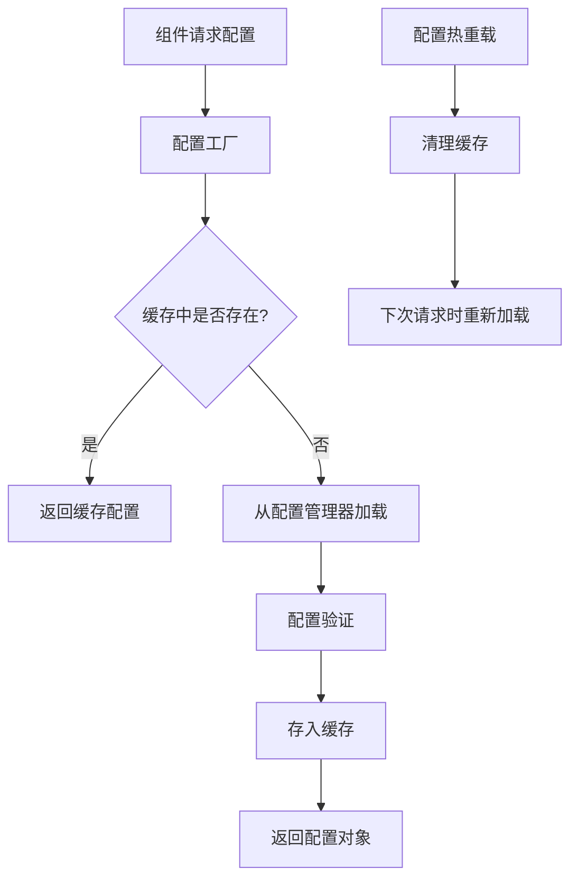

# 多组件共享配置选项解决方案

## 问题描述

在Lorn.ADSP-Rust广告平台中，当多个业务组件使用相同的配置选项结构体（如`AdEngineOptions`），但需要从配置文件的不同节读取不同的配置值时，如何实现配置的灵活绑定和管理？

### 场景举例

- `RTBAdEngineService`需要从`ad_engine.rtb`配置节读取配置
- `DirectSaleAdEngineService`需要从`ad_engine.direct_sale`配置节读取配置  
- `PMPAdEngineService`需要从`ad_engine.pmp`配置节读取配置
- 所有服务都使用相同的`AdEngineOptions`配置结构体

## 解决方案设计

### 方案一：配置绑定属性宏（推荐）

#### 设计理念

使用Rust过程宏（proc_macro）创建`#[config_binding]`属性，让业务组件声明式地指定其配置路径。基础设施通过编译时代码生成和运行时反射自动发现并处理配置绑定，实现真正的零配置扩展。

#### 核心优势

- **零硬编码**：基础设施无需硬编码任何组件信息
- **自动发现**：新增组件时无需修改基础设施代码
- **声明式配置**：配置路径直接标注在组件上，清晰明了
- **编译时验证**：配置路径和类型在编译时验证
- **开闭原则**：对扩展开放，对修改关闭

#### Cargo工作空间中的实现位置

**配置绑定宏实现**:
- 位置：`crates/05-infrastructure/dependency-injection/src/macros/config_binding.rs`
- 功能：定义`#[config_binding]`过程宏
- 依赖：`crates/05-infrastructure/config/`获取配置管理能力

**配置绑定trait定义**:
- 位置：`crates/04-core/shared/src/traits/config_bindable.rs`
- 功能：定义配置绑定基础接口
- 被依赖：所有需要配置绑定的组件crate

#### 配置文件结构设计

**TOML配置文件格式**:
```toml
# config/default.toml
[ad_engine]
[ad_engine.rtb]
register_strategy_services = true
register_callback_services = true
default_timeout_secs = 30
max_retries = 3
enable_performance_monitoring = true
enable_verbose_logging = false

[ad_engine.direct_sale]
register_strategy_services = false
register_callback_services = true
default_timeout_secs = 60
max_retries = 5
enable_performance_monitoring = false
enable_verbose_logging = true

[ad_engine.pmp]
register_strategy_services = true
register_callback_services = false
default_timeout_secs = 15
max_retries = 2
enable_performance_monitoring = true
enable_verbose_logging = false
```

#### 配置绑定宏设计

**宏定义结构**:
```rust
// 位置：crates/05-infrastructure/dependency-injection/src/macros/config_binding.rs
// 宏语法：#[config_binding("config.section.path")]
```

**宏功能设计**:

1. **编译时代码生成**:
   - 自动实现`ConfigBindable` trait
   - 生成配置路径元数据
   - 自动注册到inventory系统

2. **配置路径验证**:
   - 编译时验证配置路径格式
   - 检查配置结构体类型匹配
   - 生成配置绑定元数据

3. **运行时绑定支持**:
   - 提供配置获取逻辑
   - 支持配置热重载通知
   - 集成配置验证机制

#### 业务组件实现指导

**组件声明方式**:
```rust
// 位置：crates/02-services/ad-engine/src/services/rtb_service.rs

use dependency_injection::config_binding;
use shared::traits::ConfigBindable;

#[config_binding("ad_engine.rtb")]
pub struct RTBAdEngineService {
    config: AdEngineOptions,
    // 其他字段...
}

#[config_binding("ad_engine.direct_sale")]  
pub struct DirectSaleAdEngineService {
    config: AdEngineOptions,
    // 其他字段...
}

#[config_binding("ad_engine.pmp")]
pub struct PMPAdEngineService {
    config: AdEngineOptions,
    // 其他字段...
}
```

**自动生成的trait实现**:
```rust
// 编译时自动生成的代码（程序员无需手写）
impl ConfigBindable for RTBAdEngineService {
    type Config = AdEngineOptions;
    
    fn config_path() -> &'static str {
        "ad_engine.rtb"
    }
    
    fn load_config(config_manager: &ConfigManager) -> Result<Self::Config, ConfigError> {
        config_manager.get_config(Self::config_path())
    }
}
```

#### 数据结构设计

**配置绑定元数据**:
```rust
// 位置：crates/04-core/shared/src/models/config_metadata.rs

#[derive(Debug, Clone)]
pub struct ConfigBindingMetadata {
    pub component_name: &'static str,
    pub config_path: &'static str,
    pub config_type: &'static str,
    pub create_instance: fn(&ConfigManager) -> Result<Box<dyn Any>, ConfigError>,
}

inventory::collect!(ConfigBindingMetadata);
```

**配置绑定trait设计**:
```rust
// 位置：crates/04-core/shared/src/traits/config_bindable.rs

pub trait ConfigBindable: Send + Sync {
    type Config: for<'de> serde::Deserialize<'de> + Send + Sync + 'static;
    
    fn config_path() -> &'static str;
    fn load_config(config_manager: &ConfigManager) -> Result<Self::Config, ConfigError>;
    fn validate_config(config: &Self::Config) -> Result<(), ValidationError>;
    fn on_config_changed(&mut self, new_config: Self::Config) -> Result<(), ConfigError>;
}
```

#### 基础设施自动处理设计

**配置绑定发现器**:
```rust
// 位置：crates/05-infrastructure/dependency-injection/src/discovery/config_binding_discovery.rs

pub struct ConfigBindingDiscovery {
    config_manager: Arc<ConfigManager>,
    binding_registry: HashMap<String, ConfigBindingMetadata>,
}

impl ConfigBindingDiscovery {
    pub fn discover_all_bindings() -> Result<Vec<ConfigBindingMetadata>, DiscoveryError> {
        // 从inventory收集所有配置绑定元数据
        inventory::iter::<ConfigBindingMetadata>
            .cloned()
            .collect()
    }
    
    pub fn register_all_config_bindings(&mut self) -> Result<(), RegistrationError> {
        let bindings = Self::discover_all_bindings()?;
        
        for binding in bindings {
            self.register_config_binding(binding)?;
        }
        
        Ok(())
    }
}
```

**组件注册扩展**:
```rust
// 位置：crates/05-infrastructure/dependency-injection/src/extensions/registry_ext.rs

impl ComponentRegistry {
    pub fn register_components_with_config_binding(
        &mut self,
        config_manager: Arc<ConfigManager>
    ) -> Result<(), RegistrationError> {
        
        let discovery = ConfigBindingDiscovery::new(config_manager);
        discovery.register_all_config_bindings()?;
        
        // 自动注册所有带有配置绑定的组件
        for binding in discovery.get_all_bindings() {
            self.register_component_with_config(binding)?;
        }
        
        Ok(())
    }
}
```

### 方案二：配置工厂模式

#### 设计概念

通过配置工厂统一管理多个配置实例，支持按名称获取不同的配置对象。

#### Cargo工作空间实现位置

**配置工厂接口**:
- 位置：`crates/05-infrastructure/config/src/factory/config_factory.rs`
- 功能：定义配置工厂trait和实现
- 依赖：`crates/04-core/shared/`获取共享类型

**工厂实现**:
- 位置：`crates/05-infrastructure/config/src/factory/ad_engine_config_factory.rs`
- 功能：广告引擎配置工厂具体实现
- 特性：配置缓存、延迟加载、热重载支持

#### 配置工厂trait设计

```rust
// 位置：crates/05-infrastructure/config/src/factory/mod.rs

pub trait ConfigFactory<T>: Send + Sync 
where 
    T: for<'de> serde::Deserialize<'de> + Send + Sync + Clone + 'static
{
    fn get_config(&self, name: &str) -> Result<T, ConfigError>;
    fn get_config_with_fallback(&self, name: &str, fallback: &str) -> Result<T, ConfigError>;
    fn invalidate_cache(&self, name: &str);
    fn reload_all(&self) -> Result<(), ConfigError>;
}
```

#### 配置工厂实现指导

**工厂结构设计**:
```rust
// 位置：crates/05-infrastructure/config/src/factory/ad_engine_config_factory.rs

pub struct AdEngineConfigFactory {
    config_manager: Arc<ConfigManager>,
    cache: Arc<RwLock<HashMap<String, AdEngineOptions>>>,
    base_path: String,
}

impl AdEngineConfigFactory {
    pub fn new(config_manager: Arc<ConfigManager>) -> Self {
        Self {
            config_manager,
            cache: Arc::new(RwLock::new(HashMap::new())),
            base_path: "ad_engine".to_string(),
        }
    }
}

impl ConfigFactory<AdEngineOptions> for AdEngineConfigFactory {
    // 实现trait方法...
}
```

**组件使用方式设计**:
```rust
// 位置：crates/02-services/ad-engine/src/services/rtb_service.rs

pub struct RTBAdEngineService {
    config: AdEngineOptions,
    config_factory: Arc<dyn ConfigFactory<AdEngineOptions>>,
}

impl RTBAdEngineService {
    pub fn new(config_factory: Arc<dyn ConfigFactory<AdEngineOptions>>) -> Result<Self, ServiceError> {
        let config = config_factory.get_config("rtb")?;
        
        Ok(Self {
            config,
            config_factory,
        })
    }
    
    pub fn reload_config(&mut self) -> Result<(), ServiceError> {
        self.config = self.config_factory.get_config("rtb")?;
        Ok(())
    }
}
```

### 方案三：命名配置模式

#### 设计概念

通过命名配置系统，为每个组件注册特定名称的配置实例，组件通过名称获取对应配置。

#### 实现位置设计

**命名配置管理器**:
- 位置：`crates/05-infrastructure/config/src/named/named_config_manager.rs`
- 功能：管理命名配置实例
- 特性：类型安全、生命周期管理、配置验证

**命名配置注册器**:
- 位置：`crates/05-infrastructure/dependency-injection/src/registration/named_config_registrar.rs`
- 功能：自动注册命名配置
- 集成：与组件注册器深度集成

#### 命名配置trait设计

```rust
// 位置：crates/04-core/shared/src/traits/named_configurable.rs

pub trait NamedConfigurable: Send + Sync {
    type Config: for<'de> serde::Deserialize<'de> + Send + Sync + 'static;
    
    fn config_name() -> &'static str;
    fn config_base_path() -> &'static str;
    
    fn full_config_path() -> String {
        format!("{}.{}", Self::config_base_path(), Self::config_name())
    }
}
```

#### 命名配置管理器设计

```rust
// 位置：crates/05-infrastructure/config/src/named/named_config_manager.rs

pub struct NamedConfigManager {
    config_manager: Arc<ConfigManager>,
    named_configs: Arc<RwLock<HashMap<String, HashMap<String, Box<dyn Any + Send + Sync>>>>>,
}

impl NamedConfigManager {
    pub fn register_named_config<T, C>(&self) -> Result<(), ConfigError>
    where
        T: NamedConfigurable<Config = C>,
        C: for<'de> serde::Deserialize<'de> + Send + Sync + 'static,
    {
        let config_path = T::full_config_path();
        let config_name = T::config_name();
        
        let config: C = self.config_manager.get_config(&config_path)?;
        
        let mut configs = self.named_configs.write().unwrap();
        let type_configs = configs.entry(std::any::type_name::<C>().to_string())
            .or_insert_with(HashMap::new);
        
        type_configs.insert(config_name.to_string(), Box::new(config));
        
        Ok(())
    }
    
    pub fn get_named_config<C>(&self, name: &str) -> Result<C, ConfigError>
    where
        C: Clone + Send + Sync + 'static,
    {
        let configs = self.named_configs.read().unwrap();
        let type_name = std::any::type_name::<C>();
        
        let type_configs = configs.get(type_name)
            .ok_or_else(|| ConfigError::TypeNotFound(type_name.to_string()))?;
        
        let config_box = type_configs.get(name)
            .ok_or_else(|| ConfigError::NamedConfigNotFound(name.to_string()))?;
        
        config_box.downcast_ref::<C>()
            .cloned()
            .ok_or_else(|| ConfigError::TypeMismatch)
    }
}
```

## 数据流程设计

### 配置绑定数据流

```mermaid
flowchart TD
    A[编译时：#[config_binding]宏] --> B[生成ConfigBindable实现]
    B --> C[注册到inventory系统]
    C --> D[运行时：配置发现器扫描]
    D --> E[从配置文件加载对应配置]
    E --> F[配置验证和类型转换]
    F --> G[组件实例配置注入]
    H[配置文件变更] --> I[热重载处理器]
    I --> J[通知相关组件更新]
```

### 配置工厂数据流



## 错误处理设计

### 配置绑定错误类型

```rust
// 位置：crates/05-infrastructure/config/src/errors.rs

#[derive(Debug, thiserror::Error)]
pub enum ConfigBindingError {
    #[error("配置路径 '{path}' 不存在")]
    PathNotFound { path: String },
    
    #[error("配置类型不匹配：期望 {expected}，实际 {actual}")]
    TypeMismatch { expected: String, actual: String },
    
    #[error("配置绑定验证失败：{reason}")]
    ValidationFailed { reason: String },
    
    #[error("组件 '{component}' 的配置绑定注册失败")]
    RegistrationFailed { component: String },
    
    #[error("配置热重载失败：{source}")]
    HotReloadFailed { source: Box<dyn std::error::Error + Send + Sync> },
}
```

### 配置工厂错误类型

```rust
// 位置：crates/05-infrastructure/config/src/factory/errors.rs

#[derive(Debug, thiserror::Error)]
pub enum ConfigFactoryError {
    #[error("配置名称 '{name}' 不存在")]
    ConfigNotFound { name: String },
    
    #[error("配置缓存操作失败")]
    CacheOperationFailed,
    
    #[error("配置重载失败：{reason}")]
    ReloadFailed { reason: String },
    
    #[error("配置工厂初始化失败")]
    InitializationFailed,
}
```

## 性能优化设计

### 编译时优化

1. **宏展开优化**：配置绑定宏在编译时生成最小化代码
2. **静态配置路径**：配置路径编译时确定，无运行时字符串操作
3. **类型擦除避免**：通过泛型避免运行时类型检查开销

### 运行时优化

1. **配置缓存**：配置一次加载，多次使用，减少重复解析
2. **惰性加载**：按需加载配置，避免启动时加载所有配置
3. **读写锁优化**：使用parking_lot提供的高性能读写锁

### 内存优化

1. **配置共享**：相同配置在内存中只保存一份
2. **智能指针**：使用Arc进行高效的配置共享
3. **缓存清理**：定期清理未使用的配置缓存

## 集成指导

### 在广告投放引擎中的应用

**RTB服务配置绑定**:
```rust
// 位置：crates/02-services/ad-engine/src/services/rtb_service.rs

#[config_binding("ad_engine.rtb")]
pub struct RTBAdEngineService {
    config: AdEngineOptions,
    // ... 其他字段
}

impl RTBAdEngineService {
    pub fn new() -> Result<Self, ServiceError> {
        // 配置自动通过宏绑定加载
        let config = Self::load_config()?;
        
        Ok(Self {
            config,
            // ... 初始化其他字段
        })
    }
}
```

**直销服务配置绑定**:
```rust
// 位置：crates/02-services/ad-engine/src/services/direct_sale_service.rs

#[config_binding("ad_engine.direct_sale")]
pub struct DirectSaleAdEngineService {
    config: AdEngineOptions,
    // ... 其他字段
}
```

### 在微服务启动中的集成

**服务启动流程**:
```rust
// 位置：crates/02-services/ad-engine/src/main.rs

#[tokio::main]
async fn main() -> Result<(), Box<dyn std::error::Error>> {
    // 1. 初始化配置管理器
    let config_manager = ConfigManager::new().await?;
    
    // 2. 创建组件注册表
    let mut registry = ComponentRegistry::new();
    
    // 3. 自动发现和注册所有带配置绑定的组件
    registry.register_components_with_config_binding(Arc::new(config_manager)).await?;
    
    // 4. 启动所有组件
    registry.start_all_components().await?;
    
    // 5. 等待关闭信号
    tokio::signal::ctrl_c().await?;
    
    Ok(())
}
```

这个解决方案确保了Lorn.ADSP-Rust项目在多组件共享配置选项方面的灵活性、高性能和可维护性，同时充分利用了Rust语言的编译时优化和类型安全特性。

## 推荐方案选择

**推荐使用方案一（配置绑定宏）**，因为：

1. **扩展性强**：新增组件只需添加宏标注，无需修改基础设施
2. **零硬编码**：配置路径直接标注在组件上
3. **自动发现**：基础设施通过inventory自动处理
4. **编译时优化**：充分利用Rust编译时优化能力
5. **开闭原则**：符合开闭原则，对扩展开放，对修改关闭
6. **类型安全**：利用Rust类型系统在编译时保证配置类型正确性

这种方案最符合当前Lorn.ADSP-Rust项目的配置化和依赖注入架构设计理念，充分发挥了Rust语言的优势。
        // 通过工厂获取特定名称的配置
        _options = optionsFactory.GetOptions("Primary");
        _logger = logger;
    }

