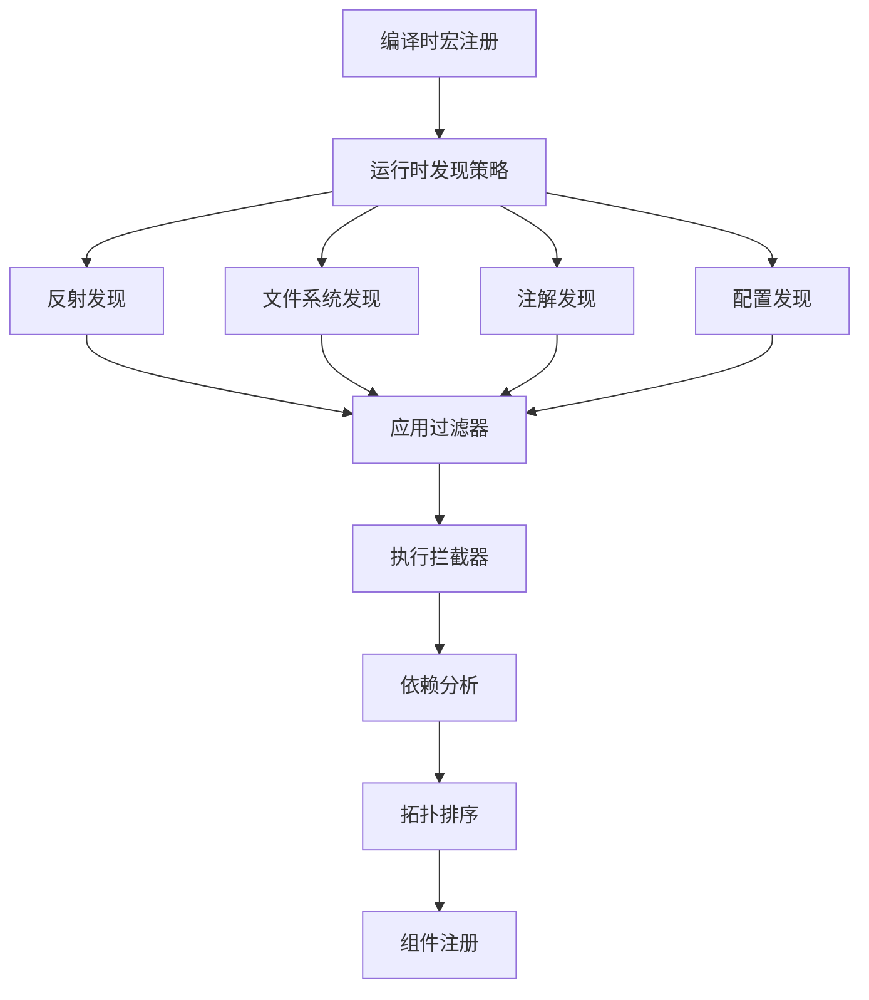

# 组件发现机制改进实现

## 概述

本次改进完善了组件发现机制，实现了以下核心功能：

### ✅ 已完成的功能

#### 1. 使用过程宏实现编译时组件注册

创建了 `component-macros` crate，提供以下过程宏：

- **`#[component]`** - 自动注册组件到全局注册表
- **`#[inject]`** - 标记依赖注入字段
- **`#[service_provider]`** - 标记服务提供者方法
- **`#[component_factory]`** - 标记组件工厂函数
- **`#[derive(Component)]`** - 自动发现派生宏

```rust
// 使用示例
#[component]
pub struct UserService {
    #[inject]
    user_repository: Arc<dyn UserRepository>,
}

#[service_provider]
impl UserService {
    pub fn create_service() -> Arc<UserService> {
        // 工厂逻辑
    }
}
```

#### 2. 实现基于反射的组件发现

在 `infrastructure-common/src/discovery.rs` 中实现：

- **`ComponentDiscovery` trait** - 组件发现抽象接口
- **`ReflectionComponentDiscovery`** - 基于反射的发现实现
- **`FileSystemComponentDiscovery`** - 基于文件系统的发现
- **`AnnotationComponentDiscovery`** - 基于注解的发现
- **`ConfigurationComponentDiscovery`** - 基于配置的发现

```rust
// 使用示例
let discovery = ReflectionComponentDiscovery::new();
let components = discovery.discover_components().await?;
```

#### 3. 添加组件依赖关系分析

实现了完整的依赖分析系统：

- **`DependencyGraph`** - 依赖关系图
- **循环依赖检测** - 防止依赖循环
- **拓扑排序** - 确定组件启动顺序
- **依赖验证** - 检查缺失的依赖

```rust
// 使用示例
let mut graph = DependencyGraph::new();
graph.add_dependency(service_type, repo_type)?;

// 检测循环依赖
match graph.detect_cycles() {
    Ok(_) => println!("无循环依赖"),
    Err(cycles) => println!("发现循环依赖: {:?}", cycles),
}

// 获取启动顺序
let startup_order = graph.topological_sort()?;
```

#### 4. 增强组件扫描器

在 `infrastructure-composition/src/enhanced_component_scanner.rs` 中实现：

- **`ComponentFilter`** - 组件过滤器接口
- **`ComponentInterceptor`** - 组件拦截器接口
- **`AdvancedComponentManager`** - 高级组件管理器
- **多种发现策略** - 支持多种组件发现方式

```rust
// 使用示例
let mut scanner = ComponentScannerImpl::new();
scanner.add_filter(Box::new(ScopeFilter::new(scopes)));
scanner.add_interceptor(Box::new(LoggingInterceptor));

let components = scanner.scan("target_module").await?;
```

## 架构设计

### 组件发现流程



### 类型系统增强

- **`TypeInfo`** 新增 `Hash`, `Eq`, `PartialEq` 特性支持 HashMap 存储
- **`ComponentScope`** 新增 `Hash` 特性支持 HashSet 操作
- **改进错误处理** 新增 `CircularDependency` 错误变体

### 模块组织

```
crates/
├── 05-infrastructure/
│   ├── common/src/
│   │   ├── discovery.rs      # 组件发现核心实现
│   │   ├── metadata.rs       # 类型信息增强
│   │   └── errors.rs         # 错误类型扩展
│   └── composition/src/
│       └── enhanced_component_scanner.rs  # 增强扫描器
└── 09-tools/
    └── component-macros/src/
        └── lib.rs            # 编译时宏实现
```

## 使用指南

### 1. 基本组件注册

```rust
use component_macros::component;

#[component]
pub struct MyService {
    // 组件字段
}
```

### 2. 依赖注入

```rust
use component_macros::{component, inject};

#[component]
pub struct UserService {
    #[inject]
    repository: Arc<dyn UserRepository>,
}
```

### 3. 服务提供者

```rust
use component_macros::service_provider;

#[service_provider]
impl UserService {
    pub fn create() -> Arc<UserService> {
        // 创建逻辑
    }
}
```

### 4. 组件发现

```rust
use infrastructure_composition::enhanced_component_scanner::ComponentScannerImpl;

let mut scanner = ComponentScannerImpl::new();
let components = scanner.scan("my_module").await?;
```

### 5. 依赖分析

```rust
use infrastructure_common::discovery::DependencyGraph;

let mut graph = DependencyGraph::new();
graph.add_dependency(service_type, dependency_type)?;
let order = graph.topological_sort()?;
```

## 示例代码

完整的示例代码请参见：
- `examples/component_discovery_demo.rs` - 完整功能演示
- 包含用户管理系统的完整示例
- 展示所有组件发现功能的使用

## 技术特性

### 编译时特性
- ✅ 自动组件注册
- ✅ 依赖注入代码生成
- ✅ 零运行时开销的宏展开

### 运行时特性
- ✅ 多策略组件发现
- ✅ 灵活的过滤和拦截机制
- ✅ 完整的依赖关系分析
- ✅ 循环依赖检测和拓扑排序

### 类型安全
- ✅ 编译时类型检查
- ✅ 强类型的组件元数据
- ✅ 泛型支持和 trait 约束

## 性能优化

1. **编译时优化** - 使用过程宏在编译时生成注册代码
2. **延迟初始化** - 组件按需发现和初始化
3. **缓存机制** - 发现结果缓存避免重复扫描
4. **内存优化** - 使用 Arc 和 HashMap 高效存储

## 扩展性

系统设计支持轻松扩展：

1. **自定义发现策略** - 实现 `ComponentDiscovery` trait
2. **自定义过滤器** - 实现 `ComponentFilter` trait
3. **自定义拦截器** - 实现 `ComponentInterceptor` trait
4. **自定义过程宏** - 扩展编译时注册逻辑

## 最佳实践

1. **组件命名** - 使用清晰的命名约定
2. **依赖设计** - 避免循环依赖
3. **作用域管理** - 合理选择组件生命周期
4. **错误处理** - 使用 Result 类型处理发现错误

## 下一步计划

- [ ] 实现自动依赖注入容器
- [ ] 添加 AOP (面向切面编程) 支持
- [ ] 集成配置管理系统
- [ ] 实现组件生命周期管理
- [ ] 添加性能监控和度量
