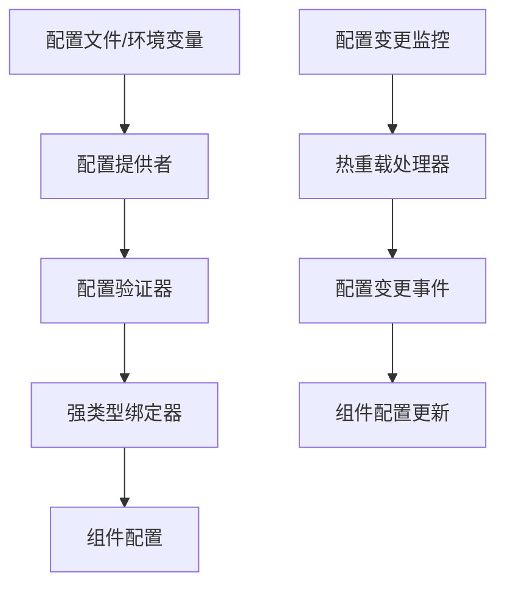
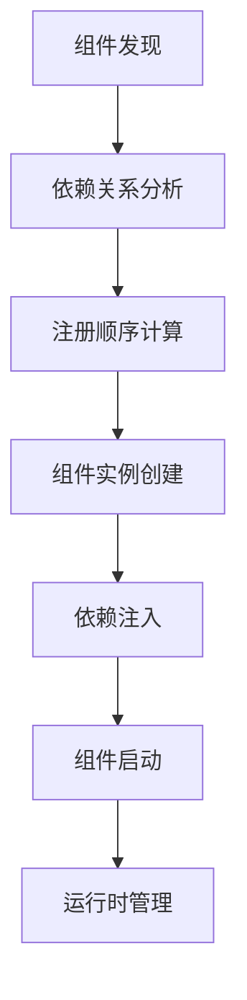

# 统一配置化和依赖注入架构设计

## 设计目标

为 Lorn.ADSP-Rust 广告平台设计一个统一的配置管理和依赖注入基础设施，解决当前系统中配置和组件注册分散、缺乏标准的问题。

### 核心目标

- **统一配置管理**：提供标准化的配置加载、验证、热重载机制，基于serde和config crate
- **统一组件注册**：提供标准化的组件发现、注册、生命周期管理，基于trait系统
- **零成本扩展**：新增配置项和组件时无需修改基础设施代码，编译时优化
- **开箱即用**：基于约定和宏系统，自动完成配置绑定和组件注册
- **内存安全**：基于Rust所有权模型，编译时保证内存安全
- **高性能**：零成本抽象和异步优先设计，支持高并发处理

## Cargo工作空间组织架构

根据Lorn.ADSP-Rust项目的工作空间结构，配置化和依赖注入基础设施位于以下crate中：

### 基础设施Crate结构设计

```text
crates/05-infrastructure/
├── config/                                      # 配置管理基础设施
│   ├── src/
│   │   ├── lib.rs                              # 配置管理统一入口
│   │   ├── providers/                          # 配置提供者模块
│   │   │   ├── mod.rs                          # 提供者模块声明
│   │   │   ├── toml_provider.rs                # TOML文件配置提供者
│   │   │   ├── env_provider.rs                 # 环境变量配置提供者
│   │   │   ├── consul_provider.rs              # Consul配置中心提供者
│   │   │   └── composite_provider.rs           # 多源配置组合提供者
│   │   ├── validation/                         # 配置验证模块
│   │   │   ├── mod.rs                          # 验证模块声明
│   │   │   ├── validator.rs                    # 核心配置验证器
│   │   │   ├── rule_engine.rs                  # 配置验证规则引擎
│   │   │   └── result.rs                       # 验证结果数据模型
│   │   ├── binding/                            # 配置绑定模块
│   │   │   ├── mod.rs                          # 绑定模块声明
│   │   │   ├── typed_binder.rs                 # 强类型配置绑定器
│   │   │   ├── convention_binder.rs            # 约定式配置绑定器
│   │   │   └── change_tracker.rs               # 配置变更跟踪器
│   │   ├── extensions/                         # 配置扩展trait模块
│   │   │   ├── mod.rs                          # 扩展模块声明
│   │   │   └── config_builder_ext.rs           # 配置构建器扩展trait
│   │   └── models/                             # 配置数据模型
│   │       ├── mod.rs                          # 模型模块声明
│   │       ├── schema.rs                       # 配置架构定义
│   │       ├── metadata.rs                     # 配置元数据模型
│   │       └── options.rs                      # 基础配置选项
│   └── Cargo.toml                              # 配置管理crate依赖
└── dependency-injection/                       # 依赖注入基础设施
    ├── src/
    │   ├── lib.rs                              # 依赖注入统一入口
    │   ├── discovery/                          # 组件发现模块
    │   │   ├── mod.rs                          # 发现模块声明
    │   │   ├── crate_scanner.rs                # 工作空间Crate扫描器
    │   │   ├── convention_discovery.rs         # 约定式组件发现器
    │   │   └── metadata_filter.rs              # 组件元数据过滤器
    │   ├── registration/                       # 组件注册模块
    │   │   ├── mod.rs                          # 注册模块声明
    │   │   ├── registry_builder.rs             # 组件注册表构建器
    │   │   ├── batch_registrar.rs              # 批量组件注册器
    │   │   └── lifecycle_manager.rs            # 组件生命周期管理器
    │   ├── macros/                             # 依赖注入宏定义
    │   │   ├── mod.rs                          # 宏模块声明
    │   │   ├── component.rs                    # 组件声明宏
    │   │   ├── config_binding.rs               # 配置绑定宏
    │   │   └── dependency.rs                   # 依赖声明宏
    │   ├── extensions/                         # 依赖注入扩展trait
    │   │   ├── mod.rs                          # 扩展模块声明
    │   │   └── registry_ext.rs                 # 组件注册扩展trait
    │   └── models/                             # 组件模型
    │       ├── mod.rs                          # 模型模块声明
    │       ├── descriptor.rs                   # 组件描述符
    │       ├── metadata.rs                     # 组件元数据
    │       └── options.rs                      # 组件注册选项
    └── Cargo.toml                              # 依赖注入crate依赖
```

## 核心Crate依赖关系设计

### config crate依赖设计

**Crate位置**: `crates/05-infrastructure/config/`

**依赖关系**:

- **向下依赖**:
  - `crates/04-core/shared/` - 获取共享类型定义和常量
  - 外部crate：`config = "0.14"`, `serde = "1.0"`, `toml = "0.8"`, `tokio = "1.0"`, `notify = "6.0"`

- **被依赖关系**:
  - `crates/05-infrastructure/dependency-injection/` - 依赖注入需要配置管理
  - 所有业务服务crate（`crates/02-services/`下的所有crate）
  - 所有应用层crate（`crates/01-presentation/`下的所有crate）

**功能职责**:

1. **配置提供者管理**：统一管理TOML文件、环境变量、Consul配置中心等多种配置源
2. **强类型配置绑定**：基于serde自动将配置映射到Rust结构体
3. **配置验证机制**：提供配置完整性和有效性验证
4. **热重载支持**：监控配置文件变更并自动重新加载
5. **配置合并策略**：支持多层级配置的优先级合并

**输入参数设计**:

- `ConfigurationSource` 枚举 - 配置源类型（文件路径、环境变量前缀、Consul地址）
- `ValidationRules` 结构体 - 配置验证规则集合
- `WatchOptions` 结构体 - 热重载监听配置选项
- `MergeStrategy` 枚举 - 配置合并策略

**输出格式设计**:

- `ConfigurationResult<T>` 泛型结果类型 - 包含配置对象或错误信息
- `ConfigChangeEvent` 枚举 - 配置变更事件通知
- `ValidationReport` 结构体 - 配置验证详细报告

### dependency-injection crate依赖设计

**Crate位置**: `crates/05-infrastructure/dependency-injection/`

**依赖关系**:

- **向下依赖**:
  - `crates/05-infrastructure/config/` - 获取配置管理能力
  - `crates/04-core/shared/` - 获取共享trait定义
  - 外部crate：`tokio = "1.0"`, `async-trait = "0.1"`, `once_cell = "1.19"`, `parking_lot = "0.12"`

- **被依赖关系**:
  - 所有需要依赖注入的业务crate
  - 所有微服务crate（`crates/02-services/`下的所有crate）

**功能职责**:

1. **组件自动发现**：基于约定扫描工作空间中的所有组件
2. **批量组件注册**：支持crate级别的批量组件注册
3. **生命周期管理**：管理组件的创建、启动、停止、销毁
4. **依赖解析**：自动解析组件间的依赖关系
5. **配置自动绑定**：组件注册时自动绑定对应配置

**输入参数设计**:

- `ComponentDescriptor` 结构体 - 组件描述信息（名称、类型、依赖等）
- `LifecycleOptions` 结构体 - 组件生命周期管理选项
- `RegistrationOptions` 结构体 - 组件注册配置选项
- `DependencyGraph` 结构体 - 组件依赖关系图

**输出格式设计**:

- `ComponentRegistry` 结构体 - 组件注册表，包含所有已注册组件
- `InstanceResult<T>` 泛型结果类型 - 组件实例或创建错误
- `LifecycleState` 枚举 - 组件当前生命周期状态

## 核心设计理念

### 1. 配置管理是基础设施，不是业务扩展点

**设计原则**:
- 配置管理应该是完整的、开箱即用的基础设施
- 新增配置项时，只需添加配置内容，无需修改配置管理代码
- 通过约定和serde宏实现零成本的自动绑定

**实现指导**:
- 在`crates/05-infrastructure/config/src/lib.rs`中实现`ConfigurationManager`结构体作为核心配置管理器
- 不使用trait抽象，而是提供具体的配置管理实现
- 通过约定自动处理各种配置类型（如：`AdEngineConfig`自动映射到`ad_engine`配置节）

### 2. 依赖注入是组件组装工具，不是业务逻辑

**设计原则**:
- 依赖注入应该是智能的组件组装器
- 新增组件时，只需实现trait，无需修改注册代码
- 通过编译时宏和约定实现自动发现和注册

**实现指导**:
- 在`crates/05-infrastructure/dependency-injection/src/lib.rs`中实现`ComponentRegistry`作为通用组件注册器
- 通过trait约束和约定处理所有类型的组件
- 使用inventory crate在编译时收集组件信息

### 3. 基于约定的零成本设计

**约定规范设计**:

1. **配置约定**:
   - 配置结构体必须以`Config`结尾
   - 配置文件按环境分层：`config/default.toml`, `config/production.toml`
   - 环境变量以`ADSP_`为前缀

2. **组件约定**:
   - 组件结构体必须实现`Component` trait
   - 组件名称自动从类型名推导（如：`AdEngineService` -> `ad_engine_service`）
   - 配置自动按组件名称绑定

### 4. Rust特有的设计原则

**内存安全优先**:
- 基于Rust所有权模型，编译时保证内存安全
- 使用Arc<RwLock<T>>进行线程安全的组件共享
- 通过类型系统防止数据竞争

**零成本抽象**:
- 编译时展开所有配置和组件绑定逻辑
- 基于trait的静态分发，避免虚函数调用开销
- 宏系统实现编译时代码生成

**异步优先**:
- 所有配置加载和组件初始化都是异步的
- 基于Tokio异步运行时，支持高并发处理
- 异步配置热重载和组件生命周期管理

## 核心Trait设计

### 配置管理相关Trait

**Configurable Trait**:
```rust
// 位置：crates/04-core/shared/src/traits/configurable.rs
pub trait Configurable {
    type Config: for<'de> serde::Deserialize<'de> + Send + Sync + 'static;
    
    fn config_key() -> &'static str;
    fn validate_config(config: &Self::Config) -> Result<(), ValidationError>;
    fn on_config_changed(&mut self, new_config: Self::Config) -> Result<(), ConfigError>;
}
```

**实现指导**:
- 所有需要配置的组件都必须实现此trait
- `Config`关联类型指定配置结构体类型
- `config_key()`返回配置节名称
- `validate_config()`提供配置验证逻辑
- `on_config_changed()`处理配置热重载

### 依赖注入相关Trait

**Component Trait**:
```rust
// 位置：crates/04-core/shared/src/traits/component.rs
#[async_trait::async_trait]
pub trait Component: Send + Sync {
    fn name(&self) -> &'static str;
    async fn start(&mut self) -> Result<(), ComponentError>;
    async fn stop(&mut self) -> Result<(), ComponentError>;
    fn health_check(&self) -> HealthStatus;
}
```

**实现指导**:
- 所有可管理的组件都必须实现此trait
- `name()`返回组件唯一标识
- `start()`和`stop()`管理组件生命周期
- `health_check()`提供组件健康状态

**Injectable Trait**:
```rust
// 位置：crates/04-core/shared/src/traits/injectable.rs
pub trait Injectable: Component {
    type Dependencies: DependencyBundle;
    
    fn new(dependencies: Self::Dependencies) -> Result<Self, InjectionError>
    where
        Self: Sized;
    
    fn dependency_names() -> Vec<&'static str>;
}
```

**实现指导**:
- 需要依赖注入的组件实现此trait
- `Dependencies`关联类型指定依赖包
- `new()`接收依赖并创建组件实例
- `dependency_names()`返回依赖组件名称列表

## 宏系统设计

### 组件声明宏

**component!宏设计**:
```rust
// 位置：crates/05-infrastructure/dependency-injection/src/macros/component.rs
// 宏语法：component!(ComponentName, dependencies: [dep1, dep2], config: ConfigType)
```

**宏功能**:
- 自动实现`Component`和`Injectable` trait
- 自动生成依赖解析逻辑
- 自动注册组件到inventory系统

**实现指导**:
- 使用proc_macro生成trait实现代码
- 在编译时检查依赖关系的有效性
- 生成组件元数据用于运行时发现

### 配置绑定宏

**config_binding!宏设计**:
```rust
// 位置：crates/05-infrastructure/dependency-injection/src/macros/config_binding.rs
// 宏语法：config_binding!(ComponentName, "config.section.path")
```

**宏功能**:
- 自动从配置管理器获取配置
- 自动处理配置验证和错误处理
- 支持配置热重载通知

**实现指导**:
- 生成配置获取和绑定代码
- 自动处理配置类型转换
- 集成配置验证逻辑

## 数据流程设计

### 配置管理数据流



**数据流说明**:
1. 配置源（文件、环境变量、Consul）通过提供者统一加载
2. 配置验证器验证配置完整性和有效性
3. 强类型绑定器将配置映射到Rust结构体
4. 组件通过配置绑定获取所需配置
5. 配置变更监控检测配置文件变化
6. 热重载处理器处理配置更新
7. 向相关组件发送配置变更事件

### 依赖注入数据流



**数据流说明**:
1. 组件发现器扫描工作空间中的所有组件
2. 依赖关系分析器构建组件依赖图
3. 注册顺序计算器确定组件创建顺序
4. 按依赖顺序创建组件实例
5. 将依赖组件注入到目标组件
6. 按顺序启动所有组件
7. 运行时管理组件生命周期

## 错误处理设计

### 配置错误类型

**ConfigurationError枚举设计**:
- `SourceNotFound` - 配置源不存在
- `ParseError` - 配置解析错误
- `ValidationError` - 配置验证失败
- `BindingError` - 配置绑定错误
- `WatchError` - 配置监控错误

### 依赖注入错误类型

**InjectionError枚举设计**:
- `ComponentNotFound` - 组件未找到
- `CircularDependency` - 循环依赖
- `DependencyResolutionFailed` - 依赖解析失败
- `LifecycleError` - 生命周期管理错误
- `RegistrationError` - 组件注册错误

## 性能优化设计

### 编译时优化

1. **零成本配置绑定**：通过宏在编译时生成配置绑定代码
2. **静态依赖解析**：在编译时确定组件依赖关系
3. **内联优化**：小函数自动内联以减少函数调用开销

### 运行时优化

1. **配置缓存**：配置一次加载，多次使用，避免重复解析
2. **组件池化**：频繁创建的组件使用对象池减少内存分配
3. **异步并发**：组件初始化和配置加载并发执行

### 内存优化

1. **所有权管理**：通过Rust所有权模型避免不必要的克隆
2. **引用计数**：使用Arc进行高效的共享所有权
3. **读写锁优化**：使用parking_lot提供的高性能读写锁

## 集成指导

### 在广告投放引擎中的应用

**组件注册示例**:
在`crates/02-services/ad-engine/src/lib.rs`中：
- 实现`Component`和`Injectable` trait
- 使用`component!`宏声明组件
- 使用`config_binding!`宏绑定配置

**配置管理示例**:
在`crates/02-services/ad-engine/src/config.rs`中：
- 定义`AdEngineConfig`结构体
- 实现`Configurable` trait
- 配置自动从`ad_engine`节加载

### 在微服务中的应用

**服务启动流程**:
1. 创建`ConfigurationManager`实例
2. 加载所有配置并验证
3. 创建`ComponentRegistry`实例
4. 发现并注册所有组件
5. 解析依赖关系并创建组件实例
6. 按顺序启动所有组件

**服务停止流程**:
1. 接收停止信号
2. 按反向依赖顺序停止组件
3. 清理资源和连接
4. 退出服务进程

这个架构设计确保了Lorn.ADSP-Rust项目在配置管理和依赖注入方面的统一性、高性能和可维护性，同时充分利用了Rust语言的内存安全和零成本抽象特性。
