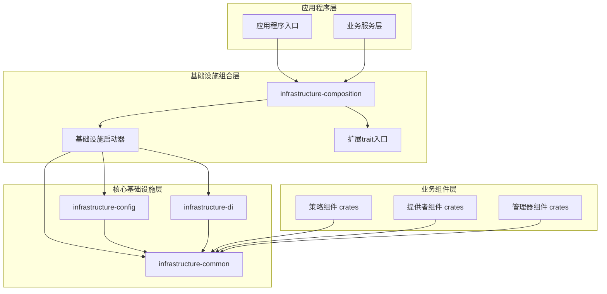
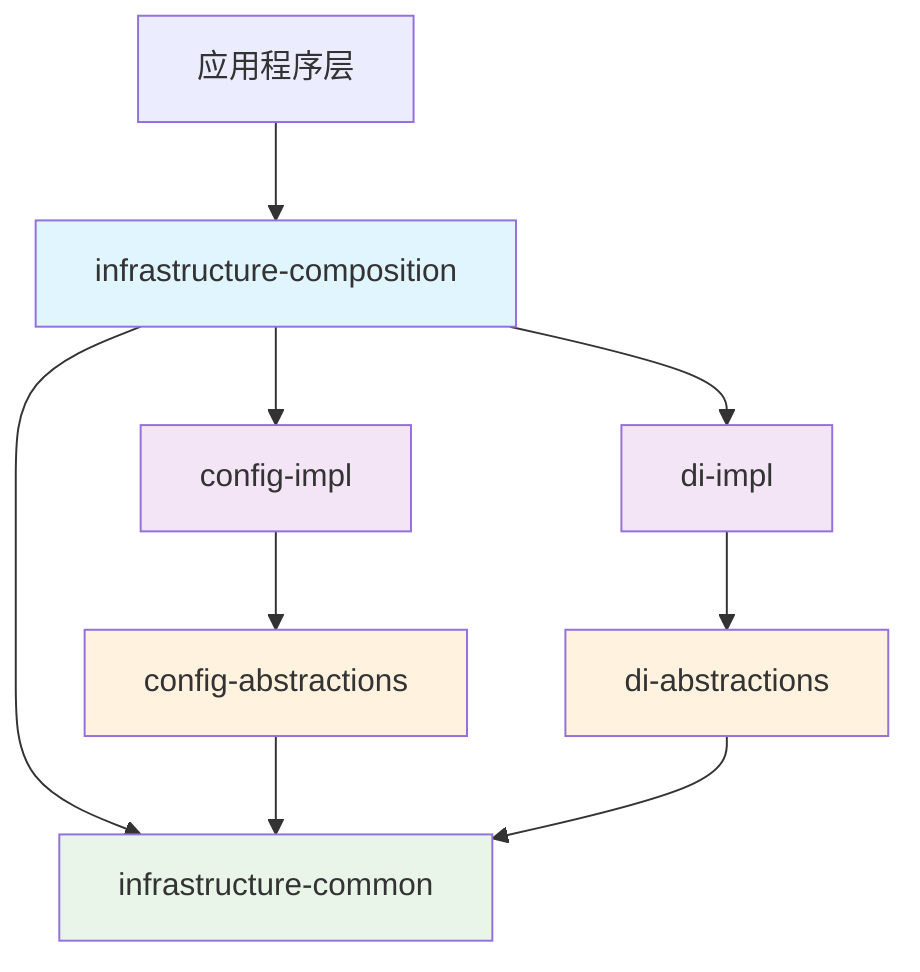
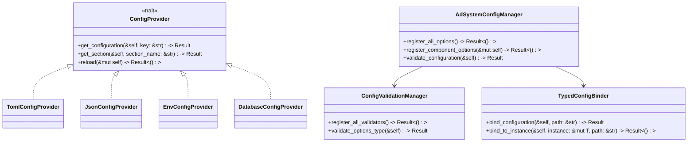
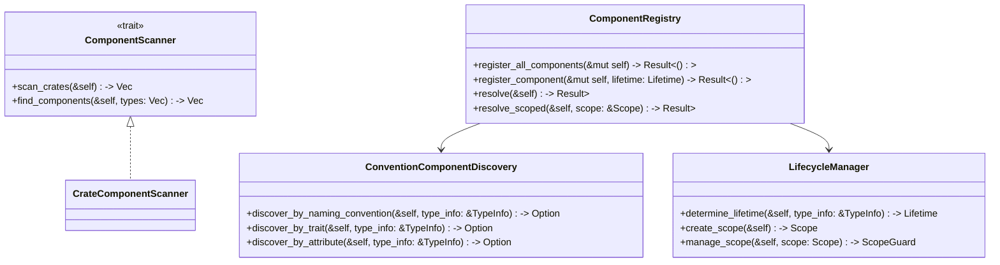
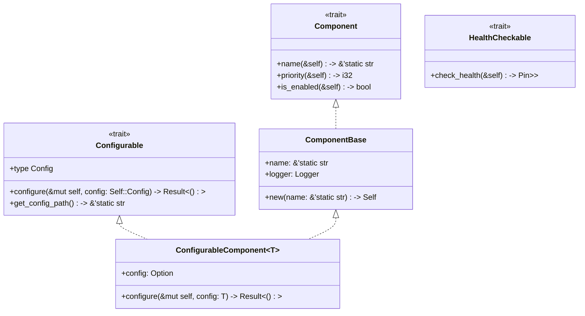
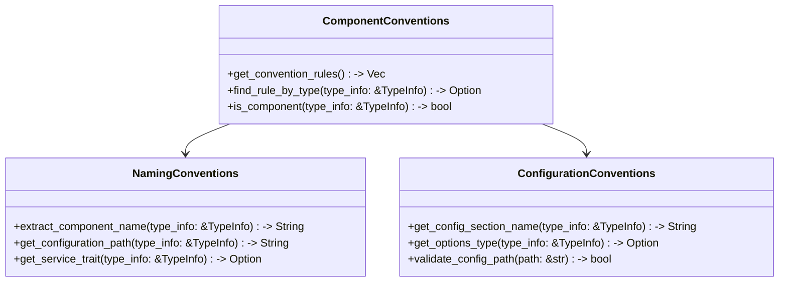
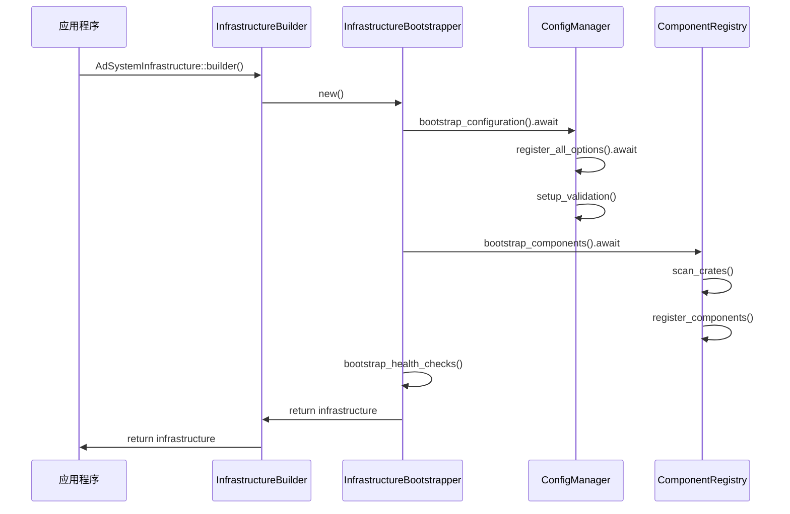
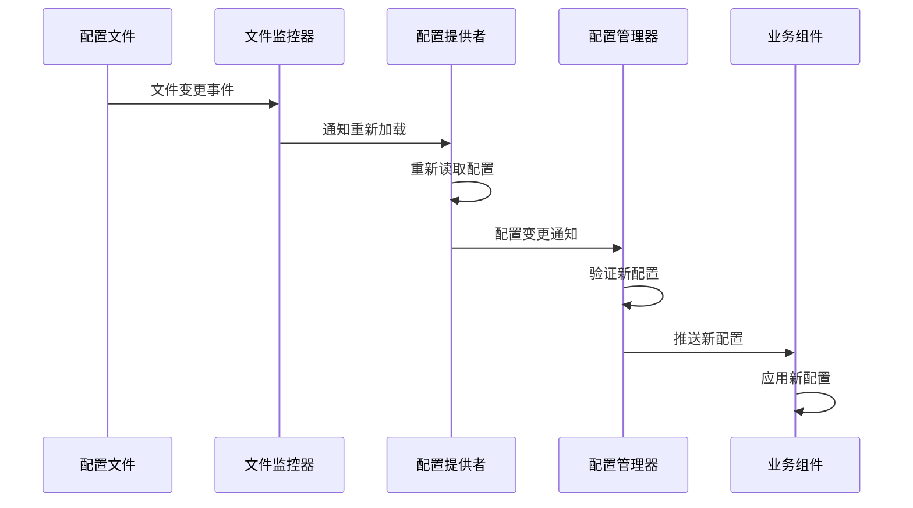
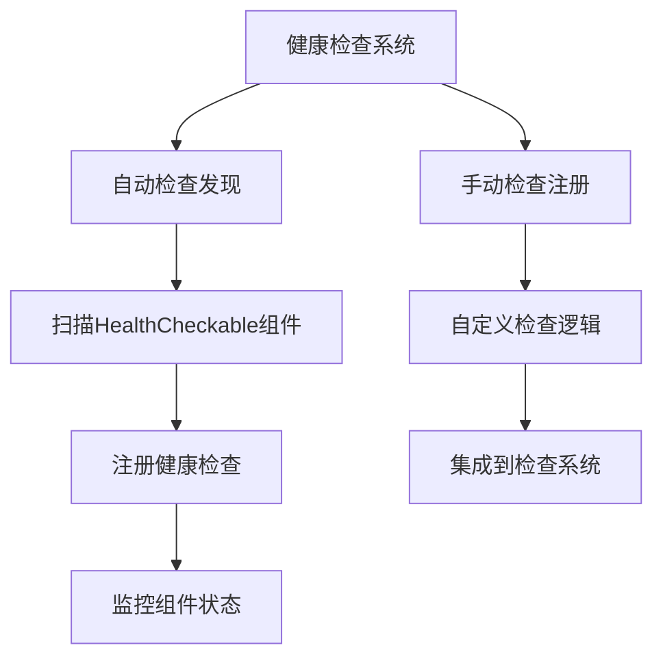
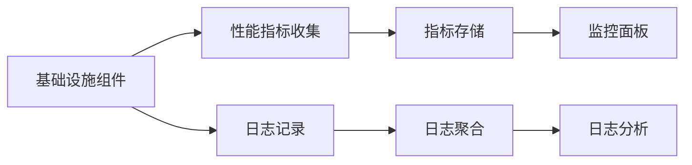

# 统一配置化和依赖注入架构设计 (Rust版本)

## 设计目标

为 Lorn.ADSP-Rust 广告平台设计一个统一的配置管理和依赖注入基础设施，基于Rust语言特性和现代Rust生态系统，解决当前系统中配置和组件注册分散、缺乏标准的问题。

**核心目标**：

- **统一配置管理**：基于 `serde` 和 `config` crate 提供标准化的配置加载、验证、热重载机制
- **统一组件注册**：基于 trait 和宏系统提供标准化的组件发现、注册、生命周期管理
- **零配置扩展**：基于 Rust 过程宏和约定，新增配置项和组件时无需修改基础设施代码
- **类型安全**：利用 Rust 强类型系统在编译时保证配置和依赖注入的正确性
- **内存安全**：基于 Rust 所有权模型，避免运行时错误和内存泄漏
- **异步优先**：基于 Tokio 异步运行时，支持异步配置加载和组件初始化

## 系统架构设计

### 整体架构视图



### Cargo工作空间结构

**Cargo工作空间中的crate组织结构**：

```text
crates/
├── 05-infrastructure/
│   ├── config-abstractions/           # 配置管理抽象层
│   ├── config-impl/                   # 配置管理实现
│   ├── di-abstractions/               # 依赖注入抽象层  
│   ├── di-impl/                       # 依赖注入实现
│   ├── composition/                   # 基础设施组合层
│   └── common/                        # 公共基础设施
└── 04-core/
    └── shared/                        # 全局共享组件
```

### Crate依赖关系设计



**依赖关系说明**：

1. **应用程序层** → 仅依赖组合层 crate，避免直接依赖多个基础设施 crate
2. **组合层** → 依赖所有核心基础设施实现 crate，负责协调和组装
3. **配置管理实现 crate** → 依赖配置抽象层和公共基础设施，提供具体的配置管理能力
4. **依赖注入实现 crate** → 依赖DI抽象层和公共基础设施，提供具体的组件注册能力
5. **抽象层 crate** → 依赖公共基础设施，定义 trait 和接口
6. **公共基础设施 crate** → 不依赖其他项目，提供基础 trait 和约定

### 核心组件设计

#### 1. 配置管理组件设计

**Crate位置**：`crates/05-infrastructure/config-impl/`

**主要职责**：

- 多源配置支持（TOML、JSON、环境变量、数据库、命令行）
- 基于 `serde` 的强类型配置绑定
- 配置验证和错误处理
- 基于 `notify` crate 的配置热重载机制
- 配置加密和安全存储

**关键组件设计**：



**核心 Trait 定义**：

```rust
// 配置提供者 trait
#[async_trait]
pub trait ConfigProvider: Send + Sync {
    async fn get_configuration(&self, key: &str) -> Result<serde_json::Value, ConfigError>;
    async fn get_section(&self, section_name: &str) -> Result<ConfigSection, ConfigError>;
    async fn reload(&mut self) -> Result<(), ConfigError>;
}

// 可配置组件 trait
pub trait Configurable {
    type Config: for<'de> Deserialize<'de> + Serialize + Clone + Send + Sync;
    
    fn configure(&mut self, config: Self::Config) -> Result<(), ConfigError>;
    fn get_config_path() -> &'static str;
}

// 配置验证 trait
pub trait ConfigValidator<T> {
    fn validate(&self, config: &T) -> Result<(), ValidationError>;
}
```

**输入输出设计**：

- **输入**：TOML/JSON配置文件路径、环境变量、数据库连接信息
- **输出**：强类型配置结构体、配置验证结果、配置变更事件流

#### 2. 依赖注入组件设计

**Crate位置**：`crates/05-infrastructure/di-impl/`

**主要职责**：

- Crate扫描和组件发现
- 基于约定和过程宏的自动注册
- 生命周期管理（Singleton、Scoped、Transient）
- 条件注册和环境适配
- 装饰器模式和中间件支持

**关键组件设计**：



**核心 Trait 定义**：

```rust
// 组件基础 trait
pub trait Component: Send + Sync {
    fn name(&self) -> &'static str;
    fn priority(&self) -> i32 { 0 }
}

// 组件注册 trait
pub trait Injectable: Send + Sync + 'static {
    type Dependencies;
    
    fn inject(deps: Self::Dependencies) -> Result<Self, DependencyError>
    where
        Self: Sized;
}

// 生命周期标记 trait
pub trait Singleton: Injectable {}
pub trait Scoped: Injectable {}
pub trait Transient: Injectable {}

// 组件描述符
#[derive(Debug, Clone)]
pub struct ComponentDescriptor {
    pub name: String,
    pub type_id: TypeId,
    pub lifetime: Lifetime,
    pub factory: ComponentFactory,
}

// 组件工厂
pub type ComponentFactory = Box<dyn Fn(&Container) -> Result<Box<dyn Any + Send + Sync>, DependencyError> + Send + Sync>;
```

**过程宏支持**：

```rust
// 自动注册宏
#[component(singleton)]
pub struct UserService {
    user_repo: Arc<dyn UserRepository>,
}

// 配置绑定宏
#[configurable("ad_engine.user_service")]
#[component(singleton)]
pub struct UserServiceConfig {
    pub cache_size: usize,
    pub timeout_seconds: u64,
}

// 条件注册宏
#[component(singleton)]
#[conditional_on_property("features.user_service_enabled", true)]
pub struct ConditionalUserService {
    // ...
}
```

**输入输出设计**：

- **输入**：Crate集合、组件类型信息、配置数据
- **输出**：服务描述符、注册结果、依赖关系图

#### 3. 公共基础设施设计

**Crate位置**：`crates/05-infrastructure/common/`

**主要职责**：

- 基础 trait 和结构体定义
- 约定规范和命名规则
- 通用扩展方法和工具函数
- 元数据模型和描述符
- 错误类型定义

**核心 Trait 设计**：



**约定规范设计**：



### 组合层设计

**Crate位置**：`crates/05-infrastructure/composition/`

**核心设计理念**：避免循环依赖，提供统一的基础设施入口

**组合器设计**：



**基础设施构建器**：

```rust
pub struct InfrastructureBuilder {
    config_sources: Vec<Box<dyn ConfigProvider>>,
    component_scanners: Vec<Box<dyn ComponentScanner>>,
    health_checks: Vec<Box<dyn HealthCheck>>,
}

impl InfrastructureBuilder {
    pub fn new() -> Self {
        Self {
            config_sources: Vec::new(),
            component_scanners: Vec::new(),
            health_checks: Vec::new(),
        }
    }
    
    pub fn add_config_source<T: ConfigProvider + 'static>(mut self, provider: T) -> Self {
        self.config_sources.push(Box::new(provider));
        self
    }
    
    pub fn add_component_scanner<T: ComponentScanner + 'static>(mut self, scanner: T) -> Self {
        self.component_scanners.push(Box::new(scanner));
        self
    }
    
    pub async fn build(self) -> Result<AdSystemInfrastructure, InfrastructureError> {
        let bootstrapper = InfrastructureBootstrapper::new(
            self.config_sources,
            self.component_scanners,
            self.health_checks,
        );
        
        bootstrapper.bootstrap().await
    }
}
```

## 约定规范设计

### 组件命名约定

**命名规则**：

| 组件类型   | 命名后缀    | 生命周期  | 必需 Trait           | 配置路径模板                 |
| ---------- | ----------- | --------- | -------------------- | ---------------------------- |
| 策略组件   | *Strategy   | Transient | AdProcessingStrategy | strategies.{component_name}  |
| 服务组件   | *Service    | Singleton | Service              | services.{component_name}    |
| 管理器组件 | *Manager    | Singleton | Manager              | managers.{component_name}    |
| 提供者组件 | *Provider   | Scoped    | DataAccessProvider   | providers.{component_name}   |
| 匹配器组件 | *Matcher    | Transient | TargetingMatcher     | matchers.{component_name}    |
| 计算器组件 | *Calculator | Transient | Calculator           | calculators.{component_name} |

**约定规则实现指导**：

- 在 `infrastructure-common` crate 中实现 `ComponentConventions` 结构体
- 使用 Rust 类型系统和 `std::any::TypeId` 进行类型识别
- 支持运行时动态添加新的约定规则
- 提供约定规则优先级管理

### 配置约定规范

**配置文件结构约定（TOML格式）**：

```toml
[ad_engine]
# 核心广告引擎配置

[data_access]
# 数据访问配置

[strategies]
[strategies.user_interest_recall]
# 用户兴趣召回策略配置

[strategies.contextual_targeting]
# 上下文定向策略配置

[providers]
[providers.user_profile]
# 用户档案提供者配置

[providers.ad_inventory]
# 广告库存提供者配置
```

**配置选项结构约定**：

- 命名格式：`{ModuleName}Config`
- 位置：与对应组件同一 crate
- 验证器：`{ModuleName}ConfigValidator`
- 基础属性：实现 `ConfigurableComponent` trait

### 属性标记设计

**组件标记属性**：

```rust
// 过程宏属性
#[component(singleton, priority = 100, enabled = true)]
pub struct ImportantService;

#[configurable("services.important_service")]
pub struct ImportantServiceConfig {
    pub timeout: Duration,
}

#[conditional_on_property("features.important_service_enabled", true)]
pub struct ConditionalService;

#[health_check("important_service")]
pub struct ImportantServiceHealthCheck;
```

## 实现指导

### 配置管理实现指导

**在 `config-impl` crate 中实现**：

1. **AdSystemConfigManager** 结构体：
   - 扫描所有实现 `Configurable` trait 的类型
   - 基于约定自动映射配置节
   - 集成配置验证机制
   - 支持配置热重载

2. **ConfigValidationManager** 结构体：
   - 扫描所有实现 `ConfigValidator<T>` 的类型
   - 自动注册验证器
   - 提供统一的验证入口

3. **TypedConfigBinder** 结构体：
   - 实现强类型配置绑定
   - 支持嵌套配置对象
   - 处理配置类型转换

**配置加载示例**：

```rust
use serde::{Deserialize, Serialize};
use config::{Config, ConfigError, Environment, File};

#[derive(Debug, Deserialize, Serialize, Clone)]
pub struct DatabaseConfig {
    pub host: String,
    pub port: u16,
    pub database: String,
    pub username: String,
    pub password: String,
}

impl Configurable for DatabaseComponent {
    type Config = DatabaseConfig;
    
    fn configure(&mut self, config: Self::Config) -> Result<(), ConfigError> {
        self.connection_string = format!(
            "postgresql://{}:{}@{}:{}/{}",
            config.username,
            config.password,
            config.host,
            config.port,
            config.database
        );
        Ok(())
    }
    
    fn get_config_path() -> &'static str {
        "database"
    }
}
```

### 依赖注入实现指导

**在 `di-impl` crate 中实现**：

1. **ComponentRegistry** 结构体：
   - 实现 crate 扫描逻辑
   - 基于约定规则进行组件识别
   - 自动确定服务生命周期
   - 集成配置绑定机制

2. **ConventionComponentDiscovery** 结构体：
   - 实现命名约定匹配
   - 实现 trait 约定匹配
   - 实现属性标记识别

3. **LifecycleManager** 结构体：
   - 基于约定推断生命周期
   - 支持显式生命周期标记
   - 管理作用域和释放

**组件注册示例**：

```rust
use std::sync::Arc;
use async_trait::async_trait;

#[component(singleton)]
pub struct UserService {
    user_repo: Arc<dyn UserRepository>,
    cache: Arc<dyn CacheService>,
}

impl Injectable for UserService {
    type Dependencies = (Arc<dyn UserRepository>, Arc<dyn CacheService>);
    
    fn inject(deps: Self::Dependencies) -> Result<Self, DependencyError> {
        Ok(Self {
            user_repo: deps.0,
            cache: deps.1,
        })
    }
}

#[async_trait]
impl UserService {
    pub async fn get_user(&self, id: u64) -> Result<User, UserError> {
        // 实现用户获取逻辑
        todo!()
    }
}
```

### 组合层实现指导

**在 `composition` crate 中实现**：

1. **InfrastructureBuilder** 结构体：
   - 提供 `AdSystemInfrastructure::builder()` 构建方法
   - 作为唯一的外部API入口
   - 集成健康检查扩展

2. **InfrastructureBootstrapper** 结构体：
   - 协调各基础设施组件的启动顺序
   - 处理组件间的依赖关系
   - 提供启动错误处理

**使用示例**：

```rust
use lorn_adsp_infrastructure::AdSystemInfrastructure;

#[tokio::main]
async fn main() -> Result<(), Box<dyn std::error::Error>> {
    let infrastructure = AdSystemInfrastructure::builder()
        .add_config_file("config/app.toml")?
        .add_config_env_vars("ADSP_")?
        .enable_hot_reload(true)
        .scan_crate("ad-engine")?
        .scan_crate("data-access")?
        .enable_health_checks(true)
        .build()
        .await?;
    
    // 启动应用
    infrastructure.start().await?;
    
    Ok(())
}
```

### 公共基础设施实现指导

**在 `common` crate 中实现**：

1. **基础 Trait 定义**：
   - `Component`：组件基础 trait
   - `Configurable`：可配置组件 trait
   - `HealthCheckable`：健康检查 trait

2. **约定规范实现**：
   - `ComponentConventions`：组件约定规则
   - `NamingConventions`：命名约定规则
   - `ConfigurationConventions`：配置约定规则

3. **基础结构体实现**：
   - `ComponentBase`：组件基础结构体
   - `ConfigurableComponent<T>`：可配置组件基础结构体

## 配置热重载设计

### 热重载机制设计



**基于 `notify` crate 的实现**：

```rust
use notify::{Watcher, RecursiveMode, watcher, DebouncedEvent};
use std::sync::mpsc::channel;
use std::time::Duration;

pub struct ConfigWatcher {
    watcher: RecommendedWatcher,
    config_manager: Arc<Mutex<ConfigManager>>,
}

impl ConfigWatcher {
    pub fn new(config_manager: Arc<Mutex<ConfigManager>>) -> Result<Self, NotifyError> {
        let (tx, rx) = channel();
        let mut watcher = watcher(tx, Duration::from_secs(1))?;
        
        watcher.watch("config/", RecursiveMode::Recursive)?;
        
        let config_manager_clone = config_manager.clone();
        tokio::spawn(async move {
            while let Ok(event) = rx.recv() {
                match event {
                    DebouncedEvent::Write(path) | DebouncedEvent::Create(path) => {
                        if let Ok(mut manager) = config_manager_clone.try_lock() {
                            if let Err(e) = manager.reload_config(&path).await {
                                log::error!("配置重载失败: {}", e);
                            }
                        }
                    }
                    _ => {}
                }
            }
        });
        
        Ok(Self {
            watcher,
            config_manager,
        })
    }
}
```

**实现要点**：

- 使用 `tokio::sync::watch` 实现配置监控
- 配置变更时先验证后应用
- 支持配置验证失败时的回滚机制
- 提供配置变更事件通知

### 健康检查集成设计

**健康检查架构**：



**健康检查实现**：

```rust
use std::time::Duration;
use serde::{Deserialize, Serialize};

#[derive(Debug, Clone, Serialize, Deserialize)]
pub enum HealthStatus {
    Healthy,
    Degraded { message: String },
    Unhealthy { error: String },
}

#[async_trait]
pub trait HealthCheckable {
    async fn check_health(&self) -> HealthStatus;
    fn name(&self) -> &str;
    fn timeout(&self) -> Duration { Duration::from_secs(30) }
}

pub struct HealthCheckService {
    checks: Vec<Box<dyn HealthCheckable + Send + Sync>>,
}

impl HealthCheckService {
    pub async fn check_all(&self) -> Vec<(String, HealthStatus)> {
        let mut results = Vec::new();
        
        for check in &self.checks {
            let result = tokio::time::timeout(
                check.timeout(),
                check.check_health()
            ).await;
            
            let status = match result {
                Ok(status) => status,
                Err(_) => HealthStatus::Unhealthy {
                    error: "健康检查超时".to_string()
                }
            };
            
            results.push((check.name().to_string(), status));
        }
        
        results
    }
}
```

**实现指导**：

- 自动扫描实现 `HealthCheckable` 的组件
- 为每个组件生成健康检查注册
- 支持组件级和系统级健康状态聚合
- 集成配置驱动的健康检查策略

## 扩展性设计

### 新增组件类型扩展

**扩展步骤**：

1. 在 `ComponentConventions` 中添加新的约定规则
2. 定义对应的 trait（如果需要）
3. 创建基础结构体模板（如果需要）
4. 无需修改基础设施注册代码

**示例：添加新的 "Processor" 组件类型**：

```rust
// 1. 定义新的 trait
pub trait Processor: Component {
    type Input;
    type Output;
    
    async fn process(&self, input: Self::Input) -> Result<Self::Output, ProcessorError>;
}

// 2. 添加约定规则
impl ComponentConventions {
    fn add_processor_convention() {
        self.add_convention(ConventionRule {
            pattern: "*Processor",
            lifetime: Lifetime::Transient,
            required_trait: Some(TypeId::of::<dyn Processor>()),
            config_path_template: "processors.{component_name}",
        });
    }
}

// 3. 实现具体的处理器
#[component(transient)]
pub struct DataProcessor {
    config: DataProcessorConfig,
}

impl Processor for DataProcessor {
    type Input = RawData;
    type Output = ProcessedData;
    
    async fn process(&self, input: Self::Input) -> Result<Self::Output, ProcessorError> {
        // 处理逻辑
        todo!()
    }
}
```

### 新增配置源扩展

**扩展点设计**：

- 实现 `ConfigProvider` trait
- 在 `AdSystemConfigManager` 中注册新提供者
- 支持配置源优先级管理
- 支持配置源热插拔

**示例：添加 Redis 配置源**：

```rust
use redis::{Client, Connection};

pub struct RedisConfigProvider {
    client: Client,
    prefix: String,
}

#[async_trait]
impl ConfigProvider for RedisConfigProvider {
    async fn get_configuration(&self, key: &str) -> Result<serde_json::Value, ConfigError> {
        let mut conn = self.client.get_async_connection().await?;
        let full_key = format!("{}:{}", self.prefix, key);
        let value: String = conn.get(full_key).await?;
        Ok(serde_json::from_str(&value)?)
    }
    
    async fn get_section(&self, section_name: &str) -> Result<ConfigSection, ConfigError> {
        let pattern = format!("{}:{}:*", self.prefix, section_name);
        let mut conn = self.client.get_async_connection().await?;
        let keys: Vec<String> = conn.keys(pattern).await?;
        
        let mut section = ConfigSection::new();
        for key in keys {
            let value: String = conn.get(&key).await?;
            let relative_key = key.strip_prefix(&format!("{}:{}:", self.prefix, section_name))
                .unwrap_or(&key);
            section.insert(relative_key, serde_json::from_str(&value)?);
        }
        
        Ok(section)
    }
    
    async fn reload(&mut self) -> Result<(), ConfigError> {
        // Redis 配置是实时的，不需要重载
        Ok(())
    }
}
```

### 新增验证规则扩展

**扩展机制**：

- 实现 `ConfigValidator<T>` trait
- 自动发现和注册机制
- 支持多个验证器组合
- 支持自定义验证失败处理

**示例：添加业务规则验证器**：

```rust
pub struct DatabaseConfigValidator;

impl ConfigValidator<DatabaseConfig> for DatabaseConfigValidator {
    fn validate(&self, config: &DatabaseConfig) -> Result<(), ValidationError> {
        if config.host.is_empty() {
            return Err(ValidationError::new("数据库主机不能为空"));
        }
        
        if config.port == 0 || config.port > 65535 {
            return Err(ValidationError::new("数据库端口必须在1-65535范围内"));
        }
        
        if config.database.is_empty() {
            return Err(ValidationError::new("数据库名称不能为空"));
        }
        
        // 尝试连接验证
        if let Err(e) = self.test_connection(config) {
            return Err(ValidationError::new(format!("数据库连接测试失败: {}", e)));
        }
        
        Ok(())
    }
}
```

## 性能和监控设计

### 性能监控点

**关键性能指标**：

- 组件扫描耗时
- 配置加载耗时
- 组件注册耗时
- 配置验证耗时
- 热重载响应时间

### 监控集成设计

**监控架构**：



**性能监控实现**：

```rust
use std::time::{Duration, Instant};
use tracing::{info, warn, instrument};

pub struct PerformanceMetrics {
    component_scan_duration: Duration,
    config_load_duration: Duration,
    component_registration_duration: Duration,
    config_validation_duration: Duration,
}

#[instrument(skip(self))]
impl ComponentRegistry {
    pub async fn register_all_components(&mut self) -> Result<(), DependencyError> {
        let start = Instant::now();
        
        // 组件注册逻辑
        let result = self.do_register_components().await;
        
        let duration = start.elapsed();
        if duration > Duration::from_millis(1000) {
            warn!("组件注册耗时过长: {:?}", duration);
        } else {
            info!("组件注册完成，耗时: {:?}", duration);
        }
        
        // 记录指标
        metrics::histogram!("component_registration_duration", duration);
        
        result
    }
}
```

**实现指导**：

- 在关键路径添加性能计数器
- 集成 `tracing` crate 进行结构化日志记录
- 支持监控数据导出到 Prometheus
- 提供性能分析工具

## 测试策略设计

### 单元测试设计

**测试覆盖范围**：

- 约定规则识别测试
- 配置绑定测试
- 组件注册测试
- 配置验证测试

**测试示例**：

```rust
#[cfg(test)]
mod tests {
    use super::*;
    use tokio_test;
    
    #[tokio::test]
    async fn test_component_registration() {
        let mut registry = ComponentRegistry::new();
        registry.register_component::<TestService>(Lifetime::Singleton).unwrap();
        
        let service = registry.resolve::<TestService>().unwrap();
        assert_eq!(service.name(), "TestService");
    }
    
    #[test]
    fn test_config_validation() {
        let config = DatabaseConfig {
            host: "localhost".to_string(),
            port: 5432,
            database: "test".to_string(),
            username: "user".to_string(),
            password: "pass".to_string(),
        };
        
        let validator = DatabaseConfigValidator;
        assert!(validator.validate(&config).is_ok());
    }
    
    #[test]
    fn test_naming_conventions() {
        let conventions = NamingConventions::new();
        let name = conventions.extract_component_name(&TypeInfo::of::<UserService>());
        assert_eq!(name, "UserService");
        
        let config_path = conventions.get_configuration_path(&TypeInfo::of::<UserService>());
        assert_eq!(config_path, "services.user_service");
    }
}
```

### 集成测试设计

**测试场景**：

- 完整基础设施启动测试
- 配置热重载测试
- 健康检查集成测试
- 多组件协作测试

**集成测试示例**：

```rust
#[tokio::test]
async fn test_full_infrastructure_startup() {
    let infrastructure = AdSystemInfrastructure::builder()
        .add_config_toml("test_config.toml").unwrap()
        .scan_test_crates()
        .build()
        .await
        .unwrap();
    
    // 验证配置加载
    let config = infrastructure.get_config::<DatabaseConfig>("database").unwrap();
    assert!(!config.host.is_empty());
    
    // 验证组件注册
    let service = infrastructure.resolve::<UserService>().unwrap();
    assert!(service.is_some());
    
    // 验证健康检查
    let health_status = infrastructure.check_health().await;
    assert!(health_status.iter().all(|(_, status)| matches!(status, HealthStatus::Healthy)));
}
```

### 性能测试设计

**测试指标**：

- 大量组件扫描性能
- 配置加载性能
- 内存使用情况
- 启动时间测试

**性能测试示例**：

```rust
use criterion::{criterion_group, criterion_main, Criterion};

fn benchmark_component_registration(c: &mut Criterion) {
    let rt = tokio::runtime::Runtime::new().unwrap();
    
    c.bench_function("register_1000_components", |b| {
        b.iter(|| {
            rt.block_on(async {
                let mut registry = ComponentRegistry::new();
                for i in 0..1000 {
                    registry.register_test_component(i).await.unwrap();
                }
            })
        })
    });
}

criterion_group!(benches, benchmark_component_registration);
criterion_main!(benches);
```

## 部署和运维设计

### 部署策略

**部署模式**：

- 单体应用部署
- 微服务架构部署
- 容器化部署（Docker）
- 云原生部署（Kubernetes）

**Dockerfile 示例**：

```dockerfile
FROM rust:1.75-slim as builder

WORKDIR /app
COPY Cargo.toml Cargo.lock ./
COPY crates/ crates/

RUN cargo build --release

FROM debian:bookworm-slim

RUN apt-get update && apt-get install -y \
    ca-certificates \
    && rm -rf /var/lib/apt/lists/*

COPY --from=builder /app/target/release/lorn-adsp /usr/local/bin/

COPY config/ /app/config/

WORKDIR /app

EXPOSE 8080

CMD ["lorn-adsp"]
```

### 运维监控

**监控维度**：

- 基础设施健康状态
- 组件注册状态
- 配置加载状态
- 性能指标监控

**Prometheus 指标导出**：

```rust
use prometheus::{Counter, Histogram, Registry};

lazy_static! {
    static ref COMPONENT_REGISTRATION_COUNTER: Counter = Counter::new(
        "component_registration_total",
        "Total number of component registrations"
    ).unwrap();
    
    static ref CONFIG_LOAD_HISTOGRAM: Histogram = Histogram::new(
        "config_load_duration_seconds",
        "Time spent loading configuration"
    ).unwrap();
}

pub fn register_metrics(registry: &Registry) {
    registry.register(Box::new(COMPONENT_REGISTRATION_COUNTER.clone())).unwrap();
    registry.register(Box::new(CONFIG_LOAD_HISTOGRAM.clone())).unwrap();
}
```

### 故障处理

**故障恢复机制**：

- 配置加载失败降级
- 组件注册失败隔离
- 依赖缺失优雅处理
- 系统自动恢复

**故障处理示例**：

```rust
pub struct FaultTolerantConfigManager {
    primary_provider: Box<dyn ConfigProvider>,
    fallback_provider: Box<dyn ConfigProvider>,
    circuit_breaker: CircuitBreaker,
}

impl FaultTolerantConfigManager {
    pub async fn get_configuration(&self, key: &str) -> Result<serde_json::Value, ConfigError> {
        match self.circuit_breaker.state() {
            CircuitBreakerState::Closed => {
                match self.primary_provider.get_configuration(key).await {
                    Ok(value) => {
                        self.circuit_breaker.record_success();
                        Ok(value)
                    }
                    Err(e) => {
                        self.circuit_breaker.record_failure();
                        warn!("主配置源失败，尝试备用源: {}", e);
                        self.fallback_provider.get_configuration(key).await
                    }
                }
            }
            CircuitBreakerState::Open => {
                info!("熔断器开启，直接使用备用配置源");
                self.fallback_provider.get_configuration(key).await
            }
            CircuitBreakerState::HalfOpen => {
                match self.primary_provider.get_configuration(key).await {
                    Ok(value) => {
                        self.circuit_breaker.record_success();
                        Ok(value)
                    }
                    Err(e) => {
                        self.circuit_breaker.record_failure();
                        self.fallback_provider.get_configuration(key).await
                    }
                }
            }
        }
    }
}
```

此技术设计文档提供了完整的 Rust 版本架构设计指导，充分利用了 Rust 语言的类型安全、内存安全和并发特性，为开发团队提供了详细的技术实现路线图。所有实现都应遵循此设计文档中的架构原则和约定规范。
